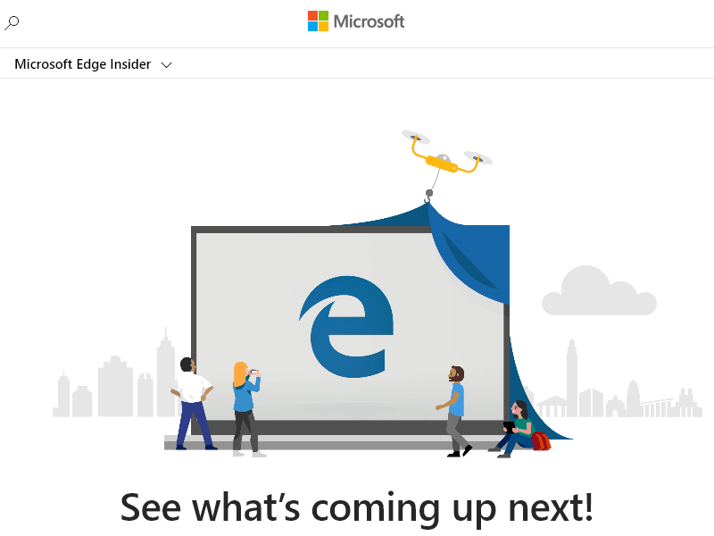
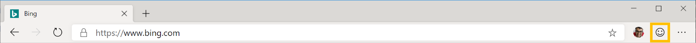

# Puppeteer

[Puppeteer](https://pptr.dev/) is a [Node](https://nodejs.org/) library which provides a high-level API to control Microsoft Edge (Chromium) over the [DevTools Protocol](https://chromedevtools.github.io/devtools-protocol/). Puppeteer runs [headless](https://en.wikipedia.org/wiki/Headless_browser) by default, which means you won't actually see the browser launch or render your website but all of this is still happening via the command line. You are able to configure Puppeteer to run full (non-headless) Microsoft Edge or Chromium as well.

By default, when you install Puppeteer, it downloads a recent version of [Chromium](https://www.chromium.org/Home), the open-source browser that [Microsoft Edge is also built upon](https://blogs.windows.com/windowsexperience/2018/12/06/microsoft-edge-making-the-web-better-through-more-open-source-collaboration/). If you already have Microsoft Edge (Chromium) installed (if you don't, you can [get it here](https://www.microsoftedgeinsider.com/download)), you can instead use [`puppeteer-core`](https://pptr.dev/#?product=Puppeteer&version=v2.0.0&show=api-puppeteer-vs-puppeteer-core). `puppeteer-core` is a lightweight version of Puppeteer that launches an existing browser installation, like Microsoft Edge (Chromium).

## Installing puppeteer-core

You can add `puppeteer-core` to your website or app with the following command:

```console
npm i puppeteer-core
# or
yarn add puppeteer-core
```

## Launch Microsoft Edge with puppeteer-core

> [!NOTE]
> `puppeteer-core` relies on Node v8.9.0+. The example below uses `async`/`await` which is only supported in Node v7.6.0 or greater. Run `node -v` from the command line to ensure you have a compatible version of Node.js.

`puppeteer-core` will be familiar to users of other browser testing frameworks like [WebDriver](./webdriver.md). You create an instance of Browser, open pages, and then manipulate them with Puppeteer's API. In the code sample below, `puppeteer-core` will launch Microsoft Edge (Chromium), navigate to `https://www.microsoftedgeinsider.com/` and save a screenshot as **example.png**.

Copy the code sample below and save it as **example.js**.

```javascript
const puppeteer = require('puppeteer-core');

(async () => {
  const browser = await puppeteer.launch({
    executablePath: 'C:\\Program Files (x86)\\Microsoft\\Edge Dev\\Application\\msedge.exe'
  });
  const page = await browser.newPage();
  await page.goto('https://www.microsoftedgeinsider.com/');
  await page.screenshot({path: 'example.png'});

  await browser.close();
})();
```

Change `executablePath` to point to your installation of Microsoft Edge (Chromium). For example, on macOS, the `executablePath` for Microsoft Edge Canary should be set to `/Applications/Microsoft\ Edge\ Canary.app/`. Save your changes. 

> [!NOTE]
> Microsoft Edge (EdgeHTML) does not work with `puppeteer-core`. Install the Microsoft Edge preview channels, which leverage Chromium, [here](https://www.microsoftedgeinsider.com/download) to continue following this example if you haven't already.

Now run **example.js** from the command line:

```console
node example.js
```

`puppeteer-core` launches Microsoft Edge, navigates to `https://www.microsoftedgeinsider.com/` and saves an 800x600px screenshot of the page. You are able to customize the page size with [`Page.setViewport()`](https://pptr.dev/#?product=Puppeteer&version=v2.0.0&show=api-pagesetviewportviewport).

> ##### Figure 1  
> The **example.png** file produced by **example.js**
>   

This is just a simple example of the automation and testing scenarios enabled by Puppeteer and `puppeteer-core`. Read more about Puppeteer and how it works [here](https://pptr.dev/).

## Feedback
We're eager to hear your feedback about using Puppeteer, `puppeteer-core`, and Microsoft Edge! Use the **Feedback** icon in the Microsoft Edge DevTools or tweet [@EdgeDevTools](https://twitter.com/intent/tweet?text=@EdgeDevTools) to let us know what you think.

> ##### Figure 2
> The **Feedback** icon in the Microsoft Edge DevTools
>   