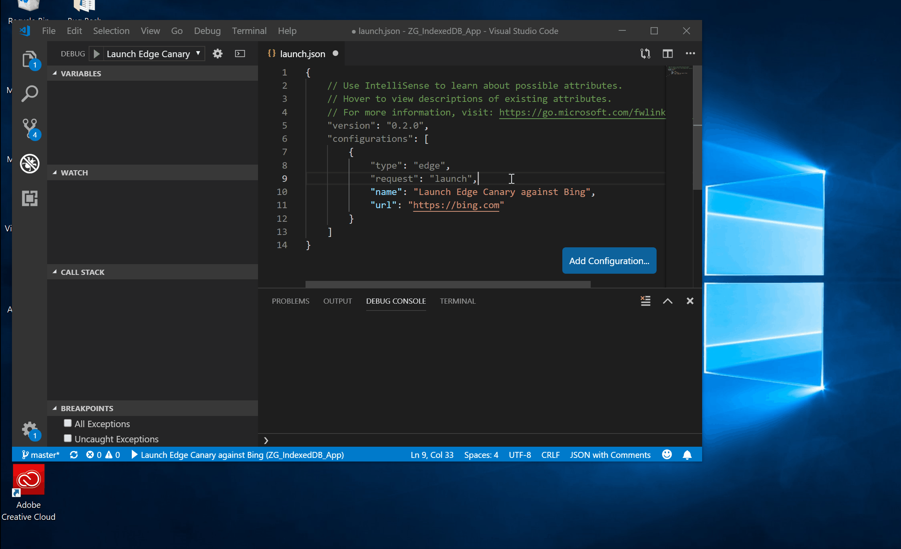

# Debugger for Microsoft Edge VS Code extension

With the [Debugger for Microsoft Edge](https://marketplace.visualstudio.com/items?itemName=msjsdiag.debugger-for-edge) VS Code extension, you can debug your front-end JavaScript code line by line and see `console.log()` statements all directly from [Visual Studio Code](https://code.visualstudio.com/)!



## Launching Microsoft Edge

Navigate to the Debug view (`Ctrl` + `Shift` + `D` on Windows or `Command` + `Shift` + `D` on Mac) in the **Activity Bar**. If you do not have any configurations in VS Code, press `F5` on Windows or Mac or click the green **Play** button. Select "Edge" in the dropdown. You will now see a **launch.json** file with the following configuration:

```json
{
    "version": "0.2.0",
    "configurations": [
        {
            "type": "edge",
            "request": "launch",
            "name": "Launch Edge against localhost",
            "url": "http://localhost:8080",
            "webRoot": "${workspaceFolder}"
        }
    ]
}
```

If you now press `F5` on Windows or Mac or click the green **Play** button again, VS Code will launch Microsoft Edge (EdgeHTML) and you will be able to debug any web project you have running on port **8080** directly from VS Code!

### Microsoft Edge (Chromium)

If you want to launch Microsoft Edge (Chromium), the next version of Microsoft Edge, instead of Microsoft Edge (EdgeHTML), simply add a `version` attribute to your existing configuration with the version of Microsoft Edge (Chromium) you want to launch (`dev`, `beta`, or `canary`). The configuration below will launch the Canary version of Microsoft Edge (Chromium):

```json
{
    "type": "edge",
    "request": "launch",
    "version": "canary",
    "name": "Launch Edge against localhost",
    "url": "http://localhost:8080",
    "webRoot": "${workspaceFolder}"
}
```

## Attaching to Microsoft Edge

You can also attach VS Code to Microsoft Edge (Chromium). From your terminal, run the following command:

`start msedge --remote-debugging-port=9222`

Add the configuration below to your **launch.json** file:

```json
{
    "type": "edge",
    "request": "attach",
    "name": "Attach to Edge",
    "port": 9222
}
```

If you now run this configuration, VS Code will attach to Microsoft Edge (Chromium) and you can start debugging!

## Feedback

Send us your feedback by [filing an issue](https://github.com/Microsoft/vscode-edge-debug2/issues/new) against this extension's [GitHub repo](https://github.com/Microsoft/vscode-edge-debug2). Please include the debug adapter log file, which is created for each run in the %temp% directory with the name `vscode-edge-debug2.txt`. You can drag this file into an issue comment to upload it to GitHub.

If you want to help us make this extension better, we welcome your contributions! You can find everything you need to get started in [our GitHub repo](https://github.com/Microsoft/vscode-edge-debug2).