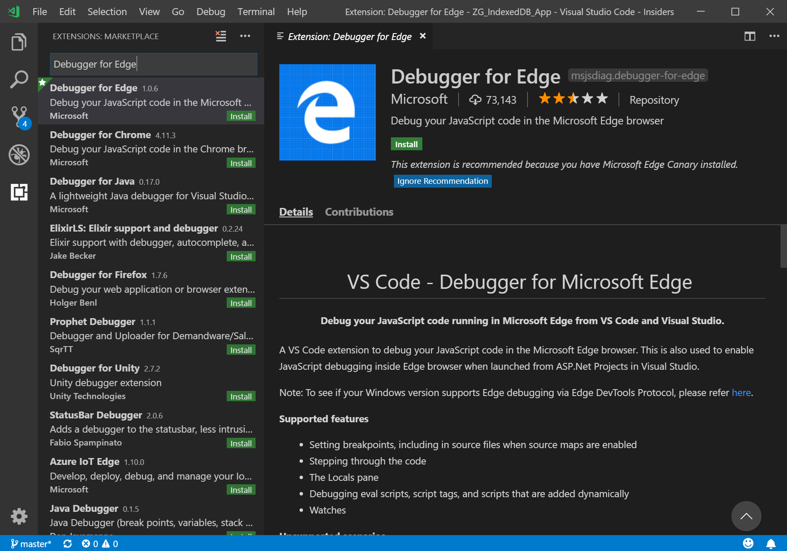

# Visual Studio Code

[Visual Studio Code](https://code.visualstudio.com/Docs) is a lightweight but powerful source code editor which runs on your desktop and is available for Windows, macOS and Linux. It comes with built-in support for JavaScript, TypeScript and Node.js so it's a great tool for web developers right out of the box! Head to [this page](https://code.visualstudio.com/) to download Visual Studio Code if you aren't using it yet.

## Extensions

<!-- We want to put something like the tiles for extensions VS Code uses on this page https://code.visualstudio.com/Docs#top-extensions but I don't think this is a markdown page. I think it's a web page. I couldn't find anything in https://github.com/Microsoft/vscode-docs that looks like this page. In the meantime, here's what I've come up with: -->

To acquire any of the extensions highlighted below, navigate to Extensions (`Ctrl` + `Shift` + `X` on Windows) in VS Code.

Search the Marketplace for the specific extension and select **Install**.

### Debugger for Edge

 

With the [Debugger for Edge](https://marketplace.visualstudio.com/items?itemName=msjsdiag.debugger-for-edge) VS Code extension, you can debug your front-end JavaScript code line by line and see `console.log()` statements all directly from [Visual Studio Code](https://code.visualstudio.com/)!

This extensions gives you the ability to launch or attach to both Microsoft Edge (EdgeHTML) and Microsoft Edge (Chromium). Check out [this page](./debugger-for-edge.md) for a walkthrough of debugging Microsoft Edge from VS Code and sample **launch.json** configurations.

