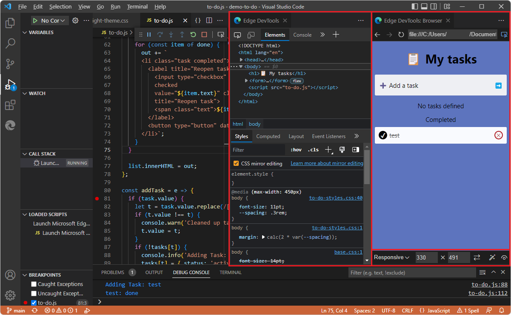

# Microsoft Edge DevTools extension for Visual Studio Code

<!-- main page for DevTools extension -->

<!-- lexicon (except ui strings):
Microsoft Edge DevTools extension for Visual Studio Code
Microsoft Edge DevTools extension
CSS Mirroring
CSS mirror editing (lowercased in UI, init capped at github)
-->

The Microsoft Edge DevTools extension for Visual Studio Code lets you use Microsoft Edge DevTools and an embedded version of the Microsoft Edge Browser including Device Emulation, right from within Visual Studio Code.  The DevTools extension provides many of the same tools that are in the DevTools that's in the Microsoft Edge browser, from within Visual Studio Code.

Visual Studio Code is a lightweight but powerful source code editor for Windows, Linux, and macOS.  Visual Studio Code is a full IDE (integrated development environment) that has powerful features for web development.  Visual Studio Code includes built-in support for JavaScript, TypeScript, and Node.js, so it's a great tool for web developers, especially with this DevTools extension.

The DevTools extension for Visual Studio Code enables you to:

*  Develop webpages and use DevTools without leaving Visual Studio Code.  This extension gives you an alternative to using DevTools for webpage development within the browser window.

*  Emulate devices, such as displaying your webpage in various viewport sizes during development.

*  Test the accessibility of your webpages from within Visual Studio Code.

*  Live-edit CSS and SASS and see your changes reflected immediately in a browser instance while editing your actual source files.  CSS mirror editing allows you to control whether to save changes to your `.css` file.  DevTools opens and edits your `.css` files, but without automatically saving the files, so that you can decide and control whether to save the changes that you made within the **Styles** tab of the **Elements** tool.

<!-- ====================================================================== -->
## Approaches compared

The DevTools extension for Visual Studio Code is one of several different ways to use DevTools to change your local files.

| Approach | Pros and Cons | Article |
|---|---|---|
| Browser > DevTools > **Elements** tool | You have to manually copy changes from DevTools into your source files. | [Inspect, edit, and debug HTML and CSS with the Elements tool](../devtools-guide-chromium/elements-tool/elements-tool.md)| 
| Browser > DevTools > **Sources** tool > **Filesystem** tab to define a **Workspace** | Always saves the changes, which could discourage experimenting | [Using the Filesystem tab to define a local Workspace](../devtools-guide-chromium/sources/index.md) in _Sources tool overview_ |
| Browser > DevTools > **Settings** > **Experiments** > **Open source files in Visual Studio Code** | Always saves the changes, which could discourage experimenting | Experiments > [Opening source files in Visual Studio Code](../devtools-guide-chromium/sources/opening-sources-in-vscode.md). |
| Microsoft Edge DevTools extension for Visual Studio Code | Automatically opens and edits the CSS source file but doesn't automatically save the file, so you get to choose whether to save the edits. | The present article. |

<!-- ====================================================================== -->
## 2-way editing

Changes are reflected among the source files in the opened folder, the **Edge DevTools** tab, and the **Edge DevTools: Browser** tab, as follows.

#### CSS

Through CSS mirror editing, you can change CSS in the **Edge DevTools** tab, and it automatically changes in the `.html` or `.css` source file, as well as being reflected in the **Edge DevTools: Browser** tab.  DevTools lets you decide whether to save the change, allowing you to experiment.

You can change CSS in the `.css` or `.html` source file, save the change, and then reload the webpage in the **Edge DevTools: Browser** tab, which also updates the **Edge DevTools** tab.

#### HTML

You can edit the DOM tree in the **Edge DevTools** tab (such as changing `<h2>Success!</h2>` to `<h2>CSS Success!</h2>`), then press **Enter**, then refresh the **Edge DevTools: Browser** tab to see the change.  (This doesn't automatically edit the `.html` source file.)

You can change HTML in the `.html` source file, save the change, and then reload the webpage in the **Edge DevTools: Browser** tab, which also updates the **Edge DevTools** tab.

<!--js-->

<!-- ====================================================================== -->
## Tasks supported by the developer tools

The DevTools extension for Visual Studio Code allows you to:

| Task | Article |
|---|---|
| Get live analysis of problems in your source code. | [Inline and live issue analysis](./microsoft-edge-devtools-extension/inline-live-issue-analysis.md) |
| Start a new browser instance with DevTools for your project. | [Opening DevTools and the DevTools browser](./microsoft-edge-devtools-extension/open-devtools-and-embedded-browser.md) |
| Emulate different devices and see your project in different display modes. | [Device emulation](./microsoft-edge-devtools-extension/device-state-emulation.md) |
| View the runtime DOM structure and layout of your page using the **Elements** tool. | [Opening source files from the Elements tool](./microsoft-edge-devtools-extension/opening-source-files-from-elements-tool.md) |
| Analyze and change CSS styles of your project with live preview and live changes to your project's source files. | [Update .css files from within the Styles tool (CSS mirror editing)](./microsoft-edge-devtools-extension/css-mirror-editing-styles-tab.md) |
| Analyze site traffic using the **Network** tool. | [Network tool integration](./microsoft-edge-devtools-extension/network-tool-integration.md) |
| Log information, try out JavaScript, and access the Window/DOM using the **Console** tool. | [Console integration](./microsoft-edge-devtools-extension/console-integration.md) |
| Inspect storage and Service Workers using the **Application** tool. | [Application tool integration](./microsoft-edge-devtools-extension/application-tool-integration.md) |
| Use the extension in the Visual Studio Code debugging workflow. | [Integration with Visual Studio Code debugging](./microsoft-edge-devtools-extension/debugging-a-webpage.md) |

<!-- ====================================================================== -->
## Overview of the tools in the DevTools extension

The following tools are included in the DevTools extension for Visual Studio Code.  The following articles are not specifically focused on the DevTools extension for Visual Studio Code, but are for the Microsoft Edge browser DevTools.

| Tool | Purpose | Article |
| --- | --- | --- |
| **Elements** tool | Inspect, edit, and debug your HTML and CSS.  You can edit in the tool while displaying the changes live in the browser.  Debug your HTML using the DOM tree, and inspect and work on the CSS for your webpage. | [Inspect, edit, and debug HTML and CSS with the Elements tool](../devtools-guide-chromium/elements-tool/elements-tool.md) |
| **Console** tool | An intelligent, rich command line within DevTools.  A great companion tool to use with others tools.  Provides a powerful way to script functionality, inspect the current webpage, and manipulate the current webpage using JavaScript. | [Console overview](../devtools-guide-chromium/console/index.md) |
| **Network** tool | Use the **Network** tool to make sure that resources are being downloaded or uploaded as expected.  Inspect the properties of an individual resource, such as the HTTP headers, content, or size. | [Inspect network activity](../devtools-guide-chromium/network/index.md) |
| **Application** tool | Use the **Application** tool to manage storage for web app pages, including manifest, service workers, local storage, cookies, cache storage, and background services. | [The Application tool, to manage storage](../devtools-guide-chromium/storage/application-tool.md) |
| **Issues** tool | The **Issues** tool automatically analyzes the current webpage, reports issues grouped by type, and provides documentation to help explain and resolve the issues. | [Find and fix problems using the Issues tool](../devtools-guide-chromium/issues/index.md) |
| **Network conditions** tool | Use the **Network conditions** tool to disable the browser cache, set network throttling, set the user agent string, and set Content-Encodings such as deflate, gzip, and br. | [Network conditions tool](../devtools-guide-chromium/network-conditions/network-conditions-tool.md) |
| **Network request blocking** tool | Use the **Network request blocking** tool to test blocking network requests to a specified URL pattern and see how a webpage behaves. | [Network request blocking tool](../devtools-guide-chromium/network-request-blocking/network-request-blocking-tool.md) |
| **Inspect** tool | Use the **Inspect** tool to see information about an item within a rendered webpage.  When the **Inspect** tool is active, you _hover_ over items in the webpage, and DevTools adds an information overlay and grid highlighting on the webpage. | [Analyze pages using the Inspect tool](../devtools-guide-chromium/css/inspect.md) |
| **Device Emulation** | Use the **Device Emulation** tool, also called _Device Simulation Mode_ or _Device Mode_, to approximate how your page looks and responds on a mobile device. | [Emulate mobile devices (Device Emulation)](../devtools-guide-chromium/device-mode/index.md) |

For the list of all tools that are in the Microsoft Edge browser version of DevTools, see [Overview of all tools](../devtools-guide-chromium/about-tools.md#overview-of-all-tools) in _About the list of tools_.

<!-- ====================================================================== -->
## See also

* [Get started using the DevTools extension for Visual Studio Code](./microsoft-edge-devtools-extension/get-started.md)
* [Opening DevTools and the DevTools browser](./microsoft-edge-devtools-extension/open-devtools-and-embedded-browser.md)

**External pages:**

* [Supercharging VS Code Live Server](https://dev.to/codepo8/supercharging-vs-code-live-server-1bgi) - If you use the [Live Server](https://marketplace.visualstudio.com/items?itemName=ritwickdey.LiveServer) extension in Visual Studio Code to see the changes in your web products live, you can improve the experience even more by getting a browser and DevTools embedded in Visual Studio Code using the Microsoft Edge DevTools extension for Visual Studio Code.
* [Getting Started](https://code.visualstudio.com/Docs) - Documentation for Visual Studio Code.
* [vscode-edge-devtools repo](https://github.com/microsoft/vscode-edge-devtools) - source code for the Microsoft Edge Developer Tools extension for Visual Studio Code.
   * [Changelog file](https://github.com/microsoft/vscode-edge-devtools/blob/main/CHANGELOG.md).
* [Microsoft Edge DevTools extension for Visual Studio Code](https://aka.ms/devtools-for-code) in the Visual Studio Marketplace.
