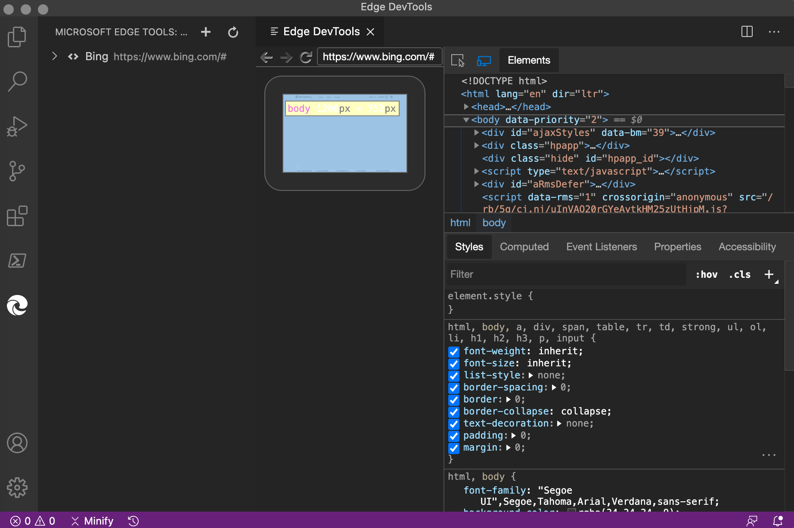
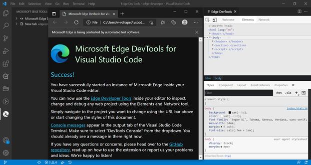
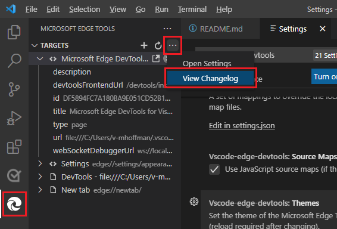

# Microsoft Edge DevTools extension for Visual Studio Code

<!-- lexicon (except when quoting a UI string):
Microsoft Edge DevTools extension for Visual Studio Code
Microsoft Edge DevTools extension
-->

The Microsoft Edge DevTools extension for Visual Studio Code lets you use the **Elements** tool and **Network** tool of the Microsoft Edge browser from within Visual Studio Code.

Without leaving Visual Studio Code, use Microsoft Edge DevTools to connect to an instance of Microsoft Edge and then:
* View the runtime HTML structure.
* Change the layout.
* Change styles (CSS).
* Read console messages.
* View network requests.

For example, use the **Elements** tool to:
*   Attach to an instance or launch an instance of Microsoft Edge.
*   Display the runtime HTML structure.
*   Update the layout.
*   Fix styling issues.



The Microsoft Edge DevTools extension requires Microsoft Edge.  This extension is supported in Microsoft Edge versions 80.0.361.48 and later.

In Visual Studio Code, there are multiple ways to open the Microsoft Edge DevTools extension:
* From the **Activity Bar**.
* From the JavaScript Debugger.

In Visual Studio Code, this extension is referred to by several variations:
*  **Microsoft Edge Developer Tools for Visual Studio Code** - the full name as shown in the detailed information in the **Extensions Marketplace**.
*  **Microsoft Edge Tools for VS Code** - the extension as listed when searching in the **Extensions Marketplace**.
*  **Microsoft Edge Tools** - the icon tooltip in the **Activity Bar**.
*  **Edge DevTools** - the tab name.

This article uses the name "the Microsoft Edge DevTools extension", except for UI text.

The Visual Studio Marketplace provides more information about [Microsoft Edge Tools for Visual Studio Code](https://marketplace.visualstudio.com/items?itemName=ms-edgedevtools.vscode-edge-devtools).


<!-- ====================================================================== -->
## Installing the Microsoft Edge DevTools extension

To install the Microsoft Edge DevTools extension from within Visual Studio Code:

1. In Visual Studio Code, navigate to **Extensions**.  To do this, you can press `Ctrl`+`Shift`+`X` on Windows/Linux or `Command`+`Shift`+`X` on macOS.

1. Search the Marketplace for the extension **Microsoft Edge Tools for VS Code**, select the extension, and then select **Install**.

  


Or, you can [download the Microsoft Edge DevTools extension](https://marketplace.visualstudio.com/items?itemName=ms-edgedevtools.vscode-edge-devtools) from Visual Studio Marketplace.


### Updating the extension

Microsoft Visual Studio Code updates extensions automatically.  To update the extension manually, see [Update an extension manually](https://code.visualstudio.com/docs/editor/extension-gallery#_update-an-extension-manually).


<!-- ====================================================================== -->
## Opening Microsoft Edge DevTools within Visual Studio Code

To open the tools panel, in the **Activity Bar**, select the **Microsoft Edge Tools** icon.

The Microsoft Edge DevTools extension lets you easily launch an instance of Edge or generate a `launch.json` file to automate the debugging workflow:


Selecting **Launch Instance** opens a browser window, and also opens the **Edge DevTools** tab in Visual Studio Code:


Use the Microsoft Edge DevTools extension in Visual Studio Code to inspect an HTML Element in Microsoft Edge. For example, click the **Success!** heading in the browser, and the **Elements** tool opens with the DOM tree expanded:


<!-- ====================================================================== -->
## Modes for using Microsoft Edge DevTools in Visual Studio Code

You can use this extension in one of three modes:
* Launch Microsoft Edge in a new window, and go to your web application.
* Attach to a running instance of Microsoft Edge.
* Open a new instance of Microsoft Edge inside Visual Studio Code.

Each mode requires you to serve your web application from a local web server, which is started from either a Visual Studio Code task or from the command line.  Use the URL parameter inside the `launch.json` file to tell Visual Studio Code which URL to open.


<!-- ====================================================================== -->
## Opening a new browser instance

To open a browser instance from Visual Studio Code:

1. On the **Activity Bar**, select **Microsoft Edge Tools**.

1. On the **Microsoft Edge Tools: Targets** panel, select **Launch Instance**.  Microsoft Edge opens, displaying a default page with guidance for more information.  Also, the **Edge DevTools** tab and panel is displayed in Visual Studio Code, containing the **Welcome**, **Elements**, and **Network** tools:

   

1. In the Microsoft Edge address bar, go to the URL of the project that you want to debug.


<!-- ====================================================================== -->
## Changing the default page to your project website

To debug your project, you might want to change the default page that opens in Microsoft Edge in Visual Studio Code.  To change the default page to your project's website:

1. In Visual Studio Code, select **File** > **New Window**.  Notice that no folder is open.

1. On the **Activity Bar**, select **Microsoft Edge Tools**.

1. In the **Microsoft Edge Tools: Targets** panel, select the **open a folder** link.

1. Select your project folder with the new default page to display when you begin debugging in Visual Studio Code.

   The first time you open a folder, you must confirm that you trust the authors of files in this folder.  You can also select the checkbox **Trust the authors of all files in the parent folder**:

   

   The first time you complete this process, you must also select **Microsoft Edge Tools** again.

   The **Microsoft Edge Tools: Targets** panel now displays two buttons: **Launch Instance** and **Generate launch.json**:

   

1. Select **Generate launch.json** to create a `launch.json` in your project.

1. In `launch.json`, add the URL of your project. If you leave URL empty, the default page is displayed.

1. Save `launch.json`.

1. Select **Launch Project** to verify that Microsoft Edge opens and displays the URL you entered.  Also, DevTools opens in Visual Studio Code.


<!-- ====================================================================== -->
## Changing the extension settings

You can customize DevTools in the Visual Studio Code extension.

To customize the settings:

1. In Visual Studio Code, on the **Activity Bar**, select **Microsoft Edge Tools**.

1. In **Microsoft Edge Tools** > **Targets**, select **More Actions** (...) to the right of the word **TARGETS**, and then select **Open Settings**.

   If you are using a mouse, to access **More Actions** (...), select the **Targets** pane or hover over it:

   


### Reloading the extension after changing settings

Some settings have a note that reads **(reload required after changing)**.  For such a setting to take effect:

1. Close the browser opened by the extension, or in the **Microsoft Edge Tools** > **Targets** pane, select **Close instance** (`X`).  This action automatically closes the **Edge DevTools** tab as well.

1. In the **Microsoft Edge Tools** > **Targets** pane, select the **Launch Instance** button.  Microsoft Edge opens, and the **Edge DevTools** tab is displayed.


<!-- ====================================================================== -->
## Viewing the changelog for changes made to the extension

You can view the changes that have been made to the extension.

To view the changelog:

1. In Visual Studio Code, on the **Activity Bar**, select **Microsoft Edge Tools**.

1. In **Microsoft Edge Tools** > **Targets**, select **More Actions** (...) to the right of the word **TARGETS**, and then select **View Changelog**:

   

Or, in the browser, go to the [changelog file](https://github.com/microsoft/vscode-edge-devtools/blob/main/CHANGELOG.md) in the `vscode-edge-devtools` repo.


<!-- ====================================================================== -->
## Changing to headless mode

By default, the extension launches Microsoft Edge in a new window, which displays another browser icon on the task bar.

To display the browser inside the code editor, or to hide the browser if it is already displayed:

1. Click the **Toggle screencast** button:

   


To use only the screencast browser inside Visual Studio Code:

1. Select **Settings** > **Headless mode**:


<!-- ====================================================================== -->
## Opening source files from the Elements tool

One of the features of the **Elements** tool is that it displays the source file that applied styles and event handlers to a selected node in the DOM tree.  Source files appear in the form of links to a URL.  Selecting a link opens that file in the Visual Studio Code editor:


<!-- ====================================================================== -->
## Setting up your project to show live changes in the extension

By default, the Microsoft Edge DevTools extension doesn't track live changes to the code as you write.  If you want the browser to automatically refresh when you change a file, set up a _live reload_ environment, as follows.

This example shows a folder of production files on your hard drive called `my-project`.  In the following steps, change `my-project` to your folder name, if it is different.

Install Node.js and the `reload` npm package, as follows:

1. Download and install [Node.js](https://www.nodejs.org).

1. To install [the reload npm package](https://www.npmjs.com/package/reload?activeTab=readme), open a command prompt and run `npm install reload -g` to install the package globally.

   Next, attach the extension to your live reloading project:

1. Navigate to the `my-project` folder in your terminal window and run `reload` to start the local server.

1. In Visual Studio Code, open the `my-project` folder.

1. Go to the extension and launch a Microsoft Edge browser instance.

1. In Microsoft Edge, go to `localhost:8080/{file name you want to open}`.

All changes that are saved in this folder now trigger a browser refresh.


<!-- ====================================================================== -->
## Syncing live changes from the Styles tool by using CSS Mirror Editing

The Styles tool in Microsoft Edge DevTools is excellent for debugging and tweaking CSS property styles.  One problem is that although these changes show up live in the browser, they aren't reflected in your source files.  This means that at the end of your CSS debugging session, you need to copy and paste what you changed back into your source files.

CSS Mirror Editing is a feature of the Microsoft Edge DevTools extension that works around that problem.  When you turn on Mirror Editing, any change made in the Styles tool of DevTools also changes the file in your workspace.

In the following example, we have `index.html` currently open in Visual Studio Code, and the Microsoft Edge DevTools extension is open.  When we select the flexbox icon in the `.searchbar` CSS selector and change the `flex-direction` to `column`, we not only see the change in the browser and in DevTools, but Visual Studio Code also automatically navigates to the correct style sheet file and the appropriate line number, and inserts the `flex-direction: column` CSS code:


Changing the CSS setting created a new line of code in the correct CSS source file:


You can edit any selector or create new ones in the Styles tool and all changes will get mirrored in the right CSS source file. The extension only changes the file, it doesn't automatically save the changes back to your hard drive. This is a security measure to make sure you don't accidentally overwrite any of your code.

You can enable and disable CSS Mirror Editing by checking and unchecking the box in the **Styles** panel of the **Elements** tool, or by using the Command Menu and searching for `mirror`:


Using the command menu to turn CSS Mirror Editing on or off:


We're continuing to improve this feature and have set up a tracking issue on GitHub, [CSS Mirror Editing](https://github.com/microsoft/vscode-edge-devtools/issues/476), where we welcome your feedback.


<!-- ====================================================================== -->
## Device and state emulation

In the Edge DevTools: Browser preview tab, the emulation toolbar on the bottom enables you to simulate different environments:


<!-- Toolbar item 1. Emulate devices: -->
In the **Emulate devices** dropdown menu, you can select from a number of different devices.  When you select a device, the viewport resizes to the correct measurements and simulates the touch interface.  For example, an iPhone:


<!-- Toolbar item 2. Width: -->
<!-- Toolbar item 3. Height: -->
Click the **Width** and **Height** dropdown menus to change the viewport dimensions: 

<!-- Toolbar item 4. Rotate: -->
Click the **Rotate** button () to rotate the viewport.

<!-- Toolbar item 5. Emulate CSS media features: -->
To emulate CSS media queries, click the **Emulate CSS media features** () button.  This button enables you to test how your product looks in print mode.  You can switch between dark and light mode, and emulate forced colors:


<!-- Toolbar item 6. Emulate vision deficiencies: -->
Click the **Emulate vision deficiencies** () button to try the experience of the current web project with different visual deficiencies.  This button lets you test your product in a blurred mode or in different color deficiencies:


<!-- ====================================================================== -->
## Inline and live issue analysis

Issues in your source code are highlighted with wavy underline. You can inspect the issue and get detailed information about what the problem is, how to fix it, and where to find more information.  To inspect the issue, select the code that has the wavy underline:


To see all the issues in the file, select **View Problem**:


The **Problems** tab in the lower panel lists all the issues that are found in the current project:


Issues are evaluated live while you edit your code.  As you type, you get feedback about any issues that are found, and how to fix them:


<!-- ====================================================================== -->
## Browser debugging with Microsoft Edge DevTools integration in Visual Studio Code

JavaScript debugging is built in to Visual Studio Code.  You can debug in Chrome, Microsoft Edge, or Node.js without installing any other extensions.  If you debug using Microsoft Edge, you can start Microsoft Edge DevTools from the JavaScript debugger.

1. To start debugging, do either of the following:
   *  Press **F5**, or on the menu bar select the **Debug** icon and then select **Run and debug**.
   *  Open the Visual Studio Code command palette and then select **Debug: Open Link**.
    
   

1. Select **Edge**.  On the debug toolbar, notice the **Inspect** button:

   

1. Select **Inspect** to open Microsoft Edge DevTools inside Visual Studio Code.

   The first time you select **Inspect**, the editor prompts you to install the extension, [Microsoft Edge Developer Tools for Visual Studio Code](https://marketplace.visualstudio.com/items?itemName=ms-edgedevtools.vscode-edge-devtools).

   After the Microsoft Edge DevTools extension is installed, when you select **Inspect**, Microsoft Edge DevTools opens inside of Visual Studio Code:

   

   Now you can inspect the DOM, change CSS, and see network requests of your project running in the browser, without leaving Visual Studio Code.

   You can also use the Debug Console in the editor to interact with the document in the browser.  You have full access to the window object and can use the [Console Utilities API](/microsoft-edge/devtools-guide-chromium/console/utilities):

   


### Automatically attaching to Microsoft Edge and launching DevTools in Visual Studio Code

1. If you want to automatically attach to Microsoft Edge and launch Microsoft Edge DevTools in Visual Studio Code, do the steps above, and then create a `launch.json` file as shown below.

   Select **Microsoft Edge** as the debug type.  In your `launch.json` file, specify `pwa-msedge` as the type:

   ```json
   {
      "version": "0.2.0",
      "configurations": [
         {
               "type": "pwa-msedge",
               "request": "launch",
               "name": "Launch Edge",
               "url": "http://localhost:8080",
               "webRoot": "${workspaceFolder}"
         }
      ]
   }
   ```

1. Change `http://localhost:8080` in the above code and make sure the variable `{workspaceFolder}` resolves.

1. Select the **Inspect** icon.  If you haven't installed the Microsoft Edge DevTools extension for Visual Studio Code, the **Extensions** tab opens and automatically displays the extension to install.

#### See also

* [Launch configurations](https://code.visualstudio.com/Docs/editor/debugging#_launch-configurations) in the _Debugging_ article for Visual Studio Code.


<!-- ====================================================================== -->
## Console integration

The [Console](/microsoft-edge/devtools-guide-chromium/console/) tool is available inside the extension and you can do everything you are used to when using DevTools inside the browser. 


You can see your [log messages](/microsoft-edge/devtools-guide-chromium/console-log), access the `window` object and use the [DOM interaction convenience methods](/microsoft-edge/devtools-guide-chromium/console-dom-interaction). You can also [filter the Console](/microsoft-edge/devtools-guide-chromium/console-filters) and set [live expressions](/microsoft-edge/devtools-guide-chromium/live-expressions). 

You can also use the Console alongside the Elements tool if you open it in the lower panel:


If you launch the extension from the Run and Debug workflow, the [Debug Console of Visual Studio Code](https://code.visualstudio.com/Docs/editor/debugging) gives you most of the functions of the DevTools [Console](/microsoft-edge/devtools-guide-chromium/console/) inside of Visual Studio Code, but no filtering options and a more basic results display:


**Turning on this preview feature:**

<!-- todo: delete temp note: -->
As of April 20, 2022, to make the **Console** tool visible, target the Canary version of Microsoft Edge.  To do this:

1. In Visual Studio Code, in the Activity Bar on the left, click the **Microsoft Edge Tools** button.  The MICROSOFT EDGE TOOLS pane opens.

1. Hover to the right of **TARGETS**, and then click **Open Settings** (**...**).

1. In the **Vscode-edge-devtools: Browser Flavor** dropdown list, select **Canary**.  At a later date, you'll be able to select any version.

1. Click **x** to close **Settings**.


<!-- ====================================================================== -->
## Getting in touch with the Microsoft Edge DevTools Extension team

Send your feedback by [filing an issue](https://github.com/Microsoft/vscode-edge-devtools/issues/new) in the `vscode-edge-devtools` repo.

Your contributions are welcome, to help make the Microsoft Edge DevTools extension better.  Find everything you need to get started in the [vscode-edge-devtools](https://github.com/Microsoft/vscode-edge-devtools) repo.


<!-- ====================================================================== -->
## See also

*  [vscode-edge-devtools repo](https://github.com/microsoft/vscode-edge-devtools) - source code for the Microsoft Edge Developer Tools extension for Visual Studio Code, at GitHub.
