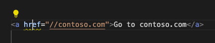

# Microsoft Edge DevTools extension for Visual Studio Code

<!-- heading convention in this file: skip h3's; tag subheadings as h4's instead -->

<!-- lexicon (except when quoting a UI string):
Microsoft Edge DevTools extension for Visual Studio Code
Microsoft Edge DevTools extension
CSS Mirroring
CSS mirror editing (lowercased in UI, initcapped at gh)
-->

The [Microsoft Edge DevTools extension for Visual Studio Code](https://aka.ms/devtools-for-code) lets you use the Microsoft Edge Browser and Developer Tools right from within Visual Studio Code.  Visual Studio Code includes built-in support for JavaScript, TypeScript, and Node.js, so it's a great tool for web developers.  Visual Studio Code is a lightweight but powerful source code editor that's available for Windows, Linux, and macOS.

The extension allows you to:

| Task | Section |
|---|---|
| Get live analysis of problems in your source code. | [Inline and live issue analysis](#inline-and-live-issue-analysis) |
| Start a new browser instance with DevTools for your project. | [Opening a browser instance in the extension](#opening-a-browser-instance-in-the-extension) |
| Emulate different devices and see your project in different display modes. | [Device and state emulation](#device-and-state-emulation) |
| View the runtime DOM structure and layout of your page using the **Elements** tool. | [Opening source files from the Elements tool](#opening-source-files-from-the-elements-tool) |
| Analyze and change CSS styles of your project with live preview and live changes to your project's source files. | [Syncing live changes from the Styles tool by using CSS mirror editing](#syncing-live-changes-from-the-styles-tool-by-using-css-mirror-editing) |
| Analyze site traffic using the **Network** tool. | [Network tool integration](#network-tool-integration) |
| Log information, try out JavaScript, and access the Window/DOM using the **Console** tool. | [Console integration](#console-integration) |
| Inspect storage and Service Workers using the **Application** tool. | [Application tool integration](#application-tool-integration) |
| Use the extension in the Visual Studio Code debugging workflow. | [Automatically opening the browser and DevTools when debugging in Visual Studio Code](#automatically-opening-the-browser-and-devtools-when-debugging-in-visual-studio-code) |

<!-- ====================================================================== -->
## Installing the Microsoft Edge DevTools extension

To install the Microsoft Edge DevTools extension from within Visual Studio Code:

1. In Visual Studio Code, navigate to **Extensions**.  To do this, you can press `Ctrl`+`Shift`+`X` on Windows/Linux or `Command`+`Shift`+`X` on macOS.

1. Search the Marketplace for the extension **Microsoft Edge Tools for VS Code**, select the extension, and then select **Install**:

   

Or, you can [download the Microsoft Edge DevTools extension](https://marketplace.visualstudio.com/items?itemName=ms-edgedevtools.vscode-edge-devtools) from Visual Studio Marketplace.

<!-- ====================================================================== -->
## Inline and live issue analysis

Issues in your source code are highlighted with wavy underlines. You can inspect the issue and get detailed information about what the problem is, how to fix it, and where to find more information.  To inspect the issue, select the code that has the wavy underline:

To see all the issues in the file, select **View Problem**:

The **Problems** tab in the lower panel lists all the issues in the currently open files:

#### Live updating of issues reporting

Issues are evaluated live while you edit your code.  As you type, you get feedback about any issues that are found, and how to fix them:

#### Automated Quick Fixes and issue filtering

<!--
bold "Quick Fix" when focusing on the UI
the UI label string is "Quick Fix", not "Quick Fixes"
-->

The Microsoft Edge DevTools extension for Visual Studio Code includes a **Quick Fix** feature.  By using Quick Fixes, you can customize the error reporting of the extension to meet the needs of the current project.

When you hover over an element that has an issue, you get a lightbulb icon indicating that there are Quick Fixes available:

Clicking the lightbulb icon shows a list of options. For example, if you added a link that has a protocol-relative URL, you get the following **Quick Fix** list to choose from:

You can select whichever **Quick Fix** you want to use to resolve the issue or to stop reporting it as an issue:

* **Fix "no-protocol-relative-urls" issue** - Adds the missing URL prefix `https://` to the link.

* **Disable "no-protocol-relative-urls" hints in this project** - Creates a `.hintrc` configuration file in the project folder, and tells the extension never to report this issue again.

* **Edit .hintrc for this project** - Opens the `.hintrc` configuration file so you can edit it to customize the extension's error reporting.

<!-- ====================================================================== -->
## Modes for using Microsoft Edge DevTools in Visual Studio Code

You can use this extension in one of three modes:

* Launch Microsoft Edge in a new window, and go to your web application.

* Attach to a running instance of Microsoft Edge.

* Open a new instance of Microsoft Edge inside Visual Studio Code.

<!-- ====================================================================== -->
## Opening a browser instance in the extension

There are various ways to start a new browser session in the extension, described in the subsections below.

#### By right-clicking an HTML file in the Explorer

In the **Explorer** of Visual Studio Code, right-click an HTML file, select **Open with Edge**, and then select **Open Browser** or **Open Browser with DevTools**:
    

#### By clicking the Launch Instance button

As another way to open a browser instance:

1. Click the **Microsoft Edge Tools** icon in the **Activity Bar**.  This lets you launch an instance of Edge or generate a `launch.json` file to automate the debugging workflow:

1. Then click the **Launch Instance** button.  Both a browser preview window and the **Edge DevTools** tab open in Visual Studio Code:

#### Opening the browser as part of a debugging session

Another way to open a browser instance is to open the browser as part of a debugging session.  See [Use the extension with the Visual Studio Code debugging workflow](#use-the-extension-with-the-visual-studio-code-debugging-workflow) below.

The extension opens a new browser as an embedded browser in Visual Studio Code. This **Devtools: Browser preview** tab can be moved anywhere within the editor. You can use this tab side by side with your source code, or split the panes and have the browser preview below your code:

#### Opening an external browser window (headless mode)

If you want to have an external browser window, you can change the default setting. Select **Settings** > **Headless mode** and then select the checkbox, to open the browser in headless mode:

<!-- ====================================================================== -->
## Device and state emulation

In the Edge DevTools: Browser preview tab, the emulation toolbar on the bottom enables you to simulate different environments:

#### Emulate Devices dropdown menu
<!-- toolbar item 1. Emulate devices -->

In the **Emulate devices** dropdown menu, you can select from a number of different devices.  When you select a device, the viewport resizes to the correct measurements and simulates the touch interface.  For example, there are several emulated iPhone layouts:

#### Width and Height dropdown menus
<!-- toolbar item 2. Width -->
<!-- toolbar item 3. Height -->

Click the **Width** and **Height** dropdown menus to change the viewport dimensions: 

#### Rotate button
<!-- toolbar item 4. Rotate -->

Click the **Rotate** button () to rotate the viewport.

#### Emulate CSS Media Features button
<!-- toolbar item 5. Emulate CSS media features -->

To emulate CSS media queries, click the **Emulate CSS media features** () button.  This button enables you to test how your product looks in print mode.  You can switch between dark and light mode, and emulate forced colors:

#### Emulate Vision Deficiencies button
<!-- toolbar item 6. Emulate vision deficiencies -->

Click the **Emulate vision deficiencies** () button to try the experience of the current web project with different visual deficiencies.  This button lets you test your product in a blurred mode or in different color deficiencies:

<!-- ====================================================================== -->
## Opening source files from the Elements tool

One of the features of the **Elements** tool is that it displays the source file that applied styles and event handlers to a selected node in the DOM tree.  Source files appear in the form of links to a URL.  Clicking a filename link opens that file in the Visual Studio Code editor:

<!-- ====================================================================== -->
## Syncing live changes from the Styles tool by using CSS mirror editing

The **Styles** tool in Microsoft Edge DevTools is excellent for debugging and tweaking your CSS.  One problem is that although these changes show up live in the browser, they aren't reflected in your source files.  This means that at the end of your CSS debugging session, you need to copy and paste what you changed back into your source files.

CSS mirror editing is a feature of the Microsoft Edge DevTools extension that works around that problem. Any change made in the **Styles** tool also changes the file in your workspace.  CSS mirror editing is enabled by default in the extension.

You can edit any selector or create new selectors in the **Styles** tool, and all changes are automatically mirrored in the correct CSS source file. The extension only changes the downloaded copy of the file; it doesn't automatically save the changes back to your hard drive. This is a security measure to make sure you don't accidentally overwrite any of your code.

#### Example of mirroring changes from the Styles tool to a CSS source file

In the following example, we have `index.html` currently open in Visual Studio Code, and the Microsoft Edge DevTools extension is open.  We select the flexbox icon in the `.searchbar` CSS selector, and then change the `flex-direction` to `column`.  As as result, we not only see the change in the browser and in DevTools (the first image below), but Visual Studio Code also automatically navigates to the correct style sheet file and the appropriate line number, and inserts the `flex-direction: column` CSS code (the second image below):

Changing the CSS setting created a new line of code in the correct CSS source file:

#### Enabling CSS mirror editing

To enable and disable CSS mirror editing:

1. In the **Edge DevTools** tab, go to the **Elements** tool, and then go to the **Styles** panel.

1. Select or clear the **CSS mirror editing** checkbox.

Or, open the Command Menu, start typing the word **mirror**, and then select **Microsoft Edge Tools: Toggle mirror editing on|off for CSS files in workspace**:

#### Sourcemap support

CSS Mirroring also supports abstractions like Sass or CSS-in-JS when you have set up your project to produce sourcemaps. We have a tracking issue on GitHub and welcome any feedback on how this could be improved: [CSS Mirror Editing with Sourcemaps: Known Issues and Feedback](https://github.com/microsoft/vscode-edge-devtools/issues/965).

<!-- ====================================================================== -->
## Network tool integration

The **Network** tool allows you to monitor network traffic and change network conditions of your application right inside Visual Studio Code. 

Use the **Network** tool to:

* Analyze the network traffic and find out why some resources aren't loaded.

* Simulate different network conditions, such as being offline or having a slow connection.

* Disable any caching that might make it hard to debug your application.

* Simulate different user agents to see how your product appears to a search engine bot or a browser that you can't test in.

<!-- ====================================================================== -->
## Console integration

The [Console](/microsoft-edge/devtools-guide-chromium/console/) tool is available inside the extension and you can do everything you are used to when using DevTools inside the browser. 

You can see your [log messages](/microsoft-edge/devtools-guide-chromium/console-log), access the `window` object and use the [DOM interaction convenience methods](/microsoft-edge/devtools-guide-chromium/console-dom-interaction). You can also [filter the Console](/microsoft-edge/devtools-guide-chromium/console-filters) and set [live expressions](/microsoft-edge/devtools-guide-chromium/live-expressions). 

#### Console side-by-side with other tools

You can also use the **Console** alongside the **Elements** tool if you open the **Console** in the lower panel:

#### Console during Run and Debug

If you launch the extension from the Run and Debug workflow, the [Debug Console of Visual Studio Code](https://code.visualstudio.com/Docs/editor/debugging) gives you most of the functions of the DevTools [Console](/microsoft-edge/devtools-guide-chromium/console/) inside of Visual Studio Code, but no filtering options and a more basic results display:

<!-- ====================================================================== -->
## Application tool integration

The **Application** tool allows you to inspect the various parts of your application. 

Use the **Application** tool to:

* Check different storage options such as Cookies, LocalStorage, SessionStorage and IndexedDB.

* Analyze the cache of your application.

* Analyze services like Notification, Payment handler, or background sync.

<!-- ====================================================================== -->
## Use the extension with the Visual Studio Code debugging workflow

JavaScript debugging is built in to Visual Studio Code.  You can debug in Chrome, Microsoft Edge, or Node.js without installing any other extensions.  If you debug using Microsoft Edge, you can start Microsoft Edge DevTools from the JavaScript debugger.

1. To start debugging, do either of the following:
   *  Press **F5**.
   *  On the menu bar, click the **Debug** icon, and then click the **Run and Debug** button, as shown below.
   *  Open the Visual Studio Code command palette, start typing the word **debug**, and then select **Debug: Open Link**.<!--todo: mention **Select environment** text box" as shown in capture-->
    
   <!--todo: make capture match the above text-->

1. Select **Edge**.<!--todo: clarify; **Edge: Launch**?  describe specific UI/controls: link or button or command/list item-->  On the debug toolbar, notice the **Inspect** button:

   

1. Select **Inspect** to open Microsoft Edge DevTools inside Visual Studio Code.

   The first time you select **Inspect**, the editor prompts you to install the extension, [Microsoft Edge Developer Tools for Visual Studio Code](https://marketplace.visualstudio.com/items?itemName=ms-edgedevtools.vscode-edge-devtools).

   After the Microsoft Edge DevTools extension is installed, when you select **Inspect**, Microsoft Edge DevTools opens inside of Visual Studio Code:

   

#### Automatically opening the browser and DevTools when debugging in Visual Studio Code

To debug your project, you might want to change the default page that opens in Microsoft Edge in Visual Studio Code.  To change the default page to your project's website:

1. In Visual Studio Code, select **File** > **New Window**.  Notice that no folder is open.

1. On the **Activity Bar**, select **Microsoft Edge Tools**.

1. In the **Microsoft Edge Tools: Targets** panel, click the **open a folder** link.

1. Select your project folder with the new default page to display when you begin debugging in Visual Studio Code.

   The first time you open a folder, you must confirm that you trust the authors of files in this folder.  You can also select the checkbox **Trust the authors of all files in the parent folder**:

   

   The first time you complete this process, you must also select **Microsoft Edge Tools** again.

   The **Microsoft Edge Tools: Targets** panel now displays two buttons: **Launch Instance** and **Generate launch.json**:

   

1. Select **Generate launch.json** to create a `launch.json` in your project.

1. In `launch.json`, add the URL of your project. If you leave URL empty, the default page is displayed.

1. Save `launch.json`.

When you choose to debug your project in Visual Studio Code it will automatically launch the browser and open the Developer Tools showing the URL you specified in your `launch.json`. 

#### See also

* [Launch configurations](https://code.visualstudio.com/Docs/editor/debugging#_launch-configurations) in the _Debugging_ article for Visual Studio Code.

<!-- ====================================================================== -->
## Changing the extension settings

You can customize the Visual Studio Code extension to your needs.

1. In Visual Studio Code, on the **Activity Bar**, select **Microsoft Edge Tools**.

1. In **Microsoft Edge Tools** > **Targets**, select **More Actions** (...) to the right of the word **TARGETS**, and then select **Open Settings**.

   If you are using a mouse, to access **More Actions** (...), select the **Targets** pane or hover over it:

   

#### Reloading the extension after changing settings

Some settings have a note that reads **(reload required after changing)**.  For such a setting to take effect:

1. Close the browser opened by the extension, or in the **Microsoft Edge Tools** > **Targets** pane, select **Close instance** (`X`).  This action automatically closes the **Edge DevTools** tab as well.

1. In the **Microsoft Edge Tools** > **Targets** pane, click the **Launch Instance** button.  Microsoft Edge opens, and the **Edge DevTools** tab is displayed.

<!-- ====================================================================== -->
## Getting in touch with the Microsoft Edge DevTools Extension team

Send your feedback by [filing an issue](https://github.com/Microsoft/vscode-edge-devtools/issues/new) in the `vscode-edge-devtools` repo.

Your contributions are welcome, to help make the Microsoft Edge DevTools extension better.  Find everything you need to get started in the [vscode-edge-devtools](https://github.com/Microsoft/vscode-edge-devtools) repo.

<!-- ====================================================================== -->
## See also

*  [vscode-edge-devtools repo](https://github.com/microsoft/vscode-edge-devtools) - source code for the Microsoft Edge Developer Tools extension for Visual Studio Code, at GitHub.
*  [Download Visual Studio Code](https://code.visualstudio.com)
*  [Getting Started](https://code.visualstudio.com/Docs) - Documentation for Visual Studio Code.
