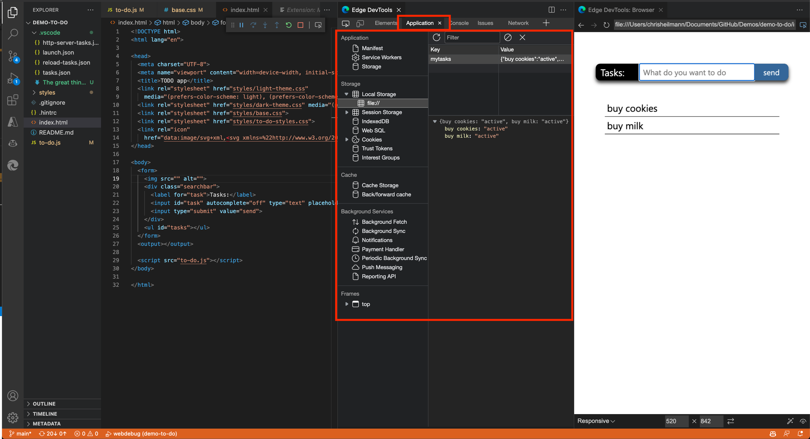

# Application tool integration

In the **Edge DevTools** tab, the **Application** tool allows you to inspect the various parts of your application:

Use the **Application** tool to:

* Check different storage options, such as **Cookies**, **LocalStorage**, **SessionStorage** and **IndexedDB**.

* Analyze the cache of your application.

* Analyze services such as Notification, Payment handler, or background sync.

For more information, see [Application tool, to manage storage](../../devtools-guide-chromium/storage/application-tool.md).

<!-- ====================================================================== -->
## See also

* [Get started using the DevTools extension for Visual Studio Code](./get-started.md)
* [Microsoft Edge DevTools extension for Visual Studio Code](../microsoft-edge-devtools-extension.md)
