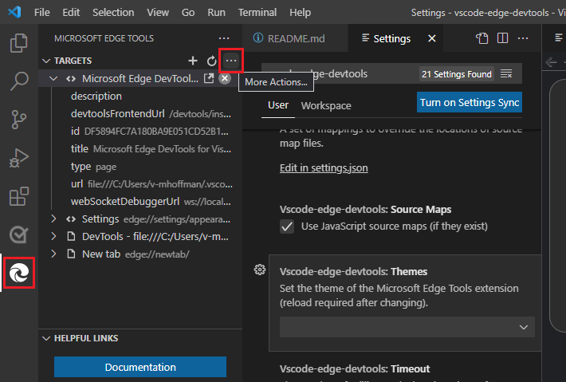

# Changing the extension settings

You can customize the Visual Studio Code extension to your needs.

1. In Visual Studio Code, on the **Activity Bar**, click **Microsoft Edge Tools**.

1. In **Microsoft Edge Tools** > **Targets**, click **More Actions** (...) to the right of the word **TARGETS**, and then select the **Open Settings** menuitem.

   

   The **Settings** page appears, filtered to show **vscode-edge-devtools** settings only.

1. Scroll through the available settings.

<!-- ====================================================================== -->
## List of Settings

The **Settings** page of DevTools v2.1.1 contains these settings.  For more information, see the **Settings** page.

* **Browser Args**
* **Browser Flavor**
* **Default Entrypoint**
* **Default Url**
* **Headless**
* **Hostname**
* **Path Mapping**
* **Port**
* **Show Workers**
* **Source Map Path Overrides**
* **Source Maps**
* **Timeout**
* **Use Https**
* **User Data Dir**
* **Webhint**
* **Web Root**
* **Bottom**
* **Top**
* **Split On Drag and Drop**
* **Ignored Extensions**
* **HTML: Custom Data**

<!-- ====================================================================== -->
## Reloading the extension after changing settings

Some settings have a note that reads **(reload required after changing)**.  For such a setting to take effect, close any instances of DevTools.  See [Closing DevTools](./open-devtools-and-embedded-browser.md#closing-devtools) in _Opening DevTools and the DevTools browser_.

Then open DevTools again to use the new settings.  See [Opening DevTools and the DevTools browser](./open-devtools-and-embedded-browser.md).

<!-- ====================================================================== -->
## See also

* [Get started using the DevTools extension for Visual Studio Code](./get-started.md)
* [Microsoft Edge DevTools extension for Visual Studio Code](../microsoft-edge-devtools-extension.md)
