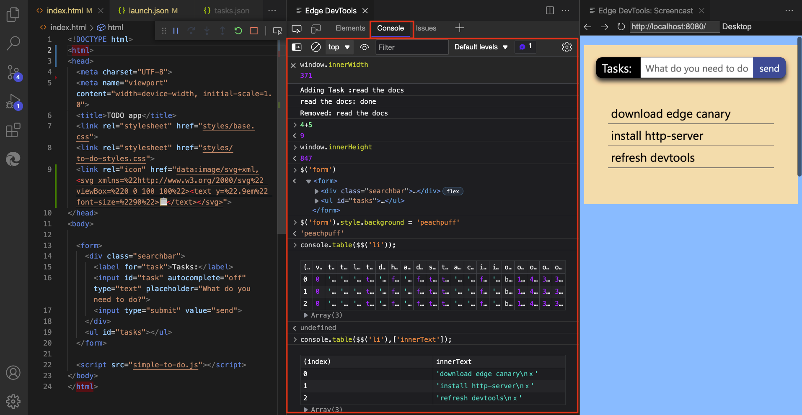
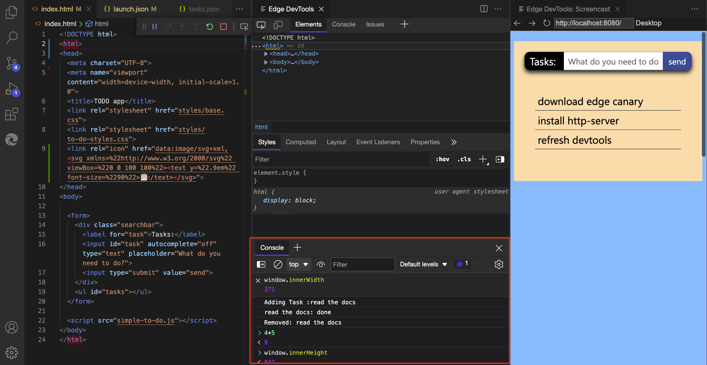
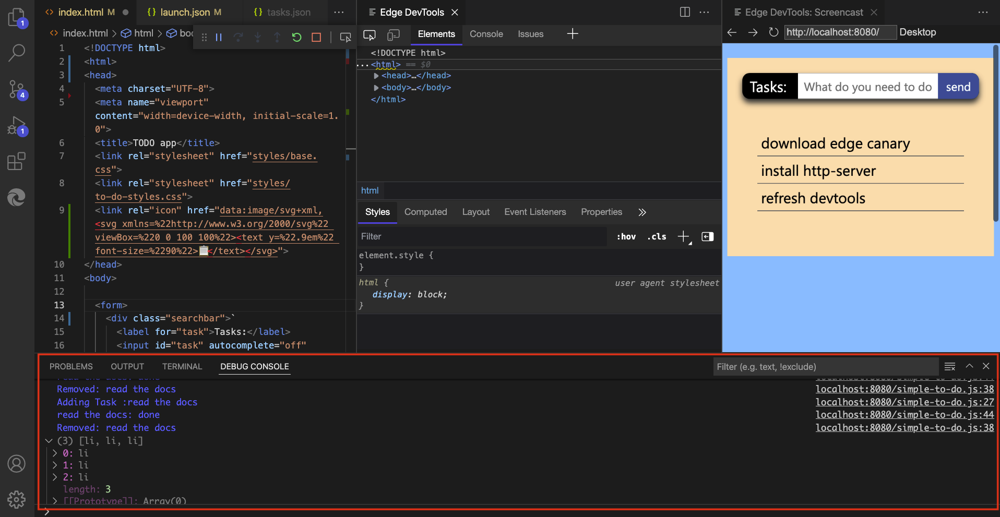

# Console integration

In the **Edge DevTools** tab's **Console** tool in Visual Studio Code with this extension, you can do everything that you can do when using Microsoft Edge DevTools inside the browser.

You can:
*  View [log messages](../../devtools-guide-chromium/console/console-log.md).
*  Access the `window` object and use the [DOM interaction convenience methods](../../devtools-guide-chromium/console/console-dom-interaction.md).
*  [Filter the Console](../../devtools-guide-chromium/console/console-filters.md) and set [live expressions](../../devtools-guide-chromium/console/live-expressions.md).

<!-- ====================================================================== -->
## Console side-by-side with other tools

You can use the **Console** alongside the **Elements** tool, by opening the **Console** in the lower panel of the **Edge DevTools** tab:

<!-- ====================================================================== -->
## Console during Run and Debug

If you launch the DevTools extension from the Run and Debug workflow, the **Debug Console** of Visual Studio Code gives you most of the functions of the **Edge DevTools** tab's **Console** tool, but without filtering options, and with a more basic results display than the **Edge DevTools** tab's **Console** tool:

<!-- ====================================================================== -->
## See also

* [Console overview](../../devtools-guide-chromium/console/index.md)
* [Debugging](https://code.visualstudio.com/Docs/editor/debugging) - the Debug Console of Visual Studio Code.
* [Get started using the DevTools extension for Visual Studio Code](./get-started.md)
* [Microsoft Edge DevTools extension for Visual Studio Code](../microsoft-edge-devtools-extension.md)
