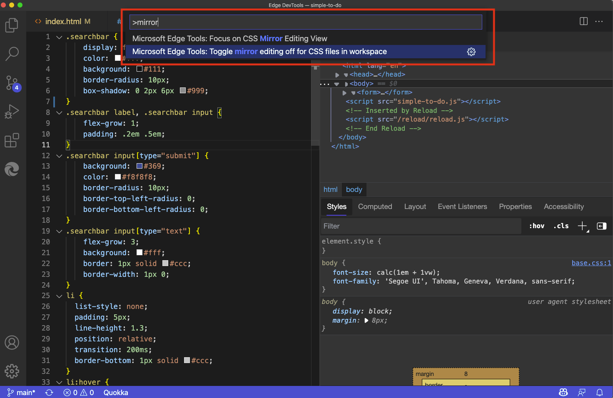

# Update .css files from within the Styles tab (CSS mirror editing)

CSS mirror editing provides two-way interaction so that you can change the CSS either way:

*  In the code editor, edit the `.css` file, your changes are mirrored in the **Elements** tool in the **Edge DevTools** tab.

*  In the **Elements** tool in the **Edge DevTools** tab, your changes are mirrored in the `.css` file in the code editor.

CSS mirror editing is enabled by default in the extension.  As a result, in the DevTools extension, in the **Styles** tab in the **Elements** tool, when you change CSS selectors, rules, or values, the local `.css` file is automatically edited as you change values.

For example, when you select a point size value for the body element and then press **Up Arrow** or **Down Arrow**, if you have the `.css` file opened, you can see the value automatically change in the `.css` file in realtime while you change the value in the **Styles** tab:

Without CSS mirror editing, the **Styles** tab in Microsoft Edge DevTools is excellent for debugging and tweaking your CSS selectors and CSS rules.  However, although these changes are immediately rendered in the web browser, they aren't reflected in your `.css` file.  This means that after you change CSS in the **Styles** tab, you need to copy and paste your changes back into your `.css` file.

CSS mirror editing is a feature of the Microsoft Edge DevTools extension that works around that problem.  Any change that you make in the **Styles** tab also automatically changes the `.css` file in your open folder in Visual Studio Code.  You can edit any CSS selector or create new CSS selectors in the **Styles** tab, and all changes are automatically mirrored in the correct `.css` file.

CSS mirror editing also works for an `.html` file that contains a `<style>` element, such as the Success page.  This is demonstrated in [Get started by clicking the Launch Instance button](./get-started-launch-instance.md).

#### The CSS Mirror Editing checkbox

If you use a URL (instead of a file path), CSS mirror editing requires opening a folder of webpage source files in Visual Studio Code that the extension can map to the webpage resources of the URL that's entered into the address bar or a `launch.json` file.  If you don't have the local source files, but want to change CSS in DevTools, clear the **CSS mirror editing** checkbox, to prevent error messages about mapping and mirror editing.  See [Enabling CSS mirror editing](#enabling-css-mirror-editing), below.

#### Saving the changes to the .css file

The extension doesn't automatically save the changes that it makes in the editor.  A white circle appears on the `.css` file's tab in the editor; you need to manually save the changes if you want to keep them.

If you close Visual Studio or the current folder or the `.css` file, Visual Studio prompts you to save the changes.

<!-- ====================================================================== -->
## Example of mirroring changes from the Styles tab to a .css file

In the following example, `index.html` is open in Visual Studio Code, and the Microsoft Edge DevTools extension is open.  We select the flexbox icon in the `.searchbar` CSS selector, and then change the `flex-direction` to `column`.

The change is reflected in the **Edge DevTools** tab and in the **Edge DevTools: Browser** tab:

As a result of CSS mirror editing, Visual Studio Code also automatically navigates to the correct `.css` file and the appropriate line number, and inserts the `flex-direction: column` CSS code:

<!-- ====================================================================== -->
## Enabling CSS mirror editing

If you have writable, trusted source files, and you want your CSS changes in DevTools to be automatically edited in the source files, select the **CSS mirror editing** checkbox.  It is selected by default.

Clear the **CSS mirror editing** check box if you're experimenting only, and there's a URL rather than a file path in the address bar in the **Edge DevTools: Browser** tab, and don't have source files locally via **Activity Bar** > **Explorer** > the **Open Folder** button, and don't want error messages about mapping and mirror editing.

To enable or disable CSS mirror editing:

1. In the **Edge DevTools** tab, in the **Elements** tab, go to the **Styles** tab.

1. Select or clear the **CSS mirror editing** checkbox:

   

   Or, open the Command Menu, start typing the word **mirror**, and then select **Microsoft Edge Tools: Toggle mirror editing on|off for CSS files in workspace**:

   

<!-- ====================================================================== -->
## Sourcemap support

CSS Mirroring also supports abstractions like Sass or CSS-in-JS when you have set up your project to produce sourcemaps.  We have a tracking issue on GitHub and welcome any feedback on how this could be improved: [CSS Mirror Editing with Sourcemaps: Known Issues and Feedback](https://github.com/microsoft/vscode-edge-devtools/issues/965).

<!-- ====================================================================== -->
## See also

* [Get started using the DevTools extension for Visual Studio Code](./get-started.md)
* [Microsoft Edge DevTools extension for Visual Studio Code](../microsoft-edge-devtools-extension.md)
