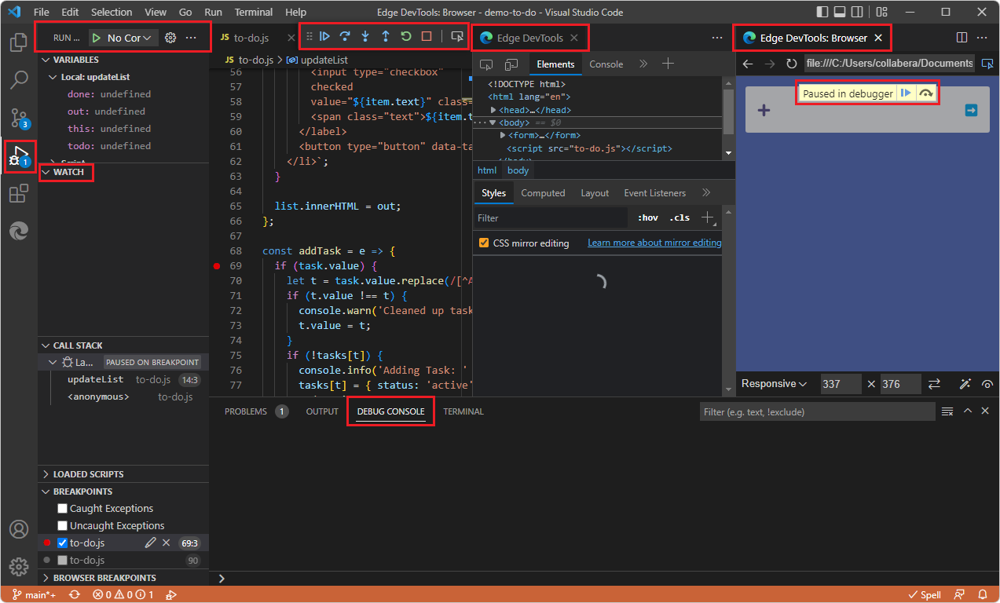
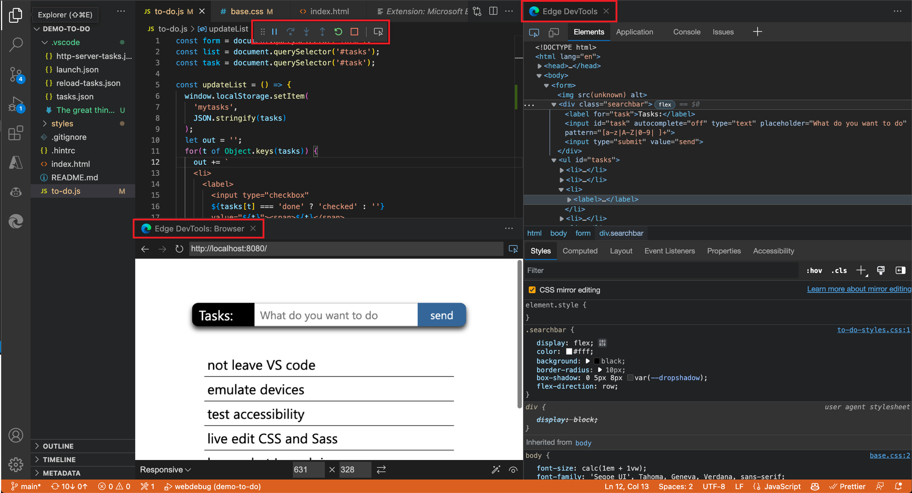
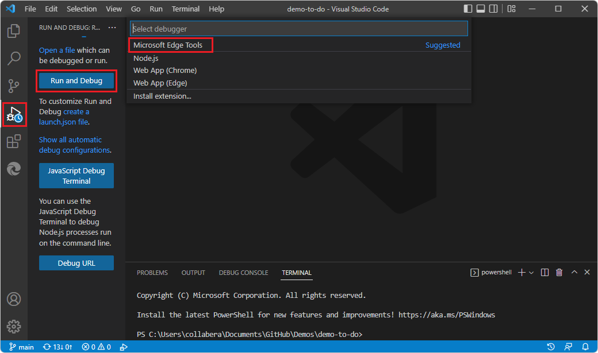
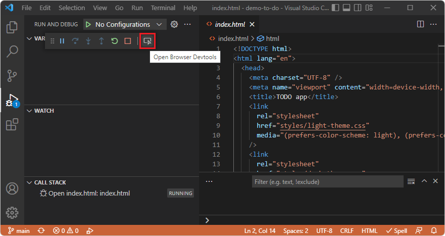
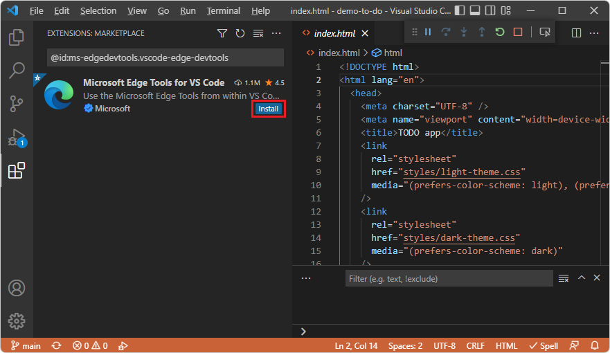
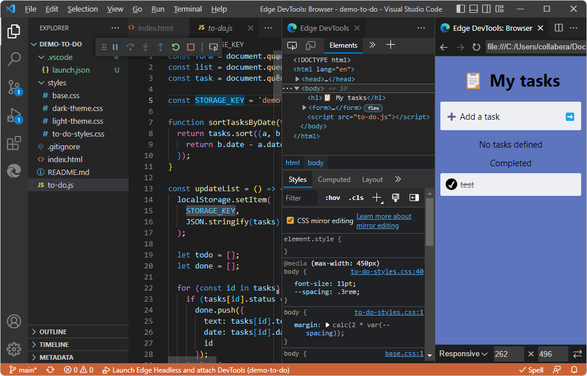
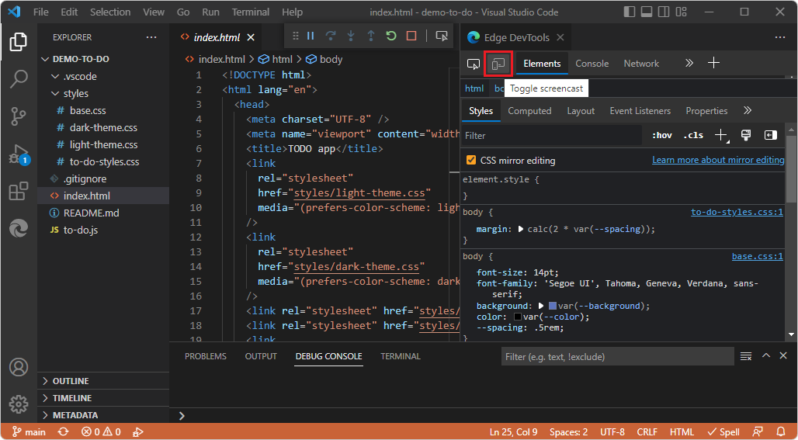
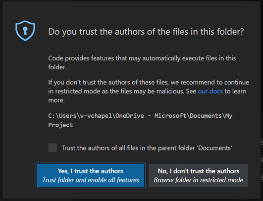

# Integration with Visual Studio Code debugging

<!-- outline:
## Ways to start the debugger along with the DevTools tabs
#### DevTools UI features to open DevTools in Debug mode
#### Visual Studio Code UI features to open DevTools in Debug mode

## Opening the browser as part of a debugging session
#### Generating a DevTools-oriented launch.json

## Automatically opening the browser and DevTools when debugging in Visual Studio Code
#### Generating a DevTools-oriented launch.json

## If you see the Success page but want your own webpage instead
-->

To open DevTools in Visual Studio Code in Debug mode by using the DevTools UI, right-click an `.html` file or click the **Launch Project** button, as described in [Opening DevTools and the DevTools browser](./open-devtools-and-embedded-browser.md).  You can also use the Visual Studio Code UI for launching the Debugger, such as **F5**, to open the **DevTools** tabs as well, if you define a DevTools-compatible `launch.json` file by clicking the **Generate launch.json** button in the **Microsoft Edge Tools** Side Bar.

When you open DevTools in Visual Studio Code in Debug mode, the following UI components are opened:
*  The **Edge DevTools** tab.
*  The **Edge DevTools: Browser** tab.
*  The Debug toolbar.
*  The **Run** (Debugger) Side Bar, including the **Watch** pane.
*  The **Debug Console** at bottom of window.

See also [Step 5: Step through JavaScript code in the Debugger](./get-started-right-click-html.md#step-5-step-through-javascript-code-in-the-debugger) in _Get started by right-clicking an HTML file_.

<!-- ====================================================================== -->
## Ways to start the debugger along with the DevTools tabs

Most of these approaches require a DevTools-generated `launch.json` file that contains your URL.

#### DevTools UI features to open DevTools in Debug mode

*  Right-click an `.html` file in **Explorer** > **Open with Edge**.  This approach essentially uses a file path rather than a URL, and doesn't require you to generate a `launch.json` file.

*  **Activity Bar** > **Microsoft Edge Tools** > click the **Launch Project** button.

#### Visual Studio Code UI features to open DevTools in Debug mode

*  Press **F5**.

*  On the **Activity Bar**, click the **Run and Debug** icon (), and then in the **Run and Debug** Side Bar, click the **Run and Debug** button.

*  Open the Visual Studio Code command palette, start typing the word **debug** after **>**, and then select **Debug: Open Link**.  See [Open Link command](https://code.visualstudio.com/docs/nodejs/browser-debugging#_open-link-command) in _Browser debugging in VS Code_.

<!-- ====================================================================== -->
## Opening the browser as part of a debugging session

You can open the **Edge DevTools: Browser** tab (the embedded DevTools browser) as part of a debugging session.  The DevTools extension opens a new browser as an embedded browser in Visual Studio Code.  This **Devtools: Browser** tab can be moved anywhere within the editor.  You can use this tab side by side with your source code, or split the panes and have the browser preview below your code:

You can use the DevTools extension with the usual Visual Studio Code debugging UI/workflow, as follows.  In this approach, to enter Debug mode, we are not using the DevTools UI; we are not right-clicking an `.html` file to select **Open with Edge**, and we are not clicking the **Activity Bar** > **Microsoft Edge Tools** > **Launch Project** button.

JavaScript debugging is built in to Visual Studio Code; you can debug in Chrome, Microsoft Edge, or Node.js without installing extensions.  If you debug by using the Microsoft Edge option with the Visual Studio Code debugging features and UI, you can start Microsoft Edge DevTools from the JavaScript debugger.  If the DevTools extension isn't installed, you're prompted to optionally install it.

The DevTools extension gives additional functionality, such as the embedded DevTools browser which has a Device Emulation toolbar, and provides additional ways to enter Debug mode in Visual Studio Code.

To start the Visual Studio Code debugger along with DevTools, by using the usual UI that's part of Visual Studio Code:

1. Open a new Visual Studio Code window.  No folder (workspace) is open, and the **DevTools** tabs aren't open.

1. Open a folder (workspace).  For example, select **File** > **Open Recent** > `C:\Users\username\Documents\GitHub\Demos\demo-to-do`.  The **DevTools** tabs aren't open.

1. Open an `.html` file.

1. Click in the `.html` file in the editor, and then do any of the following UI actions that start the Visual Studio Code debugger the usual ways:

   *  Press **F5**.

   *  On the **Activity Bar**, click the **Run and Debug** icon (), and then in the **Run and Debug** Side Bar, click the **Run and Debug** button, as shown below.

   *  Open the Visual Studio Code command palette, start typing the word **debug**, and then select **Debug: Open Link**.
    
   

   **Microsoft Edge Tools** doesn't appear in the above screenshot, because for this screenshot, DevTools was uninstalled.

1. Select **Web App (Edge)**.

1. On the Debug toolbar, click the **Inspect** button, which has a tooltip of **Open browser DevTools**:

   

   The first time you click the **Inspect** button on the Debug toolbar, the **Extensions: Marketplace** Side Bar opens, containing **Microsoft Edge Tools for VS Code**:

   

1. Click **Microsoft Edge Tools for VS Code** > **Install**.

1. Close DevTools per [Closing DevTools](./open-devtools-and-embedded-browser.md#closing-devtools).

1. Open a folder and an `.html` file.

Continue below.

<!-- ------------------------------ -->
#### Generating a DevTools-oriented launch.json

Assuming that the opened folder doesn't contain a `.vscode` folder that contains a `launch.json` file already:

1. Select **Activity Bar** > **Microsoft Edge Tools** > click the **Generate launch.json** button, and then press **F5**.  Or, see [Opening DevTools and the DevTools browser](./open-devtools-and-embedded-browser.md).

   After the DevTools extension is installed, when you open an `.html` file and then click the **Inspect** button on the Debug toolbar, the **Edge DevTools** tabs open inside of Visual Studio Code:

   

   In the above screenshot, there's a `launch.json` file in **Explorer** in the `.vscode` folder, and a string from that file, **Launch Edge Headless and attach DevTools**, at the bottom of the window, because DevTools was opened by a Visual Studio Code feature such as **F5**, which used the DevTools-generated `launch.json` file.

1. If needed, in the upper left of the **Edge DevTools** tab, click the **Toggle screencast** button:

   

   The **Edge DevTools: Browser** tab opens.

   In the above screenshot, there's no `launch.json` file in **Explorer** in the `.vscode` folder, and no string such as **Launch Edge Headless and attach DevTools** at the bottom of the window, because DevTools was opened by right-clicking the `.html` file in **Explorer**.

For additional UI steps and screenshots, see [Where the name strings appear in the UI](./launch-json.md#where-the-name-strings-appear-in-the-ui).  In most cases, the only thing you need to know about the content of the DevTools-generated `launch.json` file is that you need to enter your desired URL in the `"url"` string in several places.

<!-- ====================================================================== -->
## Automatically opening the browser and DevTools when debugging in Visual Studio Code

To debug your project, you might want to change the default page that opens in Microsoft Edge in Visual Studio Code.  To change the default page to your project's website:

1. In Visual Studio Code, select **File** > **New Window**.  Notice that no folder is open.

1. On the **Activity Bar**, select **Microsoft Edge Tools**.

1. In the **Microsoft Edge Tools: Targets** panel, click the **open a folder** link.

1. Select your project folder with the new default page to display when you begin debugging in Visual Studio Code.

   The first time you open a folder, you must confirm that you trust the authors of files in this folder:

   

1. Optionally select the checkbox **Trust the authors of all files in the parent folder**, and then click the **Yes, I trust the authors** button:

   The first time you do this process, you must also select **Activity Bar** > **Microsoft Edge Tools** again.

   The **Microsoft Edge Tools: Targets** panel now displays two buttons: **Launch Instance** and **Generate launch.json**:

   

<!-- ------------------------------ -->
#### Generating a DevTools-oriented launch.json

1. Select **Generate launch.json** to create a `launch.json` in your project.  This must be a longer file that's created by DevTools, as shown in [The launch.json file for the DevTools extension](./launch-json.md), not a short, more generic file created by Visual Studio Code.  See also [Deleting or re-creating launch.json](./troubleshooting.md#deleting-or-re-creating-launchjson) in _Troubleshooting the DevTools extension_.

1. In `launch.json`, add the URL of your project. If you leave URL empty, the default page is displayed.

1. Save `launch.json`.

When you choose to debug your project in Visual Studio Code, whether you use DevTools UI features or the usual Visual Studio Code UI features, it will automatically launch the browser and open the Developer Tools, showing the URL you specified in your `launch.json` file.

<!-- ====================================================================== -->
## If you see the Success page but want your own webpage instead

Which webpage opens is in DevTools is set by `launch.json` if that file exists in your workspace (your open folder).  Thus you might press **F5** while your own `.html` file is open, and yet see the default, **Success** page in the **DevTools** tabs.  Options in that case are:

*  Edit `launch.json` in your open folder to point to a URL (normally), or possibly a file path.  Then you can use the Visual Studio Code debugger workflow/UI, such as **F5**.

*  Or, delete `launch.json`, then **Activity Bar** > **Explorer** > right-click your `.html` file > select **Open with Edge**.  This approach doesn't use the Visual Studio Code Debugger workflow/UI, such as **F5**.

<!-- ====================================================================== -->
## See also

* [The launch.json file for the DevTools extension](./launch-json.md)
* [Debug Microsoft Edge in Visual Studio Code](../debugger-for-edge.md)
* [Microsoft Edge DevTools extension for Visual Studio Code](../microsoft-edge-devtools-extension.md)
* [The Visual Studio Code debugger now integrates with the DevTools extension](../../devtools-guide-chromium/whats-new/2021/07/devtools.md#the-visual-studio-code-debugger-now-integrates-with-the-devtools-extension) in _What's New in DevTools (Microsoft Edge 93)_.
<!--todo: incorporate pov from what's new; update present article, then remove this link.  Explain: The tools refresh automatically when you switch between different debugging targets.-->

**External pages:**

* [Launch configurations](https://code.visualstudio.com/Docs/editor/debugging#_launch-configurations) in the _Debugging_ article for Visual Studio Code.
* [Browser debugging in VS Code](https://code.visualstudio.com/docs/nodejs/browser-debugging)
