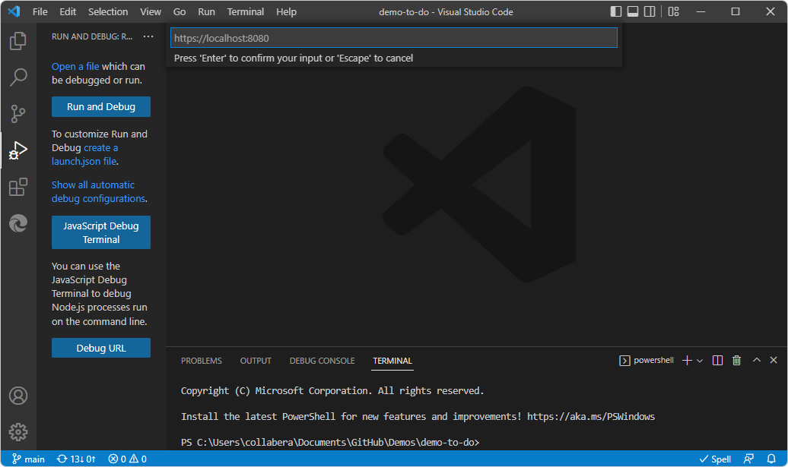

# Debugging a webpage

<!-- TODO: test the steps in this article -->

JavaScript debugging is built into Visual Studio Code.  You can debug in Chrome, Microsoft Edge, or Node.js without installing any other extensions.  If you debug by using Microsoft Edge, you can start Microsoft Edge DevTools from the JavaScript debugger of Visual Studio Code.

<!-- ====================================================================== -->
## Opening the browser as part of a debugging session

You can open the **Edge DevTools** tab and the **Edge DevTools: Browser** tab, which is an embedded (headless) browser, during a <!-- todo: reword?  as part of a --> debugging session.

The extension opens a new browser as an embedded browser in Visual Studio Code, shown as the **Edge DevTools: Browser** tab.

If you used the **Targets** > **...** > **Settings** page for the extension and cleared the **Headless mode** checkbox, an external entire Microsoft Edge window opens, if you click the **Launch Instance** button rather than right-clicking an `.html` file.

You can move the **Edge DevTools: Browser** tab to anywhere within the editor area in the Visual Studio Code window.  You can use this tab side by side with your source code, or split the panes and place the browser preview below your code:

<!-- ====================================================================== -->
## Starting the debugger with DevTools

<!-- todo: what sets this kind of debugging apart from VS Code's and from DevTool's?  Clarify h2, improve .md filename -->

<!-- todo:
add missing steps
test steps from multiple starting states
retake screenshots to show assumed starting state/context
-->

To start debugging:

1. Open Visual Studio Code or a new Visual Studio Code window.

1. If you want to work with local files, select **File** > **Open Folder**.  Or, select **Activity Bar** > **Explorer** > **Open Folder**.  Open a folder that contains a webpage, typically an `.html` file and a `.js` file and a `.css` file.

   Or, in the next step, you can enter a URL in the embedded (headless) browser (the **Edge DevTools: Browser** tab).

1. Start the extension, such as by right-clicking an HTML file or by clicking the **Launch Instance** button.  The **Edge DevTools** tab opens, the **Edge DevTools: Browser** tab opens, and the Debug toolbar opens in some cases.

   <!-- TODO: test the steps in this article -->

1. Do any of the following:

   *  In Visual Studio Code, click the **Run** menu, and then click **Start Debugging**.  Or, press `F5`.  In the **Select debugger** dropdown list, select **Microsoft Edge Tools**.

   *  Or, on the Activity Bar, click the **Run and Debug** () button, and then click the **Run and Debug** button, as shown below:

   <!--todo: make capture match the above text-->

   *  Or, select **View** > **Command Palette** (`Ctrl`+`Shift`+`P`), start typing the word **debug**, and then select **Debug: Open Link**.  The URL text box appears, suggesting **https://localhost:8080** or whatever string was last used:

   

1. In the **Select debugger** dropdown list, select **Microsoft Edge Tools**.

   The Debug toolbar includes an **Inspect** button:<!-- TODO: In some above approaches, the Debug toolbar doesn't appear.  What UI steps do you do to make it appear?  The Run and Debug pane says "Open a file which can be debugged or run."-->

   

1. Select **Inspect** to open Microsoft Edge DevTools inside Visual Studio Code.

   If you haven't yet installed the extension, when you click the **Inspect** button, the editor prompts you to install Microsoft Edge DevTools extension for Visual Studio Code.

   When the extension has been installed, when you click the **Inspect** button on the Debug toolbar, Microsoft Edge DevTools opens inside of Visual Studio Code:

   

<!-- ====================================================================== -->
## Stopping the debugger and closing DevTools

You might only need to do one or two of the following steps, depending on the state that Visual Studio Code is in.

1. If the Debug toolbar is open, in the Debug toolbar, click the **Stop** button.

1. If the **Edge DevTools** tab is open, click the **Close** (**X**) button on the tab.

1. If the **Edge DevTools: Browser** tab is open, click the **Close** (**X**) button on the tab.

1. Select **Activity Bar** > **Microsoft Edge Tools** > **Targets** > hover to the right of a target, and then click **Close** (**X**).

1. If an external, automation-controlled browser window is open, close it.

1. Select **File** > **Close Folder**.

<!-- ====================================================================== -->
## Automatically opening the browser and DevTools when debugging in Visual Studio Code

If you want to debug a local `.html`/`.css`/`.js` file, the main way to open a webpage for debugging is **Activity Bar** > **Explorer** > **Open Folder** > right-click a `.html` file, and then select **Open with Edge > Open Browser with DevTools**.

That approach opens the following UI components in Visual Studio Code:
*  The **Edge DevTools** tab.
*  The **Edge DevTools: Browser** tab.
   * If you clear the **Settings** > **Headless** checkbox and click the **Activity Bar** > **Microsoft Edge Tools** > **Launch Instance** button, an external browser window opens instead of the embedded browser tab.
*  The Debug toolbar.
*  The **Run** (Debugger) sidebar, including the **Watch** pane.
*  The **Debug Console** at bottom of window.

To debug your project, you might want to change the default page that opens in Microsoft Edge in Visual Studio Code.

This approach involves editing `launch.json`.  See also [The launch.json file for DevTools extension](./launch-json.md).

To change from the default webpage to another webpage, to open in the **Edge DevTools** tab and the **Edge DevTools: Browser** tab (or an external browser window if you don't use headless mode).

To customize launch and debug:

1. In Visual Studio Code, select **File** > **New Window**.  Initially, no folder is open.

1. On the **Activity Bar**, select **Microsoft Edge Tools**.

1. In the **Microsoft Edge Tools: Targets** panel, click the **Open Folder** button.

1. Select your project folder that contains the new default page (such as `index.html`) that you want to display in the browser instance when you begin debugging your webpage in Visual Studio Code.

   The first time you open a folder, you must confirm that you trust the authors of files in this folder.  Optionally select the checkbox **Trust the authors of all files in the parent folder**, and then click the **Yes I trust the authors** button**:

   

   The first time you open a folder, you must then click the **Microsoft Edge Tools** button in the **Activity Bar** again.

   The **Microsoft Edge Tools: Targets** panel now contains two buttons: **Launch Instance** and **Generate launch.json**:

   

1. Click the **Generate launch.json** button to create a `launch.json` file in your project.

1. In `launch.json`, add the URL of your project.  This can be a URL or a local file path.  If you leave the URL as-is, the default, **Success** page is displayed.

1. Save the `launch.json` file.

Now, when you debug your project in Visual Studio Code, the **Edge DevTools** tab opens, showing content for the page that you specified in `launch.json`.  Also, the **Edge DevTools: Browser** tab opens, displaying the rendered page that you specified in `launch.json`.

<!-- ====================================================================== -->
## See also

* [Launch configurations](https://code.visualstudio.com/Docs/editor/debugging#_launch-configurations) in the _Debugging_ article for Visual Studio Code.
* [Microsoft Edge Developer Tools for Visual Studio Code](https://marketplace.visualstudio.com/items?itemName=ms-edgedevtools.vscode-edge-devtools) at the Visual Studio Marketplace website.
* [Command Palette](https://code.visualstudio.com/docs/getstarted/userinterface#_command-palette) in _User Interface_ in the Visual Studio Code documentation.
