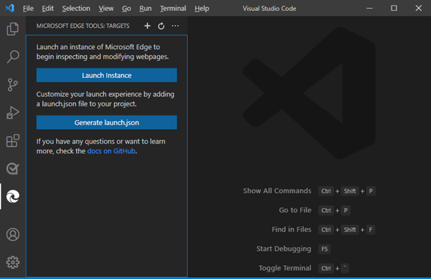

# Integration with Visual Studio Code debugging

To open DevTools in Visual Studio Code in Debug mode, right-click an `.html` file or click the **Launch Project** button, as described in [Opening DevTools and the DevTools browser](./open-devtools-and-embedded-browser.md).

When you open DevTools in Visual Studio Code in Debug mode, the following UI components are opened:
*  The **Edge DevTools** tab.
*  The **Edge DevTools: Browser** tab.
*  The Debug toolbar.
*  The **Run** (Debugger) Side Bar, including the **Watch** pane.
*  The **Debug Console** at bottom of window.

For a step-by-step example, see [Step 6: Step through JavaScript code in the Debugger](./get-started.md#step-6-step-through-javascript-code-in-the-debugger) in _Get started using the DevTools extension for Visual Studio Code_.

<!-- ====================================================================== -->
## Opening the browser as part of a debugging session

You can open the **Edge DevTools: Browser** tab (the embedded DevTools browser) as part of a debugging session.  The DevTools extension opens a new browser as an embedded browser in Visual Studio Code.  This **Devtools: Browser** tab can be moved anywhere within the editor.  You can use this tab side by side with your source code, or split the panes and have the browser preview below your code:

You can use the DevTools extension with the usual Visual Studio Code debugging UI/workflow, as follows.  In this approach, to enter Debug mode, we are not using the DevTools UI; we are not right-clicking an `.html` file to select **Open with Edge**, and we are not clicking the Activity Bar > **Microsoft Edge Tools** > **Launch Project** button.

JavaScript debugging is built in to Visual Studio Code; you can debug in Chrome, Microsoft Edge, or Node.js without installing extensions.  If you debug by using the Microsoft Edge option with the Visual Studio Code debugging features and UI, you can start Microsoft Edge DevTools from the JavaScript debugger.  If the DevTools extension isn't installed, you're prompted to optionally install it.

The DevTools extension gives additional functionality, such as the embedded DevTools browser which has a Device Emulation toolbar, and provides additional ways to enter Debug mode in Visual Studio Code.

To start the Visual Studio Code debugger along with DevTools, by using the usual UI that's part of Visual Studio Code:

1. Open a new Visual Studio Code window.  No folder (workspace) is open, and the **DevTools** tabs aren't open.

1. Open a folder (workspace).  For example, select **File** > **Open Recent** > `C:\Users\myusername\Documents\GitHub\Demos\demo-to-do`.  The **DevTools** tabs aren't open.

1. Do any of the following UI actions that start the Visual Studio Code debugger the usual ways:

   *  Press **F5**.

   *  On the Activity Bar, click the **Run and Debug** icon (), and then in the **Run and Debug** Side Bar, click the **Run and Debug** button, as shown below.

   *  Open the Visual Studio Code command palette, start typing the word **debug**, and then select **Debug: Open Link**.
    
   

   **Microsoft Edge Tools** doesn't appear in the above screenshot, because for this screenshot, DevTools was uninstalled.

<!-- todo: resume testing/doc'ing here.  uninstall DevTools. -->

1. Select **Web App (Edge)**.  On the Debug toolbar, notice the **Inspect** button:

   

1. Click the **Inspect** button to open Microsoft Edge DevTools inside Visual Studio Code.

   The first time you select **Inspect**, the editor prompts you to install the Microsoft Edge DevTools extension for Visual Studio Code.

   After the DevTools extension is installed, when you click the **Inspect** button on the Debug toolbar, the **Edge DevTools** tab opens inside of Visual Studio Code:

   

<!-- ====================================================================== -->
## Automatically opening the browser and DevTools when debugging in Visual Studio Code

To debug your project, you might want to change the default page that opens in Microsoft Edge in Visual Studio Code.  To change the default page to your project's website:

1. In Visual Studio Code, select **File** > **New Window**.  Notice that no folder is open.

1. On the **Activity Bar**, select **Microsoft Edge Tools**.

1. In the **Microsoft Edge Tools: Targets** panel, click the **open a folder** link.

1. Select your project folder with the new default page to display when you begin debugging in Visual Studio Code.

   The first time you open a folder, you must confirm that you trust the authors of files in this folder:

   

1. Optionally select the checkbox **Trust the authors of all files in the parent folder**, and then click the **Yes, I trust the authors** button:

   The first time you do this process, you must also select Activity Bar > **Microsoft Edge Tools** again.

   The **Microsoft Edge Tools: Targets** panel now displays two buttons: **Launch Instance** and **Generate launch.json**:

   

1. Select **Generate launch.json** to create a `launch.json` in your project.

1. In `launch.json`, add the URL of your project. If you leave URL empty, the default page is displayed.

1. Save `launch.json`.

When you choose to debug your project in Visual Studio Code it will automatically launch the browser and open the Developer Tools showing the URL you specified in your `launch.json`. 

<!-- ====================================================================== -->
## If you see the Success page but want your own webpage instead

   Which webpage opens is in DevTools is set by `launch.json` if that file exists in your workspace (your open folder).  Thus you might press `F5` while your own `.html` file is open, and yet see the default, **Success** page in the **DevTools** tabs.  Options in that case are:

   *  Edit `launch.json` in your open folder to point to a URL (normally), or possibly a file path.  Then you can use the Visual Studio Code debugger workflow/UI, such as `F5`.

   *  Or, delete `launch.json`, then Activity Bar > **Explorer** > right-click your `.html` file > select **Open with Edge**.  This approach doesn't use the Visual Studio Code Debugger workflow/UI, such as `F5`.

<!-- ====================================================================== -->
## See also

* [Launch configurations](https://code.visualstudio.com/Docs/editor/debugging#_launch-configurations) in the _Debugging_ article for Visual Studio Code.
* [Microsoft Edge DevTools extension for Visual Studio Code](../microsoft-edge-devtools-extension.md)
