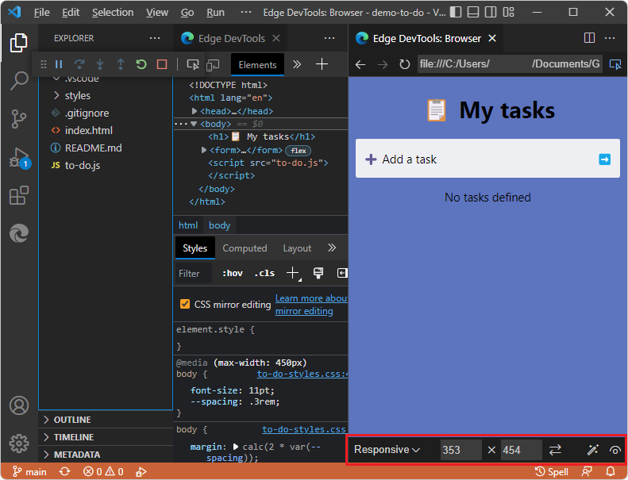
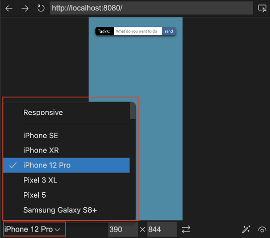
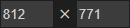
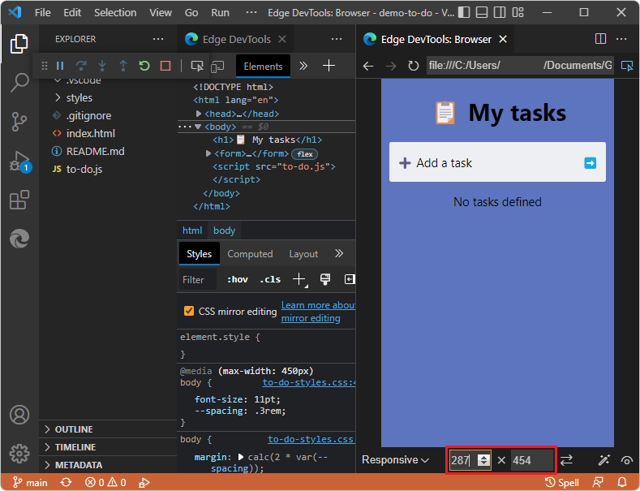
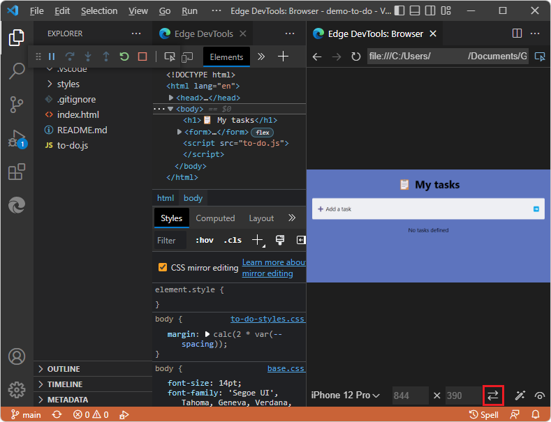
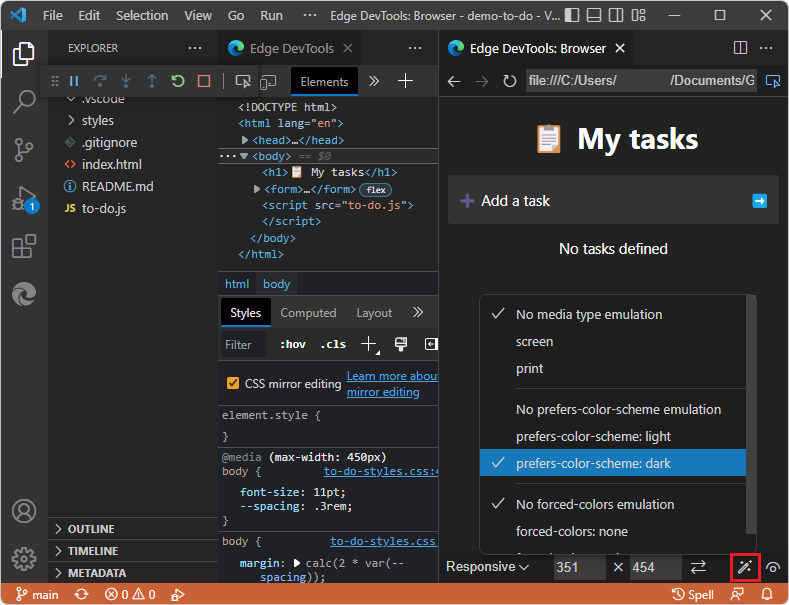

# Device emulation

In the **Edge DevTools: Browser** tab, the Device Emulation toolbar on the bottom enables you to simulate different environments:

To reproduce the UI shown here, see [Opening DevTools by right-clicking an HTML file](./open-devtools-and-embedded-browser.md#opening-devtools-by-right-clicking-an-html-file) in _Opening DevTools and the DevTools browser_.

<!-- ====================================================================== -->
## Emulate Devices dropdown menu
<!-- toolbar item 1. Emulate devices -->

In the **Emulate devices** dropdown menu, you can select from a number of different devices, or the default option of **Responsive**.  When you select a device, the viewport resizes to the correct measurements and simulates the touch interface.  For example, there are several emulated iPhone layouts:

<!-- ====================================================================== -->
## Width and Height dropdown menus
<!-- toolbar item 2. Width -->
<!-- toolbar item 3. Height -->

To change the viewport dimensions, click the **Width** and **Height**  dropdown menus:

<!-- ====================================================================== -->
## Rotate button
<!-- toolbar item 4. Rotate -->

Click the **Rotate** button () to rotate the viewport between portrait and landscape orientation:

<!-- ====================================================================== -->
## Emulate CSS Media Features button
<!-- toolbar item 5. Emulate CSS media features -->

Use the **Emulate CSS media features** button () to: 
*  Emulate CSS media queries.
*  Test how your product looks in print mode.
*  Switch between dark and light mode.
*  Emulate forced colors.

<!-- ====================================================================== -->
## Emulate Vision Deficiencies button
<!-- toolbar item 6. Emulate vision deficiencies -->

Click the **Emulate vision deficiencies** () button to test the user experience of the current webpage with different visual deficiencies.  This button lets you test your product in a blurred mode, or in different color deficiencies:

<!-- ====================================================================== -->
## See also

* [Emulate mobile devices (Device Emulation)](../../devtools-guide-chromium/device-mode/index.md)
* [Microsoft Edge DevTools extension for Visual Studio Code](../microsoft-edge-devtools-extension.md)
