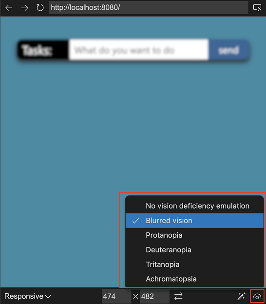

# Device and state emulation

In the Edge DevTools: Browser preview tab, the emulation toolbar on the bottom enables you to simulate different environments:

<!-- ====================================================================== -->
## Emulate Devices dropdown menu
<!-- toolbar item 1. Emulate devices -->

In the **Emulate devices** dropdown menu, you can select from a number of different devices.  When you select a device, the viewport resizes to the correct measurements and simulates the touch interface.  For example, there are several emulated iPhone layouts:

<!-- ====================================================================== -->
## Width and Height dropdown menus
<!-- toolbar item 2. Width -->
<!-- toolbar item 3. Height -->

Click the **Width** and **Height** dropdown menus to change the viewport dimensions: 

<!-- ====================================================================== -->
## Rotate button
<!-- toolbar item 4. Rotate -->

Click the **Rotate** button () to rotate the viewport.

<!-- ====================================================================== -->
## Emulate CSS Media Features button
<!-- toolbar item 5. Emulate CSS media features -->

To emulate CSS media queries, click the **Emulate CSS media features** () button.  This button enables you to test how your product looks in print mode.  You can switch between dark and light mode, and emulate forced colors:

<!-- ====================================================================== -->
## Emulate Vision Deficiencies button
<!-- toolbar item 6. Emulate vision deficiencies -->

Click the **Emulate vision deficiencies** () button to try the experience of the current web project with different visual deficiencies.  This button lets you test your product in a blurred mode or in different color deficiencies:

<!-- ====================================================================== -->
## See also

* [Microsoft Edge DevTools extension for Visual Studio Code](../microsoft-edge-devtools-extension.md)
