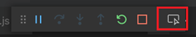
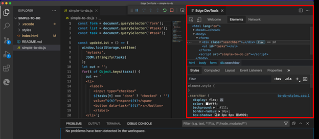

# Use the extension with the Visual Studio Code debugging workflow

JavaScript debugging is built in to Visual Studio Code.  You can debug in Chrome, Microsoft Edge, or Node.js without installing any other extensions.  If you debug using Microsoft Edge, you can start Microsoft Edge DevTools from the JavaScript debugger.

<!-- ====================================================================== -->
## Debugging
<!-- todo: what sets this kind of debugging apart from VS Code's and from DevTool's?  Clarify h2, improve .md filename -->

1. To start debugging, do either of the following:
   *  Press **F5**.
   *  On the menu bar, click the **Debug** icon, and then click the **Run and Debug** button, as shown below.
   *  Open the Visual Studio Code command palette, start typing the word **debug**, and then select **Debug: Open Link**.<!--todo: mention **Select environment** text box" as shown in capture-->
    
   <!--todo: make capture match the above text-->

1. Select **Edge**.<!--todo: clarify; **Edge: Launch**?  describe specific UI/controls: link or button or command/list item-->  On the debug toolbar, notice the **Inspect** button:

   

1. Select **Inspect** to open Microsoft Edge DevTools inside Visual Studio Code.

   The first time you select **Inspect**, the editor prompts you to install the extension, [Microsoft Edge Developer Tools for Visual Studio Code](https://marketplace.visualstudio.com/items?itemName=ms-edgedevtools.vscode-edge-devtools).

   After the Microsoft Edge DevTools extension is installed, when you select **Inspect**, Microsoft Edge DevTools opens inside of Visual Studio Code:

   

<!-- ====================================================================== -->
## Automatically opening the browser and DevTools when debugging in Visual Studio Code

To debug your project, you might want to change the default page that opens in Microsoft Edge in Visual Studio Code.  To change the default page to your project's website:

1. In Visual Studio Code, select **File** > **New Window**.  Notice that no folder is open.

1. On the **Activity Bar**, select **Microsoft Edge Tools**.

1. In the **Microsoft Edge Tools: Targets** panel, click the **Open Folder** button.

1. Select your project folder that contains the new default page (such as `index.html`) that you want to display in the browser instance when you begin debugging your webpage in Visual Studio Code.

   The first time you open a folder, you must confirm that you trust the authors of files in this folder.  You can also select the checkbox **Trust the authors of all files in the parent folder**:

   

   The first time you complete this process, you must also click the **Microsoft Edge Tools** button in the **Activity Bar** again.

   The **Microsoft Edge Tools: Targets** panel now displays two buttons: **Launch Instance** and **Generate launch.json**:

   

1. Select **Generate launch.json** to create a `launch.json` in your project.

1. In `launch.json`, add the URL of your project.  This can be a local file path.  If you leave the URL as-is, the default, **Success** page is displayed.

1. Save `launch.json`.

Now, when you select **Debug** when your project folder is open in Visual Studio Code, the **Edge DevTools** tab opens, showing content for the page that you specified in `launch.json`.  Also, the **Edge DevTools: Browser** tab opens, displaying the rendered page that you specified in `launch.json`.

<!-- ====================================================================== -->
## See also

* [Launch configurations](https://code.visualstudio.com/Docs/editor/debugging#_launch-configurations) in the _Debugging_ article for Visual Studio Code.
* [Microsoft Edge DevTools extension for Visual Studio Code](../microsoft-edge-devtools-extension.md)
