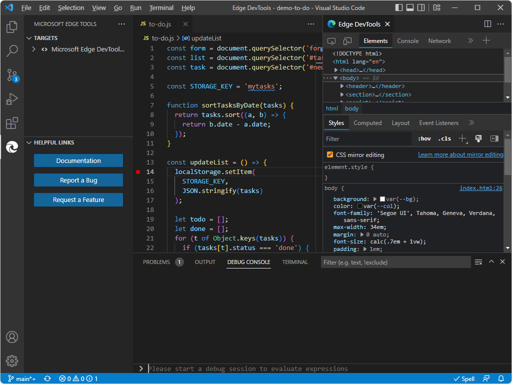

# Using an external browser window

By default, opening DevTools opens the embedded (headless) **Edge DevTools: Browser** tab, including a device emulation toolbar, in the Visual Studio Code window.

As an alternative approach, an **external browser** approach, from within VS Code, launch the full Microsoft Edge browser window, and then go to your web application (or generate a `launch.json` file to specify the `.html` page to open).  This approach opens a separate Microsoft Edge window that's controlled by DevTools automation:

   

   

   Note that there's no Debug toolbar when opening DevTools by clicking the **Launch Instance** button in the **Microsoft Edge Tools** sidebar/pane.  To turn on the Debug toolbar, paste an `.html` filepath or URL into the address bar of the browser, and then in Visual Studio Code, press `F5`, and then select **Microsoft Edge Tools**.<!-- todo: test/review -->

When you change settings, a quick way to restart is to select **File** > **Close Folder**, then select **File** > **Open Recent** > select a folder.

If you change the settings for the extension so that it opens an external Microsoft Edge window, the automation-controlled external Microsoft Edge window opens when you click the **Launch Project** button.  But when you right-click an `.html` file, the **Edge DevTools: Browser** tab (the embedded browser) still opens rather than the external browser window.

To open an external Microsoft Edge browser window, including the complete UI for Microsoft Edge (but without the UI features for Device Emulation):

1. In Visual Studio Code, select Activity Bar > **Microsoft Edge Tools** > **Launch Instance** > **Targets** > hover to the right of a target > click **More Actions** (**...**) > **Open Settings**.

1. Clear the **Headless mode** checkbox.

1. Close and reopen Visual Studio Code.  Or, just close and reopen the folder.  This closes all instances of the extension.

   Then when you launch a browser instance using the extension by selecting Activity Bar > **Microsoft Edge Tools** > **Launch Instance**, an entire Microsoft Edge browser window will open.

_External browser window_ means that when you launch an instance of the browser by using the Edge DevTools extension, an entire Microsoft Edge window with full UI opens, controlled by test automation.  If you click the **Launch Project** button and no `launch.json` file exists, or the default `launch.json` file exists, the default, Success page opens in the browser:

Visual Studio Code when external browser launched: contains the **Edge DevTools** tab, but not the **Edge DevTools: Browser** tab (and in this scenario for launching, doesn't open the Debug toolbar):

In some cases,<!--todo: which?--> the Debug toolbar opens, and the Watch pane of Visual Studio Code opens.

#### Embedded browser for DevTools

The **Edge DevTools: Browser** tab within Visual Studio Code has a device emulation toolbar.  This browser tab is sometimes called _headless mode_ or _screencast_.  This is the default setting.  The alternative approach is to have DevTools open an external, automation-controlled Microsoft Edge window, without a device emulation toolbar (other than that provided by regular DevTools in the Microsoft Edge browser).

To change or check the setting for which type of browser window to use:

1. In Visual Studio Code, select Activity Bar > **Microsoft Edge Tools** > **Launch Instance** > **Targets** > hover to the right of a target > click **More Actions** (**...**) > **Open Settings**.

1. Select the **Headless** checkbox, so that a checkmark appears.

1. Close and reopen Visual Studio Code.  Or, just close and reopen the folder.  This closes all instances of the extension.

   Then when you launch a browser instance by selecting Activity Bar > **Microsoft Edge Tools** > **Launch Instance**, the **Edge DevTools: Browser** tab will open within Visual Studio Code.

The **Edge DevTools: Browser** tab contains the embedded browser:

<!-- ====================================================================== -->
## See also

* [Get started using the DevTools extension for Visual Studio Code](./get-started.md)
