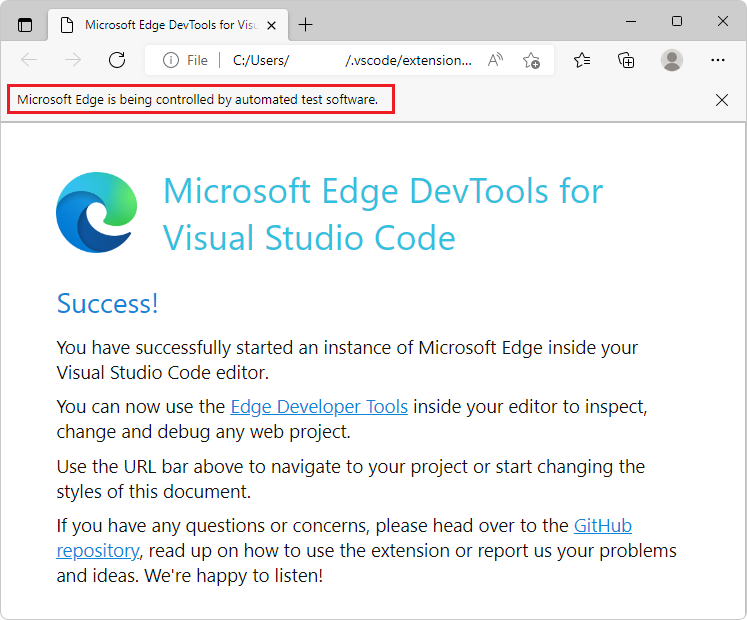
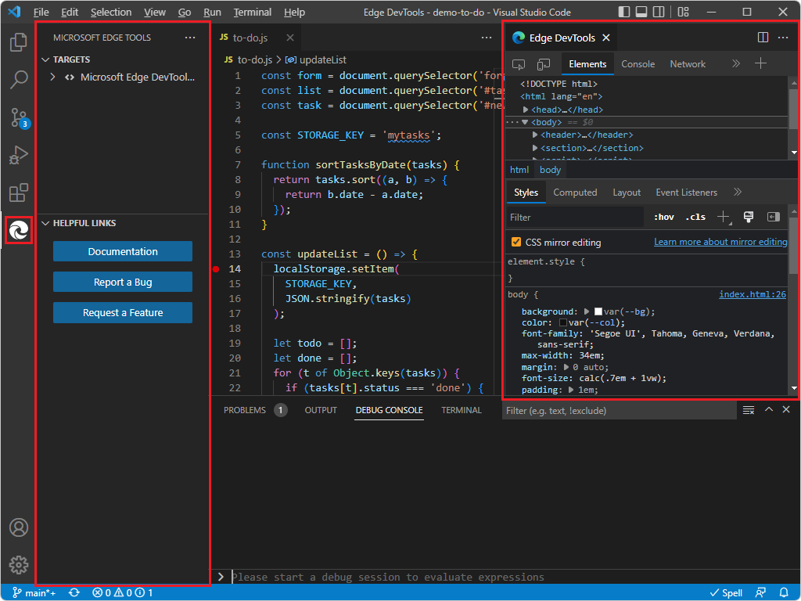
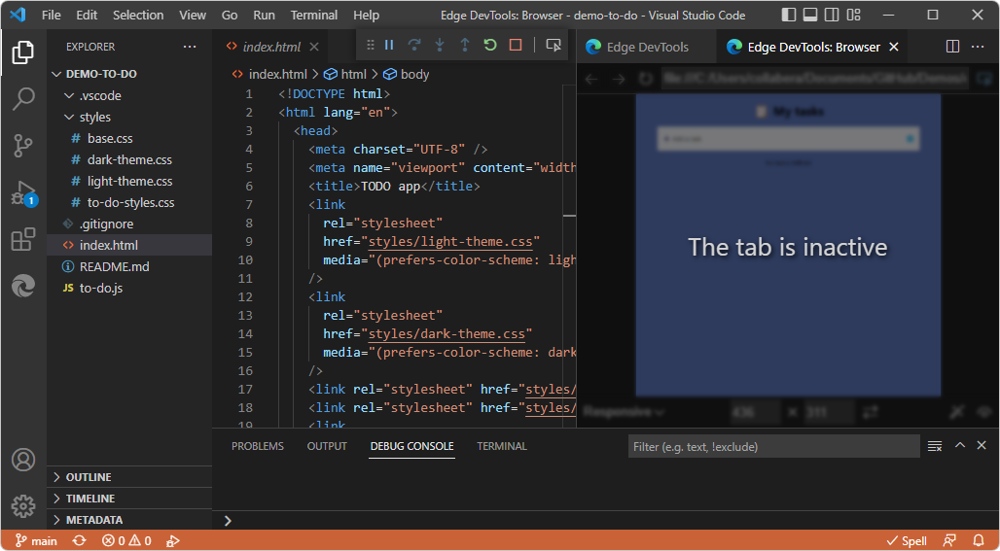
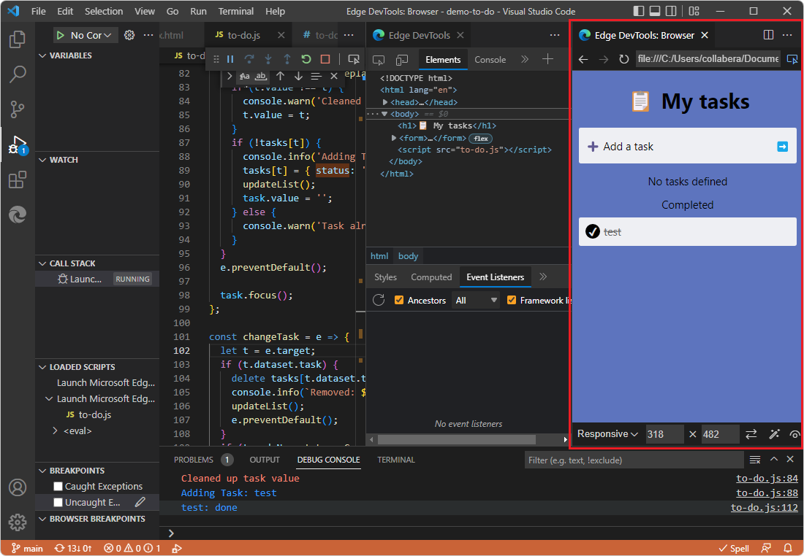
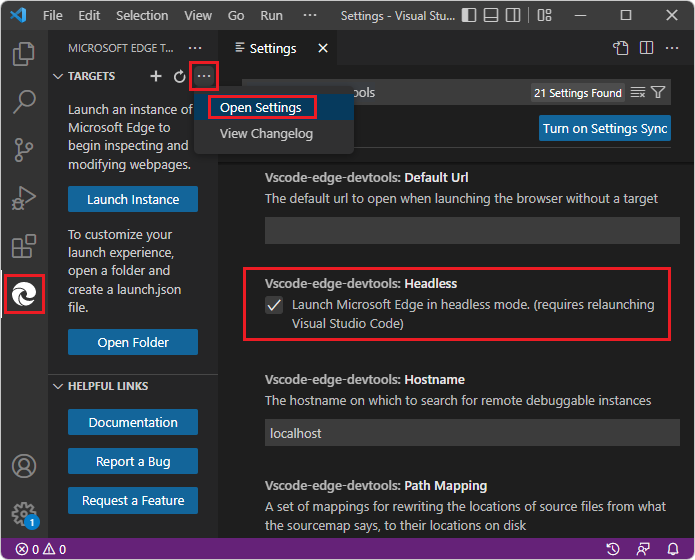

# Using an external browser window

By default, DevTools opens the **Edge DevTools: Browser** tab in Visual Studio Code.  The alternative approach is to have DevTools open an external, automation-controlled Microsoft Edge window.

<!-- ====================================================================== -->
## External browser window

_External browser window_ means that when you launch an instance of the browser by using the Edge DevTools extension, an entire Microsoft Edge window with full UI opens, controlled by DevTools test automation:

When the external browser window is open, the **Edge DevTools: Browser** tab doesn't open when you start DevTools:

If you then click the **Toggle screencast** button in the **Edge DevTools** tab, the **Edge DevTools: Browser** tab opens, displaying **The tab is inactive**:

<!-- ====================================================================== -->
## The embedded DevTools browser

By default, DevTools opens the **Edge DevTools: Browser** tab in Visual Studio Code, rather than opening an external browser window.  The  **Edge DevTools: Browser** tab includes a device emulation toolbar at the bottom:

This tab is also called:
*  The _headless browser_, in **Settings**.
*  The _screencast_, in tooltips.
*  The _embedded browser_.
*  The _DevTools browser_.
*  The _embedded DevTools browser_.

<!-- ====================================================================== -->
## Changing the setting

To change or check the setting for which type of browser window to use:

1. In Visual Studio Code, select **Activity Bar** > **Microsoft Edge Tools**.  The **Microsoft Edge Tools** Side Bar opens.

1. Hover to the right of **Targets**, and then click **More Actions** (**...**) > **Open Settings**.

   

1. If you want to use the **Edge DevTools: Browser** tab in Visual Studio Code, select the **Headless** checkbox.

   Or, if you want to use the external, automation-controlled browser window, clear the **Headless** checkbox.

1. Close DevTools.  See [Closing DevTools](./open-devtools-and-embedded-browser.md#closing-devtools) in _Opening DevTools and the DevTools browser_.

1. Open DevTools.  See [Opening DevTools and the DevTools browser](./open-devtools-and-embedded-browser.md).

<!-- ====================================================================== -->
## See also

* [Get started using the DevTools extension for Visual Studio Code](./get-started.md)
* [Microsoft Edge DevTools extension for Visual Studio Code](../microsoft-edge-devtools-extension.md)
* [Debug Microsoft Edge in Visual Studio Code](../debugger-for-edge.md)

**External articles:**

* [Browser debugging in VS Code](https://code.visualstudio.com/docs/nodejs/browser-debugging)
