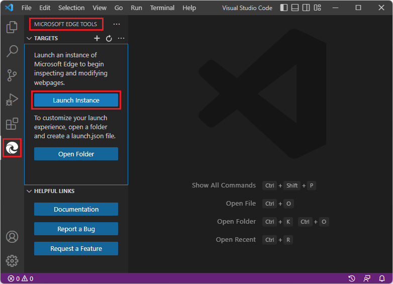
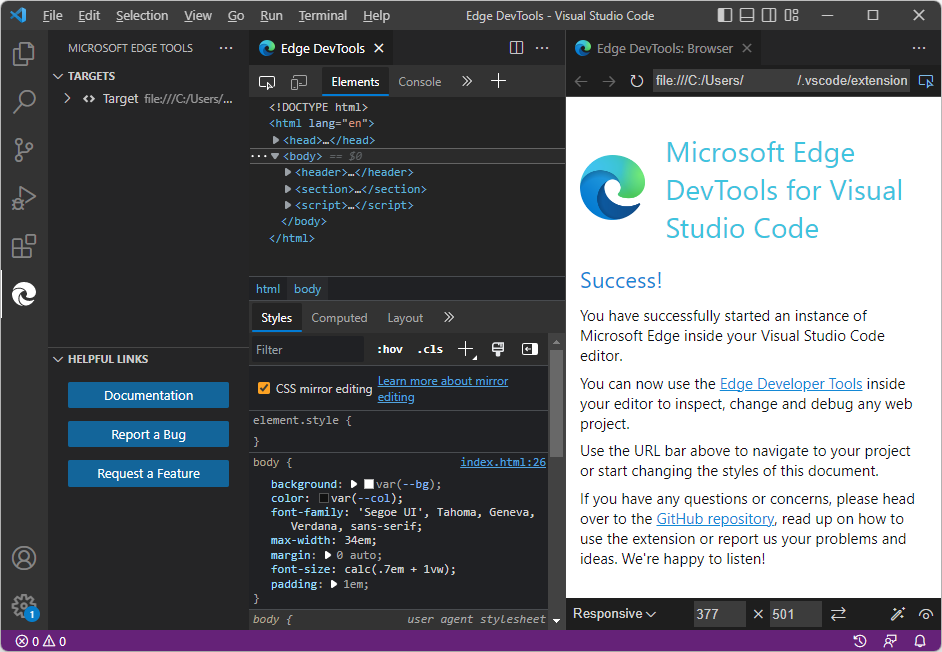
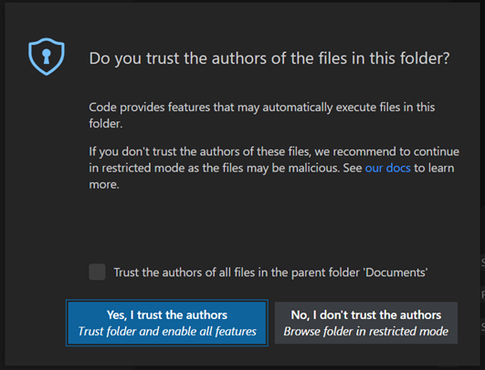
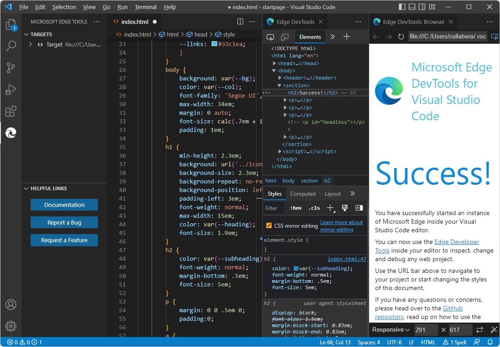
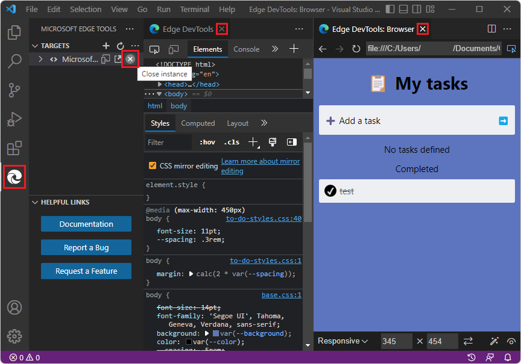

# Get started by clicking the Launch Instance button

Use this tutorial to learn how to open and close DevTools by clicking the **Launch Instance** button, to experiment with the demo **Success** webpage.  This approach opens the default, Success webpage for editing, so you can practice and get started using DevTools.  This approach is prominent in the UI, and it opens the DevTools tabs in non-debug mode.

This way of opening DevTools is useful for these simple scenarios:

*  If you want to experiment with editing the default, Success page by using DevTools.

*  If you want to inspect a page that's specified by using a URL, and don't need Debug mode.  To open a different webpage, you can paste a URL or file path, in the address bar.

*  If you don't have a folder open and you want to experiment with changing CSS on a page that's specified by using a URL, without editing a local source file.

<!-- outline:
* Step 1: Install DevTools and prerequisites
* Step 2: Click the Launch Instance button
* Step 3: Open a folder, to ensure editing is allowed
* Step 4: Edit CSS
* Step 5: Arrange tabs
* Step 6: View JavaScript
* Step 7: Open a different .html file by using the address bar
* Step 8: Open a URL by using the address bar
* Step 9: Close DevTools
-->

<!-- ====================================================================== -->
## Step 1: Install DevTools and prerequisites

1. If you haven't already, do the steps in [Installing the DevTools extension for Visual Studio Code](./install.md), and then continue below.  You don't need to install and start a web server for the present tutorial, but it's recommended.

<!-- ====================================================================== -->
## Step 2: Click the Launch Instance button

1. In Visual Studio Code, select **File** > **New Window**.  Initially, no folder is opened.

1. In **Activity Bar**, click **Microsoft Edge Tools** ().  The **Microsoft Edge Tools** Side Bar opens:

   

1. Click the **Launch Instance** button.  The **Edge DevTools** tab opens, and the **Edge DevTools: Browser** tab opens, displaying the default, Success page:

   

   The Success page source file is a self-contained `.html` file in a directory on your drive.  This is a single `.html` file that includes CSS rules (in a `<style>` element).  It also includes a JavaScript `console` statement (in a `<script>` element).

   In the address bar of the DevTools browser, there is a `file:///` path (rather than a URL), such as `file:///C:/Users/username/.vscode/extensions/ms-edgedevtools.vscode-edge-devtools-2.1.1/out/startpage/index.html`.

   The Debug toolbar doesn't open, **Debug Console** doesn't open at bottom, and the **Run and Debug** Side Bar with **Watch** pane doesn't open.  This indicates that Visual Studio Code is not in Debug mode.

   You can modify CSS of the local files, and you can enter local file paths or localhost URLs in the address bar and interact with local web app pages.

<!-- ====================================================================== -->
## Step 3: Open a folder, to ensure editing is allowed

Note that no folder is open in Visual Studio Code.  In many cases, to use DevTools to edit rather than merely inspect a webpage, you must open a folder that contains source files that match the displayed webpage.  Opening a folder gives the most flexibility so you can open either a URL or a file path in the address bar of the **Edge DevTools: Browser** tab and have full DevTools functionality.

Opening a folder gives you the opportunity to grant trust to the folder, so that you don't get an error message when you try to change the source files.  Otherwise you might get an error message because the folder that contains the Success page is not trusted, and CSS mirror editing is trying to edit the CSS in the `index.html` source file in that folder.

1. In the **Edge DevTools: Browser** tab, in the address bar, select and copy the file path, but not the file name, such as `C:/Users/username/.vscode/extensions/ms-edgedevtools.vscode-edge-devtools-2.1.1/out/startpage/`.

1. In **Activity Bar** > **Explorer**, click the **Open Folder** button.  In the **Open Folder** dialog, paste or select the path you copied above.  To paste, on Windows, you might need to change `/` to `\` throughout the path. Then click the **Select Folder** button.

   The first time you open a folder, you must confirm that you trust the authors of files in this folder:

   

1. Click the **Yes, I trust the authors** button.

   You might need to launch DevTools again, as follows:

<!-- if Trust requires re-trying these two steps: -->

1. In **Activity Bar**, click **Microsoft Edge Tools** ().  The **Microsoft Edge Tools** Side Bar opens.

1. Click the **Launch Instance** button.  The **Edge DevTools** tab opens, and the **Edge DevTools: Browser** tab opens, displaying the default, Success page.

<!-- ====================================================================== -->
## Step 4: Edit CSS

1. In the **Edge DevTools** tab, click the **Select an element in the page to inspect it** () button, sometimes called the **Inspect** button.

1. In the **Edge DevTools: Browser** tab, hover over different parts of the page, while you watch the **Elements** tool's DOM tree expand and update.

1. Click the **Success!** heading, which is an `<h2>` element.

1. In the **Styles** tab of the **Elements** tool in the **Edge DevTools** tab, in the non-italic h2 declaration section, click to the right of the `margin-bottom` rule.

1. Enter a new CSS rule, `font-size: 5em`, and then press **Enter**.  The spelling is similar to the rule shown in the italic h2 section from the user agent stylesheet below it.

   `index.html` opens, automatically edited by CSS mirror editing to add the line `font-size: 5em;`.  Scroll to that line, in the h2 section.

<!-- ====================================================================== -->
## Step 5: Arrange tabs

1. In the **Edge DevTools** tab, in the non-italic h2 section, click the `font-size` CSS rule that you entered, and then press **Up Arrow** and **Down Arrow**.  The value in `index.html` is automatically edited, by CSS mirror editing.

1. In the **Edge DevTools** tab, click the **Toggle screencast** button a couple times.  The **Edge DevTools: Browser** tab opens and closes, saving space.

1. In the **Edge DevTools: Browser** tab, click the **Close DevTools** or **Open DevTools** button a couple times.  The other **DevTools** tab opens and closes, saving space.

1. Along the top of Visual Studio Code, right-click the tabs and arrange them to show the various tabs at the same time: 

   *  The Side Bar, showing **Microsoft Edge Tools** > **Targets**.
   *  The `index.html` editor.
   *  The **Edge DevTools** tab.
   *  The **Edge DevTools: Browser** tab.

   

<!-- ====================================================================== -->
## Step 6: View JavaScript

1. In the **Edge DevTools** tab, click the **Console** tool's tab.  `index.html` contains a `<script>` element that contains a JavaScript statement `console.info('Hello from the startpage!')`, which outputs "Hello from the startpage!"

<!-- ====================================================================== -->
## Step 7: Open a different .html file by using the address bar

By entering a file path in the address bar of the **Edge DevTools: Browser** tab, the **Launch Instance** button can also be used to open a different `.html` file instead of the Success page.  We'll demonstrate that below.  However, right-clicking an `.html` file in the **Explorer** is the main way to open an `.html` file other than the **Success** webpage, and the tools open in Debug mode.

1. In Visual Studio Code, select **File** > **Open Folder** (or **Open Recent**).  Open the `\Demos\demo-to-do\` folder of the Demos repo that you cloned, such as `C:\Users\username\Documents\GitHub\Demos\demo-to-do\`.

1. If prompted, click the **Yes, I trust the authors** button.  Aside from granting trust, the **Launch Instance** approach doesn't actually require opening a folder, if you specify a file path rather than a URL in the DevTools browser.

1. If the **Edge DevTools** tabs aren't open already, in the **Activity Bar**, click **Microsoft Edge Tools** (), and then click the **Launch Instance** button:

   

1. In the **Activity Bar**, select **Explorer**, and then right-click `\demo-to-do\index.html` > **Copy Path**.

1. In Visual Studio Code, in the **Edge DevTools: Browser** tab, in the address bar, paste the local filepath that you obtained above, such as `C:\Users\username\Documents\GitHub\Demos\demo-to-do\index.html`.  The **demo-to-do** app opens.  In the address bar, the `file:///` prefix is added and (on Windows) backslashes are changed to forward slashes; for example: `file:///C:/Users/username/Documents/GitHub/Demos/demo-to-do/index.html`.

1. In the demo app, enter a task, such as **test**.

1. In the **Elements** tool, in the **Styles** tab, change a CSS value, such as: click the point size in `body { font-size: 11pt;}` and then change the value.  The corresponding `.css` file in the folder that you opened opens and it is automatically edited to match your changes made in the **Styles** tab (but is not saved).

<!-- ====================================================================== -->
## Step 8: Open a URL by using the address bar

The address bar that results from the **Launch Instance** button can be used to open a URL on a server.  However, the **Launch Project** button, along with a URL stored in `launch.json`, is the main way to open a webpage by specifying a URL, and the tools then open in Debug mode.

1. If your localhost server is running, paste a localhost URL, such as `http://localhost:8080`.  Or, paste the github.io server URL, [https://microsoftedge.github.io/Demos/demo-to-do/](https://microsoftedge.github.io/Demos/demo-to-do/).

   If you want to use CSS mirror editing to edit your source files, you'll need to open a folder in Visual Studio Code; otherwise, clear the **CSS mirror editing** checkbox in the **Styles** tab in the **Elements** tool in the **Edge DevTools** tab.  Clearing the checkbox prevents error messages about mapping and mirror editing when you experiment with changing CSS in DevTools and haven't provided a CSS source file for DevTools.

1. In the demo app, enter a task, such as **test**.

1. In the **Elements** tool, in the **Styles** tab, change a CSS value, such as: click the point size in `body { font-size: 11pt;}` and then change the value.  The corresponding `.css` file in the folder that you opened opens and it is automatically edited to match your changes made in the **Styles** tab (but is not saved).

<!-- ====================================================================== -->
## Step 9: Close DevTools

1. Click **Close** (**x**) in the **Edge DevTools** tab and in the **Edge DevTools: Browser** tab, if these tabs are open.

1. Select **Activity Bar** > **Microsoft Edge Tools**.  If the **Targets** section lists any targets, hover on the right side of the target instance and then click **Close instance** (**x**).  The **Launch Instance** button appears, indicating that all DevTools instances are closed.

   

   Note that in the above screenshot, Visual Studio Code isn't in Debug mode; for example, there's no Debug toolbar.  If there were a Debug toolbar, you could close DevTools by clicking the **Stop** button.

1. Close `index.html` without saving changes.

1. Select **File** > **Close Folder**.

See also:
* [Closing DevTools](./open-devtools-and-embedded-browser.md#closing-devtools) in _Opening DevTools and the DevTools browser_.

You've finished the tutorial "Get started by clicking the Launch Instance button".  It's recommended that you also do the other tutorials; see [Get started using the DevTools extension for Visual Studio Code](./get-started.md).

<!-- ====================================================================== -->
## See also

* [Opening DevTools and the DevTools browser](./open-devtools-and-embedded-browser.md)
* [Microsoft Edge DevTools extension for Visual Studio Code](../microsoft-edge-devtools-extension.md)

**GitHub:**

* [demo-to-do](https://microsoftedge.github.io/Demos/demo-to-do/) - the demo web app running on the `github.io` server.
* [Source code for demo-to-do](https://github.com/MicrosoftEdge/Demos/tree/main/demo-to-do)
* [MicrosoftEdge/Demos repo](https://github.com/MicrosoftEdge/Demos)
