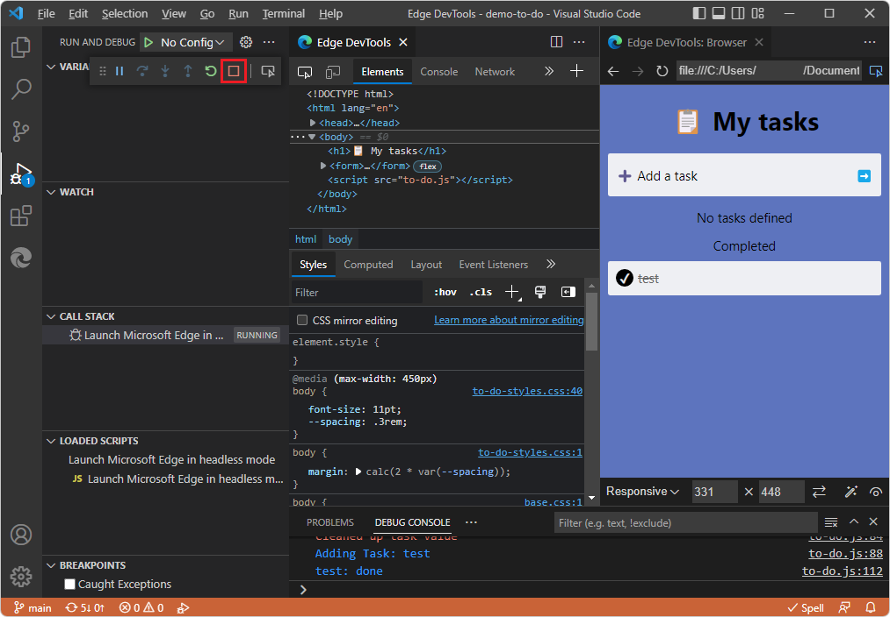

# Get started by right-clicking an HTML file

Use this tutorial to learn how to open and close DevTools by right-clicking an `.html` file for **Demo To Do** in the **Explorer** of Visual Studio Code, without needing to run a web server.

<!-- outline:
* Step 1: Install DevTools and prerequisites
* Step 2: Start DevTools by right-clicking an HTML file
* Step 3: Arrange tabs
* Step 4: Edit CSS in DevTools, updating the .css file automatically
* Step 5: Step through JavaScript code in the Debugger
* Step 6: Close DevTools
-->

<!-- ====================================================================== -->
## Step 1: Install DevTools and prerequisites

1. If you haven't already, do the steps in [Installing the DevTools extension for Visual Studio Code](./install.md), and then continue below.  You don't need to install and start a web server for the present tutorial, but it's recommended.

<!-- ====================================================================== -->
## Step 2: Start DevTools by right-clicking an HTML file

<!-- the equivalent section in Opening is more general than this section, which uses Demos repo -->

Right-clicking an `.html` file in Visual Studio Code's **Explorer** is the main way to open DevTools when your webpage doesn't require running on a web server.

*  Unlike the **Launch Instance** button, this approach opens DevTools in Debug mode.

*  Unlike the **Launch Project** button that we'll use later, this approach doesn't require you to generate a `launch.json` file.

We'll demonstrate by opening the **demo-to-do** web app:

1. In Visual Studio Code, select **File** > **Open Folder**.

1. Go to the directory where you cloned the Demos repo, open the specific directory for the **demo-to-do** app, such as `C:\Users\username\Documents\GitHub\Demos\demo-to-do\`, and then click the **Select Folder** button:

   

1. Select **Activity Bar** > **Explorer** () > right-click `index.html` and then select **Open with Edge** > **Open Browser with DevTools**:

   

   *  The **Edge DevTools** tab opens.

   *  The **Edge DevTools: Browser** tab opens, displaying the webpage you right-clicked.

   *  The Debug toolbar of Visual Studio Code opens, the **Debug Console** opens at the bottom, and the **Run** pane opens.  These features indicate that Visual Studio Code is in Debug mode:

   

<!-- ====================================================================== -->
## Step 3: Arrange tabs

To save space, use the **Close DevTools** or **Open DevTools** button and the **Toggle screencast** button to toggle (open or close) the DevTools tabs.

1. Toward the upper left corner of the **Edge DevTools** tab, click the **Toggle screencast** button:

   

   The **Edge DevTools: Browser** tab closes.

1. In the **Edge DevTools** tab, click the **Toggle screencast** button again.

   The **Edge DevTools: Browser** tab opens.

1. In the top right of the **Edge DevTools: Browser** tab, click the **Close DevTools** button:

   

1. In the top right of the **Edge DevTools: Browser** tab, click the **Open DevTools** button.

1. Drag the **Edge DevTools: Browser** tab to dock it anywhere in Visual Studio Code, such as grouping it with the source code editor.

<!-- maybe move or copy "Arrange tabs" section into its own article.  The article would explain how to customize the UI (eg arranging tabs) and how to use it - including the emulation options in the "Edge DevTools: Browser" tab.  Consider putting it in the Customize TOC bucket. -->

<!-- ====================================================================== -->
## Step 4: Edit CSS in DevTools, updating the .css file automatically

In the **Edge DevTools** tab, in the **Elements** tool > **Styles** tab, you can edit CSS selectors, rules, and values.  The **CSS mirror editing** checkbox is selected by default, so the `.css` file is automatically edited, but the edits are not saved, so that you can decide whether to save the changes.

1. In the **Elements** tool, in the **Styles** tab, click a CSS value, such as the body font size.

1. Change the CSS value, such as using mouse wheel or pressing **Up Arrow** and **Down Arrow**.  The associated `.css` file opens, such as `to-do-styles.css` and scrolls to the line that defines the CSS value, and automatically edits the `.css` file but doesn't save changes:

   

1. Close the `.css` file.  Visual Studio Code prompts you whether to save changes.

1. Click the **Don't Save** button.

<!-- ====================================================================== -->
## Step 5: Step through JavaScript code in the Debugger

1. Select **Activity Bar** > Explorer ().

1. In the **demo-to-do** directory, click **to-do.js** to open it.  Scroll down to the `changeTask` function and then click to the left of a line number to set a breakpoint:

   

1. If the **Run and Debug** Side Bar isn't displayed, select **View** > **Run**.  The **Run and Debug** Side Bar includes the **Watch** pane and other debugger panes.

1. In the demo app rendered in the **Edge DevTools: Browser** tab, enter a task, such as **test**.  The debugger of Visual Studio Code pauses at the breakpoint in the `to-do.js` file:

   

1. In the Debug toolbar, or using the **Run** menu or by pressing keys, step through a couple lines of code in `to-do.js`.

1. In the demo app rendered in the **Edge DevTools: Browser** tab, click the "done" circle next to the test task.  The debugger of Visual Studio Code pauses at the breakpoint in the `to-do.js` file.

<!-- ====================================================================== -->
## Step 6: Close DevTools

To end debugging and close the **Edge DevTools** tabs:

1. In the Debug toolbar, click the **Stop** (**Shift+F5**) button.  Or, on the **Run** menu, select **Stop Debugging**:

   

   The **Edge DevTools** tab closes, and the **Edge DevTools: Browser** tab closes.

See also:
* [Closing DevTools](./open-devtools-and-embedded-browser.md#closing-devtools) in _Opening DevTools and the DevTools browser_.

You've finished the tutorial "Get started by right-clicking an HTML file".  It's recommended that you also do the other tutorials; see [Get started using the DevTools extension for Visual Studio Code](./get-started.md).

<!-- ====================================================================== -->
## See also

* [Opening DevTools and the DevTools browser](./open-devtools-and-embedded-browser.md)
* [Microsoft Edge DevTools extension for Visual Studio Code](../microsoft-edge-devtools-extension.md)

**GitHub:**

* [demo-to-do](https://microsoftedge.github.io/Demos/demo-to-do/) - the demo web app running on the `github.io` server.
* [Source code for demo-to-do](https://github.com/MicrosoftEdge/Demos/tree/main/demo-to-do)
* [MicrosoftEdge/Demos repo](https://github.com/MicrosoftEdge/Demos)
