# Get started using the DevTools extension for Visual Studio Code

This is a step-by-step tutorial about opening and closing DevTools and using it to modify CSS and debug JavaScript.  Follow the steps here from top to bottom for a general introduction and to ensure that your machine is set up to use DevTools.


<!-- ====================================================================== -->
## Step 1: Install DevTools and prerequisites

1. Do the steps in [Installing the DevTools extension for Visual Studio Code](./install.md), and then continue below.


<!-- ====================================================================== -->
## Step 2: Start DevTools by clicking the Launch Instance button for the default page

This approach opens the DevTools tabs in non-debug mode and is useful when you don't want to use the Debug features of Visual Studio Code.  Supported scenarios for this way of opening DevTools:

*  You don't have to have a folder open in Visual Studio Code if you use a file path; you can still use CSS mirror editing to edit your CSS source files.

*  If you don't have a folder open and you want to inspect a page that's specified using a URL.

*  If you don't have a folder open and you want to experiment with changing CSS on a page that's specified using a URL, without using CSS mirror editing.

Clicking the **Launch Instance** button doesn't go directly to your file; you have to paste a file path or URL.  This approach is prominent in the UI, and you need to know how to close instances of DevTools that have been opened this way.  You should also know how to edit the Success page, so you can get started.

   **Open the DevTools tabs:**

1. In Visual Studio, select **File** > **New Window**.  Initially, no folder is opened.

1. In Activity Bar, click **Microsoft Edge Tools** ().  The **Microsoft Edge Tools** Side Bar opens.

1. Click the **Launch Instance** button.  The **Edge DevTools** tab opens, and the **Edge DevTools: Browser** tab opens, displaying the default, Success page.  In the address bar of the DevTools browser, there is a `file:///` path (rather than a URL), such as `file:///C:/Users/myusername/.vscode/extensions/ms-edgedevtools.vscode-edge-devtools-2.1.1/out/startpage/index.html`.

   The Debug toolbar doesn't open, **Debug Console** doesn't open at bottom, and the **Run and Debug** Side Bar with **Watch** pane doesn't open.  This indicates that Visual Studio Code is not in Debug mode.

   You can modify CSS of the local files, and you can enter local file paths or localhost URLs in the address bar and interact with local web app pages.

   **Open a folder:**

   Note that no folder is open in Visual Studio Code.  In many cases, to use DevTools to edit rather than merely inspect a webpage, you must open a folder that contains source files that match the displayed webpage.  Opening a folder gives the most flexibility so you can open either a URL or a file path in the address bar of the **Edge DevTools: Browser** tab and have full DevTools functionality.  Opening a folder gives you the opportunity to grant trust to the folder, so that you don't get an error message when you try to change the source files.

   Otherwise you might get an error message because the folder that contains the Success page is not trusted, and CSS mirror editing is trying to edit the CSS in the `index.html` source file in that folder.

1. In the **Edge DevTools: Browser** tab, in the address bar, select and copy the file path, but not the file name, such as `C:/Users/myusername/.vscode/extensions/ms-edgedevtools.vscode-edge-devtools-2.1.1/out/startpage/`.

1. In Activity Bar > **Explorer**, click the **Open Folder** button.  In the **Open Folder** dialog, paste or select the path you copied above.  To paste, on Windows, you might need to change `/` to `\` throughout the path. Then click the **Select Folder** button.

   The first time you open a folder, you must confirm that you trust the authors of files in this folder:

   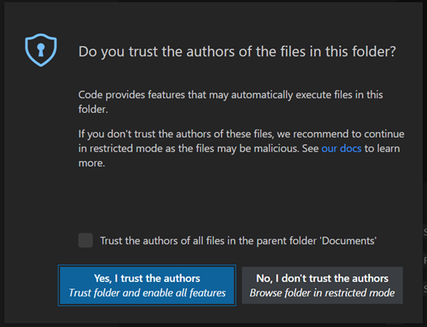

1. Click the **Yes, I trust the authors** button.

   You might need to launch DevTools again, as follows.

1. In Activity Bar, click **Microsoft Edge Tools** ().  The **Microsoft Edge Tools** Side Bar opens.

1. Click the **Launch Instance** button.

   The **Edge DevTools** tab opens, and the **Edge DevTools: Browser** tab opens, displaying the default, Success page.  The Success page source file is a self-contained `.html` file in a directory on your drive.  This is a single `.html` file that includes CSS rules (in a `<style>` element).  It also includes a JavaScript `console` statement (in a `<script>` element).

   **Edit CSS:**

1. In the **Edge DevTools** tab, click the **Select an element in the page to inspect it** () button, sometimes called the **Inspect** button.

1. In the **Edge DevTools: Browser** tab, hover over different parts of the page, while you watch the **Elements** tool's DOM tree expand and update.

1. Click the **Success!** heading, which is an `<h2>` element.

1. In the **Styles** tab of the **Elements** tool in the **Edge DevTools** tab, in the non-italic h2 declaration section, click to the right of the `margin-bottom` rule.

1. Enter a new CSS rule, `font-size: 5em`, and then press `Enter`.  The spelling is similar to the rule shown in the italic h2 section from the user agent stylesheet below it.

   `index.html` opens, automatically edited by CSS mirror editing to add the line `font-size: 5em;`.  Scroll to that line, in the h2 section.

   **Arrange tabs:**

1. In the **Edge DevTools** tab, in the non-italic h2 section, click the `font-size` CSS rule that you entered, and then press `Up Arrow` and `Down Arrow`.  The value in `index.html` is automatically edited, by CSS mirror editing.

1. In the **Edge DevTools** tab, click the **Toggle screencast** button a couple times.  The **Edge DevTools: Browser** tab opens and closes, saving space.

1. In the **Edge DevTools: Browser** tab, click the **Close DevTools** or **Open DevTools** button a couple times.  The other **DevTools** tab opens and closes, saving space.

1. Along the top of Visual Studio Code, right-click the tabs and arrange them to show the various tabs at the same time: 

   *  The Side Bar, showing **Microsoft Edge Tools** > **Targets**.
   *  The `index.html` editor.
   *  The **Edge DevTools** tab.
   *  The **Edge DevTools: Browser** tab.

   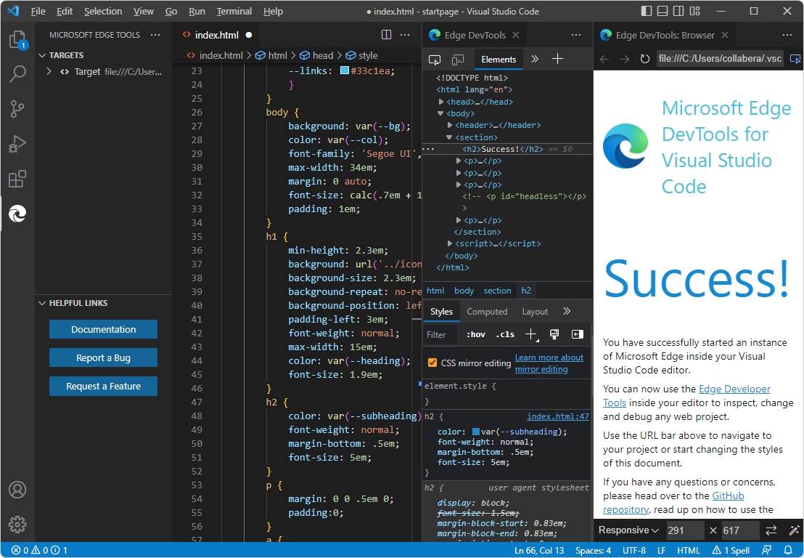

   **View JavaScript:**

1. In the **Edge DevTools** tab, click the **Console** tool's tab.  `index.html` contains a `<script>` element that contains a JavaScript statement `console.info('Hello from the startpage!')`, which outputs "Hello from the startpage!"

   **Close DevTools:**

1. Click **Close** (**x**) in the **Edge DevTools** tab and in the **Edge DevTools: Browser** tab, if these tabs are open.

1. Select Activity Bar > **Microsoft Edge Tools**.  If the **Targets** section lists any targets, hover on the right side of the target instance and then click **Close instance** (**x**).  The **Launch Instance** button appears, indicating that all DevTools instances are closed.

1. Close `index.html` without saving changes.

1. Select **File** > **Close Folder**.


<!-- ====================================================================== -->
## Step 3: Start DevTools by clicking Launch Instance button for demo-to-do

1. In Visual Studio, select **File** > **Open Folder**.  Open the `\Demos\demo-to-do\` folder of the Demos repo that you cloned, such as `C:\Users\myusername\Documents\GitHub\Demos\demo-to-do\`.

1. If prompted, click the **Yes, I trust the authors** button.  Aside from granting trust, the **Launch Instance** approach doesn't actually require opening a folder, if you specify a file path rather than a URL in the DevTools browser.

1. Activity Bar > **Explorer** > right-click `\demo-to-do\index.html` > **Copy Path**.

1. In Visual Studio, in the **Edge DevTools: Browser** tab, in the address bar, paste the local filepath that you obtained above, such as ``C:\Users\myusername\Documents\GitHub\Demos\demo-to-do\index.html`.  The **demo-to-do** app opens.  In the address bar, the `file:///` prefix is added and Windows backslashes are changed to forward slashes; for example: `file:///C:/Users/myusername/Documents/GitHub/Demos/demo-to-do/index.html`.

   Or, if your localhost server is running, paste a localhost URL, such as [http://localhost:8080/](http://localhost:8080/) or [http://localhost/demos/demo-to-do/](http://localhost/demos/demo-to-do/).  If you want to use CSS mirror editing to edit your source files, you'll need to open a folder in Visual Studio Code; otherwise, clear the **CSS mirror editing** checkbox in the **Styles** tab in the **Elements** tool in the **Edge DevTools** tab.  Clearing the checkbox prevents error messages about mapping and mirror editing when you experiment with changing CSS in DevTools and haven't provided a CSS source file for DevTools.

   Or, paste the github.io server URL, [https://microsoftedge.github.io/Demos/demo-to-do/](https://microsoftedge.github.io/Demos/demo-to-do/).

1. In the demo app, enter a task, such as **test**.

1. In the **Elements** tool, in the **Styles** tab, change a CSS value, such as: click the point size in `body { font-size: 11pt;}` and then change the value.  The corresponding `.css` file in the folder that you opened opens and it is automatically edited to match your changes made in the **Styles** tab (but is not saved).

   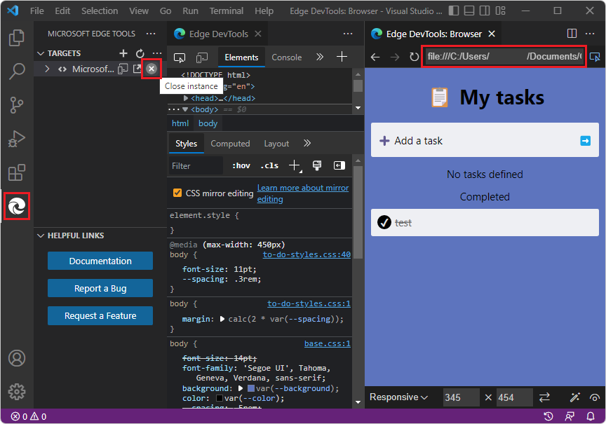


   **Close DevTools:**

1. Click **Close** (**x**) in the **Edge DevTools** tab and in the **Edge DevTools: Browser** tab, if these tabs are open.

*  Select Activity Bar > **Microsoft Edge Tools**.  If the **Targets** section lists any targets, hover on the right side of the target instance and then click **Close instance** (**x**).  The **Launch Instance** button appears, indicating that all DevTools instances are closed.

1. Close `index.html` without saving changes.

1. Select **File** > **Close Folder**.


<!-- ====================================================================== -->
## Step 4: Start DevTools by right-clicking an HTML file

<!-- the equivalent section in Opening is more general than this section, which uses Demos repo -->

Right-clicking an `.html` file in Visual Studio Code's **Explorer** is the main way to open DevTools when your webpage doesn't require running on a web server.

*  Unlike the **Launch Instance** button, this approach opens DevTools in Debug mode.

*  Unlike the **Launch Project** button that we'll use later, this approach doesn't require you to generate a `launch.json` file.


We'll demonstrate by opening the **demo-to-do** web app:

1. In Visual Studio Code, select **File** > **Open Folder**.

1. Go to the directory where you cloned the Demos repo, open the specific directory for the **demo-to-do** app, such as `C:\Users\myusername\Documents\GitHub\Demos\demo-to-do\`, and then click the **Select Folder** button:

   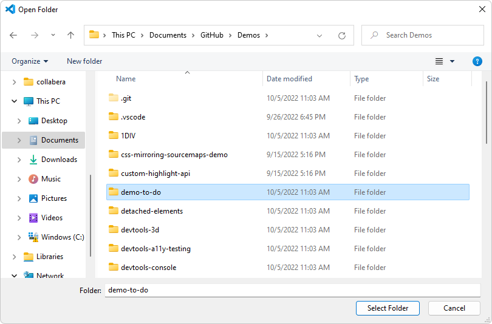

1. Select **Activity Bar** > **Explorer** () > right-click `index.html` and then select **Open with Edge** > **Open Browser with DevTools**:

   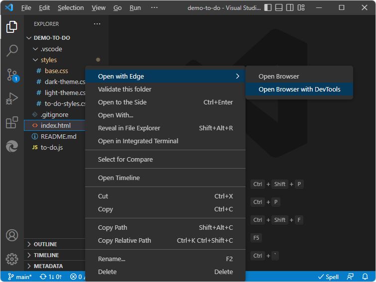

   *  The **Edge DevTools** tab opens.

   *  The **Edge DevTools: Browser** tab opens, displaying the webpage you right-clicked.

   *  The Debug toolbar of Visual Studio Code opens, the **Debug Console** opens at the bottom, and the **Run** pane opens.  These features indicate that Visual Studio Code is in Debug mode:

   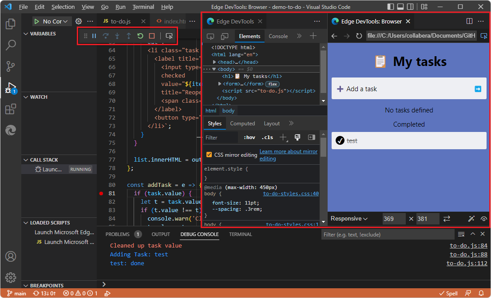

   **Layout of the DevTools tabs:**

1. Toward the upper left corner of the **Edge DevTools** tab, click the **Toggle screencast** button a couple times:

   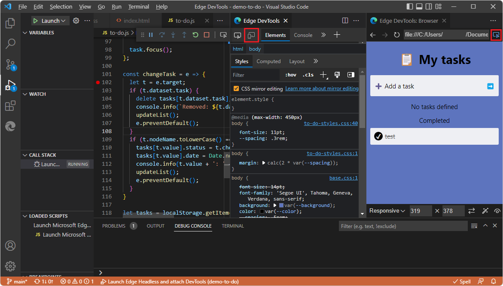

1. In the top right of the **Edge DevTools: Browser** tab, click the **Close DevTools** or **Open DevTools** button a couple times.  The two DevTools tabs are automatically positioned as you open and close them from each other.


<!-- ====================================================================== -->
## Step 5: Edit CSS in DevTools, updating the .css file automatically

In the **Edge DevTools** tab, in the **Elements** tool > **Styles** tab, you can edit CSS selectors, rules, and values.  The **CSS mirror editing** checkbox is selected by default, so the `.css` file is automatically edited, but the edits are not saved, so that you can decide whether to save the changes.

1. In the **Elements** tool, in the **Styles** tab, click a CSS value, such as the body font size.

1. Change the CSS value, such as using mouse wheel or pressing `Up Arrow` and `Down Arrow`.  The associated `.css` file opens, such as `to-do-styles.css` and scrolls to the line that defines the CSS value, and automatically edits the `.css` file but doesn't save changes:

   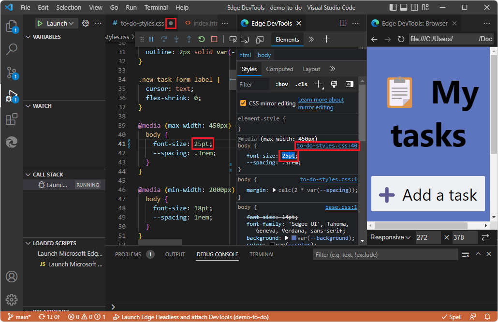

1. Close the `.css` file.  Visual Studio Code prompts you whether to save changes.

1. Click the **Don't Save** button.


<!-- ====================================================================== -->
## Step 6: Step through JavaScript code in the Debugger

1. Select Activity Bar > Explorer ().

1. In the **demo-to-do** directory, click **to-do.js** to open it.  Scroll down to the `changeTask` function and then click to the left of a line number to set a breakpoint:

   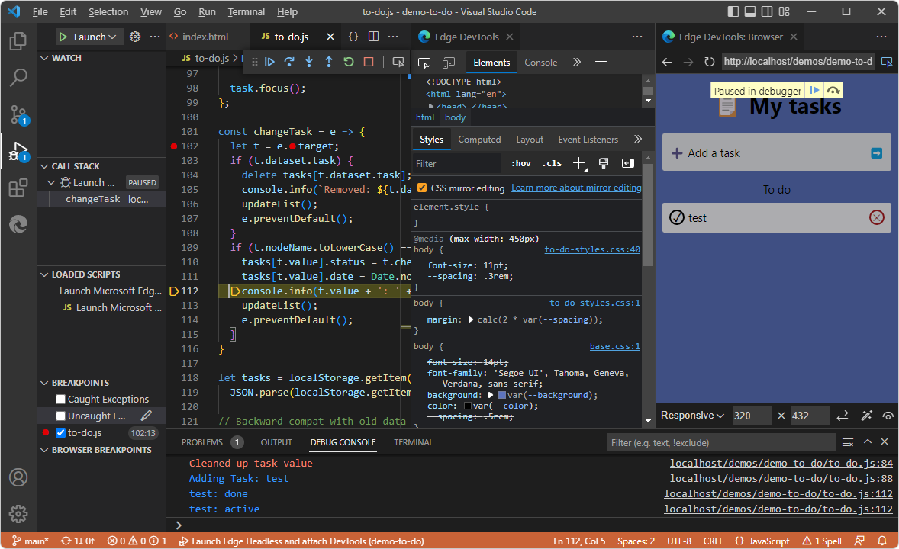

1. If the **Run and Debug** Side Bar isn't displayed, select **View** > **Run**.  The **Run and Debug** Side Bar includes the **Watch** pane and other debugger panes.

1. In the demo app rendered in the **Edge DevTools: Browser** tab, enter a task, such as **test**.  The debugger of Visual Studio Code pauses at the breakpoint in the `to-do.js` file:

   

1. In the Debug toolbar, or using the **Run** menu or by pressing keys, step through a couple lines of code in `to-do.js`.

1. In the demo app rendered in the **Edge DevTools: Browser** tab, click the "done" circle next to the test task.  The debugger of Visual Studio Code pauses at the breakpoint in the `to-do.js` file.

1. Next, to end debugging, in the Debug toolbar, click the **Stop** (`Shift`+`F5`) button.  Or, on the **Run** menu, select **Stop Debugging**:

   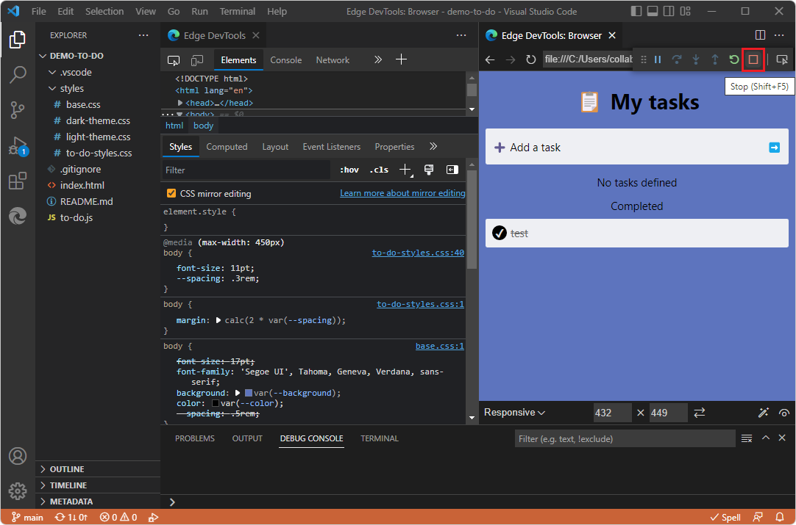

   The **Edge DevTools** tab closes, and the **Edge DevTools: Browser** tab closes.

Continue the tutorial steps below.


<!-- ====================================================================== -->
## Step 7: Start DevTools by clicking the Launch Project button

Next, we'll use the **demo-to-do** app to demonstrate the **Launch Project** button after pointing that button to a localhost URL such as [http://localhost:8080/](http://localhost:8080/) or [http://localhost/demos/demo-to-do/](http://localhost/demos/demo-to-do/).  As before, this starts DevTools in debug mode.  This is the main way to open DevTools when your webpage requires running on a web server.  As a preliminary step, we'll creating a `launch.json` file and edit the URL in it to point to localhost serving out the **demo-to-do** example app.

You might not need to use this approach, because in many cases, right-clicking an HTML file works.  However, many webpages use APIs which require the webpage to be running on a web server, so here are specific steps you can follow.


<!-- ====================================================================== -->
## Step 8: Start the web server

This section is in support of clicking the **Launch Project** button.

1. Set up and start a web server, serving out the **demo-to-do** app from the Demos repo.  To do this, see [Step 6: Set up a localhost server](./install.md#step-6-set-up-a-localhost-server) in _Installing the DevTools extension for Visual Studio Code_.

1. In Visual Studio Code, select **View** > **Terminal**.

1. `cd` into the the specific folder you want to serve via http, `Demos\demo-to-do\`:

   For example, on Windows:

   ```
   cd C:\Users\myusername\Documents\GitHub\Demos\demo-to-do\
   ```

1. Enter the command `npx http-server`.  A local webserver starts on port 8080.

   ```
   npx http-server
   ```
   
   Information about the server and localhost URL is displayed, such as:

   ```
   Starting up http-server, serving ./
   
   Available on:
   http://10.0.1.8:8080
   http://127.0.0.1:8080
   Hit CTRL-C to stop the server
   ```

   The displayed URLs are equivalent to `http://localhost` or `http://localhost:8080`
   <!-- http://localhost/demos/demo-to-do/ -->


<!-- ====================================================================== -->
## Step 9: Set up launch.json

This section is in support of clicking the **Launch Project** button.

   1. In Visual Studio, select **File** > **Open Folder**.  Select your project directory that contains `index.html` for the cloned **demo-to-do** sample in the Demos repo, such as `C:\Users\myusername\Documents\GitHub\Demos\demo-to-do\`.
   
   1. In the Activity Bar, click **Microsoft Edge Tools** ().  The **Microsoft Edge Tools** pane opens.

   1. Click the **Generate launch.json** button:

   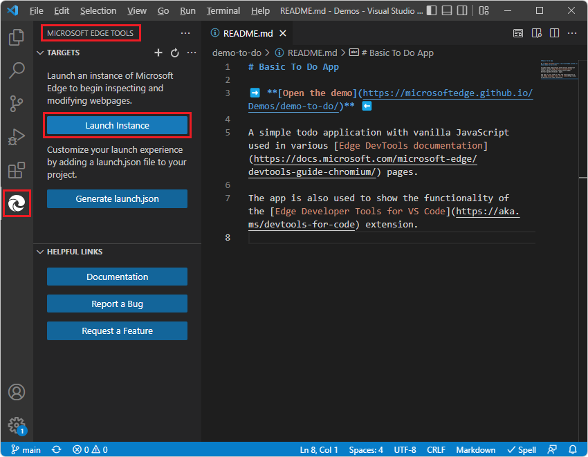

   The new `launch.json` file opens.

1. In several places in the `launch.json` file, on each of the `"url"` lines, scroll to the right , and note the comment, "Provide your project's url":

   ```js
   "url": "c:\\Users\\username\\.vscode\\extensions\\ms-edgedevtools.vscode-edge-devtools-2.1.1\\out\\startpage\\index.html", 
   // Provide your project's url to finish configuring
   ```

1. In a web browser, go to the `http://localhost/` URL where the **demo-to-do** `.html` file is on the server, such as [http://localhost/demos/demo-to-do/](http://localhost/demos/demo-to-do/).

1. Copy the URL from the address bar.

1. In `launch.json`, in each URL string, paste the URL for your cloned copy of the **demo-to-do** app, such as: `http://localhost/demos/demo-to-do/`

1. Paste the path inside the quoted path string in one of the `"url"` strings.  For example:

   ```js
   "url": "http://localhost/demo-to-do/", // Provide your project's url to finish configuring
   ```

1. Copy and paste the modified URL line to the other places in the `launch.json` file.  To modify all instances at the same time, you can copy an updated URL string, then select an instance of the initial URL string, press `Ctrl`+`Shift`+`L` to select all instances, and then paste the updated string.

1. Save the `launch.json` file.


<!-- ====================================================================== -->
## Step 10: Click the Launch Project button

1. In Visual Studio Code, in the Activity Bar, click the **Microsoft Edge Tools** () button.  The **Microsoft Edge Tools** pane opens, now containing a **Launch Project** button but not a **Generate launch.json file** button:

   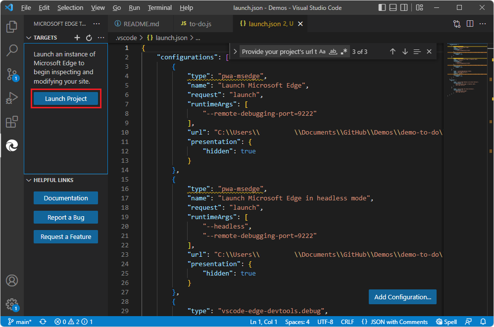

1. Click the **Launch Project** button.

   The **Edge DevTools** tab and the **Edge DevTools: Browser** tab open in separate panes, showing the **demo-to-do** web app:

   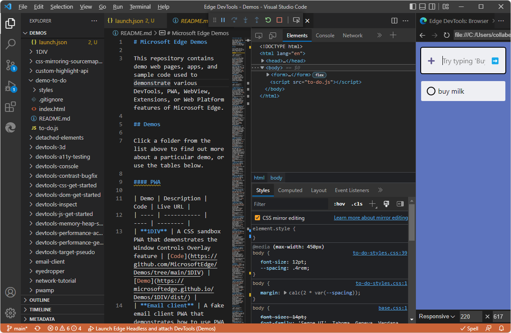

At this point, you could work with CSS edits or step through code in the debugger, as described above for the section [Step 4: Start DevTools by right-clicking an HTML file](#step-4-start-devtools-by-right-clicking-an-html-file).


<!-- ====================================================================== -->
## Step 11: Close DevTools

1. Next, to end debugging, in the Debug toolbar, click the **Stop** (`Shift`+`F5`) button:

   

   Or, on the **Run** menu, select **Stop Debugging**.  Or, close the two DevTools tabs.  The Debug toolbar closes.


<!-- ====================================================================== -->
## See also

* [Opening DevTools and the DevTools browser](./open-devtools-and-embedded-browser.md)
* [Microsoft Edge DevTools extension for Visual Studio Code](../microsoft-edge-devtools-extension.md)

**GitHub:**

* [demo-to-do](https://microsoftedge.github.io/Demos/demo-to-do/) - the demo web app running on the `github.io` server.
* [Source code for demo-to-do](https://github.com/MicrosoftEdge/Demos/tree/main/demo-to-do)
* [MicrosoftEdge/Demos repo](https://github.com/MicrosoftEdge/Demos)

<!--
**Often-needed strings:**

C:\Users\myusername\Documents\GitHub\Demos\demo-to-do\index.html
git bash: cd C:/Users/myusername/Documents/GitHub/Demos/demo-to-do/
npx http-server
C:/Users/myusername/Documents/GitHub/Demos/demo-to-do/index.html
http://localhost:8080/
https://microsoftedge.github.io/Demos/demo-to-do/
-->
