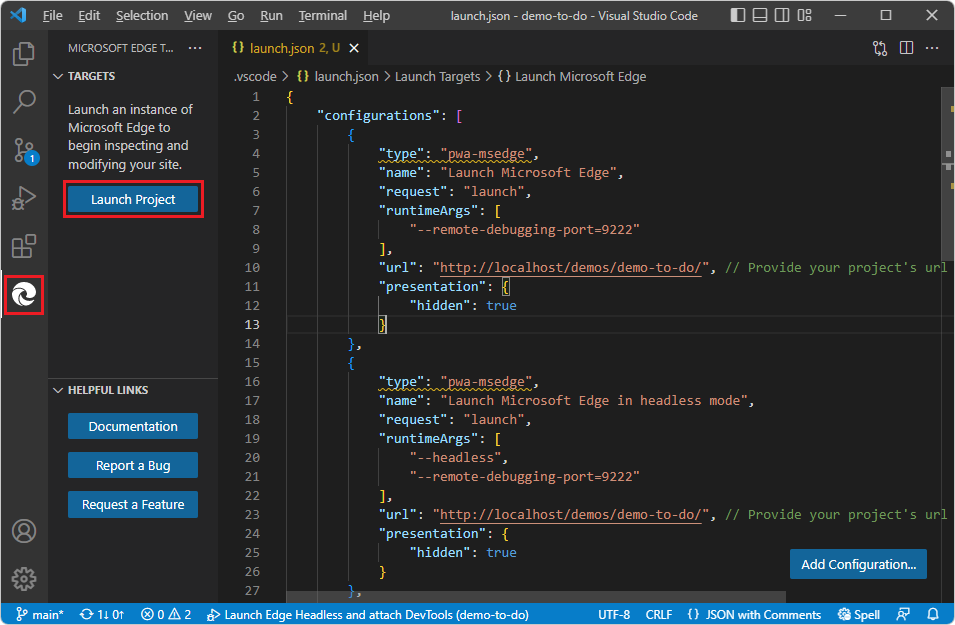

# Get started with the DevTools extension for Visual Studio Code

This article helps you:
* a
* b
* c

Why use this extension vs **Sources** tool in browser DevTools

Background general info about the extension (condensed)


Get started with the Microsoft Edge Developer Tools extension for Visual Studio Code.

This article walks you through initial setup and using the extension by cloning, loading, and modifying the **Demo To Do** sample web app from the **MicrosoftEdge/Demos** GitHub repo.


<!-- ====================================================================== -->
## Step 1: Install Visual Studio Code

1. If not done already, in a separate window or tab, go to [Download Visual Studio Code](https://code.visualstudio.com/Download) and download and install Visual Studio Code.

1. Open Visual Studio Code.


<!-- ====================================================================== -->
## Step 2: Install the Microsoft Edge DevTools extension

Install the Microsoft Edge DevTools extension for Visual Studio Code, as follows:

1. In Visual Studio Code, in the Activity Bar on the left, click the **Extensions** button.  Or, press `Ctrl`+`Shift`+`X` on Windows/Linux or `Command`+`Shift`+`X` on macOS.  The Marketplace appears.

1. In the **Search Extensions in Marketplace** text box, enter **Microsoft Edge Tools for VS Code**.

1. Select the **Microsoft Edge Tools for VS Code**, and then click the **Install** button:

   

   Or, you can use the browser to download the Microsoft Edge DevTools extension from the Visual Studio Marketplace website.  Go to [Microsoft Edge Developer Tools for Visual Studio Code](https://marketplace.visualstudio.com/items?itemName=ms-edgedevtools.vscode-edge-devtools).


<!-- ====================================================================== -->
## Step 3: Clone the Microsoft Edge Demos repo

1. Go to [MicrosoftEdge/Demos repo](https://github.com/MicrosoftEdge/Demos/).

1. If the green **Code** button isn't shown, click **Demos** in the path **Microsoft Edge** / **Demos** in the upper left to go to the main page of the repo.

1. Click the green **Code** button, and then select the **Copy** button.  This article assumes you're using the **Source Control** features within Visual Studio Code.  Or, you can use one of the other methods that are provided, if you know that you want to use that approach instead:
   *  **Open with GitHub Desktop**
   *  **Open with Visual Studio**
   *  **Download ZIP**

   

1. In Visual Studio Code, in the Activity Bar, click the **Source Control** () button, and then click the **Clone Repository** button.

1. In the **Provide repository URL** text box, paste the copied URL: **https://github.com/MicrosoftEdge/Demos.git** and then press `Enter`.  A folder selection dialog opens.

   

1. Navigate to your desired path, such as `C:\Users\myusername\Documents\GitHub` or `Users/myusername/GitHub`, and then click the **Select Repository Location** button.

1. The message **Cloning git repository** appears, then you're prompted to open the cloned repository.  Click the **Open** button:

   

1. If prompted **Do you trust...**, click the **Yes** button.  Or, click the **No** button and continue with most parts of this walkthrough.

   The **Explorer** tree lists many demos, including **demo-to-do**.


<!-- ====================================================================== -->
## Step 4: Optional: Compare and contrast DevTools in the browser vs. in the extension

To get some context, before using the Edge DevTools extension in Visual Studio Code, explore the Demo To Do web app and in-browser DevTools debugger, as follows:

1. In Visual Studio Code, in the **Explorer** tree, expand the **demo-to-do** directory, and then click the `README.md` file:

   

1. `Ctrl+click` the **Open the demo** link (`https://microsoftedge.github.io/Demos/demo-to-do/`), and then press Alt+Tab or Cmd+tab to switch to browser running the Demo To Do app.  This running demo is served out from the github.io server.

1. Click in the **Add a task** field and then enter a couple tasks, such as **Buy milk** and **Create web app**, then press `Enter` or click the entry button in the webpage:

1. Click the **Delete task** button to remove a task, such as **Buy milk**.

1. Right-click the webpage and then select **Inspect**.  DevTools opens in the browser, not yet in Visual Studio Code.  Click the **Sources** tab (or the **More tabs** button and then **Sources**).   In the **Page** tab, click `to-do.js` and then click a line of code .  This **Sources** tool is in DevTools in the browser, for comparison.

1. Scroll down to the `addTask` function and then click to the left of a line number to set a breakpoint:

1. In the webpage, enter a task, such as **Buy milk**, and then press `Enter`.  The in-browser DevTools debugger pauses on the breakpoint:

   

1. Refresh the page to reset the debugger.

Next, to get additional debugging functionality,<!-- todo: eg, list --> and to use the rich environment of Visual Studio Code, we'll open the DevTools **Sources**<!--no, fix--> tool in Visual Studio Code, using the Microsoft Edge DevTools extension for Visual Studio Code.


<!-- ====================================================================== -->
## Step 5: View the Success page and the tools

1. In Visual Studio Code, in the Activity Bar, click the **Microsoft Edge Tools** () button.  The **Microsoft Edge Tools** pane opens.

   

1. Click the **Launch Instance** button.  The **Edge DevTools** tab and the **Edge DevTools: Browser** tab open in separate panes, showing the **Success** webpage (not the Demo To Do web app yet):

   

1. In the **Edge DevTools** tab in the middle, to the right of the **Elements** tab, click the **More tabs** (**>>**) button to see which other tool tabs are already opened, such as **Console**, **Network**, and **Application**.

1. To the right of the **More tabs** (**>>**) button, click the **More Tools** (**+**) button, to see what additional tools are available, such as **Issues**, **Network conditions**, and **Network request blocking**.

1. To the left of the **More tabs** (**>>**) button, click the **Inspect** button, and then hover over parts of the rendered webpage on the right, to see layout information.  Click the rendered webpage, to go to the selected element in the **Elements** tool.

1. In the the **Edge DevTools: Browser** tab, at the bottom, click the **Emulate devices** dropdown list, and then select a couple different devices.  Then select **Responsive**, at the top of the list, to restore the original view.


<!-- ====================================================================== -->
## Step 6: Close Microsoft Edge Tools and the running browser instance

1. In the **Microsoft Edge Tools** pane on the left, in the **Targets** section, hover on the right side of the listed Target (`index.html`) and then click **Close instance** (**x**).  The Microsoft Edge DevTools panes close.


<!-- ====================================================================== -->
## Step 7: Run the demo app

1. In Visual Studio Code, in the Activity Bar, click the **Microsoft Edge Tools** () button.  The **Microsoft Edge Tools** pane opens.

   

1. Click the **Generate launch.json** button.  The new `launch.json` file opens.

1. On each of the `"url"` lines, scroll to the right , and note the comment, "Provide your project's url":

   ```js
   "url": "c:\\Users\\username\\.vscode\\extensions\\ms-edgedevtools.vscode-edge-devtools-2.1.1\\out\\startpage\\index.html", 
   // Provide your project's url to finish configuring
   ```

   You don't need to run port 8080.  You can run the app from your local drive as-is.

1. In Visual Studio Code, in the **Explorer**, right-click the file `Demos\demo-to-do\index.html` and then select **Copy path**.

1. In the **Explorer**, click the **launch.json** file.

1. Paste the path inside the quoted path string in one of the `"url"` strings, and change to use double-quotes.  For example:

   ```js
   "url": "C:\\Users\\myusername\\Documents\\GitHub\\Demos\\demo-to-do\\index.html", 
   // Provide your project's url to finish configuring
   ```

1. Copy and paste the modified URL line to the other places in the `launch.json` file.  Ctrl+Shift+L to 

1. Save the `launch.json` file.

1. In Visual Studio Code, in the Activity Bar, click the **Microsoft Edge Tools** () button.  The **Microsoft Edge Tools** pane opens, now containing a **Launch Project** button but not a **Generate launch.json file** button:

   

1. Click the **Launch Project** button.

   If you get a dialog **Could not attach to main target** and **Error while fetching list of available targets No available targets to attach**:

   

   Try again.  Make sure your `launch.json` file is saved.  Examine all instances of your revised string.


   The **Edge DevTools** tab and the **Edge DevTools: Browser** tab open in separate panes, showing the Demo To Do web app:

   

1. In the Activity Bar, click the **Explorer** button.  The Explorer tree opens.  In the **demo-to-do** directory, click **to-do.js** to open it.  Scroll down to the `add task` function and then click to the left of a line number to set a breakpoint.


<!-- ====================================================================== -->
## See also

* [Demo To Do](https://microsoftedge.github.io/Demos/demo-to-do/) - the demo web app running on the `github.io` server.
* [Source code for Demo To Do](https://github.com/MicrosoftEdge/Demos/tree/main/demo-to-do) - the **MicrosoftEdge/Demos** GitHub repo, containing `demo-to-do` and other demos.
* [Microsoft Edge DevTools extension for Visual Studio Code](../microsoft-edge-devtools-extension.md)
