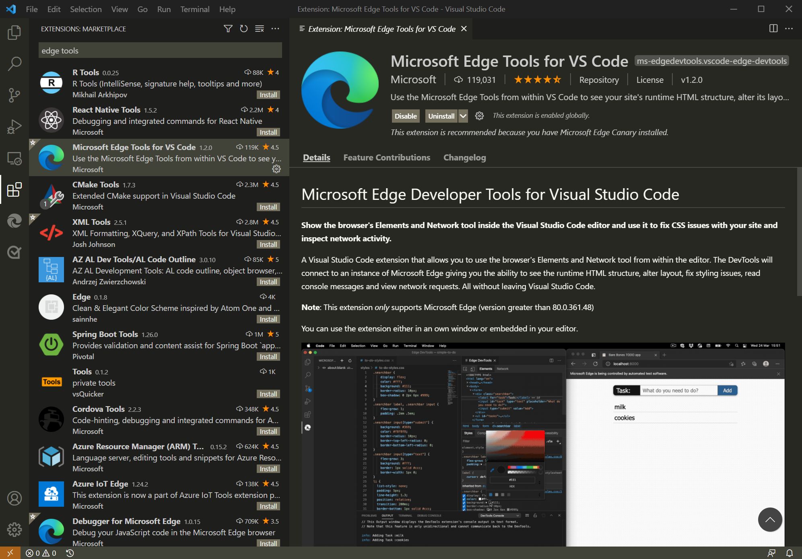

# Get started with the DevTools extension for Visual Studio Code

Get started with the Microsoft Edge Developer Tools extension for Visual Studio Code.

This article walks you through initial setup and using the extension by loading and modifying the [Demo To Do](https://microsoftedge.github.io/Demos/demo-to-do/) sample web app.

[Source for Demo To Do](https://github.com/MicrosoftEdge/Demos/tree/main/demo-to-do)

<!-- ====================================================================== -->
## Step 1: Install Visual Studio Code

1. In a separate window or tab, go to [Download Visual Studio Code](https://code.visualstudio.com/Download) and download and install Visual Studio Code.

1. Open Visual Studio Code.

<!-- ====================================================================== -->
## Step 2: Install the Microsoft Edge DevTools extension

Install the Microsoft Edge DevTools extension for Visual Studio Code, as follows:

1. In Visual Studio Code, in the Activity Bar on the left, click the **Extensions** button.  Or, press `Ctrl`+`Shift`+`X` on Windows/Linux or `Command`+`Shift`+`X` on macOS.  The Marketplace appears.

1. In the **Search Extensions in Marketplace** text box, enter **Microsoft Edge Tools for VS Code**.

1. Select the **Microsoft Edge Tools for VS Code**, and then click the **Install** button:

   

   Or, you can use the browser to download the Microsoft Edge DevTools extension from the Visual Studio Marketplace website.  Go to [Microsoft Edge Developer Tools for Visual Studio Code](https://marketplace.visualstudio.com/items?itemName=ms-edgedevtools.vscode-edge-devtools).

<!-- ====================================================================== -->
## Step 3: Clone the Microsoft Edge Demos repo

1. Go to [MicrosoftEdge/Demos repo](https://github.com/MicrosoftEdge/Demos/).

1. Click the green **Code** button, and then select the **Copy** button.  Or, use one of the other methods that are provided:
   *  **Open with GitHub Desktop**
   *  **Open with Visual Studio**
   *  **Download ZIP**

   For this article, we'll use the **Source Control** features within Visual Studio Code.  So, click the **Copy** button.

1. In Visual Studio Code, in the Activity Bar, click the **Source Control** button.  

1. tbd

<!-- ====================================================================== -->
## Step 4: View the source code

tbd

<!-- ====================================================================== -->
## Step 5: Debug the demo app

tbd

<!-- ====================================================================== -->
## See also

* [Microsoft Edge DevTools extension for Visual Studio Code](./microsoft-edge-devtools-extension.md)
* [Source for Demo To Do](https://github.com/MicrosoftEdge/Demos/tree/main/demo-to-do), a basic To Do app.
