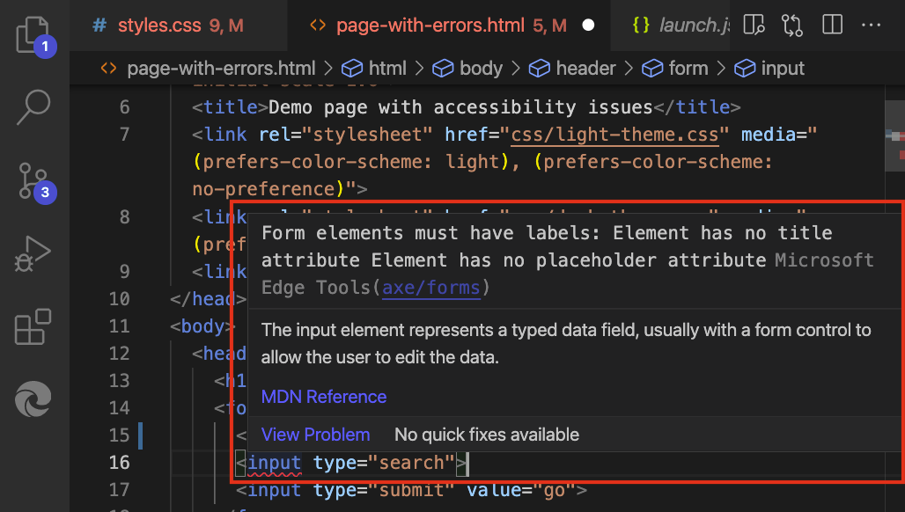
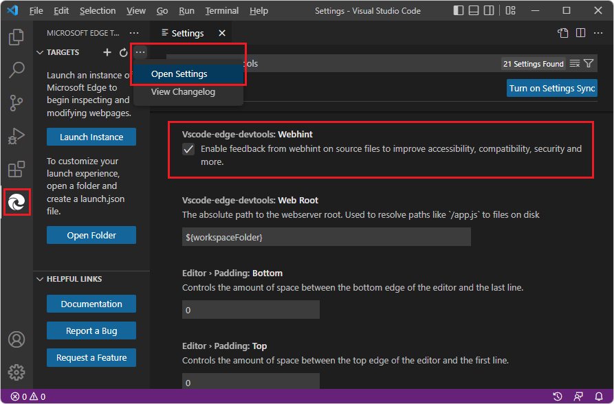
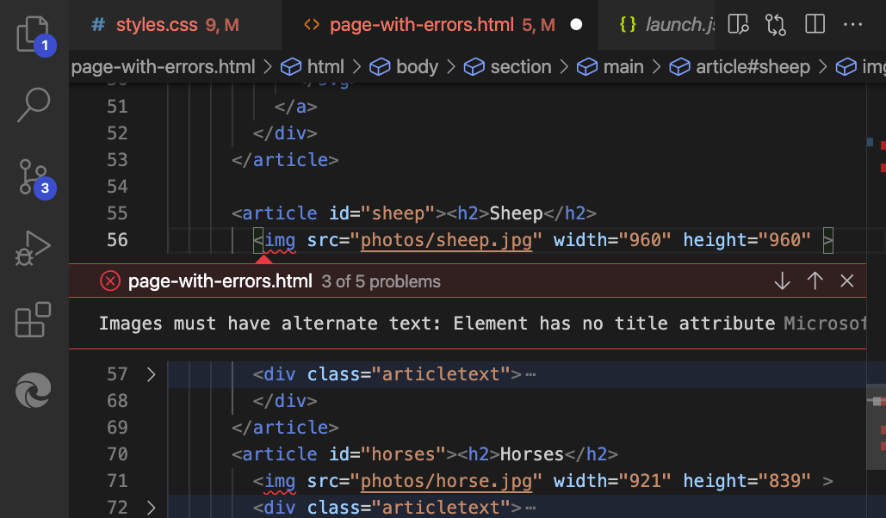
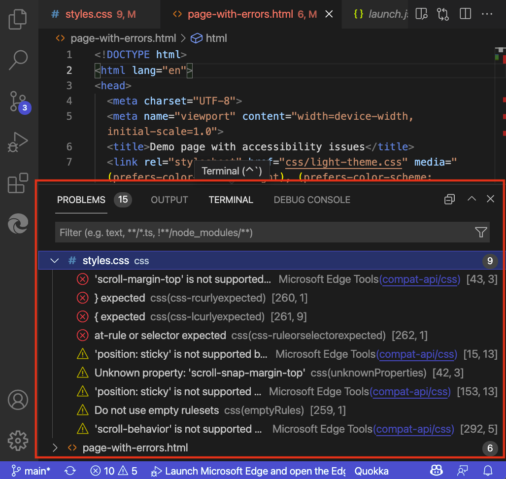
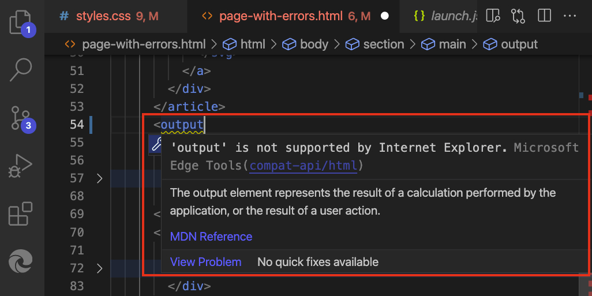
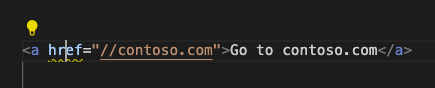
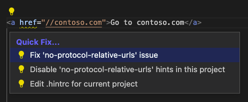

# Inline and live issue analysis

Issues in your source code (`.html`, `.css`, or `.js` files) are highlighted with wavy underlines.  You can inspect the issue and get detailed information about what the problem is, how to fix it, and where to find more information.  To inspect the issue, click the code that has the wavy underline:

This feature requires Node.js and npm (Node Package Manager).  See [Step 4: Install Node.js and Node Package Manager (npm)](./install.md#step-4-install-nodejs-and-node-package-manager-npm) in _Installing the DevTools extension for Visual Studio Code_.

This feature is on by default; the **Webhint** checkbox is selected in **Settings**.  To turn this feature on or off, select **Activity Bar** > **Microsoft Edge Tools** > hover to the right of **Targets** > **More Actions** (**...**) > **Open Settings** > select or clear the **Webhint** checkbox:

To see all the issues in the file, click **View Problem**:

The **Problems** tab in the lower panel lists all the issues that DevTools found in the currently open files:

<!-- ====================================================================== -->
## Live updating of issues reporting

Issues are evaluated live while you edit your code.  As you type, you get feedback about any issues that are found, and how to fix them:

<!-- ====================================================================== -->
## Automated Quick Fixes and issue filtering

<!--
bold "Quick Fix" when focusing on the UI
the UI label string is "Quick Fix", not "Quick Fixes"
-->

The Microsoft Edge DevTools extension for Visual Studio Code includes a **Quick Fix** feature.  By using Quick Fixes, you can customize the error reporting of the extension to meet the needs of the current project.

When you hover over an element that has an issue, you get a light bulb () icon indicating that there are Quick Fixes available:

Clicking the light bulb icon shows a list of options. For example, if you added a link that has a protocol-relative URL, you get the following **Quick Fix** list to choose from:

You can select whichever **Quick Fix** you want to use to resolve the issue or to stop reporting it as an issue:

* **Fix "no-protocol-relative-urls" issue** - Adds the missing URL prefix `https://` to the link.

* **Disable "no-protocol-relative-urls" hints in this project** - Creates a `.hintrc` configuration file in the project folder (if one doesn't exist already), and tells the extension to not report this issue for this project.

* **Edit .hintrc for this project** - Opens the `.hintrc` configuration file so you can edit it to customize the extension's error reporting.

<!-- ====================================================================== -->
## See also

* [Find and fix problems using the Issues tool](../../devtools-guide-chromium/issues/index.md)
* [Get started using the DevTools extension for Visual Studio Code](./get-started.md)
* [Microsoft Edge DevTools extension for Visual Studio Code](../microsoft-edge-devtools-extension.md)
