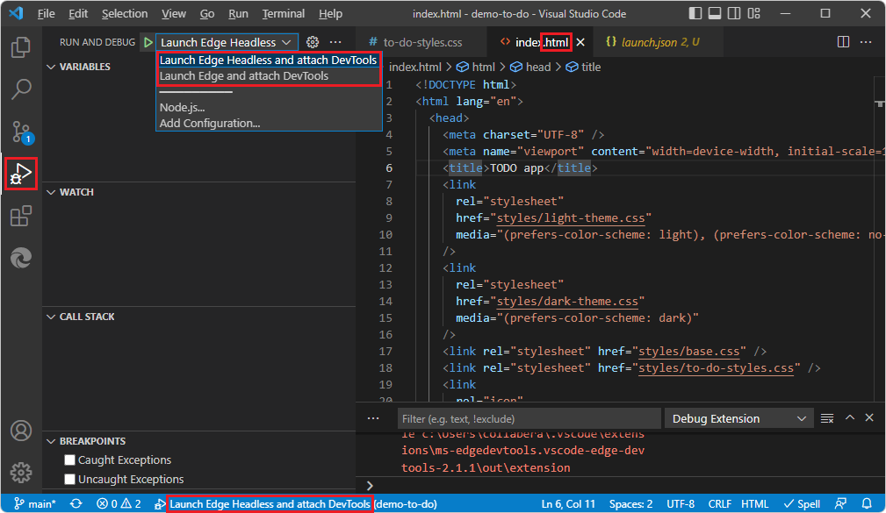
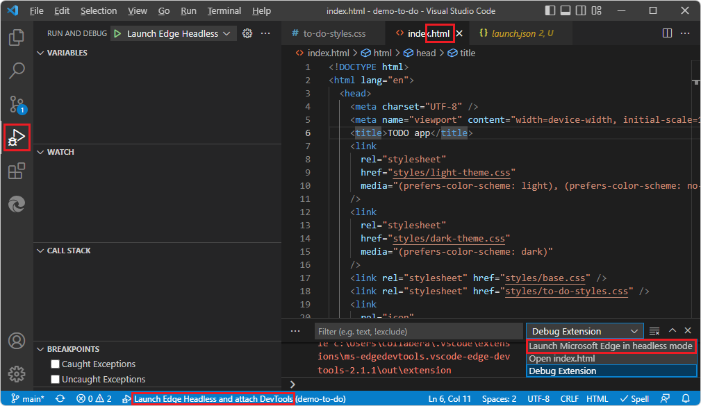
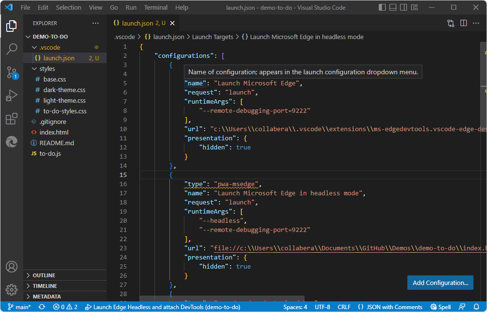
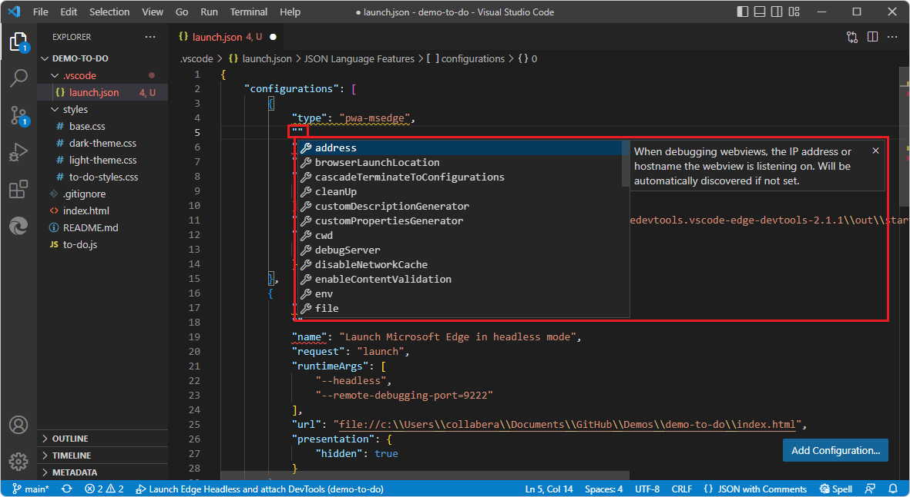

# The launch.json file for the DevTools extension

Visual Studio Code uses a `launch.json` file to define debug configurations.  To use the DevTools extension, a `launch.json` file is only needed if you want to use the debugger and your webpage requires running on a web server, not just a local file system.  In most cases, the only thing you need to know about the content of the DevTools-generated `launch.json` file (if you choose to use it) is that you need to enter your desired URL in the `"url"` string in several places.  Read this article if you want to use custom, advanced debug configurations.

If you want to use Visual Studio Code's UI such as **F5** to start the **DevTools** tabs along with Debug mode, your opened folder (workspace) must contain a DevTools-generated (DevTools-compatible) `launch.json` file in the `.vscode` directory.

Details about the `launch.json` file format are below.  You normally don't need to change anything in the file except to replace several instances of the URL string, as explained in [Opening DevTools by clicking the Launch Project button](./open-devtools-and-embedded-browser.md#opening-devtools-by-clicking-the-launch-project-button) in _Opening DevTools and the DevTools browser_.


<!-- ====================================================================== -->
## Where the name strings appear in the UI

The `"name"` string of each debug configuration populates dropdown lists in several places.

1. Select **File** > **Close Folder**.

1. Select **File** > **Open Recent** > `C:\Users\username\Documents\GitHub\Demos\demo-to-do\index.html`, cloned per [Step 5: Clone the Demos repo](./install.md#step-5-clone-the-demos-repo) in _Installing the DevTools extension for Visual Studio Code_.

   Suppose no `launch.json` file exists in the `.vscode` directory.

1. Select **Activity Bar** > **Microsoft Edge Tools** > click the **Generate launch.json** button.

1. In **Activity Bar** > **Explorer**, double-click `index.html` to open it.

1. Select **Activity Bar** > **Run and Debug** > click the **Run and Debug** button.

   In the **Run and Debug** Side Bar in the upper left, the strings are **Launch Edge Headless and attach DevTools** and **Launch Edge and attach DevTools**.  In the bottom of the Visual Studio Code window, the string is **Launch Edge Headless and attach DevTools**.  These are names of compound configurations in the `.json` file, telling the Visual Studio Code debugger to open the two **DevTools** tabs, or else the **DevTools** tab and an external browser:

   ```json
    "compounds": [
        {
            "name": "Launch Edge Headless and attach DevTools",
            "configurations": [
                "Launch Microsoft Edge in headless mode",
                "Open Edge DevTools"
            ]
        },
        {
            "name": "Launch Edge and attach DevTools",
            "configurations": [
                "Launch Microsoft Edge",
                "Open Edge DevTools"
            ]
        }
    ]
   ```

   

   In the **Debug Console** in the lower right, the string is **Launch Microsoft Edge in headless mode**.  This is a string not about the **Edge DevTools** tab, but about the **Edge DevTools: Browser** tab.  It's the name of an individual configuration, not of a compound configuration:

   ```json
       "configurations": [
        ...
        {
            "type": "pwa-msedge",
            "name": "Launch Microsoft Edge in headless mode",
            "request": "launch",
            "runtimeArgs": [
                "--headless",
                "--remote-debugging-port=9222"
            ],
            "url": "file://c:\\Users\\collabera\\Documents\\GitHub\\Demos\\demo-to-do\\index.html",
            "presentation": {
                "hidden": true
            }
        },
   ```

   

1. In the **Run and Debug** Side Bar, click **Start Debugging**.  The two **DevTools** tabs open, and Visual Studio Code enters Debug mode.  This approach is the built-in Visual Studio Code UI for starting the debugger, rather than the DevTools UI that's described in [Opening DevTools and the DevTools browser](./open-devtools-and-embedded-browser.md).
<!-- todo: copy the above steps to F5 area of Debugging article - temp linked from there to here -->


<!-- ====================================================================== -->
## Where the launch.json file is placed

1. In Visual Studio Code's **Explorer** pane, the `launch.json` file is placed in a `.vscode` folder at the root of the folder that you opened.

   *  For a repo, such as the Demos repo, if you open the entire repo folder, the **Generate launch.json** button creates a `\.vscode\launch.json` file near the root, for the entire repo directory.

   *  If you open a particular, smaller folder, such as `\Demos\demo-to-do\`, the **Generate launch.json** button puts a `launch.json` file in that folder only.

Visual Studio Code uses a `launch.json` file to configure and customize the debugger.  `launch.json` is a debugger configuration file.  This file also controls which web browser to use in conjunction with the debugger.  For example, when you test your webpage by clicking a button in the webpage to cause your JavaScript code to run, the Visual Studio Code debugger listens to the browser and steps through the JavaScript code of the webpage.

The following is a copy of the `launch.json` after clicking the **Create launch.json** button in the extension.

There are three _configurations_ and two _compounds_ initially defined by default:

*  `configurations` - in the Visual Studio Code UI, these configuration names appear in Debugger UI:

   * **Launch Microsoft Edge** - this is a "launch"-type configuration.

   * **Launch Microsoft Edge in headless mode** - this is a "launch"-type configuration.

   * **Open Edge DevTools** - this is a "debug"-type (or "attach"-type) configuration.

*  `compounds` - in the Visual Studio Code UI, these appear in the Debug toolbar:

   * **Launch Edge Headless and attach DevTools**

   * **Launch Edge and attach DevTools**


<!-- ====================================================================== -->
## Intellisense and autocomplete

Hover over a JSON name or value to show a tooltip:



Start typing double-quotes, to see the autocompletion list of available JSON properties and descriptions:

<!--no comma yet-->

When saving the file, be sure to provide well-formed JSON, including commas.


<!-- ====================================================================== -->
## Configuration types: launch vs. debug

These two distinct types of configurations are both defined in this `.json` file for the Visual Studio Code debugger.


<!-- ====================================================================== -->
## Configurations

The following sections of `launch.json` file are from v2.1.1 of the extension, in a default installation location for Visual Studio Code on Windows.


#### Configuration 1: Launch Microsoft Edge

This is a "launch browser"-type configuration.  This configuration controls the browser component, such as which `.html` file to display, when **headless** is not selected in the UI.

This configuration name doesn't appear directly in the UI.  This configuration is used by a compound configuration, below.

```json
        {
            "type": "pwa-msedge",
            "name": "Launch Microsoft Edge",
            "request": "launch",
            "runtimeArgs": [
                "--remote-debugging-port=9222"
            ],
            "url": "c:\\Users\\username\\.vscode\\extensions\\ms-edgedevtools.vscode-edge-devtools-2.1.1\\out\\startpage\\index.html", // Provide your project's url to finish configuring
            "presentation": {
                "hidden": true
            }
        },
```


#### Configuration 2: Launch Microsoft Edge in headless mode

This is a "launch browser"-type configuration.  This configuration controls the browser component, such as which `.html` file to display, when **Headless** is selected in the the Edge DevTools > **Settings** page, as it is by default.

This configuration name **Launch Microsoft Edge in headless mode** appears in the UI, such as in the Debug toolbar and in the **Debug Console**.  If you launch multiple instances, a number is appended to the additional instances in the UI, such as **Launch Microsoft Edge in headless mode 2**.  This configuration is used by a compound configuration, below.

```json
        {
            "type": "pwa-msedge",
            "name": "Launch Microsoft Edge in headless mode",
            "request": "launch",
            "runtimeArgs": [
                "--headless",
                "--remote-debugging-port=9222"
            ],
            "url": "c:\\Users\\username\\.vscode\\extensions\\ms-edgedevtools.vscode-edge-devtools-2.1.1\\out\\startpage\\index.html", // Provide your project's url to finish configuring
            "presentation": {
                "hidden": true
            }
        },
```


#### Configuration 3: Open Edge DevTools

This is a "attach debugger"-type configuration.  This configuration controls the **Edge DevTools** tab (pane), such as which `.html` file populates the **Elements** tool.

This configuration name doesn't appear directly in the UI.  This configuration is used by a compound configuration, below.

```json
        {
            "type": "vscode-edge-devtools.debug",
            "name": "Open Edge DevTools",
            "request": "attach",
            "url": "c:\\Users\\username\\.vscode\\extensions\\ms-edgedevtools.vscode-edge-devtools-2.1.1\\out\\startpage\\index.html", // Provide your project's url to finish configuring
            "presentation": {
                "hidden": true
            }
        }
```


<!-- ====================================================================== -->
## Compound configurations

The `compounds` section of `launch.json` defines compound configurations.

Each compound configuration refers to two configurations: one configuration to open the **Edge DevTools** tab in Visual Studio Code, and the other configuration to open either the **Edge DevTools: Browser** tab (sometimes called the _screencast_ or _headless browser_), or both the **Edge DevTools: Browser** tab and the entire Microsoft Edge browser window.

In the **Microsoft Edge Tools** pane, in the **Targets** section, on the right side of a target, click the **Toggle screencast** button.  The headless embedded **Edge DevTools: Browser** tab (pane) closes or opens.

In the **Microsoft Edge Tools** pane, in the **Targets** section, on the right side of a target, click the **Attach and open Microsoft Edge Tools** button.


#### Compound configuration 1: Launch Edge Headless and attach DevTools

This compound configuration launches the following components:

*  The **Edge DevTools: Browser** tab (pane) in Visual Studio Code.  This is defined by the configuration that has the `name` "Launch Microsoft Edge in headless mode", above.

*  The **Edge DevTools** tab (pane) in Visual Studio Code.  This is defined by the configuration that has the `name` "Open Edge DevTools", above.


```json
        {
            "name": "Launch Edge Headless and attach DevTools",
            "configurations": [
                "Launch Microsoft Edge in headless mode",
                "Open Edge DevTools"
            ]
        },
```

The name of this compound configuration, **Launch Edge Headless and attach DevTools**, appears in the Debug toolbar of Visual Studio Code.


#### Compound configuration 2: Launch Edge and attach DevTools

This compound configuration launches the following components:

*  The **Edge DevTools: Browser** tab (pane) in Visual Studio Code.  This is defined by the configuration that has the `name` "Launch Microsoft Edge", above.

*  The Microsoft Edge browser window.  This is defined by the configuration that has the `name` "Launch Microsoft Edge", above.

*  The **Edge DevTools** tab (pane) in Visual Studio Code.  This is defined by the configuration that has the `name` "Open Edge DevTools", above.

```json
        {
            "name": "Launch Edge and attach DevTools",
            "configurations": [
                "Launch Microsoft Edge",
                "Open Edge DevTools"
            ]
        }
```

The name of this compound configuration, **Launch Edge and attach DevTools**, appears in the UI in the Debug toolbar of Visual Studio Code.


<!-- ====================================================================== -->
## Adding configurations

You can define your own, additional debugging configurations.  Click the **Add configuration** button.


<!-- ====================================================================== -->
## See also

* [Opening DevTools and the DevTools browser](./open-devtools-and-embedded-browser.md).
* [Get started using the DevTools extension for Visual Studio Code](./get-started.md)
* [Microsoft Edge DevTools extension for Visual Studio Code](../microsoft-edge-devtools-extension.md)

#### launch.json for other platforms

* [Configure C/C++ debugging](https://code.visualstudio.com/docs/cpp/launch-json-reference) in the Visual Studio Code docs.
* [Configure the debugger](https://code.visualstudio.com/docs/nodejs/reactjs-tutorial#_configure-the-debugger) in _Using React in Visual Studio Code_ in the Visual Studio Code docs.
