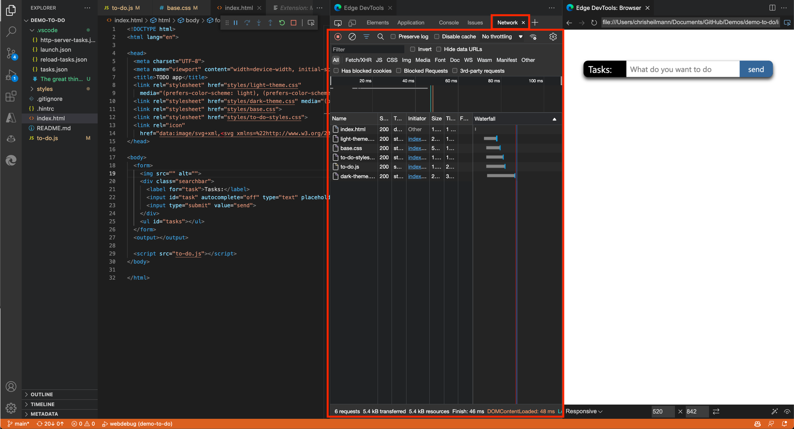

# Network tool integration

The DevTools **Network** tool allows you to monitor network traffic and change network conditions of your application, from within Visual Studio Code:

Use the **Network** tool to:

* Analyze the network traffic and find out why some resources aren't loaded.

* Simulate different network conditions, such as being offline or having a slow connection.

* Disable any caching that might make it hard to debug your application.

* Simulate different user agents to see how your product appears to a search engine bot or a browser that you can't test in.

For more information about the **Network** tool in DevTools, see [Inspect network activity](../../devtools-guide-chromium/network/index.md).

<!-- ====================================================================== -->
## See also

* [Get started using the DevTools extension for Visual Studio Code](./get-started.md)
* [Microsoft Edge DevTools extension for Visual Studio Code](../microsoft-edge-devtools-extension.md)
