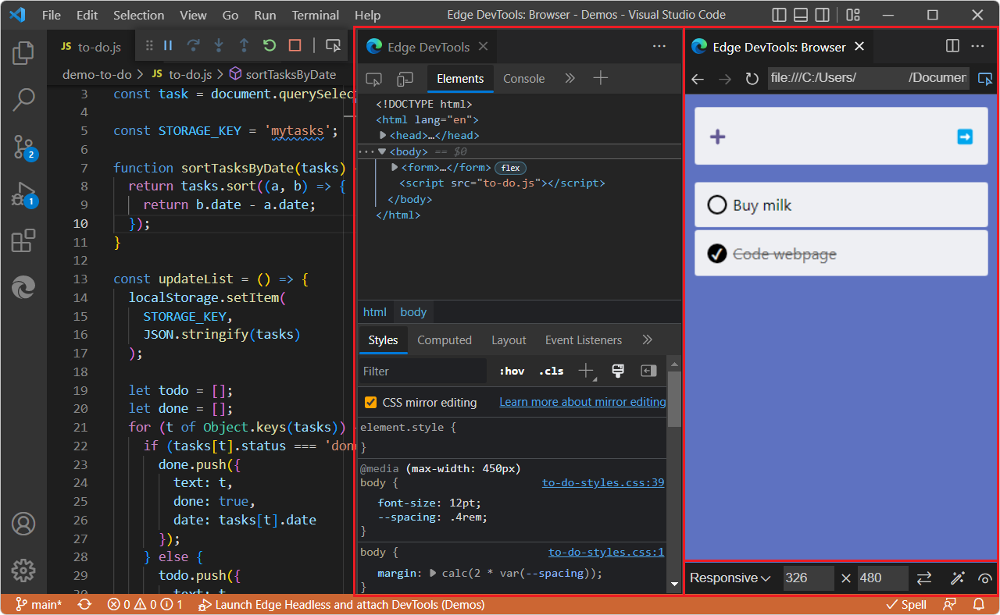
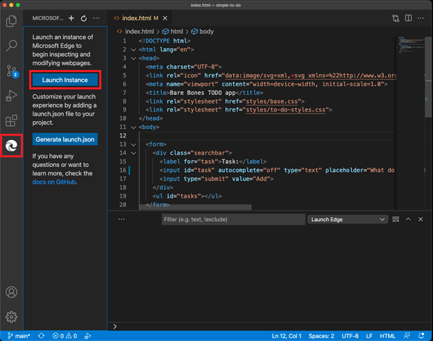

# Opening DevTools and the embedded browser

<!-- Getstart only covers the two main ways of entering debug mode: right-click and Launch Project, and does so in a tour approach of "do all steps using the Demos.  this page covers all ways and is not an end-to-end article/tour.  Only use 1 sections at a time. -->

There are several ways to open the **DevTools** tab and the **Edge DevTools: Browser** tab:

*  Open a folder, and then right-click an HTML file.  DevTools opens in Debug mode.

*  Open a folder that contains an HTML file.  Click the **Launch Instance** button, and then in the address bar of the **Edge DevTools: Browser** tab, enter enter a file path that corresponds to the opened folder (`C:\Users\myusername\Documents\GitHub\Demos\demo-to-do\index.html`), or enter a localhost URL that corresponds to the opened folder (**http://localhost/demos/demo-to-do/**).  DevTools opens in non-Debug mode; the Debug toolbar isn't open.

*  Open a folder that contains an HTML file.  Click the **Generate launch.json** button, then add a localhost URL in the `.json` file.  Click the **Launch Project** button.  DevTools opens in Debug mode.

For detailed steps, see [Get started using the DevTools extension for Visual Studio Code](./get-started.md).

If you open DevTools by right-clicking a `.html` file in Explorer in Visual Studio Code, you always get the embedded browser, rather than an external browser window.

#### By right-clicking an HTML file in the Explorer

To open DevTools and the embedded browser, along with the Debug toolbar for an HTML file on your hard drive:

1. In Visual Studio Code, select **Activity Bar** > **Open Folder** (if no folder is open yet) > **Explorer**.

1. Right-click an HTML file, select **Open with Edge**, and then select **Open Browser** or **Open Browser with DevTools**:

   

   The following components open in Visual Studio Code:
   *  The **Edge DevTools** tab, including the **Elements** tab and other tool tabs.
   *  The **Edge DevTools: Browser** tab (the headless, embedded web browser), including UI features for Device Emulation.
   *  The Debug toolbar.
   *  The Debug Console.
   *  You can select **View** > **Run**, to open the **Run and Debug** pane, which opens via some approaches, and which appears when you hit a breakpoint.
   *  In this approach, an instance is not listed in **Activity Bar** > **Microsoft Edge Tools** > **Targets**.

   

#### Opening the embedded browser with Device Emulation, without the DevTools tab

1. Select Activity Bar > **Explorer** > **Open Folder** (if not already opened) > right-click an HTML file, select **Open with Edge**, and then select **Open Browser**.
    

<!-- ====================================================================== -->
## By clicking the Launch Instance button

To open DevTools and the embedded or external browser, for a URL, in non-Debug mode:

1. Click the **Microsoft Edge Tools** icon in the **Activity Bar**.  This launches an instance of Microsoft Edge.

1. Click the **Launch Instance** button:

   

1. Enter a URL or file path into the address bar.

   Or, instead of manually entering a URL or file path into the address bar, you can generate a `launch.json` file to automate the debugging workflow.

   The following tabs and UI components open in Visual Studio Code:

   *  The **Edge DevTools** tab, which contains DevTools tools such as the **Elements** tool.  You can right-click this tab, click **Split Left** or **Split Right**, and then drag this tab to another pane.

   *  A browser preview window (headless browser; the **Edge DevTools: Browser** tab/pane).  You can right-click this tab, click **Split Left** or **Split Right**, and then drag this tab to another pane.

   *  In some scenarios, the Debug toolbar also opens.  You can drag it to move it.

   *  In the Microsoft Edge Tools pane, the **Targets** section opens, listing a target, and the blue **Launch** buttons are removed.  During debugging, the **Watch** pane opens instead of the **Microsoft Edge Tools** pane.

Note that the Debug toolbar isn't open.  You can select **View** > **Run**, or **Run** > **Start Debugging**.
<!-- todo: how to open the Debug toolbar? -->

Typically you use the **Explorer** pane, from the Activity Bar, to open a `.js` file during debugging a webpage, as shown in the above layout.

The **Launch Instance** button opens the headless browser with Device Emulation features in Visual Studio Code (this is the default setting), or launches an external browser window that's automation-controlled, depending on the **Settings** > **Headless** checkbox.  See [Using an external browser window](./external-browser-window.md).

<!-- ====================================================================== -->
## Local vs. remote URLs

In the address bar of the **Edge DevTools: Browser** tab, you can paste a local URL and get read/write DevTools functionality, or paste a remote URL and get read-only functionality.

If you paste a non-local URL, such as `https://microsoftedge.github.io/Demos/demo-to-do/`, you get browser functionality in the **Edge DevTools: Browser** tab, but not full DevTools functionality.  You can interact with the page and see it in different devices and rendering states from the lower bar.  You can also inspect the CSS and HTML, but if you try to change the page, you get an error, such as **Error while mirroring**:

<!-- ====================================================================== -->
## See also

* [Using an external browser window](./external-browser-window.md)
* [Get started using the DevTools extension for Visual Studio Code](./get-started.md)
