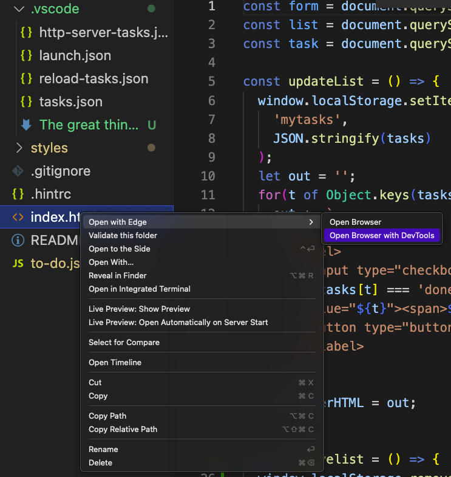
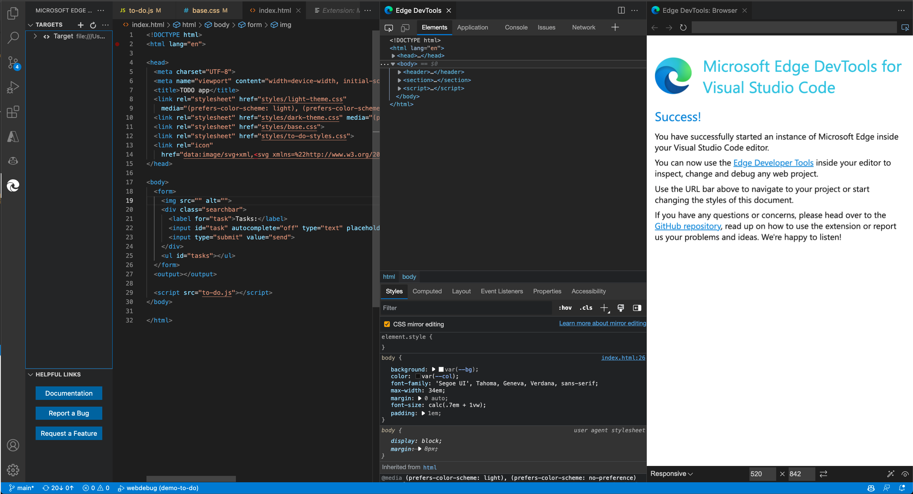
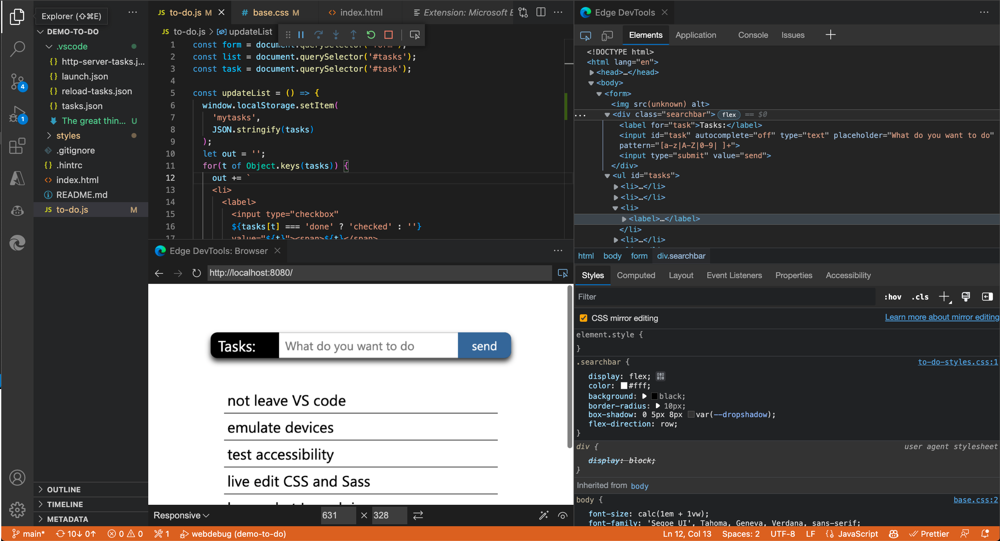

# Opening a browser instance in the extension

To view your rendered webpage while developing it, there are several ways to open and view your webpage in an instance of the Microsoft Edge browser, along with opening the **Edge DevTools** tab in Visual Studio Code.

As a separate Microsoft Edge window:

As an embedded browser instance in Visual Studio Code:

<!-- todo: link to each of 3 sections.  check topmost nav table.
put the 3 links in order of long article
How specifically do you do each of these approaches?  How do these 3 approaches relate to the long article's sections?
https://docs.microsoft.com/en-us/microsoft-edge/visual-studio-code/microsoft-edge-devtools-extension
-->

*  Approach 1: Launch Microsoft Edge in a new window (not in the Visual Studio Code window), and go to your web application.  Listed first here because most familiar.

*  Approach 2: Open a new instance of Microsoft Edge inside Visual Studio Code, as a tab (pane).
   *  This starts a new browser instance in the **Edge DevTools: Browser** tab and pane inside Visual Studio Code, displaying your rendered webpage that's specified in `launch.json`.
   *  This approach also opens the **Edge DevTools** tab (pane) within Visual Studio Code, showing information for your specified file, such as `C:\Users\myusername\Documents\GitHub\Demos\demo-to-do\index.html`.  See [Opening a browser instance in the extension](./opening-browser-instance.md).

* Approach 3: In the debugger, attach to a running instance of Microsoft Edge.  See [Opening the browser as part of a debugging session](#opening-the-browser-as-part-of-a-debugging-session), below.
<!-- https://docs.microsoft.com/en-us/microsoft-edge/visual-studio-code/microsoft-edge-devtools-extension#opening-the-browser-as-part-of-a-debugging-session -->

*  Approach 4: Headless, which means _xyz_.

<!-- ====================================================================== -->
## Approach 3: By right-clicking an HTML file in the Explorer

In the **Explorer** of Visual Studio Code, right-click an HTML file, select **Open with Edge**, and then select **Open Browser** or **Open Browser with DevTools**:
    

<!-- ====================================================================== -->
## By clicking the Launch Instance button

As another way to open a browser instance:

1. Click the **Microsoft Edge Tools** icon in the **Activity Bar**.  This lets you launch an instance of Edge or generate a `launch.json` file to automate the debugging workflow:

1. Click the **Launch Instance** button.  The following tabs and UI components open in Visual Studio Code:
   *  The **Edge DevTools** tab, which contains DevTools tools such as the **Elements** tool.  You can right-click this tab, click **Split Left** or **Split Right**, and then drag this tab to another pane.
   *  A browser preview window (headless browser; the **Edge DevTools: Browser** tab/pane).  You can right-click this tab, click **Split Left** or **Split Right**, and then drag this tab to another pane.
   *  In some scenarios, the Debug toolbar also opens.  You can drag it left or right.
   *  In the Microsoft Edge Tools pane, the **Targets** section opens, listing a target, and the blue **Launch** buttons are removed.  During debugging, the **Watch** pane opens instead of the **Microsoft Edge Tools** pane.

Typically you use the **Explorer** pane, from the Activity Bar, to open a `.js` file during debugging a webpage, as shown in the above layout.

<!-- ====================================================================== -->
## Opening the browser as part of a debugging session

Another way to open a browser instance is to open the browser as part of a debugging session.  See [Use the extension with the Visual Studio Code debugging workflow](./debugging-workflow.md).

The extension opens a new browser as an embedded browser in Visual Studio Code, shown as the **Edge DevTools: Browser** tab (pane).

If you used the **Targets** > **...** > **Settings** page for the extension and cleared the **Headless mode** checkbox, an external entire Microsoft Edge window opens (todo: confirm this is the case in this scenario).

You can move the **Edge DevTools: Browser** tab to anywhere within the editor area in the Visual Studio Code window.  You can use this tab side by side with your source code, or split the panes and place the browser preview below your code:

<!-- ====================================================================== -->
## Opening an external browser window instead of headless mode

_headless mode_ means <!--todo-->xyz.  This is the default setting.  Screenshot tbd.

Pros/cons of each way: ...<!--todo-->

#### External browser window

If you want to have an external Microsoft Edge browser window, including the complete UI for Microsoft Edge: go to **Settings**<!--todo--> for the extension by doing ABC.  Then clear the **Headless mode** checkbox. Close and reopen VS Code. Then when you launch a browser instance using the extension (in certain ways at least), an entire Microsoft Edge browser window will open.

_External browser window_ means that when you launch an instance of the browser by using the Edge DevTools extension, an entire Microsoft Edge window with full UI opens, controlled by test automation.  If you click the **Launch Project** button and no `launch.json` file exists, or the default `launch.json` file exists, the default, Success page opens in the browser:

Visual Studio Code when external browser launched: contains the **Edge DevTools** tab, but not the **Edge DevTools: Browser** tab (and in this scenario for launching, doesn't open the Debug toolbar):

In some cases,<!--todo: which?--> the Debug toolbar opens, and the Watch pane of Visual Studio Code opens.

#### Headless mode

If you want to have the **Edge DevTools: Browser** tab (pane) within Visual Studio Code, which is called _headless mode_, go to **Settings**, and then select the **Headless mode** checkbox.  This is the default setting.  Then when you launch a browser instance using the extension, the **Edge DevTools: Browser** tab (pane) will open within Visual Studio Code.

<!-- todo: new screenshot -->

Headless mode:

<!-- todo: new screenshot -->

<!-- ====================================================================== -->
## See also

* [Microsoft Edge DevTools extension for Visual Studio Code](../microsoft-edge-devtools-extension.md)
