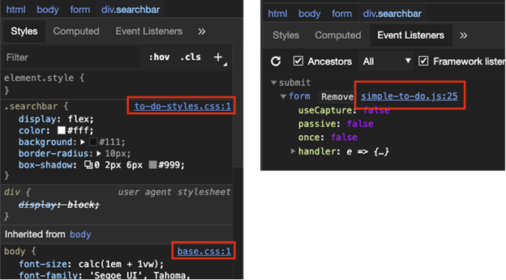

# Opening source files from the Elements tool

In the **Elements** tool:

*  The **Styles** tab indicates which source file is used to apply styles to the selected node in the DOM tree.

*  The **Event Listeners** tab indicates which source file is used to define event handlers for the selected node in the DOM tree.

The source file name and line number are shown as a clickable link.  Clicking a filename link opens that file in the Visual Studio Code editor:

For more information about the **Elements** tool, see [Inspect, edit, and debug HTML and CSS with the Elements tool](../../devtools-guide-chromium/elements-tool/elements-tool.md).

<!-- ====================================================================== -->
## See also

* [Get started using the DevTools extension for Visual Studio Code](./get-started.md)
* [Microsoft Edge DevTools extension for Visual Studio Code](../microsoft-edge-devtools-extension.md)
