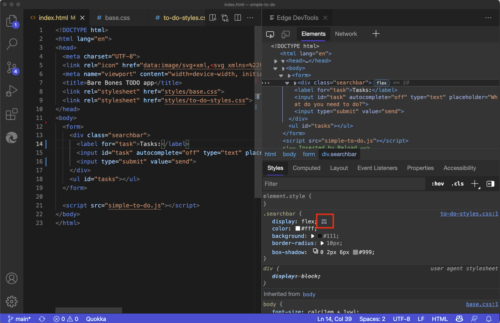
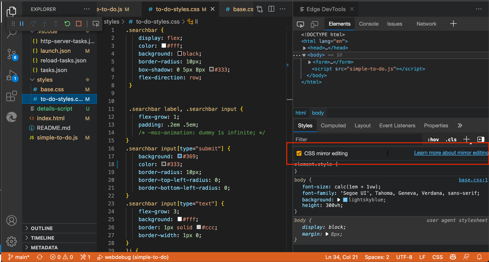

# Syncing live changes from the Styles tool by using CSS mirror editing

The **Styles** tool in Microsoft Edge DevTools is excellent for debugging and tweaking your CSS.  One problem is that although these changes show up live in the browser, they aren't reflected in your source files.  This means that at the end of your CSS debugging session, you need to copy and paste what you changed back into your source files.

CSS mirror editing is a feature of the Microsoft Edge DevTools extension that works around that problem. Any change made in the **Styles** tool also changes the file in your workspace.  CSS mirror editing is enabled by default in the extension.

You can edit any selector or create new selectors in the **Styles** tool, and all changes are automatically mirrored in the correct CSS source file. The extension only changes the downloaded copy of the file; it doesn't automatically save the changes back to your hard drive. This is a security measure to make sure you don't accidentally overwrite any of your code.

<!-- ====================================================================== -->
## Example of mirroring changes from the Styles tool to a CSS source file

In the following example, we have `index.html` currently open in Visual Studio Code, and the Microsoft Edge DevTools extension is open.  We select the flexbox icon in the `.searchbar` CSS selector, and then change the `flex-direction` to `column`.  As as result, we not only see the change in the browser and in DevTools (the first image below), but Visual Studio Code also automatically navigates to the correct style sheet file and the appropriate line number, and inserts the `flex-direction: column` CSS code (the second image below):

Changing the CSS setting created a new line of code in the correct CSS source file:

<!-- ====================================================================== -->
## Enabling CSS mirror editing

To enable and disable CSS mirror editing:

1. In the **Edge DevTools** tab, go to the **Elements** tool, and then go to the **Styles** panel.

1. Select or clear the **CSS mirror editing** checkbox.

Or, open the Command Menu, start typing the word **mirror**, and then select **Microsoft Edge Tools: Toggle mirror editing on|off for CSS files in workspace**:

<!-- ====================================================================== -->
## Sourcemap support

CSS Mirroring also supports abstractions like Sass or CSS-in-JS when you have set up your project to produce sourcemaps. We have a tracking issue on GitHub and welcome any feedback on how this could be improved: [CSS Mirror Editing with Sourcemaps: Known Issues and Feedback](https://github.com/microsoft/vscode-edge-devtools/issues/965).

<!-- ====================================================================== -->
## See also

* [Microsoft Edge DevTools extension for Visual Studio Code](./microsoft-edge-devtools-extension.md)
