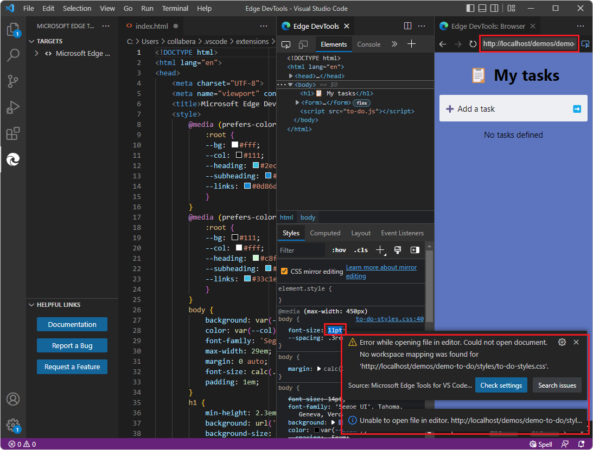
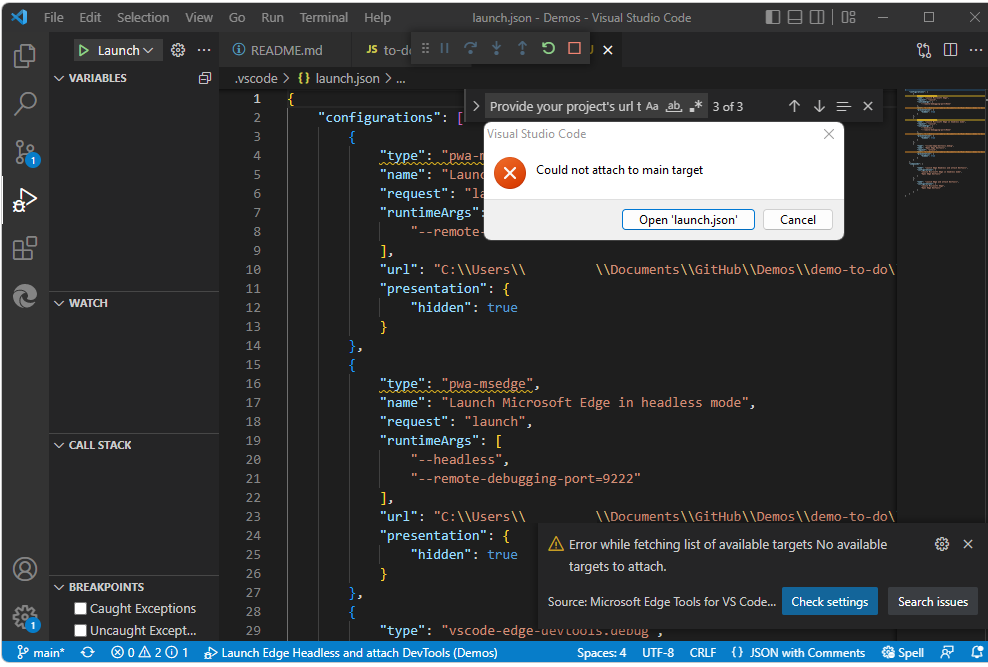
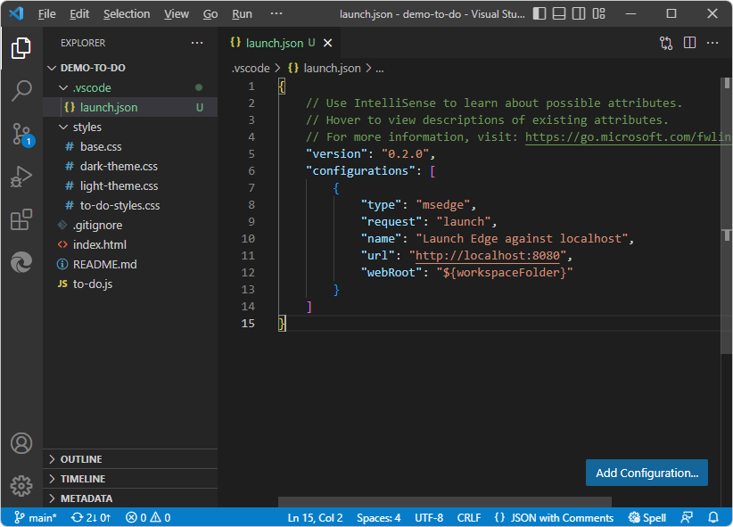

# Troubleshooting the DevTools extension

* Make sure to open DevTools in one of the supported ways or scenarios.  See [Opening DevTools and the DevTools browser](./open-devtools-and-embedded-browser.md).

<!-- ====================================================================== -->
## Controlling CSS mirror editing

By default, the **CSS mirror editing** checkbox is selected, in the **Styles** tab in the **Elements** tool in the **Edge DevTools** tab.  If you change CSS values using DevTools, but DevTools doesn't find a matching file in a workspace (folder) that's open in Visual Studio Code, error messages about mapping to source files for CSS mirror editing appear.

If you are changing CSS in DevTools, either:

   *  Select the **CSS mirror editing** checkbox and open a folder that contains source files that match the webpage that you are inspecting with DevTools.

   *  Or, clear the **CSS mirror editing** checkbox, to prevent such error messages.

See also:
* [The CSS Mirror Editing checkbox](./css-mirror-editing-styles-tab.md#the-css-mirror-editing-checkbox) in _Update .css files from within the Styles tab (CSS mirror editing)_
* [Mapping URL files to the opened folder](./open-devtools-and-embedded-browser.md#mapping-url-files-to-the-opened-folder) in _Opening DevTools and the DevTools browser_.

<!-- ====================================================================== -->
## Restarting DevTools

A powerful way of restarting DevTools is to close and reopen the folder:

1. In Visual Studio Code, select **File** > **Close Folder**.

1. If you started a web server by using Terminal in Visual Studio Code, restart the web server, such as by running `npx http-server`.  Or instead, you can start the web server from a command prompt outside of Visual Studio Code, so it keeps running.  For more information, see [Step 6: Set up a localhost server](./install.md#step-6-set-up-a-localhost-server) in _Installing the DevTools extension for Visual Studio Code_.

1. In Visual Studio Code, select **File** > **Open Recent**, and open a folder that contains web page source files.

<!-- ====================================================================== -->
## Closing all instances of DevTools

Normally, closing the two **DevTools** tabs closes any instances of DevTools and the DevTools browser.  If the Debug toolbar is open, click the **Stop** button.

To reset the state of DevTools, close all instances of DevTools.  Make sure the **Launch Instance** button is shown in Visual Studio Code > **Activity Bar** > **Microsoft Edge Tools** Side Bar.  That indicates that no instance of DevTools is running.

If necessary, close all Visual Studio Code instances, then open Visual Studio Code, and make sure the **Launch Instance** button is shown in **Activity Bar** > **Microsoft Edge Tools** Side Bar.

<!-- ====================================================================== -->
## Error messages

The solution for most error messages is to open DevTools in one of the recommended ways.  Make sure a folder is open that contains webpage source files that DevTools can map to the file path or URL that the DevTools browser is using.

The DevTools browser uses the URL or file path that you specify any of the various ways:

| Way of opening DevTools | Where the file path or URL is specified |
|---|---|
| Click the **Launch Instance** button. | The URL or file path that you specify in the DevTools browser's address bar. |
| Right-click an `.html` file. | The path of the `.html` file that you right-click. |
| Click the **Launch Project** button. | The URL or file path that you specify in `launch.json`. |

If you enter a different URL or file path in the address bar of the DevTools browser, for DevTools to provide automatic CSS mirror editing of local source files, you must also open a folder that contains files that match the webpage (file path or URL) that you specify in the DevTools browser.

Suppose you click the **Launch Instance** button, then paste a localhost URL into the address bar, such as `http://localhost:8080`, but you don't have the local source files folder open.  Then in the **Styles** tab of the Elements tool, try to change a CSS value.  Error messages might appear, such as:

*  **Error while mirroring css content to document.  Could not mirror css changes to document.  No workspace mapping was found.**

*  **Unable to open file in editor.**

*  **Error while opening file in editor.**

*  **Error while fetching.**

*  **Could not attach to main target.**

*  **Error while fetching list of available targets.  No available targets to attach.**

If you get errors while trying to point to a file path, instead of using a `launch.json` file, try right-clicking the `.html` file instead:

See [Opening DevTools and the DevTools browser](./open-devtools-and-embedded-browser.md).

<!-- ====================================================================== -->
## Deleting or re-creating launch.json

In addition to closing a reopening a folder, if you want to reset a project to use with DevTools, you can delete and optionally re-create `launch.json`.  `launch.json` defines debug configurations.

The following `launch.json` file is too short for the DevTools extension.  It was created by Visual Studio Code without using the DevTools extension.  The Demos repo doesn't have `launch.json` in [demo-to-do](https://github.com/MicrosoftEdge/Demos/tree/main/demo-to-do), so you might want to remove the file:

To re-create a fresh `launch.json` file for DevTools:

1. Make a backup copy of the `launch.json` file.

1. In Visual Studio Code > **Activity Bar** > **Explorer**, right-click `launch.json` > **Delete**.

   **Activity Bar** > **Microsoft Edge Tools** now shows a **Launch Instance** button and a **Generate launch.json** button.

1. If you want use a `launch.json` file for DevTools, make sure you have the desired folder open in Visual Studio Code > **Activity Bar** > **Explorer**, and then click the **Generate launch.json** button.  See [Opening DevTools by clicking the Launch Project button](./open-devtools-and-embedded-browser.md#opening-devtools-by-clicking-the-launch-project-button) in _Opening DevTools and the DevTools browser_.

<!-- ====================================================================== -->
## launch.json requires well-formed JSON

If **Activity Bar** > **Microsoft Edge Tools** contains a **Configure launch.json** button instead of the expected **Launch Project** button when a DevTools-generated `launch.json` file exists in the opened folder, this may be caused by adding a line with a missing comma or empty quotes.  Be sure `launch.json` contains well-formed JSON.

<!-- ====================================================================== -->
## See also

* [Get started using the DevTools extension for Visual Studio Code](./get-started.md)
* [Microsoft Edge DevTools extension for Visual Studio Code](../microsoft-edge-devtools-extension.md)
* [Opening DevTools and the DevTools browser](./open-devtools-and-embedded-browser.md)
