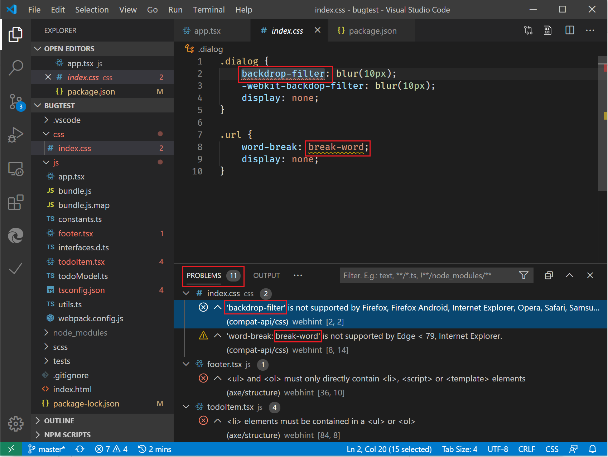

# webhint VS Code extension

Use [webhint](https://webhint.io), a customizable linting tool, to improve the accessibility, performance, cross-browser compatibility, PWA compatibility, and security of your site. It checks your code for best practices and common errors. This open-source project, initially developed by the Microsoft Edge team, is now part of the [OpenJS Foundation](https://openjsf.org/). The Microsoft Edge team continues to contribute to webhint alongside web developers in the community.



Identify and fix problems in your HTML, CSS, JavaScript, TypeScript, and more by adding the [webhint extension for VS Code](https://marketplace.visualstudio.com/items?itemName=webhint.vscode-webhint). Hints appear as inline underlines and are summarized in the Problems pane.

## Configuration

This extension uses a [default configuration](https://github.com/webhintio/hint/blob/master/packages/configuration-development/index.json) json file that activates hints and parsers for HTML, CSS, templating systems (JSX/TSX, Angular, and so on), JavaScript/TypeScript, and more.

```json
{
    "connector": "local",
    "extends": [
        "accessibility",
        "progressive-web-apps"
    ],
    "formatters": [
        "html",
        "summary"
    ],
    "hints": [
        "apple-touch-icons",
        "button-type",
        "compat-api/css",
        "compat-api/html",
        "create-element-svg",
        "css-prefix-order",
        "disown-opener",
        "highest-available-document-mode",
        "manifest-exists",
        "meta-charset-utf-8",
        "meta-viewport",
        "no-bom",
        "no-protocol-relative-urls",
        "scoped-svg-styles",
        "sri",
        "typescript-config/consistent-casing",
        "typescript-config/import-helpers",
        "typescript-config/is-valid",
        "typescript-config/no-comments",
        "typescript-config/strict",
        "typescript-config/target"
    ],
    "hintsTimeout": 10000,
    "parsers": [
        "babel-config",
        "css",
        "html",
        "javascript",
        "jsx",
        "less",
        "sass",
        "typescript",
        "typescript-config",
        "webpack-config"
    ]
}
```

If you want more control over the hints and parsers that get activated, create a local `.hintrc` file to configure webhint. For help with output from specific hints, see the [webhint user guide](https://webhint.io/docs/user-guide/configuring-webhint/summary/).

## Feedback

Send us your feedback by [filing an issue](https://github.com/webhintio/hint/issues/new) on the [webhint GitHub repo](https://github.com/webhintio/hint). 

To contribute to the extension, please read the [webhint VS Code extension contribution guide](https://github.com/webhintio/hint/blob/master/packages/extension-vscode/CONTRIBUTING.md).

## See also
  - [Accessibility]/microsoft-edge/accessibility)
  - [Visual Studio Code](/microsoft-edge/visual-studio-code/)
