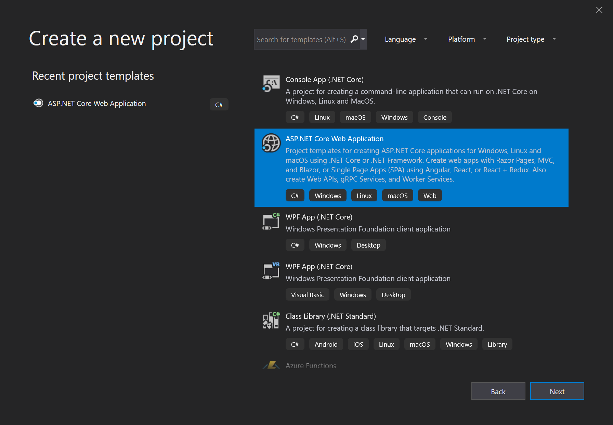
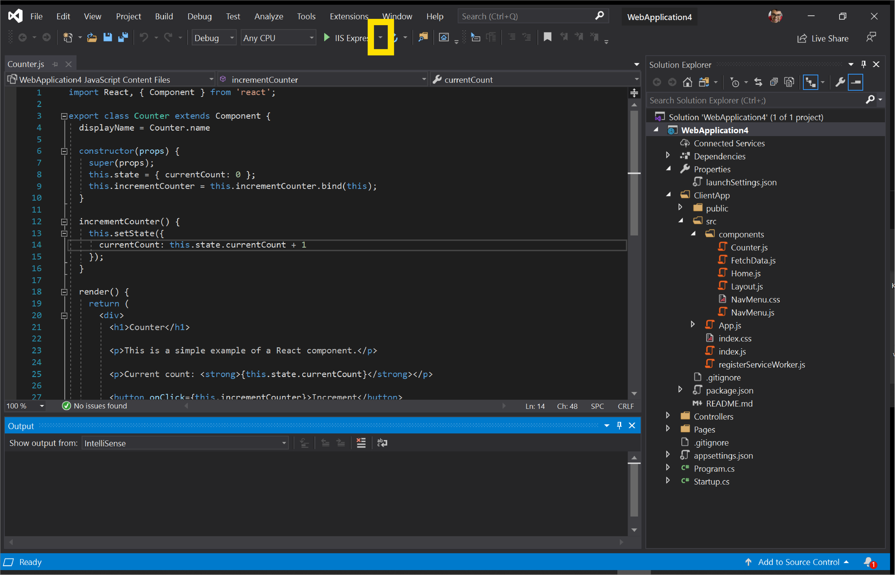
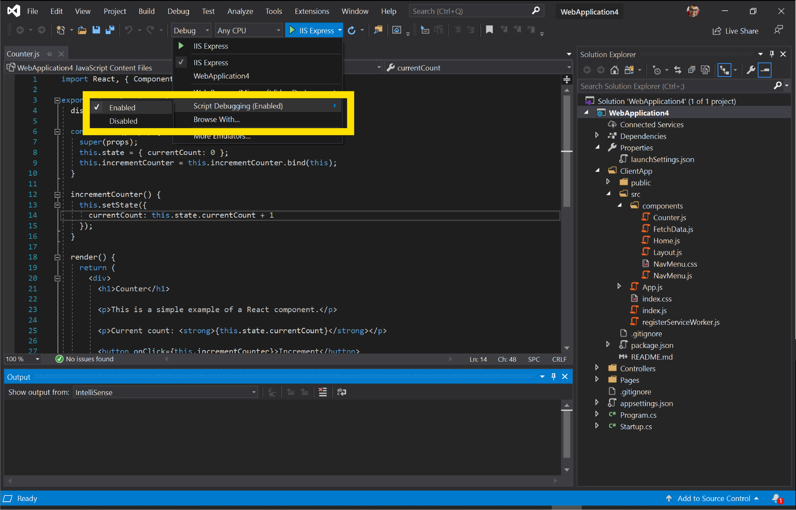
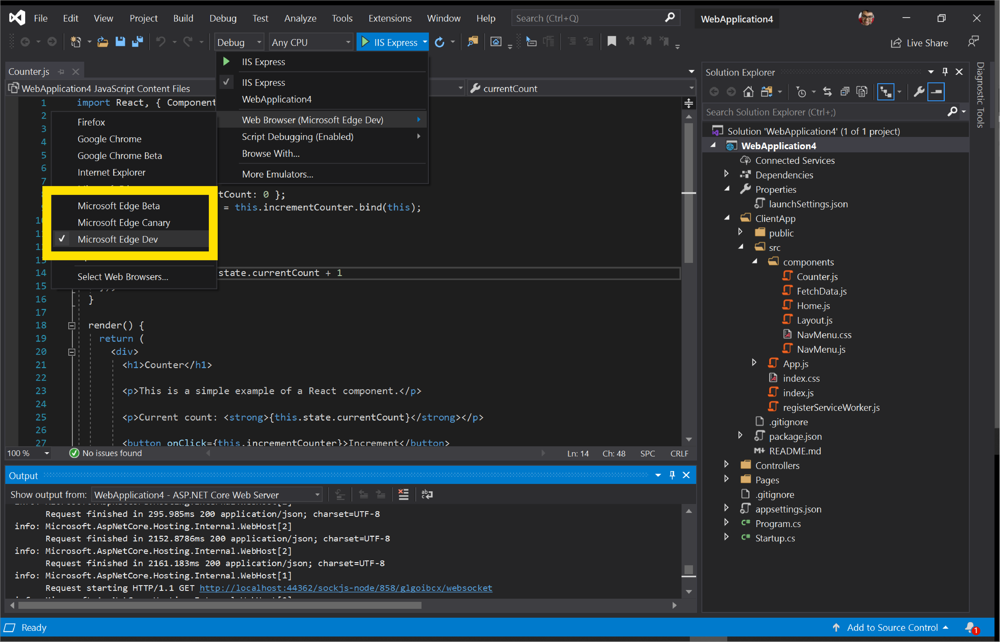
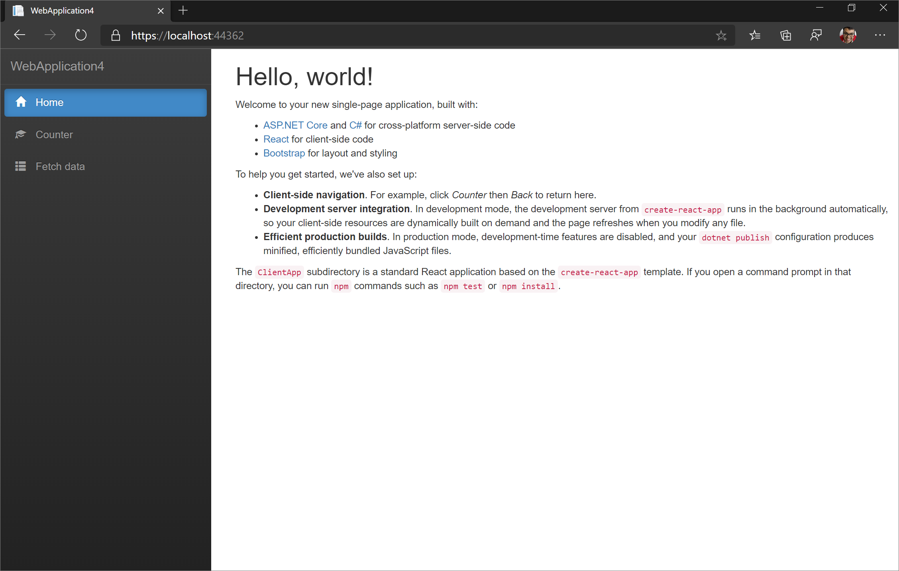
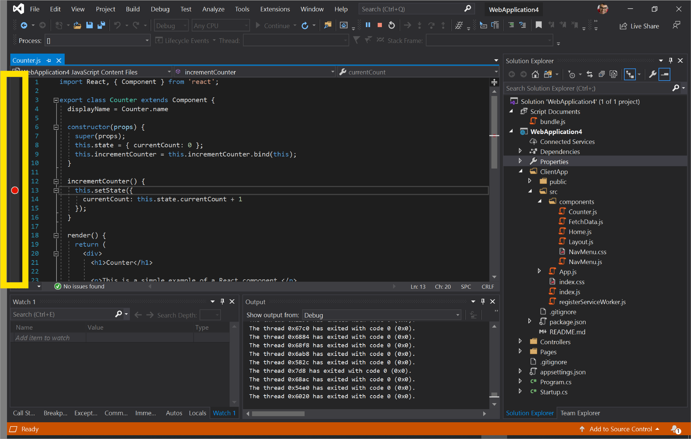
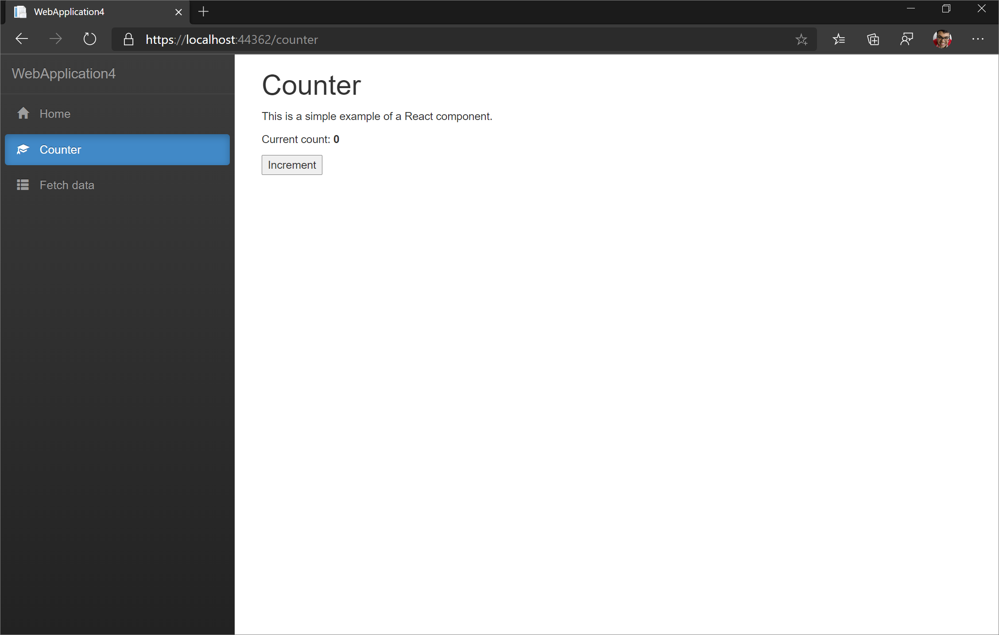
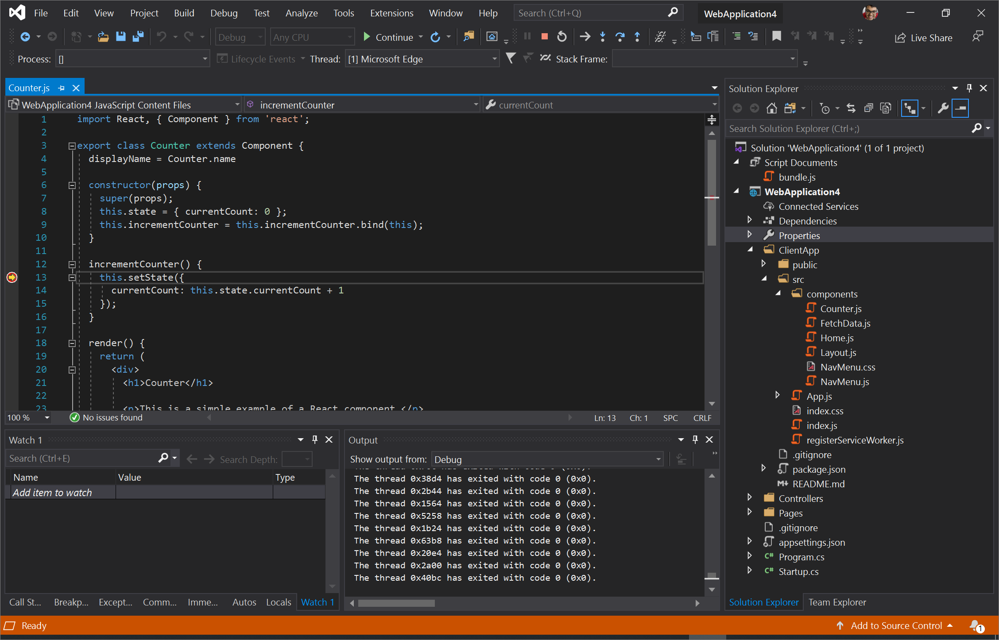
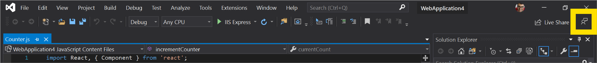

# Visual Studio

[Visual Studio](https://visualstudio.microsoft.com/vs/) is an integrated development environment (IDE) that you can use to edit, debug, build, and publish your web applications. It is a feature-rich program that can be used for many aspects of your web development. Over and above the standard editor and debugger that most IDEs provide, Visual Studio includes compilers, code completion tools, graphical designers, and many more features to ease your development process. Head to [this page](https://visualstudio.microsoft.com/downloads/) to download Visual Studio if you aren't using it yet.

Currently, Visual Studio 2019 supports debugging JavaScript in Microsoft Edge for your ASP\.NET Framework and ASP\.NET Core applications. Follow the steps below to debug Microsoft Edge from Visual Studio.

## Launch Microsoft Edge
Visual Studio builds your ASP\.NET and ASP\.NET Core application, starts your web server, launches Microsoft Edge, and connects the Visual Studio debugger all at the click of a single button. This enables you to debug JavaScript running in Microsoft Edge directly from your IDE!

### Create a new ASP.NET Core web application

Open Visual Studio 2019 and select **Create a new project**. On the next screen, select **ASP\.NET Core Web Application** and click **Next**.

> ##### Figure 1  
> Create a new ASP.NET Core Web Application 
>   

Provide a **Project name** for your new project and click **Create**. For the purposes of this example, select **React.js** as the template which shows you how to integrate React.js with an ASP.NET Core application and click **Create**.

### Launch Microsoft Edge from Visual Studio

Once your project has been created, open **ClientApp/src/components/Counter.js**. Now, tell Visual Studio to debug JavaScript by selecting the dropdown next to the green **Play** button and **IIS Express**. 

> ##### Figure 2  
> The dropdown next to the green **Play** button and **IIS Express**
>   

Select **Script Debugging** and click **Enabled**.

> ##### Figure 3  
> Enable script debugging in Visual Studio
>   

In the same dropdown, select **Web Browser** and click the preview channel of Microsoft Edge that you want Visual Studio to launch: Microsoft Edge Canary, Dev, or Beta. If you haven't already, head to [this page](https://www.microsoftedgeinsider.com/download) to install the Microsoft Edge preview channels.

> ##### Figure 4  
> Select the preview channel of Microsoft Edge that you want Visual Studio to launch
>   

> [!NOTE]
> If you select Microsoft Edge (EdgeHTML), Visual Studio will launch that instead of Microsoft Edge (Chromium). [Install the preview channels of Microsoft Edge](https://www.microsoftedgeinsider.com/download) and select them or ensure that the version of Microsoft Edge installed on your machine is Microsoft Edge (Chromium) and not Microsoft Edge (EdgeHTML).

Now that Visual Studio is correctly configured, click the green **Play** button. Visual Studio will build your application, start the web server, launch Microsoft Edge, and navigate to `https://localhost:44362/` or whatever port is specified in **launchSettings.json**.

> ##### Figure 5  
> Microsoft Edge launched from Visual Studio
>   

### Debug JavaScript running in Microsoft Edge

Switch back to Visual Studio. In **Counter.js**, set a breakpoint on Line 13 by clicking in the gutter next to that line.

> ##### Figure 6
> Setting a breakpoint in Visual Studio by clicking on the gutter next to Line 13 in **Counter.js**
>   

Now switch back to the instance of Microsoft Edge that Visual Studio launched. Click on **Counter** in the NavMenu on the left of the page. Now click **Increment**.

> ##### Figure 7
> The Counter page in our ASP.NET Core web application
>   

The JavaScript debugger in Visual Studio is going to hit the breakpoint we set in **Counter.js**. Visual Studio has now paused execution of the JavaScript running in Microsoft Edge and you can step through the script line-by-line.

> ##### Figure 8
> Visual Studio pausing JavaScript running in Microsoft Edge
>   

This example was just a minor demonstration of the functionality available in Visual Studio. Learn more about all the things you can do in Visual Studio 2019 by reading [their documentation](https://docs.microsoft.com/visualstudio/windows/?view=vs-2019).

## Attach to Microsoft Edge
In the previous workflow, Visual Studio launches Microsoft Edge. With this workflow, you will be able to attach the Visual Studio debugger to an already running instance of Microsoft Edge. 

First, ensure that there are no running instances of Microsoft Edge. Now, from your terminal, run the following command:

```console
start msedge –remote-debugging-port=9222
```

From Visual Studio, open the **Debug** menu and select **Attach to Process** or press `Ctrl` + `Alt` + `P`.

> ##### Figure 9
> Selecting **Attach to Process** in Visual Studio
>   

From the **Attach to Process** dialog, set **Connection type** to **Chrome devtools protocol websocket (no authentication)**. In the **Connecting target** textbox, type in `http://localhost:9222/` and press `Enter`. You should see the list of open tabs you have in Microsoft Edge listed out in the **Attach to Process** dialog.

> ##### Figure 10
> Configuring the **Attach to Process** dialog in Visual Studio
>   

Click **Select…** and check **JavaScript (Microsoft Edge – Chromium)**. You can add tabs, navigate to new tabs, and close tabs and see those changes reflected in the **Attach to Process** dialog by clicking the **Refresh** button. Select the tab you want to debug and click **Attach**.

The Visual Studio debugger is now attached to Microsoft Edge! You can pause execution of JavaScript, set breakpoints, and see `console.log()` statements directly in the Debug Output window in Visual Studio.

## Feedback
We're eager to learn more about how you work with JavaScript in Visual Studio! Please send us feedback by clicking the **Feedback** icon in Visual Studio or by tweeting [@VisualStudio and @EdgeDevTools](https://twitter.com/intent/tweet?text=@VisualStudio+@EdgeDevTools).

> ##### Figure 11
> The **Feedback** icon in Visual Studio
>   
