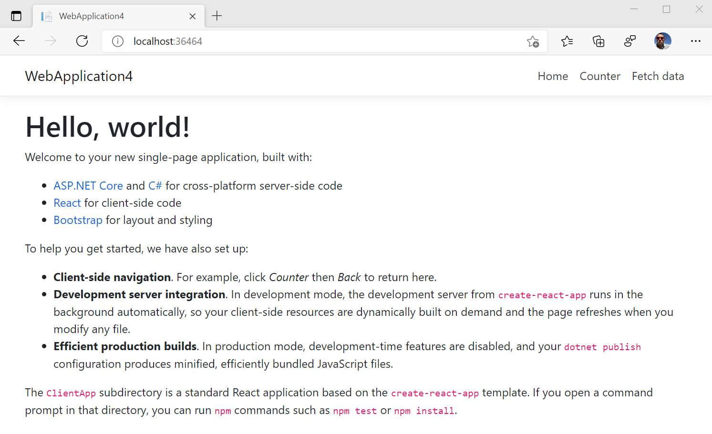

# Visual Studio for web development

Microsoft [Visual Studio](https://visualstudio.microsoft.com/vs) is an integrated development environment (IDE).  Use it to edit, debug, build, and publish your web apps.  Visual Studio is a feature-rich program that can be used for many aspects of your web development.

In addition to the standard editor and debugger that most IDEs provide, Visual Studio includes features to ease your development process, including:

*   Compilers.
*   Code completion tools.
*   Graphical designers.
*   And many more features.

If you aren't already using Visual Studio, go to [Download Visual Studio](https://visualstudio.microsoft.com/downloads) to download it.

Currently, Visual Studio 2019 supports debugging JavaScript in Microsoft Edge for your ASP.NET Framework and ASP.NET Core apps. To use Visual Studio to debug Microsoft Edge, do the following steps.


<!-- ====================================================================== -->
## Launch Microsoft Edge

Follow the steps in this section to use Visual Studio to do the following:

*  Build your ASP.NET and ASP.NET Core app.
*  Start a web server.
*  Launch Microsoft Edge.
*  Connect the Visual Studio debugger with a single button.

The simplified workflow allows you to debug JavaScript that runs in Microsoft Edge directly from your IDE.


### Create a new ASP.NET Core web app

First, create a new ASP.NET Core web app, as follows:

1. Open Visual Studio 2019 and select **Create a new project**.

1. In the search box on the next screen, enter **react**.

1. Select **ASP.NET Core with React.js** from the list of templates and then **Next**.


This **React.js** template specifies how to integrate React.js with an ASP.NET Core app.

You've now created a project for an ASP.NET Core web app.


### Launch Microsoft Edge from Visual Studio

Next, run and debug the ASP.NET Core web app project in Visual Studio, as follows:

1. Open `ClientApp/src/components/Counter.js`.

1. Select the dropdown list next to the green **Play** button and **IIS Express**.

   

1. Select **Script Debugging** > **Enabled**.

   

1. In the same dropdown list, select **Web Browser** > the preview channel of Microsoft Edge that you want Visual Studio to launch, such as Microsoft Edge Canary, Dev, or Beta.  If you aren't already using one of the Microsoft Edge preview channels, go to [Download Microsoft Edge Insider Channels](https://www.microsoft.com/edge/download/insider) to download one.

   

1. Select the green **Play** button.  Visual Studio builds your app, starts the web server, launches Microsoft Edge, and navigates to `https://localhost:44362/` or whatever port is specified in `launchSettings.json`.

   

Continue with the steps below.


### Debug JavaScript code that's running in Microsoft Edge

1. Switch back to Visual Studio to set a breakpoint.

1. In `Counter.js`, set a breakpoint on Line 13 by selecting the gutter next to the line.

   

1. Switch back to the instance of Microsoft Edge that Visual Studio launched.

1. Select **Counter** in the navigation menu at the top of the webpage and then select **Increment**.

   > [!div class="mx-imgBorder"]
   > 

1.  The JavaScript debugger in Visual Studio hits the breakpoint you set in `Counter.js`.  Visual Studio now pauses the runtime of the JavaScript running in Microsoft Edge and you can step through the script line-by-line.

   

In the above approach, you launched Microsoft Edge from Visual Studio.  Alternatively, you can an attach the Visual Studio debugger to an instance of Microsoft Edge that's already running, as described below.

The example was just a minor demonstration of the functionality available in Visual Studio.  For more information about the functionality in Visual Studio 2019, see the [Visual Studio documentation](/visualstudio/windows/index).


<!-- ====================================================================== -->
## Attach Visual Studio debugger to a running instance of Microsoft Edge

To attach the Visual Studio debugger to an instance of Microsoft Edge that's already running:

1. Make sure that there are no running instances of Microsoft Edge.

1. From your command line, run the following command:

   ```console
   start msedge --remote-debugging-port=9222
   ```
    
1. In Visual Studio, select **Debug** > **Attach to Process** or **Ctrl+Alt+P**.

   

1. In the **Attach to Process** dialog, set **Connection type** to **Chrome devtools protocol websocket (no authentication)**.

1. In the **Connecting target** text box, type `http://localhost:9222/` and then press **Enter**.

1. Review the list of open tabs you have in Microsoft Edge listed out in the **Available processes** section.

   

1. Select the tab you want to debug from the list, and then select **Attach**.

1. In the **Select Code Type** dialog, select **JavaScript (Microsoft Edge - Chromium)** and select **OK**.

The Visual Studio debugger is now attached to Microsoft Edge.  You can pause the running of JavaScript, set breakpoints, and view `console.log()` statements directly in the **Debug Output** window in Visual Studio.


<!-- ====================================================================== -->
## Edge DevTools extension for Visual Studio

Debug your ASP.NET projects in Visual Studio with the Edge Developer Tools.  You can embed the Microsoft Edge Developer Tools in Microsoft Visual Studio to debug your ASP.NET projects live.  Download the [Microsoft Edge Developer Tools for Visual Studio](https://aka.ms/edgetools-for-vs). 

To use the extension:

1. Make sure Visual Studio 2022 and the ASP.NET workload are installed.

1. Set up Web Live Preview as the default Web Forms Designer, as described in the above page.

1. Open an ASP.NET project.

1. Open a webpage of the project in the **Design** window.

1. In the upper left of the **Design** window, click the **Open Edge DevTools** () button:


Edge DevTools for Visual Studio opens, with the **Elements** tool selected:


The **Network** tool is also open by default:


The **Inspect tool** () and **Toggle screencast** () are available, and the **More Tools** () menu offers the [Issues](../devtools-guide-chromium/issues/index.md), [Network conditions](../devtools-guide-chromium/network-conditions/network-conditions-tool.md), and [Network request blocking](../devtools-guide-chromium/network-request-blocking/network-request-blocking-tool.md) tools:


**See also:**

<!-- todo: update url from preview to release: -->
* [Edge Developer Tools for Visual Studio](https://devblogs.microsoft.com/visualstudio/?p=237066&preview=1&_ppp=7aa7aef54f), at Visual Studio DevBlogs.

<!--
* [Microsoft Edge DevTools extension for Visual Studio](../devtools-guide-chromium/whats-new/2022/03/devtools.md#microsoft-edge-devtools-extension-for-visual-studio) in _What's New in DevTools (Microsoft Edge 99)_.
-->


<!-- ====================================================================== -->
## Getting in touch with the Microsoft Visual Studio team

The Microsoft Visual Studio and Microsoft Edge teams wants to learn more about how you work with JavaScript in Visual Studio.  To send your feedback, select the **Send Feedback** icon in Visual Studio, or tweet [@VisualStudio and @EdgeDevTools](https://twitter.com/intent/tweet?text=@VisualStudio+@EdgeDevTools).


