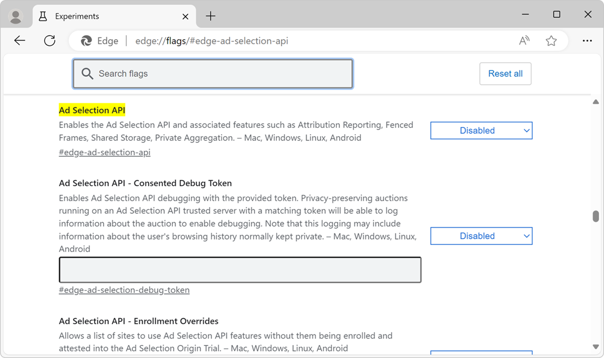

# Sign up for the Ad Selection API
<!-- https://go.microsoft.com/fwlink/?linkid=2289906 -->

The Ad Selection API provides user-relevant ads on your site without using third-party cookies.  See [Ad Selection Overview](https://github.com/WICG/privacy-preserving-ads/blob/main/Ad%20Selection%20Overview.md) in the `privacy-preserving-ads` repo.

**Detailed contents:**

* [Attestation enrollment and alpha sign-up](#attestation-enrollment-and-alpha-sign-up)
    * [When and where is the preview available?](#when-and-where-is-the-preview-available)
    * [Flags for testing](#flags-for-testing)
    * [Sign-up and attestation requirements and process](#sign-up-and-attestation-requirements-and-process)
    * [Example JSON file](#example-json-file)
        * [Important fields and values](#important-fields-and-values)
* [Deploy the Ad Selection API services](#deploy-the-ad-selection-api-services)
    * [Images for deploying services](#images-for-deploying-services)
    * [Services for sellers](#services-for-sellers)
    * [Services for buyers](#services-for-buyers)
    * [User-Defined Functions](#user-defined-functions)
        * [User-Defined Functions for sellers](#user-defined-functions-for-sellers)
        * [User-Defined Functions for buyers](#user-defined-functions-for-buyers)
    * [Deployment guide](#deployment-guide)
* [Use the Ad Selection API on your website](#use-the-ad-selection-api-on-your-website)
* [Provide feedback about the origin trial](#provide-feedback-about-the-origin-trial)
* [Terms of Use](#terms-of-use)
* [Data Protection Addendum](#data-protection-addendum)
* [See also](#see-also)

The Ad Selection API can be used by:
* **Sellers** running a supply-side platform (SSP), who can use the API to provide higher-quality ads for their publishers.
* **Buyers** running a demand-side platform (DSP), who can use the API to improve the effectiveness of advertising campaigns.

To get started using the Ad Selection API and test out the end-to-end flow, sign up for the limited preview of the Ad Selection API.

As a seller operating a supply-side platform or a buyer operating a demand-side platform, use this guide to:
* Sign up for the Ad Selection API limited preview by registering for the origin trial.
* Complete the API attestation by publishing your attestations JSON file.
* Set up an evaluation environment with a supported cloud provider.
* View the Ad Selection API documentation.
* Prepare your User-Defined Functions (UDFs).
* Deploy your services to Azure.
* Test the Ad Selection API on your site.


<!-- ====================================================================== -->
## Attestation enrollment and alpha sign-up


<!-- ------------------------------ -->
#### When and where is the preview available?

Microsoft Edge versions starting with **130.0.2808.0** have support for the Ad Selection API in a limited, developer opt-in preview outside of the European Economic Area (EEA) and the United Kingdom (UK).


<!-- ------------------------------ -->
#### Flags for testing

To change the Ad Selection API platform features on your developer machine, use the **Ad Selection API** testing flags at `edge://flags#edge-ad-selection-api`:



The **Ad Selection API** flag enables the Ad Selection API and associated features such as:
* Attribution Reporting.<!--an api-->
* Fenced Frames.<!--not an api-->
* Shared Storage.<!--an api-->
* Private Aggregation.<!--an api-->


<!-- ------------------------------ -->
#### Sign-up and attestation requirements and process

Developers interested in alpha testing can join the origin trial for the Ad Selection API.  This origin trial enables end-to-end testing of Ad Selection API features, covering both the API usage and the deployment of secure container images.

For each top-level domain that you intend to use with the Ad Selection API, fill in the **Origin Trial Registration** form for that domain, and then submit the form.

To sign up for the **Ad Selection API** origin trial for a domain:

1. First, do the steps in [Use origin trials of experimental APIs in Microsoft Edge](../origin-trials/index.md).

1. Then create a file that's named `ad-selection-attestations.json`, and host the file at the top-level domain, in the `/.well-known/` directory.  For example:

   `https://contoso.example/.well-known/ad-selection-attestations.json`

   The `ad-selection-attestations.json` file must be published within **30 days** of receiving the OT token.  Hosting this JSON file is required, in order to complete your attestation and allow your code to access the Ad Selection API, to test the Ad Selection API with supported Microsoft Edge clients.


<!-- ------------------------------ -->
#### Example JSON file

The attestations JSON file must be named `ad-selection-attestations.json`, and must conform to the following standards below.  The following is an example of an `ad-selection-attestations.json` file:

```json
{
    "ad_selection_api_attestations": [
        {
            "attestation_parser_version": "2",
            "attestation_version": "2",
            "privacy_policy": [
                "https://contoso.example/privacy/"
            ],
            "ownership_token": "<Your Unique Token Here>",
            "enrollment_site": "https://contoso.example/",
            "platform_attestations": [
                {
                    "platform": "edge",
                    "attestations": {
                        "ad_selection_api": {
                            "ServiceNotUsedForIdentifyingUserAcrossSites": true/false
                        },
                        "attribution_reporting_api": {
                            "ServiceNotUsedForIdentifyingUserAcrossSites": true/false
                        },
                        "shared_storage_api": {
                            "ServiceNotUsedForIdentifyingUserAcrossSites": true/false
                        },
                        "private_aggregation_api": {
                            "ServiceNotUsedForIdentifyingUserAcrossSites": true/false
                        }
                    }
                },
                {
                    "platform": "android",
                    "attestations": {}
                }
            ]
        }
    ]
}
```


<!-- ---------- -->
###### Important fields and values

* The `ad-selection-attestations.json` file must include the origin trial token that was generated and sent to you for this top-level domain.  `"ownership_token":` is the origin trial token that was generated when registering this domain for the **Ad Selection API** origin trial.

* In the `"platform_attestations":` section, `"platform":` must be `"edge"` or `"android"`.

* The file must include a list of APIs (features that are associated with the Ad Services API).  In the `"platform_attestations":` section, valid members of `"attestations":` are the following:
   * `"ad_selection_api":` - The main API, for private auction logic.
   * `"attribution_reporting_api":` - Attribution reporting.
   * `"shared_storage_api":` - Shared storage.
   * `"private_aggregation_api":` - Private aggregation.
   * Requirements:
      * Each `"..._api":` entry must have a single field, `"ServiceNotUsedForIdentifyingUserAcrossSites":`, with either a `true` or `false` value.  `true` means that this service is not used for identifying the user across sites.  `false` means that this service is used for identifying the user across sites.


<!-- ====================================================================== -->
## Deploy the Ad Selection API services

The Ad Selection API uses a trusted execution environment (TEE) to provide a level of assurance for data integrity, data confidentiality, and code integrity; see [Confidential Computing: Hardware-Based Trusted Execution for Applications and Data](https://confidentialcomputing.io/wp-content/uploads/sites/85/2021/03/confidentialcomputing_outreach_whitepaper-8-5x11-1.pdf).  Services provided by the Ad Selection API must run in a TEE to secure the data used by these services.

Ad Selection Services running in a TEE should be deployed on a cloud platform that supports the necessary security features.  Initially, services can be deployed in Azure by using confidential ACI containers; see [Confidential containers on Azure Container Instances](/azure/container-instances/container-instances-confidential-overview).

The Ad Selection API provides different services that need to be deployed by sellers or buyers.


<!-- ------------------------------ -->
#### Images for deploying services

Add your User-Defined Functions (UDFs) within the provided images of services.  The User-Defined Functions can run custom business logic.  The User-Defined Functions run in private containers within the deployed services.

Each image defines one service.  Some images don't contain UDFs, and consist entirely of predefined code.  Some images contain UDFs, as functions with an empty body or starter code, that are the relevant User-Defined Functions for that service.  Fill in the bodies of the User-Defined Functions in these images with your own custom code.

Microsoft provides an image for each service, which can be deployed on a cloud provider.  These are the public images that must be used for deployment.  Only official images from Microsoft are able to run private auctions.

Images for deployment:
* Sellers
   * [Ad Selection Seller Front End Service](https://mcr.microsoft.com/product/ad-selection/azure/seller-frontend-service)
   * [Ad Selection Auction Service](https://mcr.microsoft.com/product/ad-selection/azure/auction-service)
* Buyers
   * [Ad Selection Buyer Front End Service](https://mcr.microsoft.com/product/ad-selection/azure/buyer-frontend-service)
   * [Ad Selection Bidding Service](https://mcr.microsoft.com/product/ad-selection/azure/bidding-service)
   * [Ad Selection K-Anonymity Service](https://mcr.microsoft.com/product/ad-selection/azure/k-anonymity-service)
* Sellers and buyers
   * [Ad Selection Key Value Service](https://mcr.microsoft.com/product/ad-selection/azure/key-value-service/)


<!-- ------------------------------ -->
#### Services for sellers

| Service | Description |
| --- | --- |
| **SellerFrontEnd** | Provides a `/SelectAd` HTTPS endpoint, which receives requests from the seller's untrusted ad service to initiate the Protected Audience auction flow. |
| **Auction** | Provides a `/ScoreAds` endpoint, which receives requests from the **SellerFrontEnd** service, containing bids that are participating in the auction.  Responds with a score value that the **SellerFrontEnd** service uses to choose the winner. |
| **Key/Value** | Receives requests from the **SellerFrontEnd** service, which contain lookup keys from buyers' bids (such as `ad_render_urls`).  Returns real-time scoring signals that are required for the auction.  Runs in Bring Your Own Service (BYOS) mode, so the seller does not need to deploy this service in a trusted execution environment (TEE), and can instead use the image that's provided by Microsoft. |


<!-- ------------------------------ -->
#### Services for buyers

| Service | Description |
| --- | --- |
| **BuyerFrontEnd** | Provides a `/GetBids` endpoint, which receives requests from the **SellerFrontEnd** service to initiate the bidding flow. |
| **Bidding** | Provides a `/GenerateBids` endpoint, which receives requests from the **BuyerFrontEnd** service to handle the bidding and generate a bid.  Generates a bid, chooses the winner, and selects the banner to be rendered. |
| **Key/Value** | Receives requests from the **BuyerFrontEnd** service and returns real-time buyer data required for bidding, corresponding to lookup keys from Interest Groups.  Such a request happens once per workflow.  Runs in Bring Your Own Service (BYOS) mode. |
| **Bidding Selection & Key/Value** | Receives requests from the **Bidding** service to select and return additional ad banners (candidates) that can participate in bidding.  The **Bidding Selection & Key/Value** service can also return additional signals that are needed for bidding.  The **Bidding** service may send multiple requests to the **Bidding Selection & Key/Value** service, or may choose not to send any requests, because the **Bidding Selection & Key/Value** service is optional.  The **Bidding Selection & Key/Value** service must be deployed in a trusted execution environment (TEE). |
| **K-Anonymity** | Collects k-anonymity counters and checks that the winning ad creative passes the k-anonymity check. |


<!-- ------------------------------ -->
#### User-Defined Functions

Sellers and buyers need to provide their own custom code as User-Defined Functions (UDFs) that run in private containers within the deployed services.  These User-Defined Functions can execute custom business logic.

Each buyer or seller can deploy multiple instances of a given service, such as:
* **SellerFrontEnd** and **Auction**.
* **BuyerFrontend**, **Bidding**, and **K-Anonymity**.

Some of these services take an input which is a JavaScript worklet that defines User-Defined Functions.


<!-- ---------- -->
###### User-Defined Functions for sellers

| UDF | Service in which the UDF runs | Description |
| --- | --- | --- |
| `scoreAd()` | **Auction** | Generates a score for each buyer's bid, or rejects the bid.  This score is then used by the **SellerFrontEnd** service, to choose a winner from among all buyers. |
| `reportResult()` | **SellerFrontEnd** | For event-level reporting.  Runs in the **SellerFrontEnd** service after the final winner has been chosen.  Notifies the seller about the winning bidder, and provides the bid value. |


<!-- ---------- -->
###### User-Defined Functions for buyers

| UDF | Service in which the UDF runs | Description |
| --- | --- | --- |
| `generateBids()` | **Bidding** | Generates a bid, and chooses the banner that will be shown. |
| `reportWin()` | **SellerFrontEnd** | For event-level reporting.  Runs in the **SellerFrontEnd** service, if the buyer's bid wins the auction.  Notifies the buyer that they have won the auction, and generates notification URLs that will be triggered later, such as during banner rendering or other client events. |
| `getValues()` | **Bidding Selection & Key/Value** | Runs in the **Bidding Selection & Key/Value** service, if the buyer uses that service.  Allows for custom code execution for data lookup and selection. |


<!-- ------------------------------ -->
#### Deployment guide

To deploy the Ad Selection API service to Azure:

1. Create an Azure account and create a subscription at [Microsoft Azure](https://azure.microsoft.com).

1. Choose the **Confidential ACO containers** option.

1. Go to [Terraform deployment scripts](https://go.microsoft.com/fwlink/?linkid=2290115) in a new window or tab, and then download the Terraform deployment scripts and view the deployment documentation.  **Note:** Make sure the hash of the image you downloaded matches the hash in the script you download.

1. The Terraform scripts already include links to public images that are provided by Microsoft.  Choose the required services and deploy them by following the steps in the included `readme.md`.

   1. Set any specific flags for your environment, including auction worklet locations.

   1. Configure all prerequisites and prepare all tools for deployment.

   1. Create Azure Resources and run the Terraform script that finishes deployment.

1. Develop worklets including `user-defined-function` (UDF) and start Ad Selection API services.


<!-- ====================================================================== -->
## Use the Ad Selection API on your website

To start using the Ad Selection API, sellers and buyers need to modify their websites' JavaScript code that's run when the browser is Microsoft Edge.

* Sellers: To run private auctions, fetch interest groups, and do reporting, update your code on publishers' websites.

* Buyers: To create interest groups and store them in the browser, update the code on your advertising partners' websites.  You can use the delegation mechanism to restrict and allow Interest Group creation on third-party domains.

To learn more about which API methods are available and to view example code, see [Ad Selection API details](https://github.com/WICG/privacy-preserving-ads/blob/main/API%20Details.md).


<!-- ====================================================================== -->
## Provide feedback about the origin trial

To provide feedback about the Ad Selection API origin trial, create a new issue on the WICG/privacy-preserving-ads GitHub repo:

* To view existing issues, go to the [Issues tab of the WICG/privacy-preserving-ads repo](https://github.com/WICG/privacy-preserving-ads/issues).

* To submit a new issue, go to the [new issue form](https://github.com/WICG/privacy-preserving-ads/issues/new?labels=Ad+Selection%20API,OriginTrialFeedback&title=%5BAd%20Selection%20API%5D+Feedback).


<!-- ====================================================================== -->
## Terms of Use

See [Terms of Use for Ad Selection API](/legal/microsoft-edge/ad-selection-api/terms-of-use).


<!-- ====================================================================== -->
## Data Protection Addendum

See [Data Protection Addendum for the Ad Selection API](/legal/microsoft-edge/ad-selection-api/dpa).


<!-- ====================================================================== -->
## See also
<!-- all links in article -->

Origin trials:

* [Ad Selection API Origin Trial Registration in Microsoft Edge](https://forms.office.com/r/eBhJt58Lks)
* [Use origin trials of experimental APIs in Microsoft Edge](../origin-trials/index.md)<!-- not in article body -->

Design and technical documents:

* [Ad Selection Overview](https://github.com/WICG/privacy-preserving-ads/blob/main/Ad%20Selection%20Overview.md)
* [Ad Selection API Proposal](https://github.com/WICG/privacy-preserving-ads?tab=readme-ov-file#ad-selection-api-proposal)<!-- not in article body -->
* [Ad Selection API details](https://github.com/WICG/privacy-preserving-ads/blob/main/API%20Details.md)

Images for deployment:

* Sellers
  * [Ad Selection Seller Front End Service](https://mcr.microsoft.com/product/ad-selection/azure/seller-frontend-service)
  * [Ad Selection Auction Service](https://mcr.microsoft.com/product/ad-selection/azure/auction-service)
* Buyers
  * [Ad Selection Buyer Front End Service](https://mcr.microsoft.com/product/ad-selection/azure/buyer-frontend-service)
  * [Ad Selection Bidding Service](https://mcr.microsoft.com/product/ad-selection/azure/bidding-service)
  * [Ad Selection K-Anonymity Service](https://mcr.microsoft.com/product/ad-selection/azure/k-anonymity-service)
* Sellers and buyers
  * [Ad Selection Key Value Service](https://mcr.microsoft.com/product/ad-selection/azure/key-value-service/)

Deployment scripts:

* [Terraform deployment scripts](https://go.microsoft.com/fwlink/?linkid=2290115)

Trusted execution environment (TEE):

* [Confidential Computing: Hardware-Based Trusted Execution for Applications and Data](https://confidentialcomputing.io/wp-content/uploads/sites/85/2021/03/confidentialcomputing_outreach_whitepaper-8-5x11-1.pdf)

Azure:

* [Microsoft Azure](https://azure.microsoft.com)
* [Confidential containers on Azure Container Instances](/azure/container-instances/container-instances-confidential-overview)
