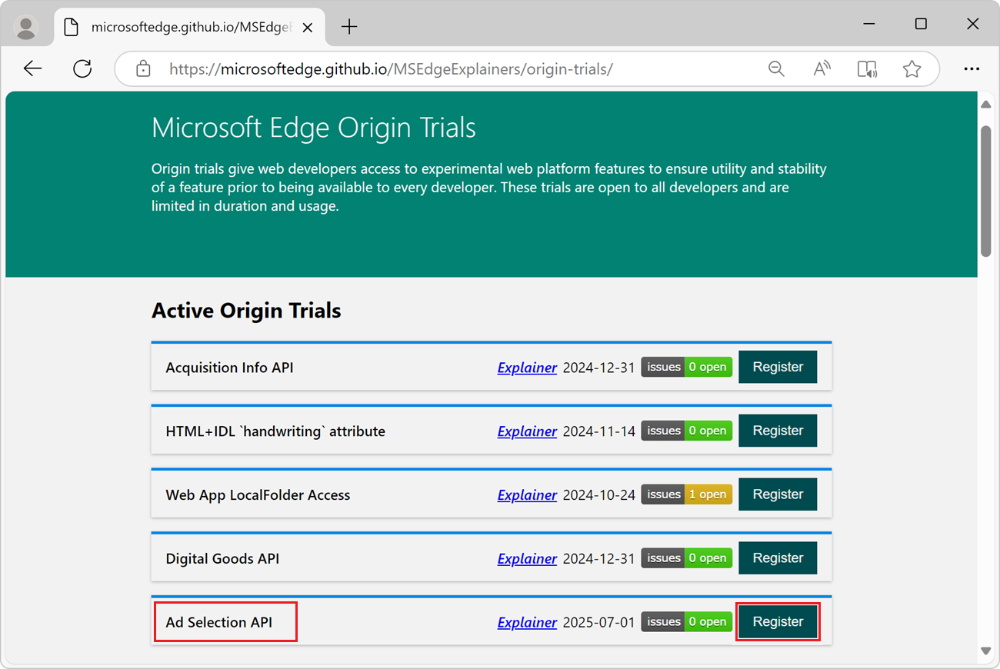
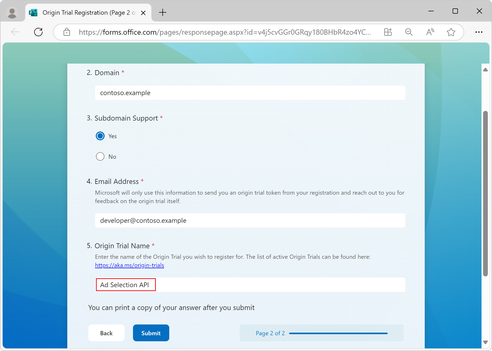

# Sign up for the Ad Selection API
<!-- https://go.microsoft.com/fwlink/?linkid=2289906 -->

The Ad Selection API provides user-relevant ads on your site without using third-party cookies.  See [Ad Selection Overview](https://github.com/WICG/privacy-preserving-ads/blob/main/Ad%20Selection%20Overview.md) in the "WICG / privacy-preserving-ads" repo.

The Ad Selection API can be used by:
* **Sellers** running a supply-side platform (SSP), who can use the API to provide higher-quality ads for their publishers.
* **Buyers** running a demand-side platform (DSP), who can use the API to improve the effectiveness of advertising campaigns.

To get started using the Ad Selection API and test out the end-to-end flow, sign up for the limited preview of the Ad Selection API.

As a seller operating a supply-side platform or a buyer operating a demand-side platform, use this guide to:
* Test the Ad Selection API on your site.
* Sign up for the Ad Selection API limited preview.
* Register for the Origin Trial.
* Complete API attestation.
* See the Ad Selection API and its usage, and deploy your services to Azure.
* Set up an evaluation environment with a supported cloud provider.
* Prepare all needed UDF functions and be able to work with Edge Web API.


<!-- ====================================================================== -->
## Attestation enrollment and alpha sign-up


<!-- ------------------------------ -->
#### When and where is the preview available?

Microsoft Edge versions starting with **130.0.2808.0** have support for the Ad Selection API in a limited, developer opt-in preview outside of the European Economic Area (EEA) and the United Kingdom (UK).


<!-- ------------------------------ -->
#### Flags for testing

To change the Ad Selection API platform features on your developer machine, use the **Ad Selection API** testing flags at `edge://flags#edge-ad-selection-api`:


The **Ad Selection API** flag enables the Ad Selection API and associated features such as:
* Attribution Reporting.<!--an api-->
* Fenced Frames.<!--not an api-->
* Shared Storage.<!--an api-->
* Private Aggregation.<!--an api-->


<!-- ------------------------------ -->
#### Sign-up and attestation requirements and process

Developers interested in alpha testing can join the [Origin Trial](https://microsoftedge.github.io/MSEdgeExplainers/origin-trials/).  This trial enables end-to-end testing of Ad Selection API features, covering both the API usage and the deployment of secure container images.

For each top-level domain that you intend to use with the Ad Selection API, fill in the **Origin Trial Registration**  form for that domain, and then submit the form.

To sign up for the **Ad Selection API** origin trial for a domain:

1. Open [Microsoft Edge Origin Trials](https://microsoftedge.github.io/MSEdgeExplainers/origin-trials/) in a new window or tab:

   

1. In the **Ad Selection API** section, click the **Register** button.  The **Origin Trial Registration** form opens:

   

1. Fill in the form.

   * In the **Domain** text box, enter a single top-level domain.  For example, a top-level domain is `contoso.example`, and optionally includes subdomains such as `subdomain.contoso.example`.

   * In the **Subdomain Support** section, select the **Yes** or **No** option button.

   * In the **Email Address** text box, provide a valid developer contact for the domain.

   * In the **Origin Trial Name** text box, enter **AdSelectionAPI** (with no spaces).  This is the ID of this origin trial.

1. Click the **Submit** button.

   An Origin Trial token is generated for the top-level domain and is sent to you.

1. Create a file that's named `ad-selection-attestations.json`, and host the file at the top-level domain, in the `/.well-known/` directory.  For example:

   `https://contoso.example/.well-known/ad-selection-attestations.json`

   The `ad-selection-attestations.json` file must be published within **30 days** of receiving the OT token.  Hosting this JSON file is required, in order to complete your attestation and allow your code to access the Ad Selection API, to test the Ad Selection API with supported Microsoft Edge clients.


<!-- ------------------------------ -->
#### Example JSON file

The attestations JSON file must be named `ad-selection-attestations.json`, and must conform to the following standards below.  The following is an example of an `ad-selection-attestations.json` file:

```json
{
    "ad_selection_api_attestations": [
        {
            "attestation_parser_version": "2",
            "attestation_version": "2",
            "privacy_policy": [
                "https://contoso.example/privacy/"
            ],
            "ownership_token": "<Your Unique Token Here>",
            "enrollment_site": "https://contoso.example/",
            "platform_attestations": [
                {
                    "platform": "edge",
                    "attestations": {
                        "ad_selection_api": {
                            "ServiceNotUsedForIdentifyingUserAcrossSites": true/false
                        },
                        "attribution_reporting_api": {
                            "ServiceNotUsedForIdentifyingUserAcrossSites": true/false
                        },
                        "shared_storage_api": {
                            "ServiceNotUsedForIdentifyingUserAcrossSites": true/false
                        },
                        "private_aggregation_api": {
                            "ServiceNotUsedForIdentifyingUserAcrossSites": true/false
                        }
                    }
                },
                {
                    "platform": "android",
                    "attestations": {}
                }
            ]
        }
    ]
}
```


<!-- ---------- -->
###### Important fields and values

* The `ad-selection-attestations.json` file must include the Origin Trial token that was generated and sent to you for this top-level domain.  `"ownership_token":` is the Origin Trial token that was generated when registering this domain for the **Ad Selection API** origin trial.

* In the `"platform_attestations":` section, `"platform":` must be `"edge"` or `"android"`.

* The file must include a list of APIs (features that are associated with the Ad Services API).  In the `"platform_attestations":` section, valid members of `"attestations":` are the following:
   * `"ad_selection_api":` - The main API, for private auction logic.
   * `"attribution_reporting_api":` - Attribution reporting.
   * `"shared_storage_api":` - Shared storage.
   * `"private_aggregation_api":` - Private aggregation.
   * Requirements:
      * Each `"..._api":` entry must have a single field, `"ServiceNotUsedForIdentifyingUserAcrossSites":`, with either a `true` or `false` value.  `true` means that this service is not used for identifying the user across sites.  `false` means that this service is used for identifying the user across sites.

To use the Ad Selection API, see [Provide privacy-preserving ads, by using the Ad Selection API](./privacy-preserving-ads.md).


<!-- ====================================================================== -->
## See also
<!-- all links in both articles -->

* [Provide privacy-preserving ads, by using the Ad Selection API](./privacy-preserving-ads.md)

Design and technical documents:
* [Ad Selection API Proposal](https://github.com/WICG/privacy-preserving-ads?tab=readme-ov-file#ad-selection-api-proposal)
* [Ad Selection Overview](https://github.com/WICG/privacy-preserving-ads/blob/main/Ad%20Selection%20Overview.md)
* [Ad Selection API details](https://github.com/WICG/privacy-preserving-ads/blob/main/API%20Details.md)

Images for deployment:
* Sellers
   * [SellerFrontEnd service](https://mcr.microsoft.com/product/ad-selection/azure/seller-frontend-service)
   * [Auction service](https://mcr.microsoft.com/product/ad-selection/azure/auction-service)
* Buyers
   * [BuyerFrontEnd service](https://mcr.microsoft.com/product/ad-selection/azure/buyer-frontend-service)
   * [Bidding service](https://mcr.microsoft.com/product/ad-selection/azure/bidding-service)
   * [K-Anonymity service](https://mcr.microsoft.com/product/ad-selection/azure/k-anonymity-service)

Origin trials:
* [Origin Trials](https://microsoftedge.github.io/MSEdgeExplainers/origin-trials/)

Trusted execution environment (TEE):
* [Confidential Computing: Hardware-Based Trusted Execution for Applications and Data](https://confidentialcomputing.io/wp-content/uploads/sites/85/2021/03/confidentialcomputing_outreach_whitepaper-8-5x11-1.pdf)

Azure:
* [Microsoft Azure](https://azure.microsoft.com)
* [Confidential ACI containers](/azure/container-instances/container-instances-confidential-overview)

Terraform:
* [Terraform deployment scripts and guide](https://go.microsoft.com/fwlink/?linkid=2290115)
