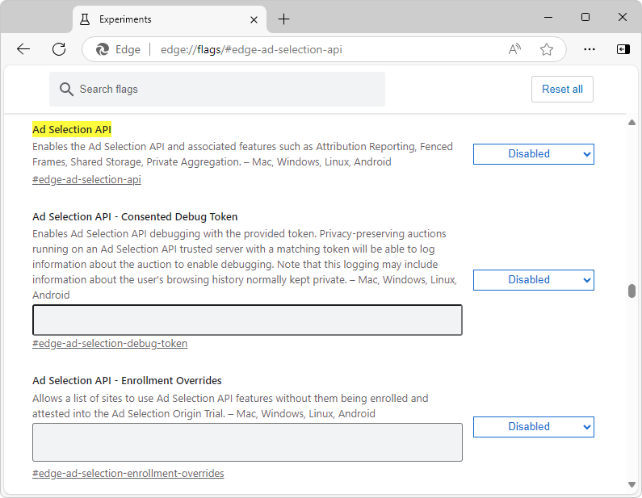
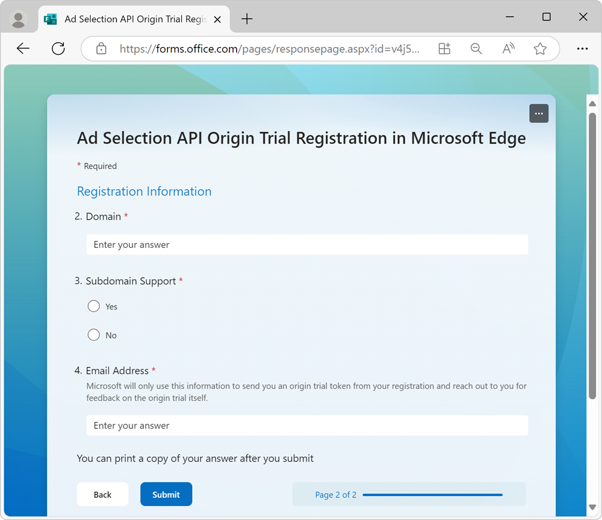

# Sign-up for the Ad Selection API
<!-- https://go.microsoft.com/fwlink/?linkid=2289906 -->

The Ad Selection API provides user-relevant ads on your site without using third-party cookies.  See [Ad Selection Overview](https://github.com/WICG/privacy-preserving-ads/blob/main/Ad Selection Overview.md) in the "WICG / privacy-preserving-ads" repo.

The Ad Selection API can be used by: **Sellers (SSPs)** – supply-side platforms, who can use the API to provide higher-quality ads for their publishers; and **Buyers (DSPs)** – demand-side platforms, who can use the API to improve the effectiveness of advertising campaigns.

To get started using the Ad Selection API and test out the end-to-end flow, sign up for the limited Preview of the Ad Selection API.

Sellers (SSP) and buyers (DSP) can use this guide to:
* Test the Ad Selection API on your site.
* Sign-up for the Ad Selection API limited preview.
* Register for the Origin Trial.
* Complete API attestation.
* See the Ad Selection API, its usage, and deploy to Azure.
* Set up an evaluation environment with a supported cloud provider.
* Prepare all needed UDF functions and be able to work with Edge Web API.


<!-- ====================================================================== -->
## Attestation enrollment and alpha sign-up


<!-- ------------------------------ -->
#### When and where is the preview available?

Microsoft Edge versions starting with **130.0.2808.0** will have the platform components of the Ad Selection API in a limited, developer opt-in preview outside of the European Economic Area (EEA) and the United Kingdom (UK).

Developers can individually change the Ad Selection API platform features, using the testing flag, `edge://flags#edge-ad-selection-api`:




<!-- ------------------------------ -->
#### Sign-up and attestation requirements and process

Developers interested in alpha testing can join the [Origin Trial](https://microsoftedge.github.io/MSEdgeExplainers/origin-trials/).  This trial enables end-to-end testing of Ad Selection API features, covering both the API usage and the deployment of secure container images.

To sign up for an Origin Trial token:

1. Go to Microsoft Edge [Origin Trials](https://microsoftedge.github.io/MSEdgeExplainers/origin-trials/) in a new window or tab.

1. In the **Ad Selection API** section, click the **Register** button:

   

1. Complete the form for each domain you intend to use with the Ad Selection API and make sure to provide a valid developer contact:

   

   * When you receive your OT token, this can be used on the provided domain(s) to enable Ad Selection APIs for testing with supported Microsoft Edge clients.

1. To complete attestation and allow for continued access to the Ad Selection API, you'll need to host a JSON file named `attestations.json` on each domain at a `/.well-known/` path.  For example: `https://contoso.example/.well-known/ad-selection-attestations.json`.

   This JSON file must conform to the following standards below, and must include the created OT token as well as a list of APIs.


<!-- ------------------------------ -->
#### Example attestations.json file

Below is an example of an `attestations.json` JSON file, containing an OT token, which must be published within **30 days** of receiving the initial token:

```json
{
    "ad_selection_api_attestations": [
        {
            "attestation_parser_version": "2",
            "attestation_version": "2",
            "privacy_policy": [
                "https://contoso.example/privacy/"
            ],
            "ownership_token": "<Your Unique Token Here>",
            "enrollment_site": "https://contoso.example/",
            "platform_attestations": [
                {
                    "platform": "edge",
                    "attestations": {
                        "attribution_reporting_api": {
                            "ServiceNotUsedForIdentifyingUserAcrossSites": true/false
                        },
                        "shared_storage_api": {
                            "ServiceNotUsedForIdentifyingUserAcrossSites": true/false
                        },
                        "private_aggregation_api": {
                            "ServiceNotUsedForIdentifyingUserAcrossSites": true/false
                        },
                        "ad_selection_api": {
                            "ServiceNotUsedForIdentifyingUserAcrossSites": true/false
                        }
                    }
                },
                {
                    "platform": "android",
                    "attestations": {}
                }
            ]
        }
    ]
}
```


<!-- ---------- -->
###### Important fields and values

* `"platform":` must be `"edge"` or `"android"`.

* `"attestations":` must be `"attribution_reporting_api"`, `"shared_storage_api"`, `"private_aggregation_api"`, and/or `"ad_selection_api"`.

   Note: Each `"attestations":` entry must have a single field, `"ServiceNotUsedForIdentifyingUserAcrossSites":`, with either a `true` or `false` value, indicating your reality.

* `"ownership_token":` is the OT token generated for your individual domain registration.


<!-- ====================================================================== -->
## Deploy the Ad Selection API services

The Ad Selection API uses a [trusted execution environment (TEE)](https://confidentialcomputing.io/wp-content/uploads/sites/85/2021/03/confidentialcomputing_outreach_whitepaper-8-5x11-1.pdf) to provide a level of assurance for data integrity, data confidentiality, and code integrity.  Services provided by the Ad Selection API must run in a TEE to secure the data used by these services.

Ad Selection Services running in a TEE should be deployed on a cloud platform that supports the necessary security features.  Initially, services can be deployed in Azure using [Confidential ACI containers](/azure/container-instances/container-instances-confidential-overview).

The Ad Selection API provides different services that need to be deployed by buyers or sellers.  Microsoft provides an image for each service, which can be deployed on a cloud provider.


<!-- ------------------------------ -->
#### Seller's Service

* **SellerFrontEnd Service:** The front-end service provides a gRPC endpoint `/SelectAd`, which receives requests from the seller's ad service to initiate the Protected Audience auction flow.

* **Auction Service:** This service provides a gRPC endpoint `/ScoreAds`, which receives requests from the **SellerFrontEnd** service with bids participating in the auction.  The service responds with a score value that the **SellerFrontEnd** uses to choose the winner.

* **Seller's Key/Value Service:** This service receives requests from the **SellerFrontEnd** with lookup keys from buyers' bids (such as ad_render_urls) and returns real-time scoring signals required for the auction.  The Key/Value service will be run in Bring Your Own Service (BYOS) mode, so the seller does not need to deploy it in a TEE, and can instead use the image provided by Microsoft.


<!-- ------------------------------ -->
#### Buyer's Service

* **BuyerFrontEnd Service:** The front-end service provides a gRPC endpoint `/GetBids`, which receives requests from **SellerFrontEnd** to initiate the bidding flow.

* **Bidding Service:** This service provides an endpoint `/GenerateBids`, which receives requests from the **BuyerFrontEnd** service to handle the bidding and generate a bid.  The service generates a bid, chooses the winner, and selects the banner to be rendered.

* **Buyer's Key/Value Service:** A buyer's Key/Value service receives requests from the **BuyerFrontEnd** service and returns real-time buyer data required for bidding, corresponding to lookup keys from Interest Groups.  This request happens once per workflow.  The Key/Value service will be run in BYOS mode.

* **Bidding Selection & Key/Value Service:** This service receives requests from the Bidding Service to select and return additional ad banners (candidates) that can participate in bidding.  The service can also return additional signals needed for bidding.  The Bidding Service may send multiple requests to the Selection & Key/Value service or may choose not to send any, as the service is optional.  The Selection & Key/Value service must be deployed in a TEE.

* **K-Anon Service:** This service collects k-anonymity counters and checks that the winning ad banner passes the k-anonymity check.

Buyers and sellers need to provide their own custom code as User-Defined Functions (UDFs) that will run in private containers within the deployed services.  These User-Defined Functions can execute custom business logic.


<!-- ------------------------------ -->
#### Seller's User Define Function

* `scoreAd()` for **Auction Service:** This function should generate a score for each buyer's bid or reject it.  The score will be used in the **SellerFrontEnd** to choose a winner from among all buyers.

* `reportResult()` for **Event-Level Reporting:** This function will run in the **SellerFrontEnd** after the final winner has been chosen.  The goal of `reportResult()` is to notify the seller about the winning bidder and provide the bid value.


<!-- ------------------------------ -->
#### Buyer's User Define Function

* `generateBids()` for **Bidding Service:**  This function will generate a bid and choose the banner that will be shown.

* `reportWin()` for **Event-Level Reporting:**  This function will run in the **SellerFrontEnd** if the buyer's bid wins the auction.  The goal of `reportWin()` is to notify the buyer that they have won the auction and generate notification URLs that will be triggered later, such as during banner rendering or other client events.

* `getValues()` for **Bidding's Selection & Key/Value Service:**  This function will run in the Bidding Selection & Key/Value service if the buyer uses this service.  It allows for custom code execution for data lookup and selection.


<!-- ------------------------------ -->
#### Deployment guide

To deploy the Ad Selection API service to Azure:

1. Create an Azure account and create a subscription at [Microsoft Azure](https://azure.microsoft.com).

1. Choose the **Confidential ACO containers** option.

1. Download the Terraform [deployment scripts and guide](https://go.microsoft.com/fwlink/?linkid=2290115).  **Note:** Make sure the hash of the image you downloaded matches the hash in the script you download.

1. The Terraform scripts already include links to public images provided by Microsoft.  Choose the required services and deploy them by following the steps in the included `readme.md`.

   1. Set any specific flags for your environment, including auction worklet locations.

   1. Configure all prerequisites and prepare all tools for deployment.

   1. Create Azure Resources and run terraform script that finish deployment.

1. Develop worklets including `user-defined-function` (UDF) and start Ad Selection API services.


<!-- ====================================================================== -->
## Use the Ad Selection API on your website

To start using the Ad Selection API, sellers and buyers need to use the API, by modifying the JavaScript code of their websites running in Microsoft Edge.

* Sellers: To run private actions, fetch interest groups, and do reporting, update your supply and publisher code.

* Buyers: To create interest groups and store them in the browser, update the code on your advertiser partners' websites.  You can use the delegation mechanism to restrict and allow Interest Group creation on third-party domains.

To learn more about which API methods are available and to review example code, see the [Ad Selection API documentation](https://github.com/WICG/privacy-preserving-ads/blob/main/API%20Details.md).


<!-- ====================================================================== -->
## See also
<!-- todo: all links in article -->

The end-to-end design and technical documents can be found in the public repo: [Ad Selection API Proposal](https://github.com/WICG/privacy-preserving-ads?tab=readme-ov-file#ad-selection-api-proposal).

Public images that must be used for deployment; only official images from Microsoft will be able to run private auction:
* Buyer
   * [buyer-frontend-service](https://mcr.microsoft.com/product/ad-selection/azure/buyer-frontend-service)
   * [bidding-service](https://mcr.microsoft.com/product/ad-selection/azure/bidding-service)
   * [k-anonymity-service](https://mcr.microsoft.com/product/ad-selection/azure/k-anonymity-service)
* Seller
   * [seller-frontend-service](https://mcr.microsoft.com/product/ad-selection/azure/seller-frontend-service)
   * [auction-service](https://mcr.microsoft.com/product/ad-selection/azure/auction-service)
