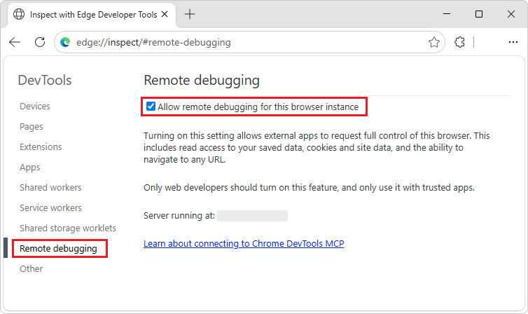

# Let agents inspect your site and WebView2 app with Chrome DevTools MCP

Chrome DevTools for agents (`chrome-devtools-mcp`) lets your coding agent (such as Copilot, Antigravity, Claude, or Cursor) control and inspect a live Chromium-based browser, including Microsoft Edge and WebView2.

**Detailed contents:**
* [Introduction](#introduction)
* [Prerequisites](#prerequisites)
* [Launch Edge](#launch-edge)
   * [Additional flags for launching Edge](#additional-flags-for-launching-edge)
   * [Executable path for each Edge channel](#executable-path-for-each-edge-channel)
* [Auto-connect to a running Edge instance](#auto-connect-to-a-running-edge-instance)
   * [Step 1: Enable remote debugging in Edge](#step-1-enable-remote-debugging-in-edge)
   * [Step 2: Configure the MCP server](#step-2-configure-the-mcp-server)
   * [Step 3: Test your setup](#step-3-test-your-setup)
   * [User data directory for each Edge channel](#user-data-directory-for-each-edge-channel)
* [Auto-connect to a WebView2 instance](#auto-connect-to-a-webview2-instance)
   * [Step 1: Enable remote debugging for WebView2](#step-1-enable-remote-debugging-for-webview2)
      * [By using WebView2Utilities](#by-using-webview2utilities)
      * [By using the Windows Registry](#by-using-the-windows-registry)
   * [Step 2: Find the WebView2 user data directory](#step-2-find-the-webview2-user-data-directory)
   * [Step 3: Configure the MCP server](#step-3-configure-the-mcp-server)
   * [Step 4: Test your setup](#step-4-test-your-setup)
* [How it works](#how-it-works)
* [Configuring other MCP clients](#configuring-other-mcp-clients)
   * [Copilot CLI](#copilot-cli)
   * [Other MCP clients, such as Claude Code, Cursor, or Gemini CLI](#other-mcp-clients-such-as-claude-code-cursor-or-gemini-cli)
* [Troubleshooting](#troubleshooting)
   * ["Could not connect to Chrome" error with auto-connect](#could-not-connect-to-chrome-error-with-auto-connect)
   * [Edge not found at `executablePath`](#edge-not-found-at-executablepath)
   * [WebView2 won't connect](#webview2-wont-connect)
* [See also](#see-also)


<!-- ====================================================================== -->
## Introduction

<!-- copied to top of article: -->
Chrome DevTools for agents (`chrome-devtools-mcp`) lets your coding agent (such as Copilot, Antigravity, Claude, or Cursor) control and inspect a live Chromium-based browser, including Microsoft Edge and WebView2.
<!-- / end of copied to top of article -->

Chrome DevTools for agents acts as a Model-Context-Protocol (MCP) server, giving your AI coding assistant access to the full power of Microsoft Edge DevTools for reliable automation, in-depth debugging, and performance analysis. 

The Chrome DevTools MCP server supports connecting to any Chromium-based browser, including Microsoft Edge and WebView2.  Because the server is built for the Google Chrome browser, you need to provide extra configuration to point the server at Microsoft Edge or a WebView2 instance.

This guide covers three scenarios:

* [Launch Edge](#launch-edge) — the MCP server starts Microsoft Edge for you.
* [Auto-connect to a running Edge instance](#auto-connect-to-a-running-edge-instance) — you start Edge yourself and the MCP server connects to it.
* [Auto-connect to a WebView2 instance](#auto-connect-to-a-webview2-instance) — the MCP server connects to a running WebView2 host app.

See also:
* [Chrome DevTools for agents](https://github.com/ChromeDevTools/chrome-devtools-mcp/blob/main/README.md) - the "ChromeDevTools / chrome-devtools-mcp" repo.


<!-- ====================================================================== -->
## Prerequisites

* [Node.js](https://nodejs.org), the latest Long-Term Support (LTS) release.
* [npm](https://www.npmjs.com).
* Microsoft Edge installed (any channel: Stable, Beta, Dev, or Canary).
* A coding agent with Model-Context-Protocol (MCP) support, such as Microsoft Visual Studio Code (with GitHub Copilot), Copilot CLI, Claude Code, or Cursor.

The examples in this guide use the VS Code `mcp.json` format.  If you're using a different MCP client, see [Configuring other MCP clients](#configuring-other-mcp-clients), below.


<!-- ====================================================================== -->
## Launch Edge

Use this configuration to let your coding agent launch Microsoft Edge for you.
   
With this configuration, the Model-Context-Protocol (MCP) server, which your agent connects to, launches Edge, by using the `--executablePath` flag pointing to the Edge binary.

Copy and paste the configuration snippet for your platform into your VS Code `mcp.json`.  These examples use Edge Stable.

##### [Windows](#tab/windows/)

```json
{
  "servers": {
    "chrome-devtools": {
      "type": "stdio",
      "command": "npx",
      "args": [
        "-y",
        "chrome-devtools-mcp@latest",
        "--executablePath=%ProgramFiles(x86)%\\Microsoft\\Edge\\Application\\msedge.exe"
      ]
    }
  }
}
```

##### [macOS](#tab/macos/)

```json
{
  "servers": {
    "chrome-devtools": {
      "type": "stdio",
      "command": "npx",
      "args": [
        "-y",
        "chrome-devtools-mcp@latest",
        "--executablePath=/Applications/Microsoft Edge.app/Contents/MacOS/Microsoft Edge"
      ]
    }
  }
}
```

##### [Linux](#tab/linux/)

```json
{
  "servers": {
    "chrome-devtools": {
      "type": "stdio",
      "command": "npx",
      "args": [
        "-y",
        "chrome-devtools-mcp@latest",
        "--executablePath=/usr/bin/microsoft-edge"
      ]
    }
  }
}
```

---


<!-- ------------------------------ -->
#### Additional flags for launching Edge

You can combine `--executablePath` with the following flags:

* `--headless` — run without a visible browser window
* `--isolated` — use a temporary profile directory (cleaned up on close)
* `--viewport=1280x720` — set initial viewport size

Example with headless and isolated (Windows):

```json
"args": [
  "-y",
  "chrome-devtools-mcp@latest",
  "--executablePath=%ProgramFiles(x86)%\\Microsoft\\Edge\\Application\\msedge.exe",
  "--headless",
  "--isolated"
]
```


<!-- ------------------------------ -->
#### Executable path for each Edge channel

Use the appropriate `--executablePath` value for your channel of Edge.

These are default install locations.  Paths may vary based on user configuration, version, or group policies.

##### [Windows](#tab/windows/)

| Channel | Default Path |
|---|---|
| Stable | `%ProgramFiles(x86)%\Microsoft\Edge\Application\msedge.exe` |
| Beta | `%ProgramFiles(x86)%\Microsoft\Edge Beta\Application\msedge.exe` |
| Dev | `%ProgramFiles(x86)%\Microsoft\Edge Dev\Application\msedge.exe` |
| Canary | `%LOCALAPPDATA%\Microsoft\Edge SxS\Application\msedge.exe` |  

##### [macOS](#tab/macos/)
   
| Channel | Default Path |
|---|---|
| Stable | `/Applications/Microsoft Edge.app/Contents/MacOS/Microsoft Edge` |
| Beta | `/Applications/Microsoft Edge Beta.app/Contents/MacOS/Microsoft Edge` |
| Dev | `/Applications/Microsoft Edge Dev.app/Contents/MacOS/Microsoft Edge` |
| Canary | `/Applications/Microsoft Edge Canary.app/Contents/MacOS/Microsoft Edge` |

##### [Linux](#tab/linux/)

| Channel | Default Path |
|---|---|
| Stable | `/usr/bin/microsoft-edge` |
| Beta | `/usr/bin/microsoft-edge-beta` |
| Dev | `/usr/bin/microsoft-edge-dev` |
| Canary | n/a; there isn't a Canary channel for Linux. |

---


<!-- ====================================================================== -->
## Auto-connect to a running Edge instance

Use the configuration below to automatically connect to an instance of Microsoft Edge that's already running.

Auto-connecting to an already running Edge instance is useful:
* When you want to maintain browser state between manual testing and agent-driven testing.
* When you need to be signed into a website.
   * For example, when you need to be signed into a website that has a complex authentication flow that's hard to accomplish with traditional web automation.
* When you want to inspect an existing session.

> [!WARNING]
> When using auto-connect, your agent inherits your active session, including logged-in accounts, cookies, and other data that's surfaced through JavaScript APIs.  This may expose Personally Identifiable Information (PII) to the agent.  Only use this mode with agents that you trust, and be careful with your prompts.


<!-- ------------------------------ -->
#### Step 1: Enable remote debugging in Edge

There are have two options:

**Option A:** Start Microsoft Edge with the remote debugging flag:

`msedge.exe --remote-debugging-port=9222`

**Option B:** In the **Inspect with Edge Developer Tools** special page, enable remote debugging, as follows:

1. In a running instance of Microsoft Edge, go to `edge://inspect`.

   The **Inspect with Edge Developer Tools** page opens, initially showing the **Devices** page.

1. On the left, click **Remote debugging**.

   The **Remote debugging** page opens.

1. Select the **Allow remote debugging for this browser instance** checkbox:

   


<!-- ------------------------------ -->
#### Step 2: Configure the MCP server

To configure the Model-Context-Protocol (MCP) server, use `--autoConnect` combined with `--user-data-dir` pointing to your Microsoft Edge user data directory.  These examples use the Edge Stable channel.

##### [Windows](#tab/windows/)

```json
{
  "servers": {
    "chrome-devtools": {
      "type": "stdio",
      "command": "npx",
      "args": [
        "-y",
        "chrome-devtools-mcp@latest",
        "--autoConnect",
        "--user-data-dir=%LocalAppData%\\Microsoft\\Edge\\User Data"
      ]
    }
  }
}
```

##### [macOS](#tab/macos/)

```json
{
  "servers": {
    "chrome-devtools": {
      "type": "stdio",
      "command": "npx",
      "args": [
        "-y",
        "chrome-devtools-mcp@latest",
        "--autoConnect",
        "--user-data-dir=~/Library/Application Support/Microsoft Edge"
      ]
    }
  }
}
```

##### [Linux](#tab/linux/)

```json
{
  "servers": {
    "chrome-devtools": {
      "type": "stdio",
      "command": "npx",
      "args": [
        "-y",
        "chrome-devtools-mcp@latest",
        "--autoConnect",
        "--user-data-dir=~/.config/microsoft-edge"
      ]
    }
  }
}
```

---


<!-- ------------------------------ -->
#### Step 3: Test your setup

Make sure Microsoft Edge is running, then enter the following prompt in your Model-Context-Protocol (MCP) client:

`Navigate to https://contoso.com and take a screenshot`

The MCP server should connect to your running Edge instance and execute the command.


<!-- ------------------------------ -->
#### User data directory for each Edge channel

Use the appropriate `--user-data-dir` value for your channel.

These are default locations.  Paths may vary based on user configuration, version, or group policies.

##### [Windows](#tab/windows/)

| Channel | Default Path |
|---|---|
| Stable | `%LOCALAPPDATA%\Microsoft\Edge\User Data` |
| Beta | `%LOCALAPPDATA%\Microsoft\Edge Beta\User Data` |
| Dev | `%LOCALAPPDATA%\Microsoft\Edge Dev\User Data` |
| Canary | `%LOCALAPPDATA%\Microsoft\Edge SxS\User Data` |

##### [macOS](#tab/macos/)

| Channel | Default Path |
|---|---|
| Stable | `~/Library/Application Support/Microsoft Edge` |
| Beta | `~/Library/Application Support/Microsoft Edge Beta` |
| Dev | `~/Library/Application Support/Microsoft Edge Dev` |
| Canary | `~/Library/Application Support/Microsoft Edge Canary` |

##### [Linux](#tab/linux/)

| Channel | Default Path |
|---|---|
| Stable | `~/.config/microsoft-edge` |
| Beta | `~/.config/microsoft-edge-beta` |
| Dev | `~/.config/microsoft-edge-dev` |
| Canary | n/a; there isn't a Canary channel for Linux. |


---


<!-- ====================================================================== -->
## Auto-connect to a WebView2 instance

WebView2 doesn't have a "launch" scenario; instead, the host app creates the WebView2 instance.

The MCP server connects to the WebView2 instance via auto-connect, similar to [Auto-connect to a running Edge instance](#auto-connect-to-a-running-edge-instance), above.  


<!-- ------------------------------ -->
#### Step 1: Enable remote debugging for WebView2

You need to configure the WebView2 runtime to start with `--remote-debugging-port=0`.  There are two ways to do this: WebView2Utilities, or Windows Registry.


<!-- ---------- -->
###### By using WebView2Utilities

Many apps will block the end user from opening DevTools.  As a developer, you can use WebView2Utilities to auto-open DevTools when a WebView2 is created, as follows.

1. [Install and run WebView2Utilities](https://github.com/david-risney/WebView2Utilities#install--run).

1. In WebView2Utilities, select the **Overrides** tab.

1. Click the **Add New** button in the lower left.

1. Select the newly added entry in the list.

1. Change the Host app exe textbox to be the name of the executable file of your host app, such as `OUTLOOK.EXE`.

1. In the **Browser arguments** section, in the **Arguments** textbox, enter: `--remote-debugging-port=0`<!-- orig step at https://github.com/david-risney/WebView2Utilities/wiki/How-to:-Auto-open-DevTools has instead: In the **Browser arguments** section, select the **Auto open DevTools** checkbox. -->

1. If your host app is running, close your host app.

1. Restart your host app.

   When the host app creates a WebView2, it now automatically opens DevTools.

See also:
* [How to: Auto open DevTools](https://github.com/david-risney/WebView2Utilities/wiki/How-to:-Auto-open-DevTools)


<!-- ---------- -->
###### By using the Windows Registry

In this approach, you create a registry value to set `AdditionalBrowserArguments`.  Replace `appname.exe` with the name of your WebView2 host executable:

```
[HKEY_CURRENT_USER\Software\Policies\Microsoft\Edge\WebView2\AdditionalBrowserArguments]
"appname.exe"="--remote-debugging-port=0"
```

For information about `additionalBrowserArguments` and `WEBVIEW2_ADDITIONAL_BROWSER_ARGUMENTS`, see [Globals](/microsoft-edge/webview2/reference/win32/webwebview2-idl) in _WebView2 Win32 API Reference_.


<!-- ------------------------------ -->
#### Step 2: Find the WebView2 user data directory

You need to discover the user data directory of the host app.

The path for the user data directory ends with `\EBWebView`.  The `\EBWebView` suffix is automatically added by the WebView2 Runtime.  If you're copying the user data path from source code, you might need to append `\EBWebView`.

You can find the path for the user data directory by using WebView2Utilities: in the **Host Apps** tab, select your running host app, and examine the **User data folder** row.


<!-- ------------------------------ -->
#### Step 3: Configure the MCP server

To configure the Model-Context-Protocol (MCP) server, use `--autoConnect` combined with `--user-data-dir` pointing to the WebView2 user data directory:

```json
{
  "servers": {
    "chrome-devtools": {
      "type": "stdio",
      "command": "npx",
      "args": [
        "-y",
        "chrome-devtools-mcp@latest",
        "--autoConnect",
        "--user-data-dir=%LocalAppData%\\Packages\\<APP_PACKAGE>\\LocalState\\EBWebView"
      ]
    }
  }
}
```

Replace `<APP_PACKAGE>` with the package name of your host app.


<!-- ------------------------------ -->
#### Step 4: Test your setup

Launch your WebView2 host app, then use your MCP client to interact with your WebView2 host app.

For example, prompt your AI coding agent: `Take a snapshot of the current page`


<!-- ====================================================================== -->
## How it works

Under the hood, the Chrome DevTools MCP server uses [Puppeteer](https://github.com/puppeteer/puppeteer) to control the browser.  When you provide `--executablePath`, Puppeteer launches that binary directly, instead of searching for the browser.

When you provide `--autoConnect` with `--user-data-dir`, the server reads the `DevToolsActivePort` file from that directory to discover the WebSocket endpoint of the running browser and connects to it.

Because Microsoft Edge and WebView2 are based on the Chromium browser engine, the DevTools Protocol is compatible with Microsoft Edge and WebView2, and the MCP tools work as expected.


<!-- ====================================================================== -->
## Configuring other MCP clients

The examples above use the Visual Studio Code `mcp.json` format.  Here's how to adapt the above examples for other Model-Context-Protocol (MCP) clients:


<!-- ------------------------------ -->
#### Copilot CLI

Copilot CLI stores its config in `~/.copilot/mcp-config.json`.  The format uses `mcpServers` (instead of `servers`) and `"type": "local"` (instead of `"type": "stdio"`):

```json
{
  "mcpServers": {
    "chrome-devtools": {
      "type": "local",
      "command": "npx",
      "args": [
        "-y",
        "chrome-devtools-mcp@latest",
        "--executablePath=%ProgramFiles(x86)%\\Microsoft\\Edge\\Application\\msedge.exe"
      ]
    }
  }
}
```

You can also add an MCP server interactively by running `copilot` and then `/mcp add`.


<!-- ------------------------------ -->
#### Other MCP clients, such as Claude Code, Cursor, or Gemini CLI

Most Model-Context-Protocol (MCP) clients use the generic `mcpServers` format without a `type` field:

```json
{
  "mcpServers": {
    "chrome-devtools": {
      "command": "npx",
      "args": [
        "-y",
        "chrome-devtools-mcp@latest",
        "--executablePath=%ProgramFiles(x86)%\\Microsoft\\Edge\\Application\\msedge.exe"
      ]
    }
  }
}
```

The `args` array is the same across all clients; only the wrapper format differs.  See your MCP client's documentation for the exact config file location and format.


<!-- ====================================================================== -->
## Troubleshooting


<!-- ------------------------------ -->
#### "Could not connect to Chrome"<!-- todo: to Microsoft Edge? --> error with auto-connect

If you are using auto-connect and get an error such as "Could not connect to Chrome"<!-- todo: to Microsoft Edge? -->:

* Make sure Microsoft Edge is running, and remote debugging is enabled.

* Make sure the `--user-data-dir` path is correct for your channel of Microsoft Edge.

* Make sure the `DevToolsActivePort` file exists in the user data directory.  The `DevToolsActivePort` file is created when remote debugging is active.


<!-- ------------------------------ -->
#### Edge not found at `executablePath`

* Make sure that the `executablePath` for the channel of Microsoft Edge exists on disk.  For example, Edge Canary on Windows installs per-user under `%LOCALAPPDATA%`, not under `\Program Files\`.

* On Windows, use double backslashes (`\\`) in JSON strings.


<!-- ------------------------------ -->
#### WebView2 won't connect

* Make sure the registry key matches your host app's executable name exactly.

* After adding the `AdditionalBrowserArguments` registry key, restart the host app.  The app name `.exe` argument is only read at WebView2 creation time.

* Make sure the `--user-data-dir` path ends with `\EBWebView`.


<!-- ====================================================================== -->
## See also

* [Remotely debug Android devices](../devtools/remote-debugging/index.md)<!-- upstream: https://developer.chrome.com/docs/devtools/remote-debugging/ -->

GitHub:
* [Chrome DevTools for agents](https://github.com/ChromeDevTools/chrome-devtools-mcp) - the README of the "ChromeDevTools / chrome-devtools-mcp" repo.
* [WebView2Utilities](https://github.com/david-risney/WebView2Utilities) — tool for managing WebView2 debugging; the "david-risney / WebView2Utilities" repo.
   * [How to: Auto open DevTools](https://github.com/david-risney/WebView2Utilities/wiki/How-to:-Auto-open-DevTools)

Blogs:
* [Edge and WebView2 in Chrome DevTools MCP](https://deletethis.net/dave/2026-03/edge-and-webview2-in-chrome-devtools-mcp/)
