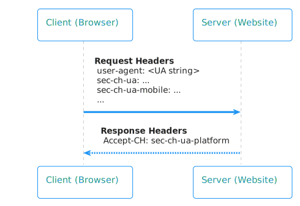
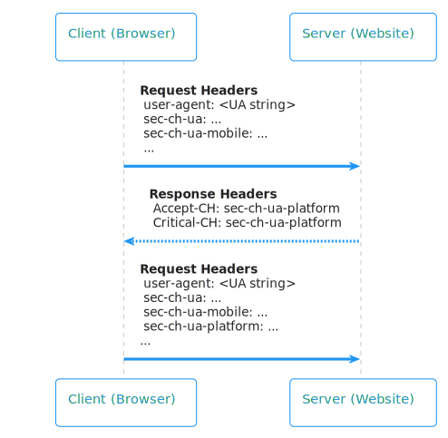

# Detect Windows 11 and CPU architecture using User-Agent Client Hints

<!--
Restrict the lexicon to these forms:
User-Agent string
user agent string
User-Agent Client Hints
user agent information
-->

Websites can differentiate between users on Windows 11 and Windows 10, and detect the CPU architecture of the device, by using User-Agent Client Hints (UA-CH).  The User-Agent Client Hints format is used by browsers to provide user agent information to websites.

Websites can also use the user agent information that's sent from the browser to detect information such as:
*  The browser brand.
*  The browser version number.
*  The device platform on which the browser is running.

There are two approaches for sites to access user agent information:

*  User-Agent strings (legacy).
*  User-Agent Client Hints (recommended).

For details about these two approaches, see [Detecting Microsoft Edge from your website](user-agent-guidance.md).

In Microsoft Edge (and also in Google Chrome), sites can differentiate between users on Windows 11 and Windows 10, and can detect the CPU architecture of the device, via User-Agent Client Hints (UA-CH).  This information can be found in the following UA-CH request headers:

| Header field | Values that indicate Windows 10 | Values that indicate Windows 11 |
| --- | --- | --- |
| `Sec-CH-UA-Platform` | `Windows` | `Windows` |
| `Sec-CH-UA-Platform-Version` | values between `1.0.0` and `10.0.0` | `13.0.0` and above |

User-Agent strings won't be updated to differentiate between Windows 11 and Windows 10, or to differentiate between CPU architectures.  We don't recommend using User-Agent strings to retrieve user agent data.  Browsers that don't support User-Agent Client Hints won't be able to differentiate between Windows 11 and Windows 10, or between CPU architectures.


<!-- ====================================================================== -->
## Browsers that support User-Agent Client Hints

The following table shows which browsers support differentiating between Windows 11 and Windows 10, and between different CPU architectures.

| Browser | Supports differentiation via User-Agent Client Hints? |
| --- | --- |
| Microsoft Edge | Yes |
| Chrome | Yes |
| Opera | Yes |
| Firefox | No |
| Internet Explorer 11 | No |


<!-- ====================================================================== -->
## Sample code for detecting Windows 11

The following code detects Windows 11:

```javascript
navigator.userAgentData.getHighEntropyValues(["platformVersion"])
 .then(ua => {
   if (navigator.userAgentData.platform === "Windows") {
     const majorPlatformVersion = parseInt(ua.platformVersion.split('.')[0]);
     if (majorPlatformVersion >= 13) {
       console.log("Windows 11 or later");
      }
      else if (majorPlatformVersion > 0) {
        console.log("Windows 10");
      }
      else {
        console.log("Before Windows 10");
      }
   }
   else {
     console.log("Not running on Windows");
   }
 });

```

<!-- ====================================================================== -->
## Sample code for detecting ARM or x86

Use detection of CPU architecture to have your website automatically download the version of your app that's built specifically for the user's CPU.

CPU detection is particularly helpful for ARM-based devices, so that a customer using an ARM device automatically downloads the native ARM version of an application.  This prevents the user from inadvertently installing an app that's built for x86, and then experiencing reduced performance due to emulation.

The following code detects CPU architecture:

```javascript
navigator.userAgentData.getHighEntropyValues(["architecture", "bitness"])
 .then(ua => {
   if (navigator.userAgentData.platform === "Windows") {
     if (ua.architecture === 'x86') {
       if (ua.bitness === '64') {
         console.log("x86_64");
       }
       else if (ua.bitness === '32') {
         console.log("x86");
       }
     }
     else if (ua.architecture === 'arm') {
       if (ua.bitness === '64') {
         console.log("ARM64");
       }
       else if (ua.bitness === '32') {
         console.log("ARM32");
       }
     }
   }
   else {
     console.log("Not running on Windows");
   }
 });
```


<!-- ====================================================================== -->
## Optimizing detection performance with `Critical-CH`

Currently, website servers must send the `Accept-CH` response header to the browser client to request higher entropy fields not sent in the `Sec-CH-UA` header by default. The following diagram shows the browser sending request headers to the server including `user agent: <UA string>` and receiving response headers including `Accept-CH: sec-ch-ua-platform`.

<!-- To edit SVG go to link: http://www.plantuml.com/plantuml/uml/LOrDIWD144RtVOeogpZGSu11Gc8sMIlYnasbyvaqz4zRLQtNTsH0CgiFwZtgxTLOhEVa7ko63CfiaCY-TaknmBKPnn0R5wFDCKNCktsM-gEGnmsnKbWxhv1l26tVSTPeM1nrWVoETA9XUC5NXngTm1U83WDz5EeAyNn5iOcUtWwa9h5STtz84Nou-SuJZUEuklXSpp7X7ypZrC-Xi8IqrQ9ObmuXe9a_dgQxFosnVLR9RezowJdz0W00 -->


During this initial request, the client will record the `Accept-CH` preferences and on subsequent requests include `sec-ch-ua-platform` by default. 

To further optimize this flow, the new `Critical-CH` header can be used in addition to the `Accept-CH` header to reissue the request header immediately, without the need for a page reload. The following diagram shows the browser sending request headers to the server including `user agent: <UA string>` and receiving response headers including `Accept-CH: sec-ch-ua-platform` and `Critical-CH: sec-ch-ua-platform`. The browser then sends request headers to the server immediately.

<!-- To edit SVG go to link: http://www.plantuml.com/plantuml/uml/lOz1ImCn48Nl-ol6dkf2-WCMAQrxwLaHBrwcwRCD9DauCz6_RvQYk8XNJmFpFjx7swcnM4snkx4B4YYnGGAxgLeC6LrfSV2XS3PQZJ6WtVMzJ1yAkLqHA_abymXvXz3w6KSDXYkZdIUt9Hsexn_mLg561_09edrFBvcgGXoVM_j0TqzxKfEGpzivKdZdBwxoG9lDPl5nQJg6YE-WdKvT4_chICkK5KlJtdiKS-DX-D5J8jlh96a6HWbj3SU_aF-Pybly5SqZTyYdck8d -->


You can use the `Critical-CH` header to receive desired high entropy headers with optimized performance.

Remember that `Critical-CH` and `Accept-CH` preferences persist until session cookies are cleared, or until a user clears site data or cookies for a given origin. For more information about `Critical-CH`, refer to [Client Hint Reliability](https://github.com/WICG/client-hints-infrastructure/blob/main/reliability.md).


<!-- ====================================================================== -->
## Detecting specific Windows versions
The definition of the platform versions returned by the `navigator.userAgentData.getHighEntropyValues` API for the `"platformVersion"` hint (and via the `Sec-CH-UA-Platform-Version` header) is specified in the [User-Agent Client Hints Draft Community Group Report](https://wicg.github.io/ua-client-hints/#sec-ch-ua-platform-version). On Windows 10 and higher, the value is based on the [**Windows.Foundation.UniversalApiContract** version](/windows/uwp/debug-test-perf/version-adaptive-apps#api-contracts).

To detect specific versions of Windows, use the following values for `platformVersion` in User-Agent Client Hints:

| Version | First version component of the `platformVersion` |
| --- | --- |
| Win7/8/8.1 | 0 |
| Win10 1507 | 1 |
| Win10 1511 | 2 |
| Win10 1607 | 3 |
| Win10 1703 | 4 |
| Win10 1709 | 5 |
| Win10 1803 | 6 |
| Win10 1809 | 7 |
| Win10 1903 | 8 |
| Win10 1909 | 8 |
| Win10 2004 | 10 |
| Win10 20H2 | 10 |
| Win10 21H1 | 10 |
| Win10 21H2 | 10 |
| Win11 | 13+ |
