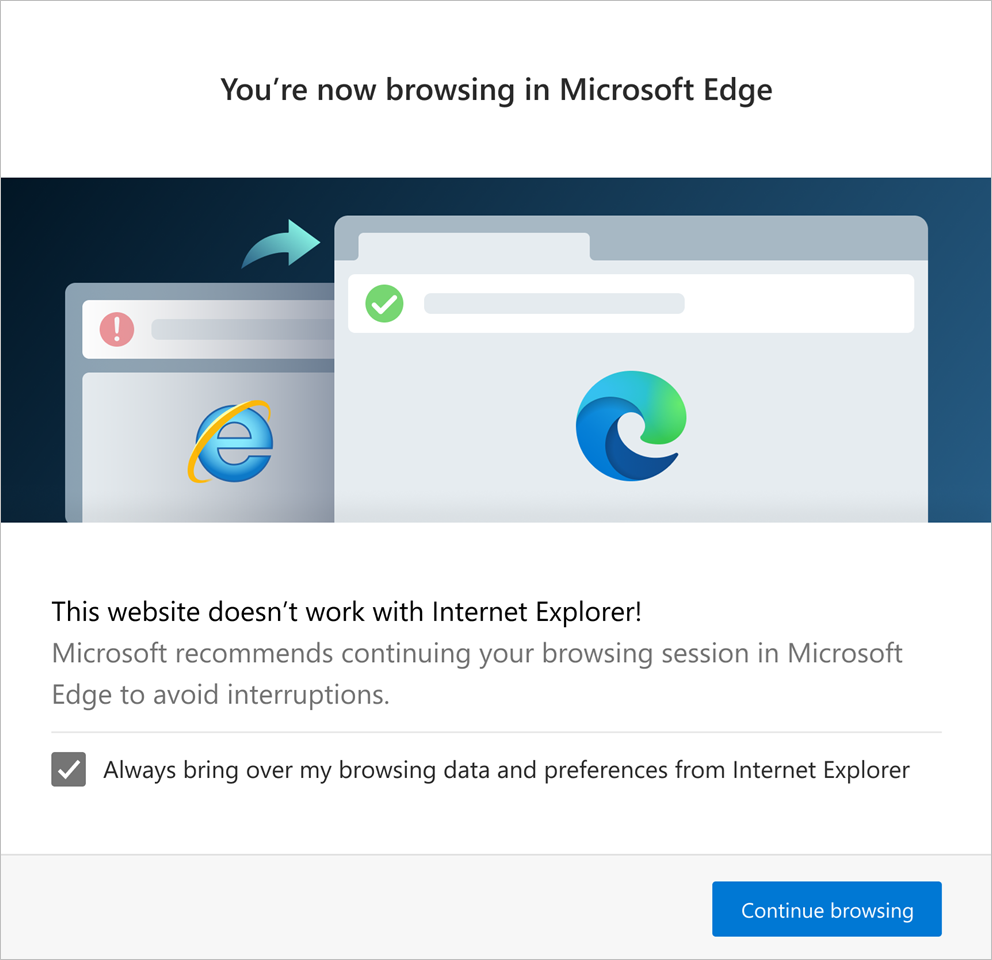

# Move users to Microsoft Edge from Internet Explorer

Many modern websites have designs that are incompatible with Internet Explorer.  When an Internet Explorer user visits an incompatible public website, the user may be instructed by the website that the website is incompatible with Internet Explorer, and that the user must switch to a more modern browser in order to use the website.

To minimize disruptions, Microsoft Edge supports a new capability that automatically redirects users.  When an Internet Explorer user goes to a website that's incompatible with Internet Explorer, Windows can automatically redirect the user to Microsoft Edge.  Only websites that are part of the [Need Microsoft Edge list](https://edge.microsoft.com/neededge/v1) are redirected.

<!-- ====================================================================== -->
## Redirection experience

On redirection to Microsoft Edge, the user is shown the one-time dialog in the next screenshot.  The dialog provides the user with the following information:
*  It explains why the website is being redirected.
*  It prompts the user for consent to copy browsing data and preferences from Internet Explorer to Microsoft Edge.

The following browsing data is imported:
*  Favorites
*  Passwords
*  Search engines
*  Open tabs
*  History
*  Settings
*  Cookies
*  The Home Page

Browsing notification and prompt to import data and preferences:

If the user doesn't consent by selecting the **Always bring over my browsing data and preferences from Internet Explorer** checkbox, the user may choose **Continue browsing** to continue the browsing session.

Finally, a website incompatibility banner is displayed under the address bar for each redirection.  An example of a website incompatibility banner is displayed in following figure.

The website incompatibility banner provides the following details to the user.

*   Recommends that the user to switch to Microsoft Edge.
*   Offers to set Microsoft Edge as the default browser.
*   Gives the user the option to explore Microsoft Edge.

When a website is redirected from Internet Explorer to Microsoft Edge, one of the following actions occurs.

*   If the active Internet Explorer tab had no prior content, it is closed.
*   If the active Internet Explorer tab had prior content, it navigates to the [Microsoft support page that explains why the website was redirected to Microsoft Edge](https://support.microsoft.com/office/the-website-you-were-trying-to-reach-doesn-t-work-with-internet-explorer-8f5fc675-cd47-414c-9535-12821ddfc554).

> [!NOTE]
> After a redirection, users may continue to use Internet Explorer for websites that aren't on the Internet Explorer compatibility list.

<!-- ====================================================================== -->
## Request an update to the Internet Explorer compatibility list

The Internet Explorer compatibility list is an XML file on [microsoft.com](https://www.microsoft.com).  The list is regularly updated in response to user and website developer requests to have websites added or removed.  Updates to the list are automatically downloaded to user machines.

Email the following information to [ietoedge@microsoft.com](mailto:ietoedge@microsoft.com) for your website to be added or removed from the Internet Explorer compatibility list.

*   Owner name
*   Corporate title
*   Email address
*   Company name
*   Street address
*   Website address

The Internet Explorer compatibility list is usually updated within a week. If you experience wait times greater than one week, we may be working through an outage.

> [!NOTE]
> The Internet Explorer compatibility list is designed to work with public sites only.
