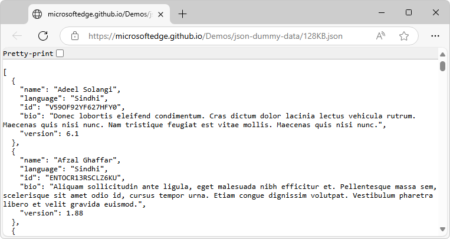
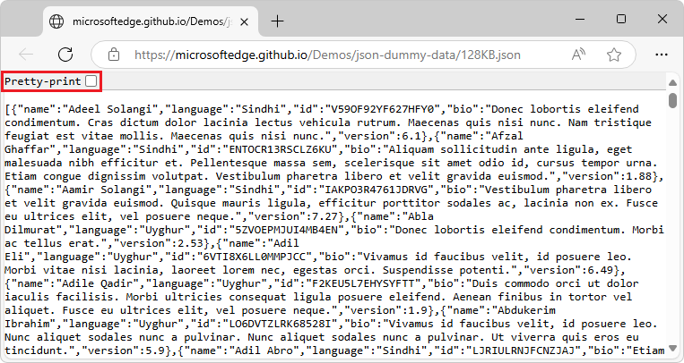

# View formatted JSON files

When you open a JSON file in Microsoft Edge, the file is initially displayed as-is (nested, or minified), and the **Pretty-print** checkbox is initially cleared.

A `.json` file that contains whitespace and nesting ([128KB.json](https://microsoftedge.github.io/Demos/json-dummy-data/128KB.json)), displayed as-is:

A `.json` file that's minified ([128KB-min.json](https://microsoftedge.github.io/Demos/json-dummy-data/128KB-min.json)), displayed as-is:

<!-- ====================================================================== -->
## The Pretty-print checkbox

Select or clear the **Pretty-print** checkbox to change between viewing the `.json` file using a nested, easy-to-read display or a concatenated, dense display.

A `.json` file that contains whitespace and nesting ([128KB.json](https://microsoftedge.github.io/Demos/json-dummy-data/128KB.json)), displayed with the **Pretty-print** checkbox selected and then cleared:

A `.json` file that's minified ([128KB-min.json](https://microsoftedge.github.io/Demos/json-dummy-data/128KB-min.json)), displayed with the **Pretty-print** checkbox selected:

<!-- ------------------------------ -->
<!-- #### Video: The JSON viewer -->

<!--  -->

<!-- ====================================================================== -->
## Supported scenarios

The **JSON viewer** is not supported in windows that are opened by using the `window.open` JavaScript method. In windows opened with `window.open`, JSON data is displayed as a single line of text, without formatting or syntax highlighting.

<!-- ====================================================================== -->
## View reformatted JSON server responses

To view a JSON response from a web server as reformatted JSON:

1. Open a new tab or window in Microsoft Edge.

1. Type a URL that returns JSON data in the address bar. For example, use this sample JSON response: [https://microsoftedge.github.io/Demos/json-dummy-data/256KB-min.json](https://microsoftedge.github.io/Demos/json-dummy-data/256KB-min.json).

   You can find more samples of JSON responses at [MicrosoftEdge / Demos > json-dummy-data](https://microsoftedge.github.io/Demos/json-dummy-data/).

1. Microsoft Edge detects that the returned data is JSON and formats it automatically.

<!-- ====================================================================== -->
## View reformatted JSON files

To view a JSON file stored on your device as reformatted JSON:

1. Open a new tab or window in Microsoft Edge.

1. Press **Ctrl+O** on Windows and Linux, or **Command+O** on macOS, and then select a JSON file.

1. Microsoft Edge detects that the file contains JSON data and formats it automatically.

<!-- ====================================================================== -->
## See also

* [Demo page listing demo .json files](https://microsoftedge.github.io/Demos/json-dummy-data/)
   * [128KB.json](https://microsoftedge.github.io/Demos/json-dummy-data/128KB.json) - A non-minified `.json` file.
   * [128KB-min.json](https://microsoftedge.github.io/Demos/json-dummy-data/128KB-min.json) - A minified `.json` file.
* [MicrosoftEdge / Demos > /json-dummy-data/](https://github.com/MicrosoftEdge/Demos/tree/main/json-dummy-data) - Source directory.
