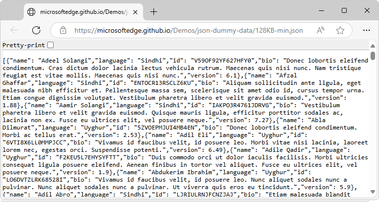
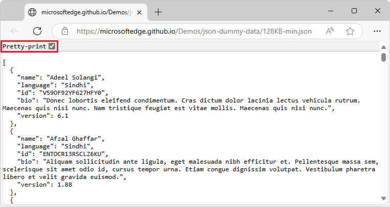

# View a JSON file, with formatting

To display a minified JSON file in a more readable format, select the **Pretty-print** checkbox.

When you open a JSON HTTP response or a JSON file in Microsoft Edge, the content is initially displayed as-is.  For example, if the JSON was minified, with its entire content on a single line with empty spaces removed, the JSON is initially displayed in a dense format, as wide lines, wrapped.

To format a minified JSON file or server response:

1. Open a `.json` file that's minified, such as ([128KB-min.json](https://microsoftedge.github.io/Demos/json-dummy-data/128KB-min.json)), or go to a URL that returns a minified JSON response:

   

   To open a local JSON file, press **Ctrl+O** on Windows and Linux, or **Command+O** on macOS, and then select a JSON file.

1. Select the **Pretty-print** checkbox:

   

   The JSON file or response is displayed in a readable format, with indentation and line wrapping.

Clicking the **Pretty-print** checkbox doesn't change the JSON file itself; only how it is displayed.

<!-- ====================================================================== -->
## See also

* [Demo page listing demo .json files](https://microsoftedge.github.io/Demos/json-dummy-data/)
   * [128KB.json](https://microsoftedge.github.io/Demos/json-dummy-data/128KB.json) - A non-minified `.json` file.
   * [128KB-min.json](https://microsoftedge.github.io/Demos/json-dummy-data/128KB-min.json) - A minified `.json` file.
* [MicrosoftEdge / Demos > /json-dummy-data/](https://github.com/MicrosoftEdge/Demos/tree/main/json-dummy-data) - Source directory.
