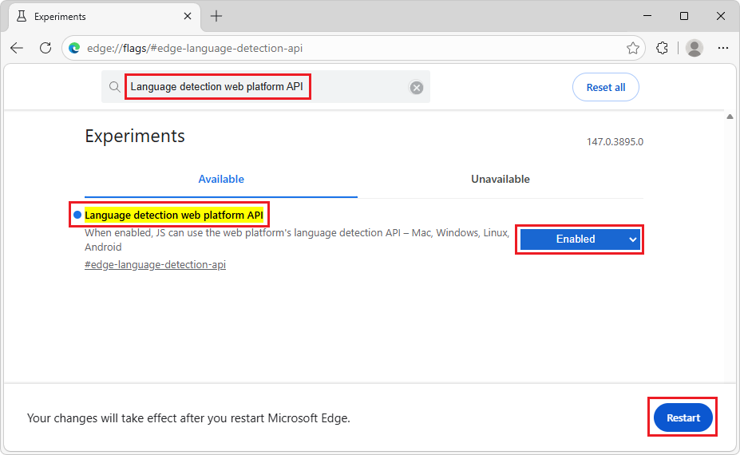
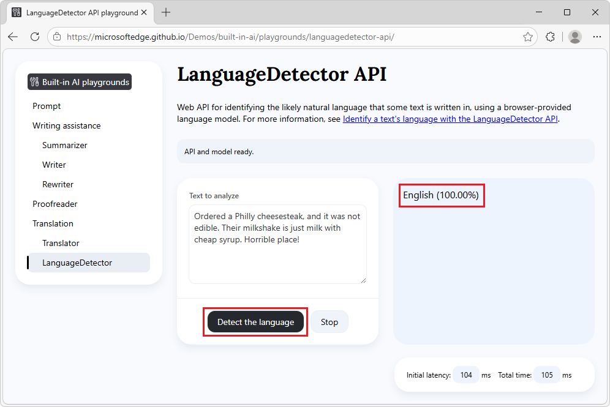

# Detect languages with the Language Detector API

The Language Detector API is an experimental web API that allows you to detect the language of text by using a model that's built into Microsoft Edge, from JavaScript code in your website or browser extension.

For introductory information about the Language Detector API, see:
* [Translator and Language Detector APIs](https://webmachinelearning.github.io/translation-api/)
* [Explainer for the Translator and Language Detector APIs](https://github.com/webmachinelearning/translation-api)


**Detailed contents:**

* [Availability of the Language Detector API](#availability-of-the-language-detector-api)
* [Benefits of the Language Detector API](#benefits-of-the-language-detector-api)
* [Alternatives to the Language Detector API](#alternatives-to-the-language-detector-api)
* [Disclaimer](#disclaimer)
* [Model availability](#model-availability)
* [Enable the Language Detector API](#enable-the-language-detector-api)
* [See a working example](#see-a-working-example)
* [Use the Language Detector API](#use-the-language-detector-api)
* [Check if the Language Detector API is enabled](#check-if-the-language-detector-api-is-enabled)
* [Check if the model can be used (availability())](#check-if-the-model-can-be-used-availability)
* [Create a new session (create())](#create-a-new-session-create)
* [Monitor the progress of the model download (monitor)](#monitor-the-progress-of-the-model-download-monitor)
* [Run the Language Detector API (detect())](#run-the-language-detector-api-detect)
* [Understanding the confidence scores](#understanding-the-confidence-scores)
* [Destroy a session (destroy())](#destroy-a-session-destroy)
    * [Destroy a session by calling destroy()](#destroy-a-session-by-calling-destroy)
    * [Destroy a session by using AbortController](#destroy-a-session-by-using-abortcontroller)
* [Send feedback](#send-feedback)
* [See also](#see-also)


<!-- ====================================================================== -->
## Availability of the Language Detector API

The Language Detector API is available as a developer preview in the Microsoft Edge Canary or Dev channels, starting with version 147.0.3882.0.  To download a preview channel of Microsoft Edge (Beta, Dev, or Canary), go to [Become a Microsoft Edge Insider](https://www.microsoft.com/edge/download/insider).


<!-- ====================================================================== -->
## Benefits of the Language Detector API

The Language Detector API uses a model that runs on the same device where the inputs to and outputs of the model are used (that is, locally).  This approach has the following benefits compared to cloud-based solutions:

* **Reduced cost:** There's no cost associated with using a cloud language detection service.

* **Network independence:** Beyond the initial model download, there's no network latency when using this API to detect languages, and the API can also be used when the device is offline.

* **Improved privacy:** The data input into the model never leaves the device, and isn't collected to train AI models.

The language detection models are downloaded the first time the API is used in Microsoft Edge, and are subsequently shared across all websites in the browser.  The models are accessed via a straightforward web API that doesn't require knowledge of third-party frameworks, and doesn't require Artificial Intelligence (AI) or Machine Learning (ML) expertise.


<!-- ====================================================================== -->
## Alternatives to the Language Detector API

You can send network requests to cloud-based language detection services with more sophisticated capabilities; see [Azure AI Language documentation](/azure/ai-services/language-service/).

As an on-device alternative, the Prompt API serves more custom scenarios, with a small language model that's built into Microsoft Edge; see [Prompt a built-in language model with the Prompt API](./prompt-api.md).


<!-- ====================================================================== -->
## Disclaimer

Like other machine learning models, the language detection model in Microsoft Edge can potentially produce results that are inaccurate or unreliable for certain inputs, particularly very short text or single words.


<!-- ====================================================================== -->
## Model availability

An initial download of the model will be required the first time a website calls the Language Detector API.  You can monitor the model download by using the monitor option when creating a new Language Detector API session; see [Monitor the progress of the model download (monitor)](#monitor-the-progress-of-the-model-download-monitor), below.


<!-- ====================================================================== -->
## Enable the Language Detector API

To use the Language Detector API in Microsoft Edge, set the flag, as follows:

1. In Microsoft Edge, go to `edge://version`, and make sure you're using version 147.0.3882.0 or later of Microsoft Edge, such as the Canary or Dev preview channel of Microsoft Edge.

   To download a preview channel of Microsoft Edge (Beta, Dev, or Canary), go to [Become a Microsoft Edge Insider](https://www.microsoft.com/edge/download/insider).

1. In that version of Microsoft Edge, open a new tab or window and go to `edge://flags`.

1. In the **Search flags** text box at the top, start typing **Language detection web platform API**:

   

   The following flag is listed:

   * **Language detection web platform API**

      This entry shows `#edge-language-detection-api`, which goes to `edge://flags/#edge-language-detection-api`.

1. Under **Language Detector API**, select **Enabled**.

   In the lower right, a **Restart** button is displayed.

1. Click the **Restart** button.


<!-- ====================================================================== -->
## See a working example

To see the Language Detector API in action, and review existing code that uses this API:

1. [Enable the Language Detector API](#enable-the-language-detector-api), as described above.

1. In Microsoft Edge Canary or Dev, go to the [Language Detector API playground](https://microsoftedge.github.io/Demos/built-in-ai/playgrounds/languagedetector-api/) in a new window or tab.

1. In the information banner at the top, check the status: it initially reads: **On-device API and model available.**

1. Optionally change the text to detect in the **Text to analyze** text box.

1. Click the **Detect the language** button.

   The model starts detecting the language of the text.

   The output is generated in the response section of the page:

   

See also:
* [/built-in-ai/](https://github.com/MicrosoftEdge/Demos/tree/main/built-in-ai/) - Source code and Readme for the Built-in AI playgrounds demo.


<!-- ====================================================================== -->
## Use the Language Detector API

The next sections are about using the Language Detector API.


<!-- ====================================================================== -->
## Check if the Language Detector API is enabled

Before using the Language Detector API in your website's code, check that the API is enabled by testing the presence of the `LanguageDetector` object:

```javascript
if (!LanguageDetector) {
  // The Language Detector API is not available.
} else {
  // The Language Detector API is available.
}
```


<!-- ====================================================================== -->
## Check if the model can be used (`availability()`)

The Language Detector API can be used if the model and model runtime have been downloaded by Microsoft Edge.

To check if the API can be used, call `availability()`:

```javascript
const availability = await LanguageDetector.availability();

if (availability == "unavailable") {
  // The model is not available.
}

if (availability == "downloadable" || availability == "downloading") {
  // The model can be used, but it needs to be downloaded first.
}

if (availability == "available") {
  // The model is available and can be used.
}
```


<!-- ====================================================================== -->
## Create a new session (`create()`)

Creating a session instructs the browser to load the language detection model in memory, so that it can be used.  Before you can detect languages, create a new session by using the `create()` method:

```javascript
// Create a Language Detector session.
const session = await LanguageDetector.create();
```

To customize the model session, you can pass options to the `create()` method:

```javascript
// Create a Language Detector session with options.
const session = await LanguageDetector.create({
  expectedInputLanguages: ["en", "es", "fr"]
  monitor: monitorProgress
});
```

The available options are:

| **Option** | **Description** |
| --- | --- |
| `expectedInputLanguages` | An array of language codes. If there are certain languages you need to be able to detect for your use case, include them in the `expectedInputLanguages` option. This allows Microsoft Edge to download additional resources, if necessary, for better accuracy. The language codes should be in BCP 47 format (for example, `"en"` for English, `"es"` for Spanish, or `"fr"` for French). |
| `monitor` | A function that's used to monitor the progress of the model download. See [Monitor the progress of the model download (monitor)](#monitor-the-progress-of-the-model-download-monitor), below. |


<!-- ====================================================================== -->
## Monitor the progress of the model download (`monitor`)

You can follow the progress of the model download by using the `monitor` option.  This is useful when the model has not yet been fully downloaded onto the device where it will be used, to inform users of your website that they should wait.

```javascript
// Create a Language Detector session with the monitor option to monitor the
// model download.
const session = await LanguageDetector.create({
  monitor: m => {
    // Use the monitor object argument to add a listener for the 
    // downloadprogress event.
    m.addEventListener("downloadprogress", event => {
      // The event is an object with the loaded and total properties.
      if (event.loaded == event.total) {
        // The model is fully downloaded.
      } else {
        // The model is still downloading.
        const percentageComplete = (event.loaded / event.total) * 100;
      }
    });
  }
});
```


<!-- ====================================================================== -->
## Run the Language Detector API (`detect()`)

After you have created a model session, you can detect the language of text.  The Language Detector API provides the `detect()` method to detect languages:

```javascript
// Create a Language Detector session.
const session = await LanguageDetector.create();

// Detect the language of the text.
const results = await session.detect(someUserText);

// Use the results.
for (const result of results) {
  // Show the full list of potential languages with their likelihood, ranked
  // from most likely to least likely.
  console.log(result.detectedLanguage, result.confidence);
}
```

The `detect()` method returns a promise that resolves to an array of language detection results.  Each result is an object with the following properties:

| **Property** | **Description** |
| --- | --- |
| `detectedLanguage` | The BCP 47 language tag of the detected language (for example, `"en"` for English, `"es"` for Spanish, or `"und"` for undetermined). |
| `confidence` | A number between 0.0 and 1.0 indicating the confidence level of the detection. Higher values indicate higher confidence. |

The results are sorted by confidence in descending order, with the most likely language first.  The last entry in the results array is always the undetermined language (`"und"`), which represents the confidence that the text is not in any of the languages the model knows.


<!-- ====================================================================== -->
## Understanding the confidence scores

The confidence scores returned by the Language Detector API have the following characteristics:

* **Range:** Each confidence score is a number between 0 (lowest confidence) and 1 (highest confidence).

* **Sorted results:** The results are always sorted from highest to lowest confidence.

* **Low-confidence filtering:** Languages with very low confidence (typically less than 1%, or less confident than the "undetermined" category) are automatically filtered out to reduce noise.

* **Sum of scores:** The sum of all confidence scores may be less than 1 because low-probability languages are omitted from the results.


<!-- ====================================================================== -->
## Destroy a session (`destroy()`)

After detecting languages, destroy the session to let the browser know that you don't need the language model anymore, so that the model can be unloaded from memory.

You can destroy a session in two different ways:
* By using the `destroy()` method.
* By using an `AbortController`.

Details are below.


<!-- ------------------------------ -->
#### Destroy a session by calling `destroy()`

To destroy a session by calling `destroy()` with a `LanguageDetector` session:

```javascript
const session = await LanguageDetector.create();

// Later, destroy the session by using the destroy method.
session.destroy();
```


<!-- ------------------------------ -->
#### Destroy a session by using `AbortController`

To destroy a session by creating an `AbortController` object, create a `LanguageDetector` session, and then call `abort()`:

```javascript
// Create an AbortController object.
const controller = new AbortController();

// Create a Language Detector session and pass the 
// AbortController object by using the signal option.
const session = await LanguageDetector.create({
  signal: controller.signal
});

// Later, perhaps when the user interacts with the UI, destroy the session by
// calling the abort() function of the AbortController object.
controller.abort();
```


<!-- ====================================================================== -->
## Send feedback

We're very interested in learning about the range of scenarios for which you intend to use the Language Detector API, any issues with the API or language detection model, and whether other task-specific, built-in APIs would be useful.

To send feedback about your scenarios and the tasks you want to achieve, please add a comment to [the Language Detector API feedback issue](https://github.com/MicrosoftEdge/MSEdgeExplainers/issues/NNNN). <!-- TODO: create a new issue -->

If you notice any issues when using the API instead, please [report it on the repo](https://github.com/MicrosoftEdge/MSEdgeExplainers/issues/new?template=language-detector-api.md). <!-- TODO: create a new issue template -->

You can also contribute to the discussion about the design of the Language Detector API at the [W3C Web Machine Learning Working Group repository](https://github.com/webmachinelearning/translation-api).


<!-- ====================================================================== -->
## See also
<!-- all links in article -->

<!-- Local: -->
* [Translate text with the Translator API](./translator-api.md)
* [Prompt a built-in language model with the Prompt API](./prompt-api.md)
* [Summarize, write, and rewrite text with the Writing Assistance APIs](./writing-assistance-apis.md)
* [Correct grammar and spelling with the Proofreader API](./proofreader-api.md)

Get Microsoft Edge:
* [Become a Microsoft Edge Insider](https://www.microsoft.com/edge/download/insider) - download a preview channel of Microsoft Edge (Beta, Dev, or Canary).

GitHub:
* [webmachinelearning / translation-api](https://github.com/webmachinelearning/translation-api) repo.
   * [Explainer for the Translator and Language Detector APIs](https://github.com/webmachinelearning/translation-api/blob/main/README.md)
* [Translator and Language Detector APIs](https://webmachinelearning.github.io/translation-api/)

Azure docs:
* [Azure AI Language documentation](/azure/ai-services/language-service/)

Demos repo:
* [Language Detector API playground](https://microsoftedge.github.io/Demos/built-in-ai/playgrounds/language-detector-api/)
* [/built-in-ai/](https://github.com/MicrosoftEdge/Demos/tree/main/built-in-ai/) - Source code and Readme for the Built-in AI playgrounds demo.

<!-- omitted Feedback section links b/c must describe how to use
