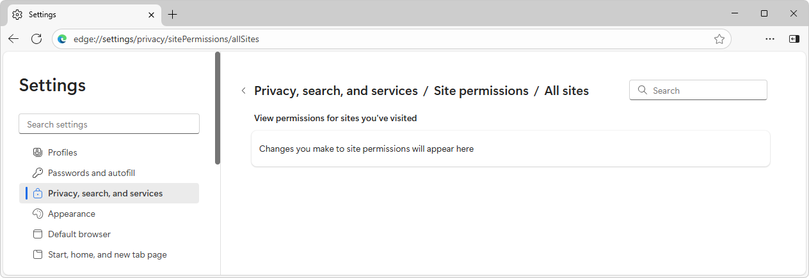
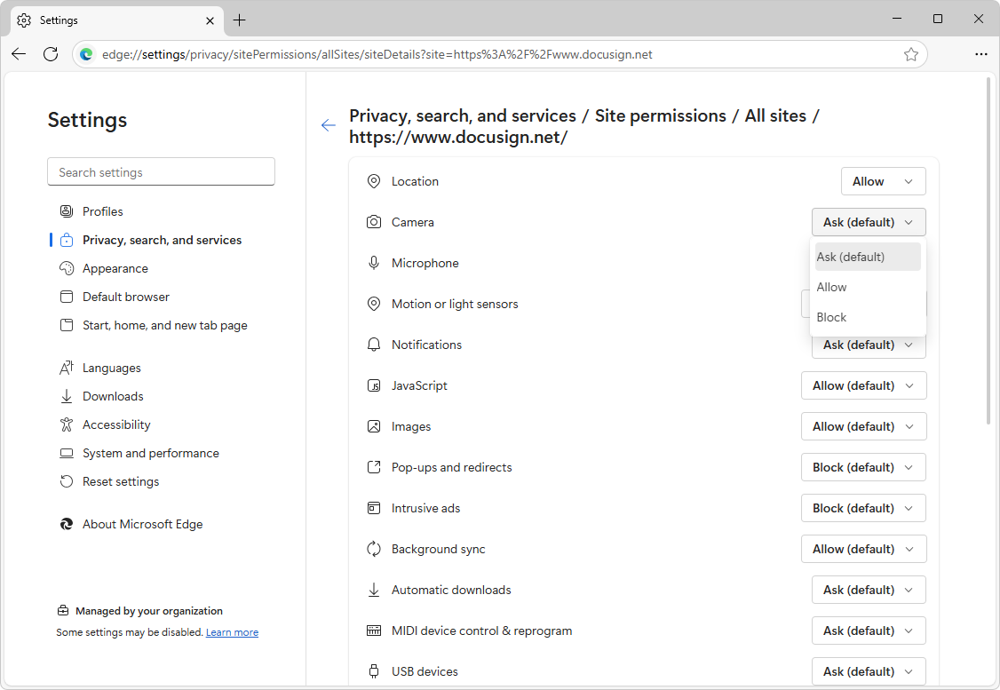

# Control a website's access to the local network
<!-- todo: improve "description:" above, after clarify intro -->

Use the Local Network Access feature to grant or deny sites' access to your<!-- todo: who is "your"?  the (end-)user's? --> local network.
<!-- todo:
As an end-user, you can use the Local Network Access feature to grant or deny a website access to your local network.

state the audience; clarify the audience and scenario.  Admins?  Devs?  End-users?
what admin must configure the policies, for this to work?
* `LocalNetworkAccessAllowedForUrls`
* `LocalNetworkAccessBlockedForUrls`
-->

This feature delivers secure, privacy-respecting browsing experiences, while maintaining compatibility with modern web standards.

This feature requires Microsoft Edge 140 or later.

<!-- todo:
See also:
* 
-->

<!-- ====================================================================== -->
## What is Local Network Access?

Local Network Access is a feature in Microsoft Edge that restricts a website's ability to send requests to servers on a user's local network.  This feature displays a prompt to end-users, requiring the end-user to grant or deny the site permission before these requests can be made.

The ability to request this permission is restricted to secure contexts.

<!-- ====================================================================== -->
## How to Enable Local Network Access in Microsoft Edge

Users<!-- todo: which type of users, in which scenario?  network admins?  devs?  end-users? --> can enable and manage Local Network Access permissions through the browser settings:

<!-- todo: when steps are accurate, maybe condense: select x > y > z. -->

1. In Microsoft Edge, go to `edge://flags/#local-network-access-check`.

1. In the dropdown list for **Local Network Access Checks**, select **Enabled**.

1. Click the **Restart** button in the lower right.

1. In Microsoft Edge, select **Settings and more** (...) > **Settings**.

   The **Settings** page opens.

1. Select **Privacy, search, and services**.

   The **Privacy, search, and services** page is displayed.

1. Select **Site permissions**.

   The **Site permissions** page is displayed.

1. Select **All sites**.

   The **All sites** page is displayed:

    

   The sites that are listed are sites that requested access to your local network, such as by a dialog requesting permission.

   The Address bar shows `edge://settings/privacy/sitePermissions/allSitePermissions/localNetworkAccess`.<!-- todo: in some cases, might not end up there.  can comment-out, but keep this special url, for Maint -->

1. For a listed site, turn on the **[todo]** toggle:

   <!-- todo: improve png, this is Edge 139 not 140 -->

<!-- ====================================================================== -->
## Configuring policies
<!-- todo:
does the article's audience change from end-users to admins, here?
in each h2 section that has action steps, state the audience
-->

Enterprise administrators can configure access by using the following policies:
* `LocalNetworkAccessAllowedForUrls`
* `LocalNetworkAccessBlockedForUrls`

These policies are supported in Microsoft Edge 140 or later.<!-- todo: omit version discussion here?  try to put "140" only at top of article & clearly indicate there that it applies to entire article -->

These policies provide granular control over which URLs are permitted or blocked from accessing local network resources.

<!-- todo:
See also:
* 
https://learn.microsoft.com/deployedge/
-->

<!-- ====================================================================== -->
## Which requests are impacted

For the first milestone of Local Network Access, a _local network request_ is any request from the public network to a local network or loopback destination.

* A _local network_ is any destination that resolves to one of the following:
   * The private address space (such as `192.168.0.0/16`).
   * An IPv4-mapped IPv6 address, where the mapped IPv4 address is itself private.
   * An IPv6 address outside the `::1/128`, `2000::/3`, and `ff00::/8` subnets.

* _Loopback_ is any destination that resolves to one of the following:
   * The "loopback" space (`127.0.0.0/8`).
   * The "link-local" space (`169.254.0.0/16`).
   * The "Unique Local Address" prefix (`fcc00::/7`).
   * The "link-local" prefix (`fe80::/10`).

* A _public network_ is any other destination.

<!-- ====================================================================== -->
## How it's checked whether a request is going to the local network

* The request hostname is a private IP literal (such as `192.168.0.1`).

* The request hostname is a `.local` domain.

* The `fetch()` call is annotated with the option `targetAddressSpace: "local"`.

<!-- ====================================================================== -->
<!-- ## See also -->
<!-- todo: all links in the article -->

<!-- 
* 
-->
