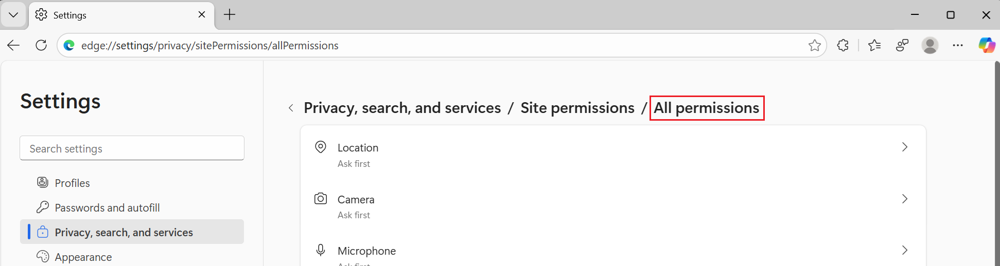
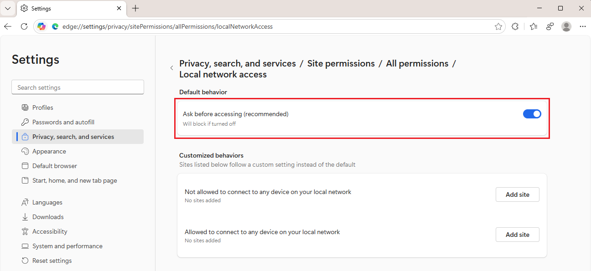

# Control a website's access to the local network

As a user of Microsoft Edge, you can use the Local Network Access feature to grant or deny a website access to your local network; that is, a network that uses a private IP address space.

An enterprise administrator can configure the Local Network Access policies to grant or deny a website access to an enterprise's devices.

The Local Network Access feature delivers secure, privacy-respecting browsing experiences, while maintaining compatibility with modern web standards.

This feature requires Microsoft Edge 140 or later.

<!-- ====================================================================== -->
## What is Local Network Access?

_Local Network Access_ is a feature in Microsoft Edge that restricts a website's ability to send requests to servers on a user's local network.  This feature displays a prompt to users (website visitors), requiring the user to grant or deny the website permission before these requests can be made.

The ability of a website to request this permission from users is restricted to secure contexts.

<!-- ====================================================================== -->
## How to Enable Local Network Access in Microsoft Edge

Users (website visitors using Microsoft Edge) can enable and manage Local Network Access permissions through the Microsoft Edge browser settings.

To grant or deny a website permission to access your local network:

1. In Microsoft Edge, go to `edge://flags/#local-network-access-check`.

1. In the dropdown list for **Local Network Access Checks**, select **Enabled (Blocking)**.

   Or, select **Enabled**, which will make the website display a warning, rather than blocking the network request.

1. Click the **Restart** button in the lower right.

1. In Microsoft Edge, select **Settings and more** () > **Settings**.

   The **Settings** page opens.

1. Select **Privacy, search, and services** > **Site permissions** > **All permissions**.

   The **All permissions** page is displayed:

    

   The websites that are listed are websites that requested access to your local network, such as by a dialog requesting permission.

   The Address bar shows `edge://settings/privacy/sitePermissions/allSitePermissions/localNetworkAccess`.

1. For the Local Network Access website permission, turn on the **Ask before accessing** toggle:

   

<!-- ====================================================================== -->
## Configuring policies

Enterprise administrators can configure access on a per-site basis by using the following policies:
* [LocalNetworkAccessAllowedForUrls](/deployedge/microsoft-edge-browser-policies/localnetworkaccessallowedforurls)
* [LocalNetworkAccessBlockedForUrls](/deployedge/microsoft-edge-browser-policies/localnetworkaccessblockedforurls)

These policies provide granular control over which URLs are permitted or blocked from accessing local network resources.

Enterprise administrators can configure access on a per-device basis by using the following policy:
* [LocalNetworkAccessRestrictionsEnabled](/deployedge/microsoft-edge-browser-policies/localnetworkaccessrestrictionsenabled)

This policy will deny all local network requests without prompting the user.

<!-- ====================================================================== -->
## Which requests are impacted

For the first milestone of Local Network Access, a _local network request_ is any request from the public network to a local network or loopback destination.

* A _local network_ is any destination that resolves to one of the following:
   * The private address space (such as `192.168.0.0/16`).
   * An IPv4-mapped IPv6 address, where the mapped IPv4 address is itself private.
   * An IPv6 address outside the `::1/128`, `2000::/3`, and `ff00::/8` subnets.

* _Loopback_ is any destination that resolves to one of the following:
   * The "loopback" space (`127.0.0.0/8`).
   * The "link-local" space (`169.254.0.0/16`).
   * The "Unique Local Address" prefix (`fcc00::/7`).
   * The "link-local" prefix (`fe80::/10`).

* A _public network_ is any other destination.

<!-- ====================================================================== -->
## How it's checked whether a request is going to the local network

* The request hostname is a private IP literal (such as `192.168.0.1`).

* The request hostname is a `.local` domain.

* The `fetch()` call is annotated with the option `targetAddressSpace: "local"`.

<!-- ====================================================================== -->
<!-- ## See also -->
<!-- all links in article -->

<!-- section not needed unless more sections have links
* [LocalNetworkAccessAllowedForUrls](/deployedge/microsoft-edge-browser-policies/localnetworkaccessallowedforurls)
* [LocalNetworkAccessBlockedForUrls](/deployedge/microsoft-edge-browser-policies/localnetworkaccessblockedforurls)
* [LocalNetworkAccessRestrictionsEnabled](/deployedge/microsoft-edge-browser-policies/localnetworkaccessrestrictionsenabled)
-->
