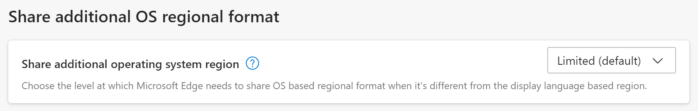

---
title: Updates to Region information exposed to web content
description: How customers and web developers can use the OS regional format in Microsoft Edge for improved site experiences
author: MSEdgeTeam
ms.author: msedgedevrel
ms.topic: conceptual
ms.prod: microsoft-edge
ms.date: 08/11/2022
--- 
# Updates to Region information exposed to web content

Microsoft Edge provides operating sysytem (OS) regional preference information to web content to help web site authors create regional experiences on their website. This feature allows website authors to deliver value to customers who specifically change their regional preferences in the OS to reflect their personal preferences.

Users want to see dates, times, numbers, and other formatting printed according to their preferences. For example, the US geographic region translates **7/2/2022** into **July 2nd, 2022**.  Another geographic region could translate that same date into **February 7, 2022** because they read the month and day inversely. 

## Regional Codes
The user’s formatting preferences are abstracted into a simple regional code, which is used by web applications to infer the various details noted above about dates, times, and other formatting preferences. With a regional code, websites can use a built-in Internationalization API to properly format information into the user's preferences. The built-in Internationalization API saves lots of MB of data transfer over the network, keeping websites small and allowing them to quickly and easily adapt to different regions. In general, the website's internationalization customer experiences are only as good as the regional code that they're able to determine for the current user. 

A regional code is a two-letter language code followed by a hyphen and a two-letter region code.  Microsoft Edge uses ICU, which is an implementation of the Unicode standard's Internationalization API.  See [ICU](https://icu.unicode.org/home).

To set the user’s language preferences, Microsoft Edge gets the default values from the OS at the time it's first installed. After that, users can change the language preferences on **edge://settings/languages** and then sorting them in priority order.

|Microsoft Edge Setting Category| Description |
|--------|-------------------------|
| The language used for rendering Microsoft Edge's UI | edge://settings/languages. One item in the list will indicate **Microsoft Edge is displayed in this language**|
| The Language used to render web sites | **Website Server-side processing**: Microsoft Edge sends the language list (as regional codes) specified in **edge://settings/languages** via the accept-language header. <br><br> **Website Client-side processing**: Microsoft Edge makes the language list (as regional codes) available via the `navigator.languages` DOM API. The preferred language (at the top of the list) is also available as `navigator.language`. |
| The language/region used for formatting date, time, numbers, etc. | The language in the **edge://settings/languages** list specified as the **displayed language** |

#### Regional format
To reflect a customer’s regional preferences (especially in the cases where the customer has changed their default preferences in the OS), Microsoft Edge is making a new Setting available in the “Language” section of Settings:



This access will allow websites to have visibility into more customer's specific regional preferences than was previously possible. Customers that changed their OS regional preferences may now see their preferences reflected automatically in more websites.

## Sharing Setting
Customers have three settings on Microsoft Edge to select the level of information their browser will share about their regions:

* Never 
* Limited (default) 
* Always (not recommended). 

#### Never Setting
To minimize the risks, customers can disable the sharing of OS regional information by selecting **Never**. The **Never** option prevents websites from reading region information, but doesn't block any specific OS regional customizations that the user has made from being exposed to website content. Instead, the browser's display language is used to derive a default region. 

#### The Limited setting (default)
The default recommended value is **limited**. With this setting, the above risks are mitigated by ensuring that “incompatible” combinations of language and region aren't revealed to websites. The “limited” value ensures that only valid combinations of the user's current browser display language preference and a given region value are used. **Limited** ensures that websites won't see a regional code anomaly (though it could still look unusual per geographic inference), and also ensures that for language processing, websites will at least provide a consistent language experience (not mixing languages in weird combinations). The **limited** setting compares the language part of the regional code that is derived from the browser’s display language, and the regional part coming from the OS setting, and if the language parts match and if the resulting regional code is a valid combination, will pass the result through to the website. If the language in the message doesn't match, the feature acts as if **never** was selected (the regional information falls back to being derived from the browser’s display language). 

Note: the **limited** value is similar to current Firefox behavior for exposing the regional code as described in [Firefox Source Docs documentation (mozilla.org)](https://firefox-source-docs.mozilla.org/intl/locale.html#regional-preferences), but also offers the possibility to not share this information at all. 

#### The Always setting (not recommended)
If **Always** is selected, the customer is exposed to the full set of risks noted earlier: the potential to be easily signaled out for fingerprinting, and also to potentially see website language-processing problems and inconsistencies. However, the user's OS preferences will be made available to the website without any limitations or restrictions to be sure their preferences are respected. 

## Policy Controls 
A related new policy added to Microsoft Edge provides a setting for corporate or enterprise-level default configurations: **ShareOSRegionThroughJavaScriptLocale** which accepts an integer with potential values: 

|Number| Description |
|--------|-------------------------|
| 1 | Limited | 
| 2 | Always | 
| 3 | Never | 

In addition, an [older policy](/DeployEdge/microsoft-edge-policies#applicationlocalevalue) (**ApplicationLocaleValue**) allows setting the Microsoft Edge locale and prevents users from changing it. 

## Avoiding potential misuse
We believe that **limited** is the right default that allows the most customer’s regional preferences to be respected with the least amount of risk of the website misusing this information.

#### Fingerprinting Entropy
OS regional information could be misused to compromise the user's privacy.  The regional information would help hackers establish fingerprinting entropy. In combination with many other pre-existing bits of entropy in the platform today, the user could be uniquely identified leading to more potential secondary harm. While a user's region and language are already available via the web platform, users generally fall into well-recognized regional codes that are similar across geographies.  Because the sample sizes are so large, the risk of any specific regional code standing out is small, and thus the risk is small. If the user changes their OS preferences to a unique language + region, websites may be able to identify the anomaly in a population, and easily uniquely identify the associated customer. 

#### Content Presentation
The OS regional information could be misused by a website is in the consistency of their content presentation. There are various places in the web platform where language and regional information is made available. Regional information is processed in one place, while language preferences are surfaced in another.  Furthermore, this information is proactively sent to the server on the initial request for content. When the language and regional information is self-consistent, then it doesn’t really matter which signals the website uses to assemble its content presentation. If one part of the web platform starts reporting a language preference, but another part of the platform reports a separate language, then the website may start to mix-and-match regional preferences resulting in strange and unusual experiences.  Watch for the phrasing of requests that mixes languages and regional preferences together (such as "Email sent on miércoles, 5 de enero de 2021").

## Developer Details 
The new setting to **Share additional OS regional format** directly impacts the JavaScript `Intl` object’s default regional value and all other JavaScript APIs that use the default region (such as the `Date` constructor). 

In cases where the `Intl` object's constructors are used to create a new regional code, such as `DateTimeFormat` (with an existing regional code where these behaviors are unchanged). However, the constructors do offer options to create objects without a specified regional code, but the APIs fallback to a default regional code.

The default regional code is what is surfaced via the new user preference. For example, a `DateTimeFormat` can be created with the user's default regional code (and inspected) via the following expression:

```js
Intl.DateTimeFormat().resolvedOptions().locale 
```

Other areas in the platform, such as the `accept-languages` header that's sent via HTTP/HTTPS GET requests, and the `navigator.language` and `navigator.languages` APIs, aren't impacted by the regional information that's shared by the OS, as noted earlier.
