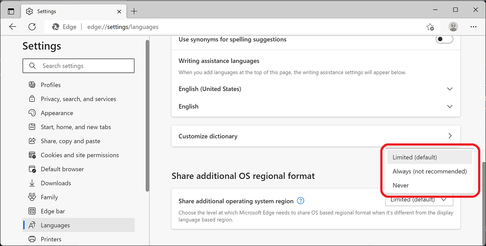

---
title: Operating System Regional Data Display in Microsoft Edge
description: How users and web developers can use the OS regional format in Microsoft Edge for improved site experiences
author: MSEdgeTeam
ms.author: msedgedevrel
ms.topic: conceptual
ms.prod: microsoft-edge
ms.date: 08/15/2022
--- 
# Operating System Regional Data Display

Microsoft Edge provides operating system (OS) regional preference information to help website authors create regional experiences on their web site, when viewing your site using Microsoft Edge. This feature allows website authors to deliver value to users who specifically change their regional preferences in the OS to reflect their personal preferences.

Users want to see dates, times, numbers, and other formatting printed according to their preferences. For example, the US geographic region translates **7/2/2022** into **July 2nd, 2022**.  Another geographic region could translate that same date into **February 7, 2022** because they read the month and day inversely. 

#### Regional format
To reflect a user's regional preferences for how data is displayed (such as the date), Microsoft Edge has a new option  in the **Language** section of **Settings**.



This access will allow websites to have visibility into more user's specific regional preferences than was previously possible. Users that change their OS regional preferences may now see their preferences reflected automatically in more websites.

<!-- ====================================================================== -->
## OS Regional Data Display Codes

The user's formatting preferences are abstracted into a simple regional code, which is used by web applications to infer the various details noted above about dates, times, and other formatting preferences.

Websites can use the built-in Internationalization API with a regional code to properly format information into the user's preferences.  The Internationalization API can save lots of MB of data transfer over the network, keeping websites small and allowing them to quickly and easily adapt to different regions.

In general, the website's internationalization user experiences are only as good as the regional code that they're able to determine for the current user. 

A regional code is a two-letter language code followed by a hyphen and a two-letter region code.  Microsoft Edge uses ICU to understand regional codes. ICU is an implementation of the Unicode standard's Internationalization API.  See [ICU](https://icu.unicode.org/home).

To set the user's language preferences, Microsoft Edge gets the default values from the OS when Microsoft Edge is first installed. The user can then change the language preferences in `edge://settings/languages` and sort them in priority order.

| Language or region data | User impact |
|--------|-------------------------|
| **Preferred language** in the **setting** page | The language selected for rendering Microsoft Edge. This language/region is also used for formatting values such as date, time, and numbers. |
|  `accept-language` HTTP header | A list of regional codes sent to the server to allow a Website to display the right language. Microsoft Edge sends the regional codes in the order specified in **edge://settings/languages**. |
| `navigator.language` API (and similar) | Allow a Website to display the right language and regional formatting for user input and other content produced locally. |

## Regional Data Display options
Users have three options on Microsoft Edge to select the level of information their browser will share about their regions:

* Limited (default).
* Always (not recommended).
* Never 

#### Limited  (default)
The default, recommended value is **Limited**. This setting uses only valid combinations of the user's current browser display language preference and the given region value. **Limited** ensures that for language processing, websites will at least provide a consistent language experience (not mixing languages in mismatched combinations). The **Limited** option compares the language part of the regional code that is derived from the browser's display language, and the regional part coming from the OS setting, and if the language parts match and if the resulting regional code is a valid combination, will provide the regional code to websites as the default locale. If the OS-specified formatting language doesn't match Microsoft Edge's preferred language, the **Limited** option will act as if **Never** was selected (the regional code falls back to the browser's preferred display language). 

Note: the **Limited** option is similar to current Firefox behavior for exposing the regional code, as described in [Regional Preferences - Firefox Source Docs documentation (mozilla.org)](https://firefox-source-docs.mozilla.org/intl/locale.html#regional-preferences), but also offers the possibility to not share this information at all. 

#### Always option (not recommended)

If **Always** is selected, the user's OS regional preferences will be provided to the Website without any limitations or restrictions. The user may be exposed to fingerprinting and to Website compatibility problems (inconsistent use of language and formatting). See below "Avoiding potential misuse" section.)

#### Never
Users can disable the sharing of OS regional information by selecting **Never**. The **Never** option still allows websites to read regional information, but does block any specific OS regional customizations that the user has made from being exposed to website content. Instead, the browser's display language is used to derive a default region.


<!-- ====================================================================== -->
## Policy Controls 
A related new policy in Microsoft Edge, **ShareOSRegionThroughJavaScriptLocale**, provides a setting for corporate or enterprise-level default configurations.  This setting accepts an integer with the following potential values: 

|Number| Description |
|--------|-------------------------|
| 1 | Limited | 
| 2 | Always | 
| 3 | Never | 

In addition, an older policy, [ApplicationLocaleValue](/DeployEdge/microsoft-edge-policies#applicationlocalevalue), sets the Microsoft Edge locale and locks it to prevent users from changing it. 

## Avoiding potential misuse  
We believe that **Limited** is the right option for most users. **Limited** respects the user's regional preferences while introducing the least amount of risk of the website misusing this information.

#### Fingerprinting Entropy
OS regional information could be misused to compromise the user's privacy.  The regional information would help hackers establish fingerprinting entropy. In combination with many other pre-existing bits of entropy in the platform today, the user could be uniquely identified leading to more potential secondary harm. While a user's region and language are already available via the web platform, users generally fall into well-recognized regional codes that are similar across geographies.  Because the sample sizes are so large, the risk of any specific regional code standing out is small, and thus the risk is small. If the user changes their OS preferences to a unique language + region, websites may be able to identify the anomaly in a population, and easily uniquely identify the associated user. 

#### Content Presentation
The OS regional information can also be misused and lead to inconsistency of a Website's language presentation. Microsoft Edge provides multiple language and regional APIs to Websites developers.  Websites may process regional information in one place, while deriving language preferences from another.

When the language and regional information is self-consistent, then it doesn't really matter which APIs the website uses to assemble its content presentation. However, if a Website reads the language information from multiple APIs and those APIs return different language codes, then the website may inadvertently start to mix-and-match regional preferences, resulting in strange user experiences. Watch for phrasing that mixes languages and regional preferences together, such as "Email sent on miércoles, 5 de enero de 2021".

<!-- ====================================================================== -->
## Developer Details 
The new setting to **Share additional OS regional format** directly impacts the JavaScript `Intl` object's default regional value and all other JavaScript APIs that use the default region (such as the `Date` constructor). 

When the `Intl` object's constructors (such as `DateTimeFormat`) are provided with an existing regional code, their behavior is unchanged. However, when a specific regional code isn't provided, the constructors will use the **default regional code**. The new user preference also affects other date and time formatting APIs that rely on the default regional code, such as `Date`.

The default regional code is what is surfaced via the new user preference. For example, a `DateTimeFormat` can be created with the user's default regional code (and inspected) via the following expression:

```js
Intl.DateTimeFormat().resolvedOptions().locale 
```

Other areas in the platform, such as the `accept-languages` header sent via HTTP/HTTPS GET requests to the server, and the `navigator.language` and `navigator.languages` APIs, aren't impacted by the regional information that's shared by the OS.
