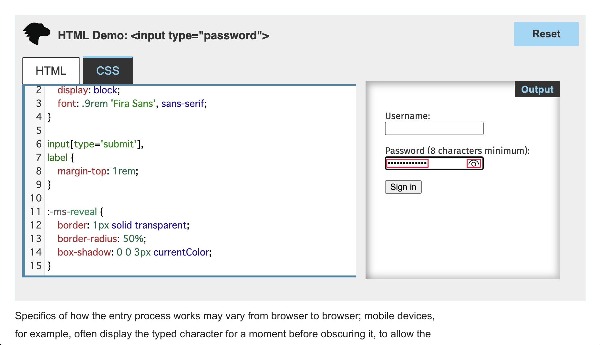
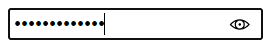
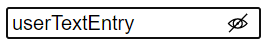

# Customize the password reveal button

The `password` input type in Microsoft Edge includes a **password reveal** button.  To make sure that the password is entered correctly, a user can click the **password reveal** button or press **Alt+F8**, to show the characters in the password field.  You can remove the password reveal control, or customize the control styling.

By default, the **password reveal** button is turned off, so that in the **password** field, dots replace the characters entered by the user.  The **password reveal** button appears to the right of the **password** field, as an eye-shaped icon:



When the user clicks the **password reveal** button to turn it on, the password text is revealed, and the eye icon changes to have a slash over it:


By default, the **password reveal** button is inserted into the Shadow DOM of all HTML `input` elements that have the `type` set to `"password"`.  Starting with Microsoft Edge Version 87, users or [enterprises](/deployedge/microsoft-edge-policies#passwordrevealenabled) can disable this feature globally.  Web designers and developers should expect most Microsoft Edge users to have the default experience.

<!--
these might be outdated style: not used in .md files:


-->


<!-- ====================================================================== -->
## Remove the password reveal control

As the webpage author, you can completely remove the **password reveal** button, by targeting the `::-ms-reveal` pseudo-element:

```css
::-ms-reveal {
    display: none;
}
```

However, you should consider taking advantage of the **password reveal** button.  The native **password reveal** button has important [security measures](#visibility-of-the-control) built into the behavior.


<!-- ====================================================================== -->
## Customize the control style

Instead of fully removing the control, you can instead modify the styling of the **password reveal** button to better match the visual language of the website.  The following snippet provides an example of such styling:

```css
::-ms-reveal {
    border: 1px solid transparent;
    border-radius: 50%;
    box-shadow: 0 0 3px currentColor;
}
```

Keep the following things in mind when you style the **password reveal** button:

*  The eye icon implements as a background image.  To add a background color to the **password reveal** button, use the CSS `background-color` property instead of the `background` shorthand property.

*  You can adjust the size and scale of the **password reveal** button.

   > [!NOTE]
   > The browser hides any overflow outside of the bounds of the password input control.

*  Currently, no state selectors are available to style the toggled state of the **password reveal** button.


<!-- ====================================================================== -->
## Visibility of the control

The **password reveal** button is unavailable until the user enters text into the **password** field.  To help keep the user's password entry secure, the browser suppresses the button in the following scenarios:

*   If focus moves away from the **password** field, the browser removes the **password reveal** button.

*   If scripts modify the **password** field, the browser removes the **password reveal** button.

If the **password reveal** button is removed, the user must delete the contents of the **password** field to make the **password reveal** button appear again. This behavior prevents someone from making a minor adjustment to display the password, should the user step away from an unlocked device.

The **password reveal** button is unavailable if the **password** field is autofilled by using the password manager.
