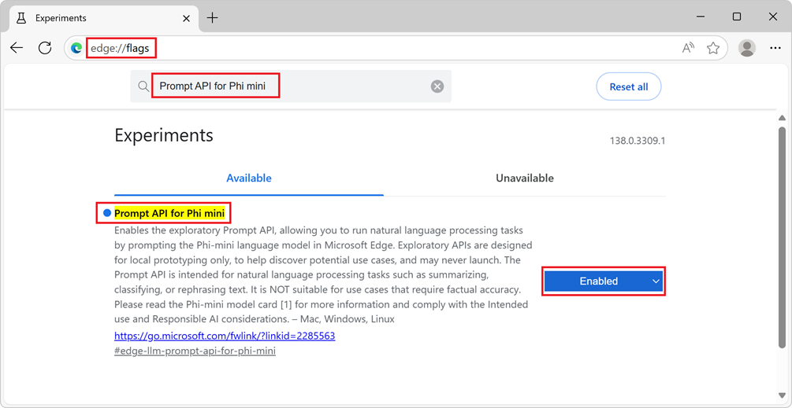
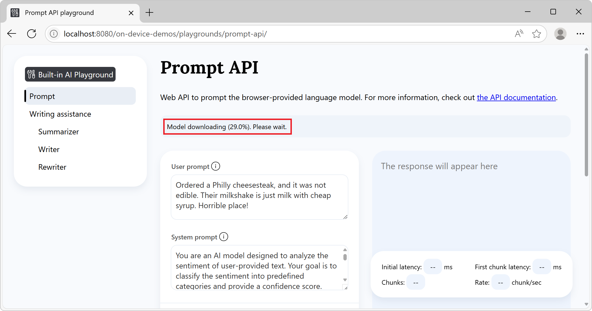
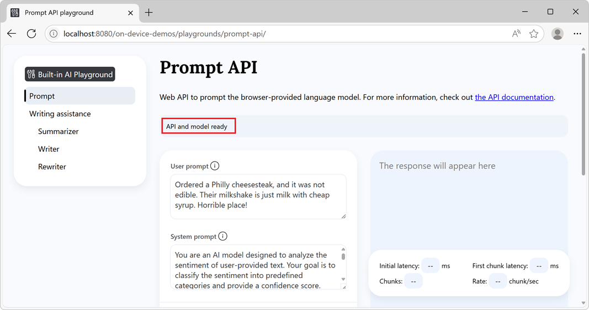
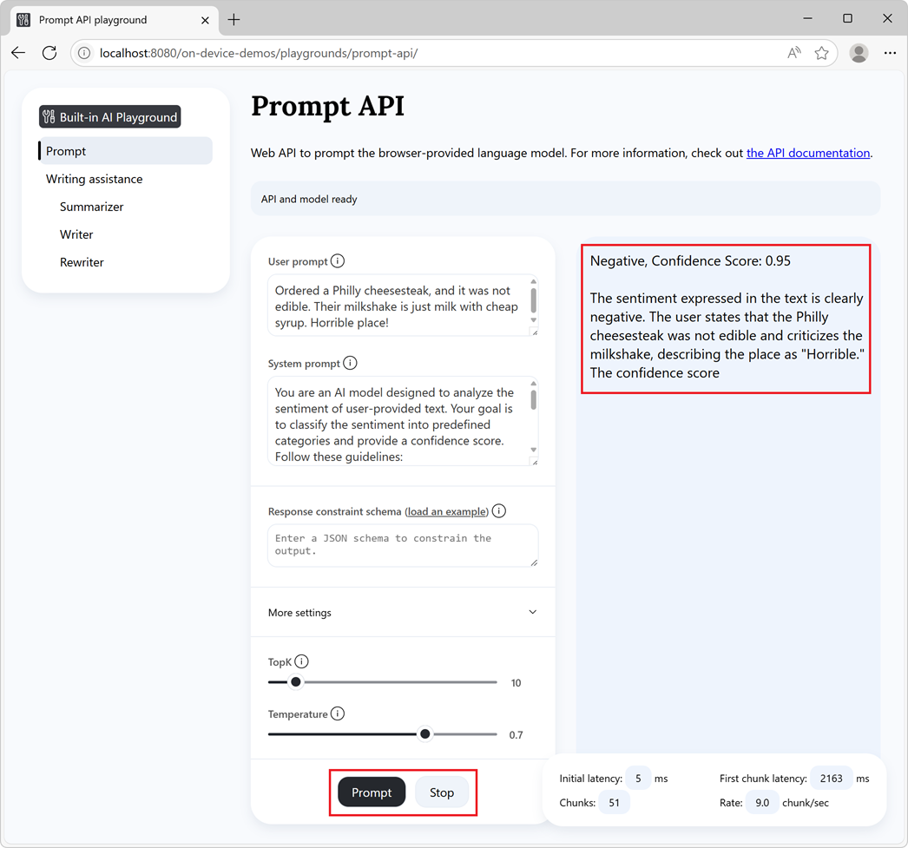

# Prompt a built-in language model with the Prompt API
<!-- https://aka.ms/edge-prompt-api-docs -->

The [Prompt API](https://github.com/webmachinelearning/prompt-api) is an experimental web API that allows you to prompt a small language model (SLM) that is built into Microsoft Edge, from your website's or browser extension's JavaScript code.  Use the Prompt API to generate and analyze text or create application logic based on user input, and discover innovative ways to integrate prompt engineering capabilities into your web application.


**Detailed contents:**

* [Availability of the Prompt API](#availability-of-the-prompt-api)
* [Alternatives to and benefits of the Prompt API](#alternatives-to-and-benefits-of-the-prompt-api)
* [The Phi-4-mini model](#the-phi-4-mini-model)
    * [Disclaimer](#disclaimer)
    * [Hardware requirements](#hardware-requirements)
    * [Model availability](#model-availability)
* [Enable the Prompt API](#enable-the-prompt-api)
* [See a working example](#see-a-working-example)
* [Use the Prompt API](#use-the-prompt-api)
    * [Check if the API is enabled](#check-if-the-api-is-enabled)
    * [Check if the model can be used](#check-if-the-model-can-be-used)
    * [Create a new session](#create-a-new-session)
        * [Monitor the progress of the model download](#monitor-the-progress-of-the-model-download)
        * [Provide the model with a system prompt](#provide-the-model-with-a-system-prompt)
        * [N-shot prompting with initialPrompts](#n-shot-prompting-with-initialprompts)
        * [Set topK and temperature](#set-topk-and-temperature)
    * [Clone a session to start the conversation again with the same options](#clone-a-session-to-start-the-conversation-again-with-the-same-options)
    * [Prompt the model](#prompt-the-model)
        * [Wait for the final response](#wait-for-the-final-response)
        * [Display tokens as they are generated](#display-tokens-as-they-are-generated)
        * [Constrain the model output by using a JSON schema or regular expression](#constrain-the-model-output-by-using-a-json-schema-or-regular-expression)
        * [Send multiple messages per prompt](#send-multiple-messages-per-prompt)
    * [Stop generating text](#stop-generating-text)
    * [Destroy a session](#destroy-a-session)
        * [Destroy a session by using the destroy() method](#destroy-a-session-by-using-the-destroy-method)
        * [Destroy a session by using an AbortController](#destroy-a-session-by-using-an-abortcontroller)
* [Send feedback](#send-feedback)
* [See also](#see-also)


<!-- ====================================================================== -->
## Availability of the Prompt API

The Prompt API is available as a developer preview in Microsoft Edge Canary or Dev channels, starting with version 138.0.3309.2.

The Prompt API is intended to help discover use cases and understand challenges for built-in SLMs.  This API is expected to be succeeded by other experimental APIs for specific AI-powered tasks such as writing assistance and text translation.  To learn more about these other APIs, see:

* [Summarize, write, and rewrite text with the writing assistance APIs](./writing-assistance-apis.md)

* The [webmachinelearning / translation-api](https://github.com/webmachinelearning/translation-api) repo.


<!-- ====================================================================== -->
## Alternatives to and benefits of the Prompt API

To leverage AI capabilities in websites and browser extensions, you can also use the following methods:

* Send network requests to cloud-based AI services, such as [Azure AI solutions](https://azure.microsoft.com/solutions/ai).

* Run local AI models using the [Web Neural Network (WebNN) API](https://webmachinelearning.github.io/webnn-intro/) or [ONNX Runtime for Web](https://onnxruntime.ai/docs/tutorials/web/).

The Prompt API uses an SLM that runs on the same device where the inputs to and outputs of the model are used (that is, locally).  This has the following benefits compared to cloud-based solutions:

* **Reduced cost:** There's no cost associated with using a cloud AI service.

* **Network independence:** Beyond the initial model download, there's no network latency when prompting the model, and may also be used when the device is offline.

* **Improved privacy:** The data input to the model never leaves the device and is not collected to train AI models.

The Prompt API uses a model that's provided by Microsoft Edge and built into the browser, which comes with the additional benefits over custom local solutions such as those based on WebGPU, WebNN, or WebAssembly:

* **Shared one-time cost:** The browser-provided model is downloaded the very first time the API is called and shared across all websites that run in the browser, reducing network costs for the user and developer.

* **Simplified usage for web developers:** The built-in model can be run by using straightforward web APIs and doesn't require AI/ML expertise or using third-party frameworks.


<!-- ====================================================================== -->
## The Phi-4-mini model

The Prompt API allows you to prompt Phi-4-mini — a powerful small language model that excels at text-based tasks — built into Microsoft Edge.  To learn more about Phi-4-mini and its capabilities, see the model card at [microsoft/Phi-4-mini-instruct](https://huggingface.co/microsoft/Phi-4-mini-instruct).


<!-- ------------------------------ -->
#### Disclaimer

Like other language models, the Phi family of models can potentially behave in ways that are unfair, unreliable, or offensive.  To learn more about the model's AI considerations, see [Responsible AI Considerations](https://huggingface.co/microsoft/Phi-4-mini-instruct#responsible-ai-considerations).


<!-- ------------------------------ -->
#### Hardware requirements

The Prompt API developer preview is intended to work on devices with hardware capabilities that produce SLM outputs with predictable quality and latency. The Prompt API is currently limited to:

* **Operating system:** Windows 10 or 11 and macOS 13.3 or later.

* **Storage:** At least 20 GB available on the volume that contains your Edge profile.  If the available storage drops below 10 GB, the model will be deleted to ensure that other browser features have sufficient space to function.

* **GPU:** 5.5 GB of VRAM or more.

* **Network:** Unlimited data plan or unmetered connection.  The model is not downloaded if using a metered connection.

To check if your device supports the Prompt API developer preview, see [Enable the Prompt API](#enable-the-prompt-api) below and check your device performance class.

Due to the experimental nature of the Prompt API, you might observe issues on specific hardware configurations.  If you see issues on specific hardware configurations, please provide feedback by [opening a new issue](https://github.com/MicrosoftEdge/MSEdgeExplainers/issues/new?template=prompt-api.md) at the MSEdgeExplainers repository.


<!-- ------------------------------ -->
#### Model availability

An initial download of the model will be required the first time a website calls a built-in AI API.  You can monitor the model download by using the monitor option when creating a new Prompt API session.  To learn more, see [Monitor the progress of the model download](#monitor-the-progress-of-the-model-download), below.


<!-- ====================================================================== -->
## Enable the Prompt API

To use the Prompt API in Microsoft Edge:

1. Make sure you're using the latest version of Microsoft Edge Canary or Dev (version 138.0.3309.2 or newer).  See [Become a Microsoft Edge Insider](https://www.microsoft.com/edge/download/insider).

1. In Microsoft Edge Canary or Dev, open a new tab or window and go to `edge://flags/`.

1. In the search box, at the top of the page, enter **Prompt API for Phi mini**.

   The page is filtered to show the matching flag.

1. Under **Prompt API for Phi mini**, select **Enabled**:

   

1. Optionally, to log information locally that may be useful for debugging issues, also enable the **Enable on device AI model debug logs** flag.

1. Restart Microsoft Edge Canary or Dev.

1. To check if your device meets the hardware requirements for the Prompt API developer preview, open a new tab, go to `edge://on-device-internals`, and check the **Device performance class** value.

   If your device performance class is **High** or greater, the Prompt API should be supported on your device.  If you continue to notice issues, please [Create a new issue](https://github.com/MicrosoftEdge/MSEdgeExplainers/issues/new?template=prompt-api.md) in the MSEdgeExplainers repo.


<!-- ====================================================================== -->
## See a working example

To see the Prompt API in action, and review existing code that uses the API:

1. [Enable the Prompt API](#enable-the-prompt-api), as described above.

1. In Microsoft Edge Canary or Dev browser, open a tab or window and go to the [Prompt API playground](https://microsoftedge.github.io/Demos/built-in-ai/playgrounds/prompt-api/).

   In the **Built-in AI playgrounds** navigation on the left, **Prompt** is selected.

1. In the information banner at the top, check the status: it initially reads **Model downloading, please wait**:

   

   After the model has downloaded, the information banner reads **API and model ready**, indicating that the API and model can be used:

   

   If the model download doesn't start, restart Microsoft Edge and try again.

   The Prompt API is only supported on devices that meet certain hardware requirements.  For more information, see [Hardware requirements](#hardware-requirements), above.

1. Optionally change the prompt settings values, such as:
      * **User prompt**
      * **System prompt**
      * **Response constraint schema**
      * **More settings** > **N-shot prompt instructions**
      * **TopK**
      * **Temperature**

1. Click the **Prompt** button, at the bottom of the page.

   The response is generated in the response section of the page:

   

1. To stop generating the response, at any time, click the **Stop** button.

See also:
* [/built-in-ai/](https://github.com/MicrosoftEdge/Demos/tree/main/built-in-ai/) - Source code and Readme for Built-in AI playgrounds, including the Prompt API playground.


<!-- ====================================================================== -->
## Use the Prompt API


<!-- ------------------------------ -->
#### Check if the API is enabled

Before using the API in your website or extension's code, check that the API is enabled by testing the presence of the `LanguageModel` object:

```javascript
if (!LanguageModel) {
  // The Prompt API is not available.
} else {
  // The Prompt API is available.
}
```


<!-- ------------------------------ -->
#### Check if the model can be used

The Prompt API can only be used if the device supports running the model, and once the language model and model runtime have been downloaded by Microsoft Edge.

To check if the API can be used, use the `LanguageModel.availability()` method:

```javascript
const availability = await LanguageModel.availability();

if (availability == "unavailable") {
  // The model is not available.
}

if (availability == "downloadable" || availability == "downloading") {
  // The model can be used, but it needs to be downloaded first.
}

if (availability == "available") {
  // The model is available and can be used.
}
```


<!-- ------------------------------ -->
#### Create a new session

Creating a session instructs the browser to load the language model in memory, so that it can be used.  Before you can prompt the language model, create a new session by using the `create()` method:

```javascript
// Create a LanguageModel session.
const session = await LanguageModel.create();
```

To customize the model session, you can pass options to the `create()` method:

```javascript
// Create a LanguageModel session with options.
const session = await LanguageModel.create(options);
```

The available options are:

* `monitor`, to follow the progress of the model download.

* `initialPrompts`, to give the model context about the prompts which will be sent to the model, and to establish a pattern of user/assistant interactions that the model should follow for future prompts.

* `topK` and `temperature`, to adjust the coherence and determinism of the model output.

These options are documented below.


<!-- ---------- -->
###### Monitor the progress of the model download

You can follow the progress of the model download by using the `monitor` option.  This is useful when the model has not yet been fully downloaded onto the device where it will be used, to inform users of your website that they should wait.

```javascript
// Create a LanguageModel session with the monitor option to monitor the model
// download.
const session = await LanguageModel.create({
  monitor: m => {
    // Use the monitor object argument to add an listener for the 
    // downloadprogress event.
    m.addEventListener("downloadprogress", event => {
      // The event is an object with the loaded and total properties.
      if (event.loaded == event.total) {
        // The model is fully downloaded.
      } else {
        // The model is still downloading.
        const percentageComplete = (event.loaded / event.total) * 100;
      }
    });
  }
});
```


<!-- ---------- -->
###### Provide the model with a system prompt

To define a system prompt, which is a way to give the model instructions to use when generating text in response to a prompt, use the `initialPrompts` option.

The system prompt you provide when creating a new session is preserved for the entire existence of the session, even if the context window overflows due to too many prompts.

```javascript
// Create a LanguageModel session with a system prompt.
const session = await LanguageModel.create({
  initialPrompts: [{
    role: "system",
    content: "You are a helpful assistant."
  }]
});
```

Placing the `{ role: "system", content: "You are a helpful assistant." }` prompt anywhere besides at the 0th position in `initialPrompts` will reject with a `TypeError`.


<!-- ---------- -->
###### N-shot prompting with initialPrompts

The `initialPrompts` option also allows you to provide examples of user/assistant interactions which you want the model to continue using when prompted.

This technique is also known as _N-shot prompting_ and is useful to make the responses that are generated by the model more deterministic.

```javascript
// Create a LanguageModel session with multiple initial prompts, for N-shot
// prompting.
const session = await LanguageModel.create({
  initialPrompts: [
    { role: "system", content: "Classify the following product reviews as either OK or Not OK." },
    { role: "user", content: "Great shoes! I was surprised at how comfortable these boots are for the price. They fit well and are very lightweight." },
    { role: "assistant", content: "OK" },
    { role: "user", content: "Terrible product. The manufacturer must be completely incompetent." },
    { role: "assistant", content: "Not OK" },
    { role: "user", content: "Could be better. Nice quality overall, but for the price I was expecting something more waterproof" },
    { role: "assistant", content: "OK" }
  ]
});
```


<!-- ---------- -->
###### Set topK and temperature

`topK` and `temperature` are known as _sampling parameters_ and are used by the model to influence the generation of text.

* TopK sampling limits the number of words considered for each subsequent word in the generated text, which can speed up the generation process and lead to more coherent outputs but also reduce diversity.

* Temperature sampling controls the randomness of the output.  A lower temperature results in less random outputs, favoring higher probability words, and thus producing more deterministic text.

Set the `topK` and `temperature` options, to configure the model's sampling parameters:

```javascript
// Create a LanguageModel session and setting the topK and temperature options.
const session = await LanguageModel.create({
  topK: 10,
  temperature: 0.7
});
```


<!-- ------------------------------ -->
#### Clone a session to start the conversation again with the same options

Clone an existing session to prompt the model without the knowledge from the previous interactions, but with the same session options.

Cloning a session is useful when you want to use the options from a previous session but without influencing the model with previous responses.

```javascript
// Create a first LanguageModel session.
const firstSession = await LanguageModel.create({
  initialPrompts: [
    role: "system",
    content: "You are a helpful assistant."
  ],
  topK: 10,
  temperature: 0.7
});

// Later, create a new session by cloning the first session to start a new
// conversation with the model, but preserve the first session's settings.
const secondSession = await firstSession.clone();
```


<!-- ------------------------------ -->
#### Prompt the model

To prompt the model, after you have created a model session, use the `session.prompt()` or `session.promptStreaming()` methods.


<!-- ---------- -->
###### Wait for the final response

The `prompt` method returns a promise that resolves once the model has finished generating text in response to your prompt:

```javascript
// Create a LanguageModel session.
const session = await LanguageModel.create();

// Prompt the model and wait for the response to be generated.
const result = await session.prompt(promptString);

// Use the generated text.
console.log(result);
```


<!-- ---------- -->
###### Display tokens as they are generated

The `promptStreaming` method returns a stream object right away.  Use the stream to display the response tokens as they are being generated:

```javascript
// Create a LanguageModel session.
 const session = await LanguageModel.create();

// Prompt the model.
 const stream = session.promptStreaming(myPromptString);

// Use the stream object to display tokens that are generated by the model, as
// they are being generated.
for await (const chunk of stream) {
  console.log(chunk);
}
```

You can call the `prompt` and `promptStreaming` methods multiple times within the same session object to continue generating text that's based on previous interactions with the model within that session.


<!-- ---------- -->
###### Constrain the model output by using a JSON schema or regular expression

To make the format of the model responses more deterministic and easier to use in a programmatic manner, use the `responseConstraint` option when prompting the model.

The `responseConstraint` option accepts a JSON schema or a regular expression:

* To make the model respond with a stringified JSON object which follows a given schema, set `responseConstraint` to the JSON schema you want to use.

* To make the model respond with a string that matches a regular expression, set `responseConstraint` to that regular expression.

The following example shows how to make the model respond to a prompt with a JSON object that follows a given schema:

```javascript
// Create a LanguageModel session.
const session = await LanguageModel.create();

// Define a JSON schema for the Prompt API to constrain the generated response.
const schema = {
  "type": "object",
  "required": ["sentiment", "confidence"],
  "additionalProperties": false,
  "properties": {
    "sentiment": {
      "type": "string",
      "enum": ["positive", "negative", "neutral"],
      "description": "The sentiment classification of the input text."
    },
    "confidence": {
      "type": "number",
      "minimum": 0,
      "maximum": 1,
      "description": "A confidence score indicating certainty of the sentiment classification."
    }
  }
}
;

// Prompt the model, by providing a system prompt and the JSON schema in the
// responseConstraints option.
const response = await session.prompt(
  "Ordered a Philly cheesesteak, and it was not edible. Their milkshake is just milk with cheap syrup. Horrible place!",
  {
    initialPrompts: [
      {
        role: "system",
        content: "You are an AI model designed to analyze the sentiment of user-provided text. Your goal is to classify the sentiment into predefined categories and provide a confidence score. Follow these guidelines:\n\n- Identify whether the sentiment is positive, negative, or neutral.\n- Provide a confidence score (0-1) reflecting the certainty of the classification.\n- Ensure the sentiment classification is contextually accurate.\n- If the sentiment is unclear or highly ambiguous, default to neutral.\n\nYour responses should be structured and concise, adhering to the defined output schema."
      },
    ],
    responseConstraint: schema
  }
);
```

Running the above code returns a response which contains a stringified JSON object such as:

```json
{"sentiment": "negative", "confidence": 0.95}
```

You can then use the response in your code logic by parsing it using the `JSON.parse()` function:

```javascript
// Parse the JSON string generated by the model and extract the sentiment and
// confidence values.
const { sentiment, confidence } = JSON.parse(response);

// Use the values.
console.log(`Sentiment: ${sentiment}`);
console.log(`Confidence: ${confidence}`);
```

To learn more, see [Structured output with JSON schema or RegExp constraints](https://github.com/webmachinelearning/prompt-api?tab=readme-ov-file#structured-output-with-json-schema-or-regexp-constraints).


<!-- ---------- -->
###### Send multiple messages per prompt

In addition to strings, the `prompt` and `promptStreaming` methods also accept an array of objects that's used to send multiple messages with custom roles.  The objects you send should be in the form `{ role, content }`, where `role` is either `user` or `assistant`, and `content` is the message.

For example, to provide multiple user messages and an assistant message in the same prompt:

```javascript
// Create a LanguageModel session.
const session = await LanguageModel.create();

// Prompt the model by sending multiple messages at once.
const result = await session.prompt([
  { role: "user", content: "First user message" },
  { role: "user", content: "Second user message" },
  { role: "assistant", content: "The assistant message" }
]);
```


<!-- ------------------------------ -->
#### Stop generating text

To abort a prompt before the promise returned by `session.prompt()` has been resolved, or before the stream returned by `session.promptStreaming()` has ended, use an `AbortController` signal:

```javascript
// Create a LanguageModel session.
const session = await LanguageModel.create();

// Create an AbortController object.
const abortController = new AbortController();

// Prompt the model by passing the AbortController object by using the signal
// option.
const stream = session.promptStreaming(myPromptString , {
  signal: abortController.signal
});

// Later, perhaps when the user presses a "Stop" button, call the abort()
// method on the AbortController object to stop generating text.
abortController.abort();
```


<!-- ------------------------------ -->
#### Destroy a session

Destroy the session to let the browser know that you don't need the language model anymore, so that the model can be unloaded from memory.

You can destroy a session in two different ways:
* By using the `destroy()` method.
* By using an `AbortController`.


<!-- ---------- -->
###### Destroy a session by using the destroy() method

```javascript
// Create a LanguageModel session.
const session = await LanguageModel.create();

// Later, destroy the session by using the destroy method.
session.destroy();
```


<!-- ---------- -->
###### Destroy a session by using an AbortController

```javascript
// Create an AbortController object.
const controller = new AbortController();

// Create a LanguageModel session and pass the AbortController object by using
// the signal option.
const session = await LanguageModel.create({ signal: controller.signal });

// Later, perhaps when the user interacts with the UI, destroy the session by
// calling the abort() function of the AbortController object.
controller.abort();
```


<!-- ====================================================================== -->
## Send feedback

The Prompt API developer preview is intended to help discover use-cases for browser-provided language models.  We're very interested in learning about the range of scenarios for which you intend to use the Prompt API, any issues with the API or language models, and whether new task-specific APIs, such as for proofreading or translation, would be useful.

To send feedback about your scenarios and the tasks you want to achieve, please add a comment to [the Prompt API feedback issue](https://github.com/MicrosoftEdge/MSEdgeExplainers/issues/1012).

If you notice any issues when using the API instead, please [report it on the repo](https://github.com/MicrosoftEdge/MSEdgeExplainers/issues/new?template=prompt-api.md).

You can also contribute to the discussion about the design of the Prompt API at the [W3C Web Machine Learning Working Group repository](https://github.com/webmachinelearning/prompt-api).


<!-- ====================================================================== -->
## See also

* [Explainer for the Prompt API](https://github.com/webmachinelearning/prompt-api), on the Web Machine Learning GitHub repo.
* [Write, rewrite, and summarize text with the Writing Assistance APIs](./writing-assistance-apis.md)
* [/built-in-ai/](https://github.com/MicrosoftEdge/Demos/tree/main/built-in-ai/) - Source code and Readme for Built-in AI playgrounds, including the Prompt API playground.
