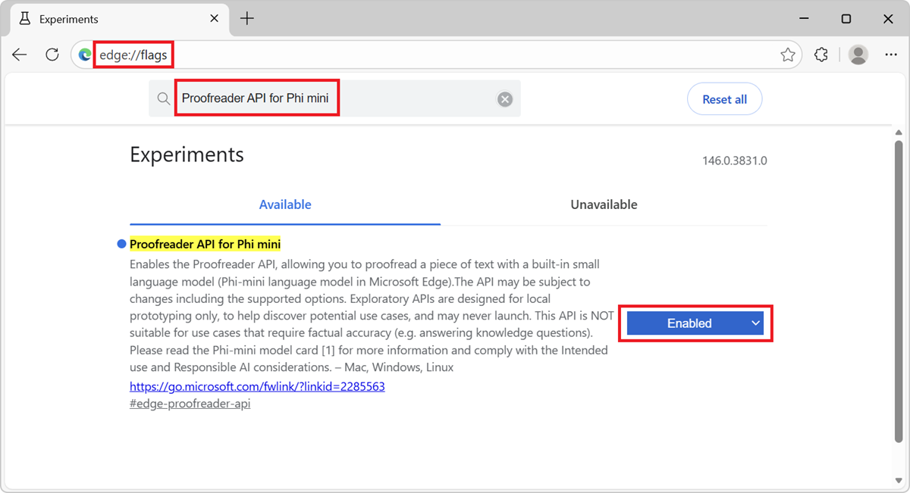
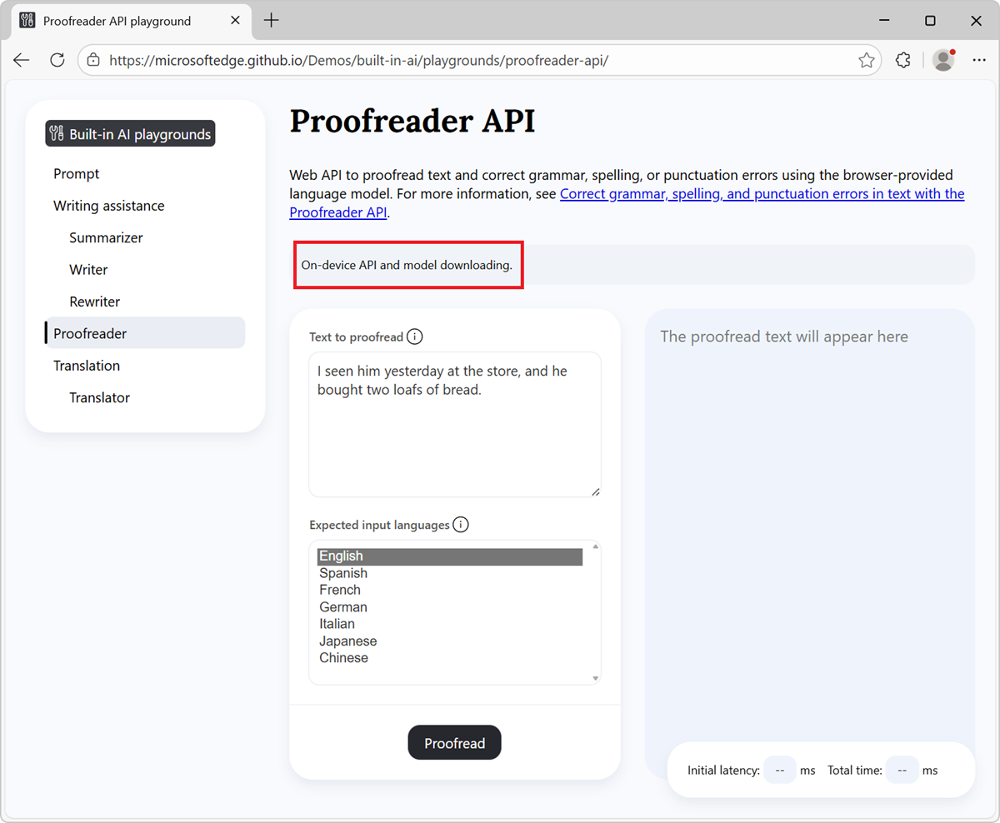
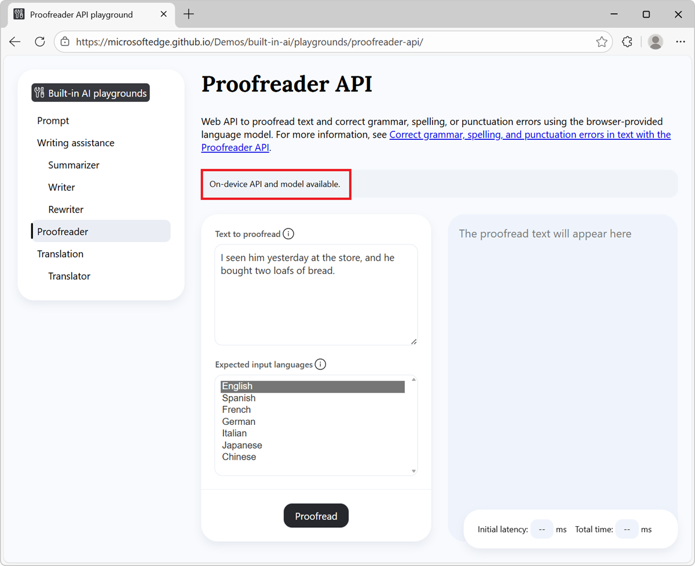

# Correct grammar and spelling with the Proofreader API

The Proofreader API is an experimental web API that allows you to correct grammar, spelling, and punctuation errors in text by using a small language model (SLM) that is built into Microsoft Edge, from your website's or browser extension's JavaScript code.

For introductory information about the Proofreader API, see [Proofreader API Explainer](https://github.com/webmachinelearning/proofreader-api).


**Detailed contents:**

* [Availability of the Proofreader API](#availability-of-the-proofreader-api)
* [Alternatives to and benefits of the Proofreader API](#alternatives-to-and-benefits-of-the-proofreader-api)
* [The Phi-4-mini model](#the-phi-4-mini-model)
    * [Disclaimer](#disclaimer)
    * [Hardware requirements](#hardware-requirements)
    * [Model availability](#model-availability)
* [Enable the Proofreader API](#enable-the-proofreader-api)
* [See a working example](#see-a-working-example)
* [Use the Proofreader API](#use-the-proofreader-api)
    * [Check if the API is enabled](#check-if-the-api-is-enabled)
    * [Check if the model can be used](#check-if-the-model-can-be-used)
    * [Create a new session](#create-a-new-session)
        * [Monitor the progress of the model download](#monitor-the-progress-of-the-model-download)
    * [Run the Proofreader API](#run-the-proofreader-api)
    * [Use the result of the Proofreader API](#use-the-result-of-the-proofreader-api)
    * [Destroy a session](#destroy-a-session)
        * [Destroy a session by using the destroy() method](#destroy-a-session-by-using-the-destroy-method)
        * [Destroy a session by using an AbortController](#destroy-a-session-by-using-an-abortcontroller)
* [Send feedback](#send-feedback)
* [See also](#see-also)


<!-- ====================================================================== -->
## Availability of the Proofreader API

The Proofreader API is available as a developer preview in Microsoft Edge Canary or Dev channels, starting with version 142.

The Proofreader API is optimized to correct grammar, spelling, and punctuation errors in text content.  To learn more about an alternative for more custom prompt engineering scenarios that may not be served by these APIs, see [Prompt a built-in language model with the Prompt API](./prompt-api.md).


<!-- ====================================================================== -->
## Alternatives to and benefits of the Proofreader API

To leverage AI capabilities in websites and browser extensions, you can also use the following methods:

* Send network requests to cloud-based AI services, such as [Azure AI solutions](https://azure.microsoft.com/solutions/ai).

* Run local AI models using the [Web Neural Network (WebNN) API](https://webmachinelearning.github.io/webnn-intro/) or [ONNX Runtime for Web](https://onnxruntime.ai/docs/tutorials/web/).


The Proofreader API uses a small language model (SLM) that runs on the same device where the inputs to and outputs of the model are used (that is, locally).  This has the following benefits compared to cloud-based solutions:

* **Reduced cost:** There's no cost associated with using a cloud AI service.

* **Network independence:** Beyond the initial model download, there's no network latency when prompting the model, and the model can also be used when the device is offline.

* **Improved privacy:** The data input to the model never leaves the device and is not collected to train AI models.

The Proofreader API use a model that's provided by Microsoft Edge and built into the browser, which comes with the additional benefits over custom local solutions such as those based on WebGPU, WebNN, or WebAssembly:

* **Shared one-time cost:** The browser-provided model is downloaded when the API is called for the first time, and then the model is shared across all websites that run in the browser, reducing network costs for the user and developer.

* **Simplified usage for web developers:** The built-in model can be run by using straightforward web APIs and doesn't require AI/ML expertise or using third-party frameworks.


<!-- ====================================================================== -->
## The Phi-4-mini model

The Proofreader API uses the Phi-4-mini model — a powerful small language model that excels at text-based tasks — built into Microsoft Edge.  To learn more about Phi-4-mini and its capabilities, see the model card at [microsoft/Phi-4-mini-instruct](https://huggingface.co/microsoft/Phi-4-mini-instruct).


<!-- ------------------------------ -->
#### Disclaimer

Like other language models, the Phi family of models can potentially behave in ways that are unfair, unreliable, or offensive.  To learn more about the model's AI considerations, see [Responsible AI Considerations](https://huggingface.co/microsoft/Phi-4-mini-instruct#responsible-ai-considerations).


<!-- ------------------------------ -->
#### Hardware requirements

The Proofreader API developer preview is intended to work on devices that have hardware capabilities that produce Small Language Model (SLM) outputs that have predictable quality and latency.

The Proofreader API has the following requirements:

* **Operating system:** Windows 10 or 11 and macOS 13.3 or later.

* **Storage:** At least 20 GB available on the volume that contains your Edge profile.  If the available storage drops below 10 GB, the model will be deleted to ensure that other browser features have sufficient space to function.

* **GPU:** 5.5 GB of VRAM or more.

* **Network:** Unlimited data plan or unmetered connection.  The model is not downloaded if using a metered connection.

To check if your device supports the Proofreader API developer preview, see [Enable the Proofreader API](#enable-the-proofreader-api) below and check your device performance class.

Due to the experimental nature of the Proofreader API, you might observe issues on specific hardware configurations.  If you see issues on specific hardware configurations, please provide feedback by [opening a new issue](https://github.com/MicrosoftEdge/MSEdgeExplainers/issues/new?template=proofreader-api.md) at the MSEdgeExplainers repository.


<!-- ------------------------------ -->
#### Model availability

An initial download of the model is required the first time a website calls a built-in AI API.  You can monitor the model download by using the monitor option when creating a new Proofreader API session.  See [Monitor the progress of the model download](#monitor-the-progress-of-the-model-download), below.


<!-- ====================================================================== -->
## Enable the Proofreader API

To use any of the Proofreader API in Microsoft Edge:

1. Make sure you're using the latest version of Microsoft Edge Canary or Dev (version 142 or newer).  See [Become a Microsoft Edge Insider](https://www.microsoft.com/edge/download/insider).

1. In Microsoft Edge Canary or Dev, open a new tab or window and go to `edge://flags/`.

1. In the search box, at the top of the page, enter **Proofreader API for Phi mini**.

   The page is filtered to show the matching flag.

1. Select **Enabled** next to the **Proofreader API for Phi mini** flag:

   

1. Optionally, to log information locally that may be useful for debugging issues, also enable the **Enable on device AI model debug logs** flag.

1. Restart Microsoft Edge Canary or Dev.

1. To check if your device meets the hardware requirements for the Proofreader API developer preview, open a new tab, go to `edge://on-device-internals`, and check the **Device performance class** value.

   If your device performance class is **High** or greater, the Proofreader API is expected to be supported on your device.  If you continue to notice issues, please [file a new issue](https://github.com/MicrosoftEdge/MSEdgeExplainers/issues/new?template=proofreader-api.md).


<!-- ====================================================================== -->
## See a working example

To see the Proofreader API in action, and examine existing code that uses these APIs:

1. [Enable the Proofreader API](#enable-the-proofreader-api), as described above.

1. In Microsoft Edge Canary or Dev browser, open a tab or window and go to the [Proofreader API playground](https://microsoftedge.github.io/Demos/built-in-ai/playgrounds/proofreader-api/).

1. In the information banner at the top, check the status.  The status initially reads **On-device API and model downloading**:

   

   After the model has been downloaded, the information banner reads **On-device API and model available**, indicating that the API and model can be used:

   

   If the model doesn't start downloading, restart Microsoft Edge and try again.

   The Proofreader API is only supported on devices that meet certain hardware requirements.  For more information, see [Hardware requirements](#hardware-requirements), above.

1. Optionally change the content and settings in the page.  For example, modify the text to proofread, or change the expected input language.

1. Click the **Proofread** button, at the bottom of the page.

   The output is generated in the response section of the page:

   

See also:
* [/built-in-ai/](https://github.com/MicrosoftEdge/Demos/tree/main/built-in-ai/) - Readme and source code for the Built-in AI playgrounds demo.


<!-- ====================================================================== -->
## Use the Proofreader API


<!-- ------------------------------ -->
#### Check if the API is enabled

Before using the Proofreader API in your website's code, check that the API is enabled, by testing for the presence of the `Proofreader` object:

```javascript
if (!Proofreader) {
  // The Proofreader API is not available.
}
```


<!-- ------------------------------ -->
#### Check if the model can be used

The Proofreader API can only be used if the device supports running the model, and after the language model and model runtime have been downloaded by Microsoft Edge.

To check if the API can be used, use the `availability()` method:

```javascript
const availability = await Proofreader.availability();

if (availability == "unavailable") {
  // The model is not available.
}

if (availability == "downloadable" || availability == "downloading") {
  // The model can be used, but it needs to be downloaded first.
}

if (availability == "available") {
  // The model is available and can be used.
}
```


<!-- ------------------------------ -->
#### Create a new session

Creating a session instructs the browser to load the language model in memory, so that it can be used.  Before you can use the Proofreader API to correct text, create a new session by using the `create()` method:

```javascript
// Create a Proofreader session.
const session = await Proofreader.create();
```

To customize the model session, you can pass options to the `create()` method:

```javascript
// Create a Proofreader session with options.
const session = await Proofreader.create(options);
```

The available options are listed below:

| **Option** | **Description** |
| --- | --- |
| `monitor` | A function that's used to monitor the progress of the model download. See [Monitor the progress of the model download](#monitor-the-progress-of-the-model-download), below. |
| `expectedInputLanguages` | An array of strings listing the languages which the input text is expected to contain. For example: `["en"]`. |


<!-- ---------- -->
###### Monitor the progress of the model download

You can follow the progress of the model download by using the `monitor` option.  This is useful when the model has not yet been fully downloaded onto the device where it will be used, to inform users to wait.

```javascript
// Create a Proofreader session with the monitor option to monitor the model
// download.
const session = await Proofreader.create({
  monitor: m => {
    // Use the monitor object argument to add an listener for the 
    // downloadprogress event.
    m.addEventListener("downloadprogress", event => {
      // The event is an object with the loaded and total properties.
      if (event.loaded == event.total) {
        // The model is fully downloaded.
      } else {
        // The model is still downloading.
        const percentageComplete = (event.loaded / event.total) * 100;
      }
    });
  }
});
```


<!-- ------------------------------ -->
#### Run the Proofreader API

To generate revised text by using the Proofreader API, after you have created the corresponding model session, use the `session.proofread()` method. This method returns a promise that resolves after the Proofreader API has finished generating corrected text.

```javascript
// Create a Proofreader session.
const session = await Proofreader.create();

// Correct the text and wait for the result.
const result = await session.proofread(textToBeCorrected);

// Use the result.
console.log(result);
```


<!-- ------------------------------ -->
#### Use the result of the Proofreader API

The `session.proofread()` method returns a promise that resolves to an object that has the following properties:

| **Property** | **Description** |
| --- | --- |
| `correctedInput` | The corrected text, as a string. |
| `corrections` | An array of correction objects. |

The properties of the correction objects are listed below:

| **Property** | **Description** |
| --- | --- |
| `startIndex` | The index of the first character, in the input text, that was corrected. |
| `endIndex` | The index of the last character, in the input text, that was corrected. |
| `correction` | The string that replaces the incorrect text. |

The following example shows how to use the result of the `session.proofread()` method:

```javascript
// Create a Proofreader session.
const session = await Proofreader.create();

// Correct the text and wait for the result.
const result = await session.proofread(textToBeCorrected);

// Log the corrected text.
console.log("Corrected text:", result.correctedInput);

// Log each correction.
result.corrections.forEach(({ startIndex, endIndex, correction }) => {
  const initialText = textToBeCorrected.slice(startIndex, endIndex);
  console.log(`Replaced text "${initialText}" (index ${startIndex} to ${endIndex}) with "${correction}"`);
});
```


<!-- ------------------------------ -->
#### Destroy a session

Destroy the session to let the browser know that you don't need the language model anymore, so that the model can be unloaded from memory.

You can destroy a session in two different ways:
* By using the `destroy()` method.
* By using an `AbortController`.


<!-- ---------- -->
###### Destroy a session by using the destroy() method

You can use the `session.destroy()` method to destroy a Proofreader session:

```javascript
const session = await Proofreader.create();

// Later, destroy the session by using the destroy method.
session.destroy();
```


<!-- ---------- -->
###### Destroy a session by using an AbortController

Alternatively, you can create an `AbortController` object, create a `Proofreader` session, and then call `abort()`:

```javascript
// Create an AbortController object.
const controller = new AbortController();

// Create a Proofreader session and pass the 
// AbortController signal object by using the signal option.
const session = await Proofreader.create({ signal: controller.signal });

// Later, perhaps when the user interacts with the UI, destroy the session by
// calling the abort() function of the AbortController object.
controller.abort();
```


<!-- ====================================================================== -->
## Send feedback

We're very interested in learning about the range of scenarios for which you intend to use the Proofreader API, any issues with the API or language model, and whether new task-specific APIs would be useful.

To send feedback about your scenarios and the tasks you want to achieve, please add a comment to [the Proofreader API feedback issue](https://github.com/MicrosoftEdge/MSEdgeExplainers/issues/1238).

If you notice any issues when using the API instead, please [report it on the repo](https://github.com/MicrosoftEdge/MSEdgeExplainers/issues/new?template=proofreader-api.md).

You can also contribute to the discussion about the design of the Proofreader API at the [W3C Web Machine Learning Working Group repository](https://github.com/webmachinelearning/proofreader-api).


<!-- ====================================================================== -->
## See also

* [Proofreader API Explainer](https://github.com/webmachinelearning/proofreader-api), on the Web Machine Learning GitHub repo.
* [Write, rewrite, and summarize text with the Writing Assistance APIs](./writing-assistance-apis.md).
* [Prompt a built-in language model with the Prompt API](./prompt-api.md).
* [/built-in-ai/](https://github.com/MicrosoftEdge/Demos/tree/main/built-in-ai/) - Source code and Readme for the Built-in AI playgrounds demo.
